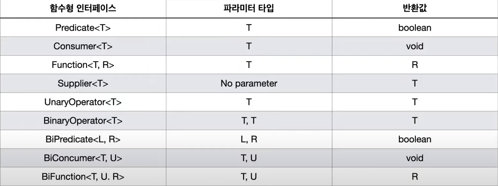
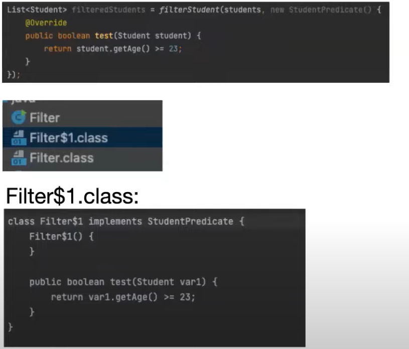
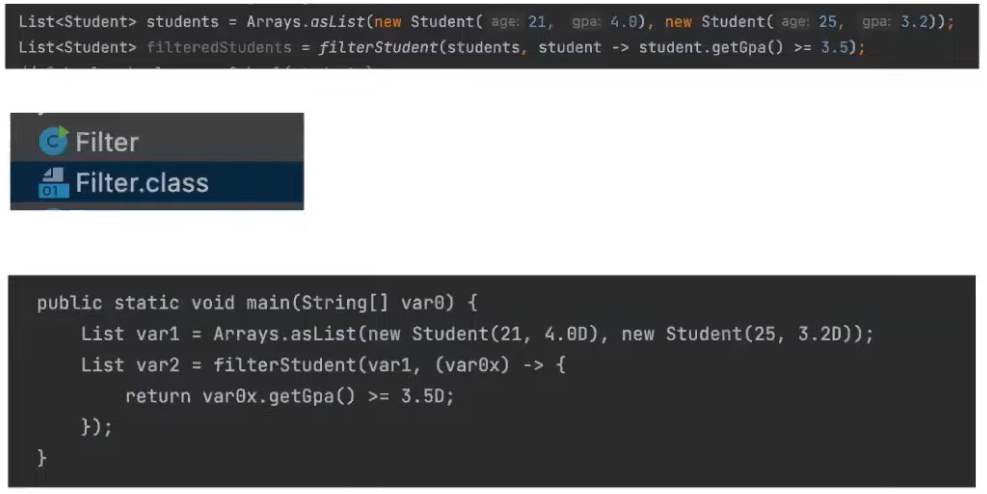
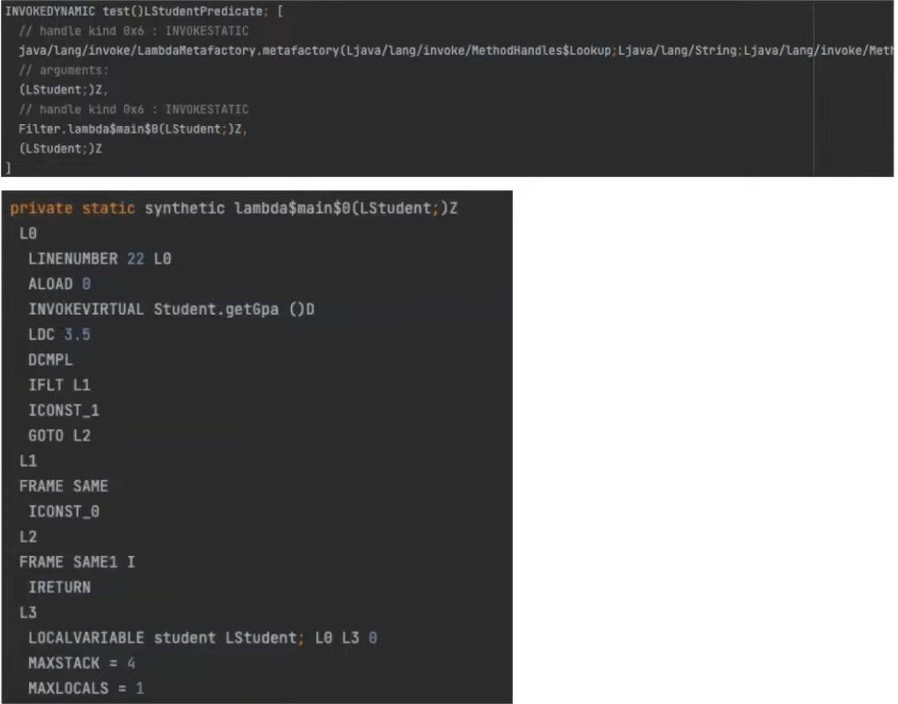
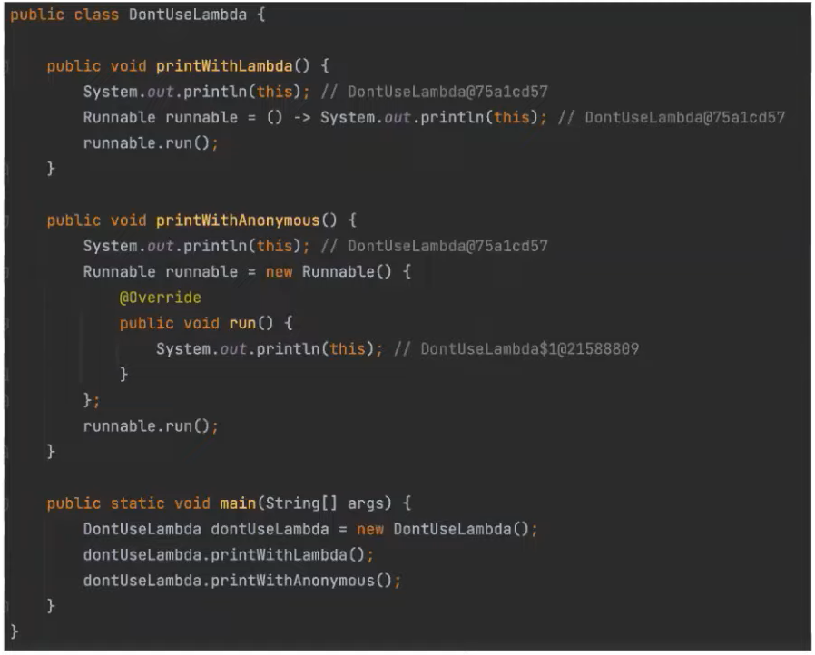
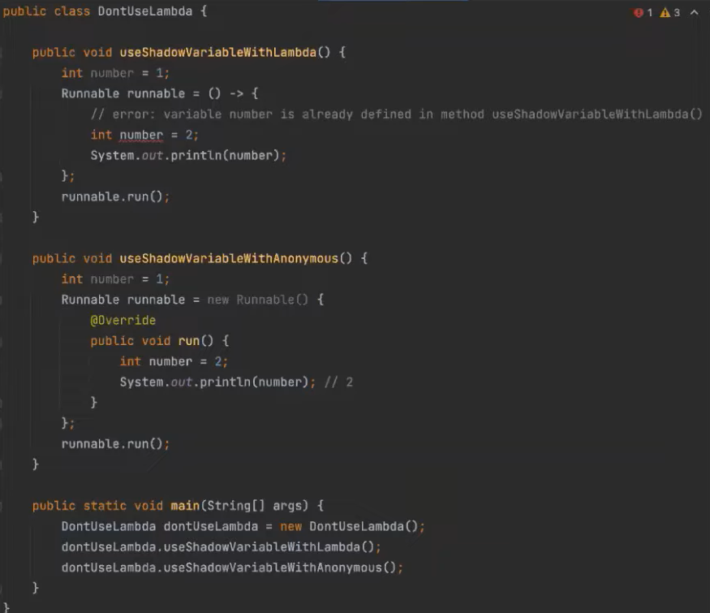
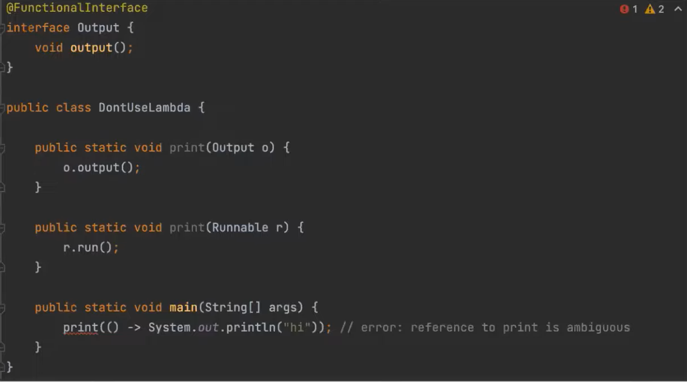
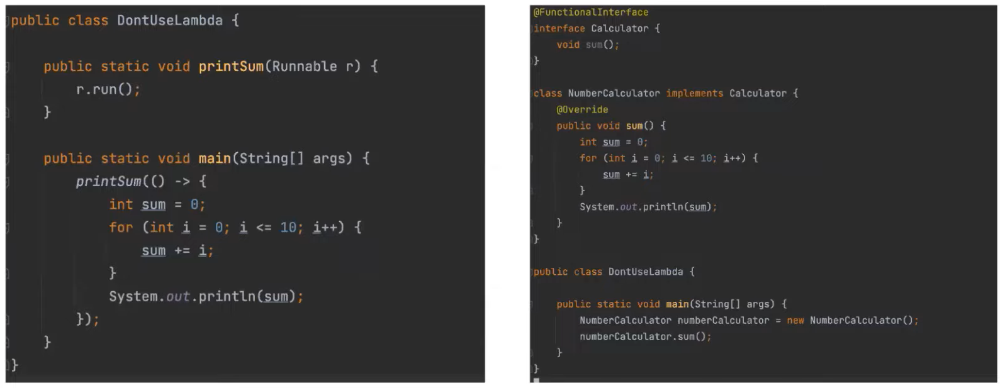

# 스컬의 람다
[https://youtu.be/sS-_Xr5Q4V4](https://youtu.be/sS-_Xr5Q4V4)

# 스컬의 람다
* toc
{:toc}

## 동작 파라미터화
+ 동작 파라미터화는 함수 또는 코드 블록을 파라미터로 넘길 수 있게 한 곳이 동작 파라미터화이다
+ Java7 까지는 이를 위해서 추상메서드가 오직 하나만 존재하는 인터페이스를 정의를 하고 이에 대한 구현을 사용을 하기 위해서 별도의 파일을 통해서 클래스를 정의하거나 또는 익명클래스를 사용을 했다
+ 하지만 별도의 파일을 통한 클래스 정의 같은 경우에는 별도의 파일을 정의해야 된다라는 귀찮음과 많은 코드를 작성해야 한다 라는 단점이 존재
+ 익명클래스를 사용을 하는 경우 비록 별도의 파일을 정의해야 한다 라는 귀찮음은 존재하지 않았지만 여전히 많은 코드를 작성해야 한다 라는 단점이 존재
+ Java8에서 람다를 도입한 이후부터 아주 짧은 코드를 작성할 수 있게 되었고 이를 이용해 동작 파라미터화를 사용을 하면 동작파라미터화의 장점인 코드의 재사용 성을 그대로 누릴 수 있게 되었다

## 람다를 사용하기 위한 조건 - 함수형 인터페이스
+ 람다를 정의를 하고 사용을 하기 위해선 추상메서드가 하나뿐인 인터페이스가 필요
+ Java8 부터는 이러한 인터페이스를 함수형 인터페이스라 칭하고 있다
  + 그리고 이 함수형 인터페이스는 하나의 추상메서드가 존재해야 된다라는 조건만 가지고 있기 때문에 다수의 default 메서드 또는 static 메서드를 정의를 해도 무방하다
+ @FunctionalInterface라는 어노테이션은 해당 인터페이스를 함수형 인터페이스로서 사용을 하겠다 라고 명시를 함과 동시에 해당 인터페이스가 함수형 인터페이스의 조건을 충족하지 못할 경우 에러를 띄우는 역할을 하고 있다
  + 비록 이 어노테이션의 사용이 강제는 아니지만 이러한 이점들 때문에 함수형 인터페이스를 사용을 할 때는 해당 어노테이션을 사용하는 것을 권장하고 있다

## 표준 라이브러리에 존재하는 함수형 인터페이스
+ 표준 라이브러리에 정확히는 java.util.function 이라는 패키지 내부에 다수의 함수형 인터페이스를 정의하고 있다
+ 

## 익명 클래스의 .class
+ 
+ 컴파일을 하면 원래대로 라면 하나의 클래스 파일만 생성이 되어야 되지만 익명 클래스에 사용으로 인해서 2개의 클래스 파일이 생성
+ Filter$1.class 파일 내부를 보면은 익명 클래스로 정의한 클래스가 별도의 클래스 파일로 빠져 나와서 사용되고 있는 것을 알 수 있다
+ 그 때문에 익명 클래스는 단순히 편의를 위해서 이런 식으로 어떤 클래스 내부에서 사용을 할 뿐 컴파일이 되면은 별도의 클래스로 분리되어 나온다 라는 것을 알 수 있다

## 람다 .class
+ 
+ 람다 같은 경우에는 컴파일을 해도 별도의 클래스 파일이 생성이 되지 않으며 람다는 그대로 람다로 존재하게 된다

## 람다 동작 과정
+ 
+ 람다를 정의를 한 파일의 바이트코드를 보면 람다가 정의된 곳은 INVOKEDYNAMIC으로 대체가 되고 클래스 내부의 새로운 메서드가 하나가 생성이 되게 된다
  + INVOKEDYNAMIC: Java7 에서 먼저 도입이 됐으며 클래스에 생성을 런타임까지 지연시키는 역할을 한다 그 때문에 람다는 컴파일 단계에서 생성이 되지 않고
    런타임까지 지연이 된다라는 것을 알 수 있다
+ 메서드들의 이름을 잠깐 보면 'lambda'라는 Prefix가 오고 두 개의 '$' 표시 이는 모든 람다 메서드의 공통 사항이고 첫 번째 $ 뒤에는 해당 람다가 존재하고 있는 메서드의 이름이 오게 되며 두 번째 $ 뒤에는 0부터 순차적으로 증가하는 숫자가 오게 된다
+ 그래서 만약에 이 메인 메서드 내에 두 개의 람다가 있다면 첫 번째 람다의 이름은 main$0이 되고 두 번째 람다의 이름은 main$1이 되게 된다

## 람다를 사용하면 안되는 경우
+ 
  + this를 사용할 경우
+ 
  + shadow 변수로 사용하는 경우
+ 
  + 컨텍스트 오버로딩이 존재할 때
  + 람다는 이름이 존재하지 않는다 그렇기 때문에 파라미터나 반환 값 등을 통해서 해당 람다가 어느 익명 메서드의 구현인지를 내부적으로 추론한다
  + 이때 파라미터와 반환 값 등 모든 요소가 같은 추상 메서드가 2개 이상 존재한다면 자바는 해당 람다가 어떤 추상 메서드에 구현인지를 추론할 수 없고 그에 따라서 애러를 띄우게 된다
+ 
  + 람다 코드가 3줄 이상으로 넘어갈 때
  + 람다는 함수에 이름을 붙일 수 없다 그 때문에 다른 메서드나 함수 처럼 이름을 통해서 해당 동작을 알 수 없기 때문에 오직 구현만 보고 동작을 알아내야 된다 그 때문에 코드가 길어지게 되면, 동작을 파악하는데까지 
  시간이 오래 걸리고 되게 복잡한 코드가 나올 수 있기 때문에 왼쪽 보다는 오른쪽처럼 사용을 하는 것을 권장하고 있다
