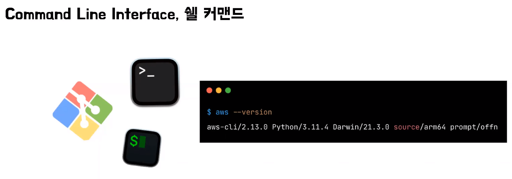
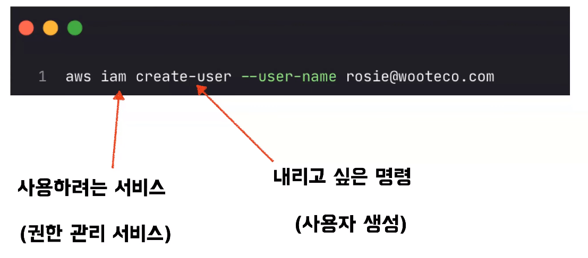
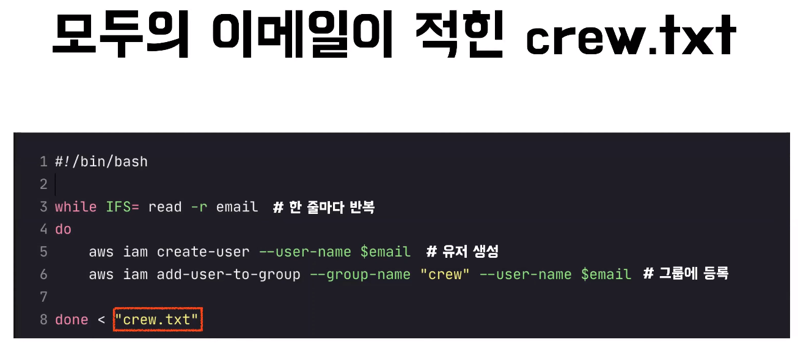
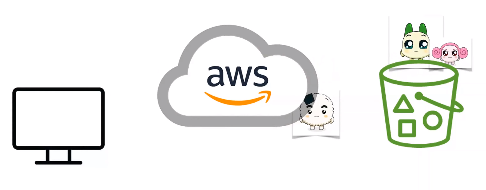
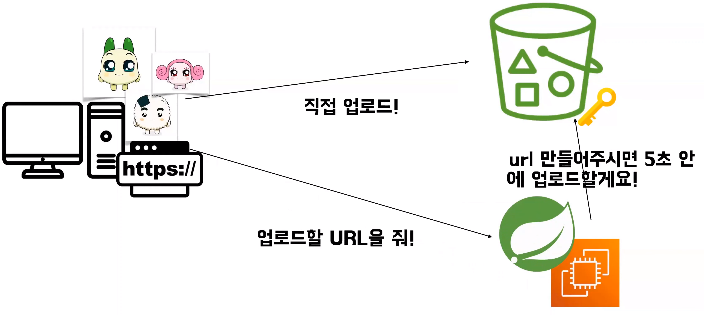
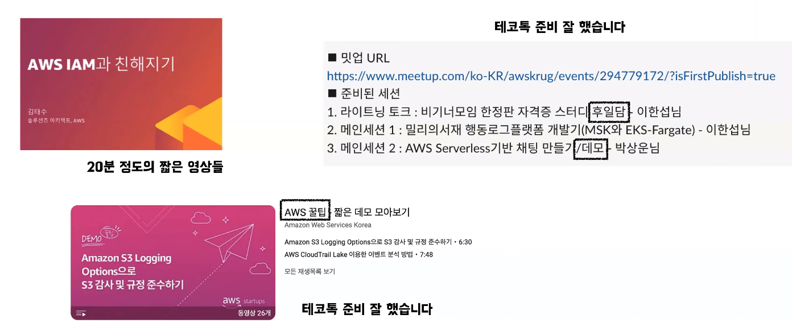
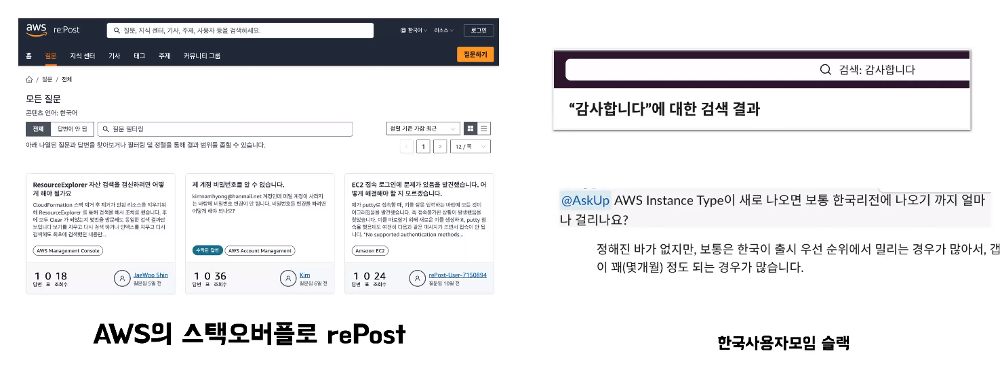

# 로지의 AWS 사용팁
[https://youtu.be/v63xqVXwSlo?feature=shared](https://youtu.be/v63xqVXwSlo?feature=shared)

# 로지의 AWS 사용팁
* toc
{:toc}

## 비효율을 감지하자
+ AWS CLI
  + Command Line Interface의 약자
  + 쉘 커맨드를 이용해서 AWS를 이용할 수 있는 방법
  + 
  + 
  + 

## 거시적으로 해결 방안 찾기 
+ LMS에서 각자 프로필 사진을 업로드할 수 있는 기능 구현
  + S3라는 파일 저장소 서비스에 직접 파일을 업로드하는 방법? (잘못된 방법 예시) 
    + 
      + 웹 클라이언트에서 사진 파일을 보내면 EC2에서 가동되고 있는 스프링 웹 애플리케이션에 도착을 하고
    + 
      + 그 도착된 파일을 그대로 로컬에 저장한 다음에 다시 AWS S3에 저장한다
    + 
      + 그런데 이 방식은 여러 사용자들이 아주 많은 요청을 보내게 된다면 문제가 일어난다 
      + 왜냐하면 미디어 용량은 굉장히 높기 때문에 이걸 처리하기 위해서는 네트워크 IO 및 서버 CPU 시간이 굉장히 늘어나기 때문이다
      + 성능 부작용이 초래된다
  + 웹 클라이언트에서 바로 AWS를 호출해서 S3 스토리지에 업로드하는 방법
    + 
  + 미리 서명한 URL이라는 방법
    +  
    + 클라이언트가 직접 업로드하기 위해서 업로드를 할 요청을 보내기 위한 URL을 서버한테 부탁을 하게 된다
    + 그리고 서버는 신원 인증을 통해 S3의 URL을 만들어 달라는 요청을 보낸다
    + S3에서는 그 요청을 승인해서 URL을 만들어 주고 다시 전달해 준다
    + 그렇게 해서 웹 클라이언트는 다시 직접 이미지를 업로드할 수 있게 된다
+ 이런 식으로 좀 더 거시적인 관점에서 나의 기술을 벗어나서 해결 방법을 찾아보는 그런 자세도 필요하다

## 일딴 재미로 보고 듣기
+ 가볍게 볼 컨테츠가 많이 있다
  + 
+ 질문 엿보면 시야 넓히기 
  + 
