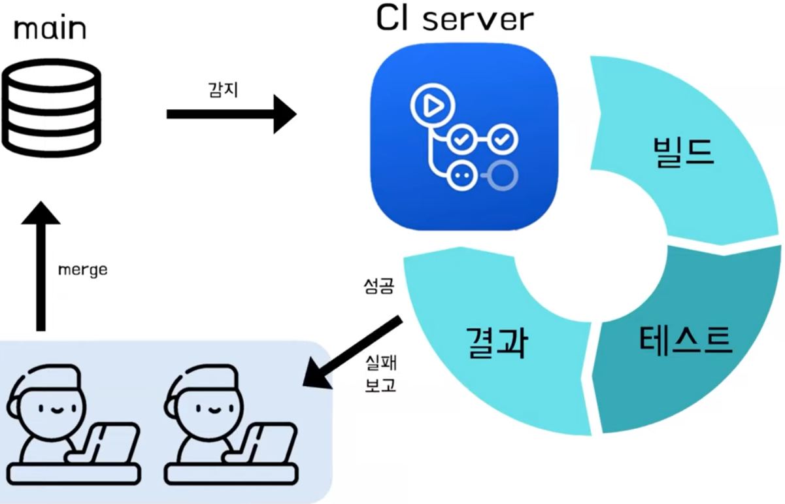
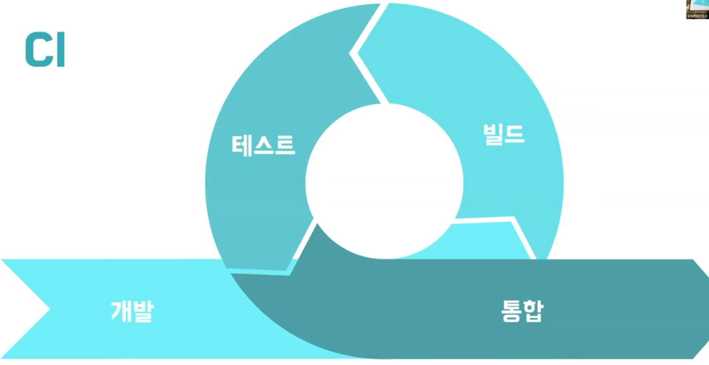
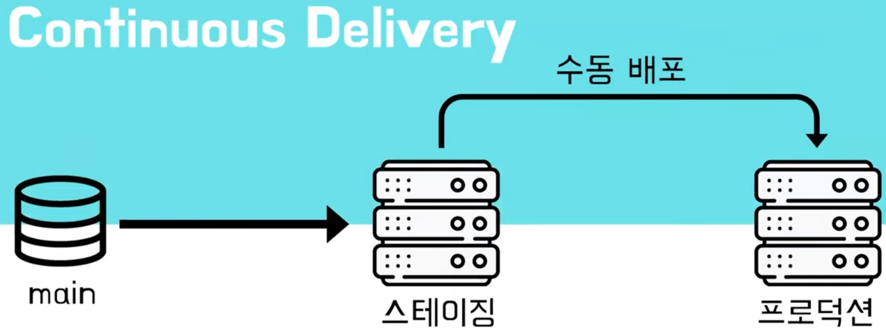
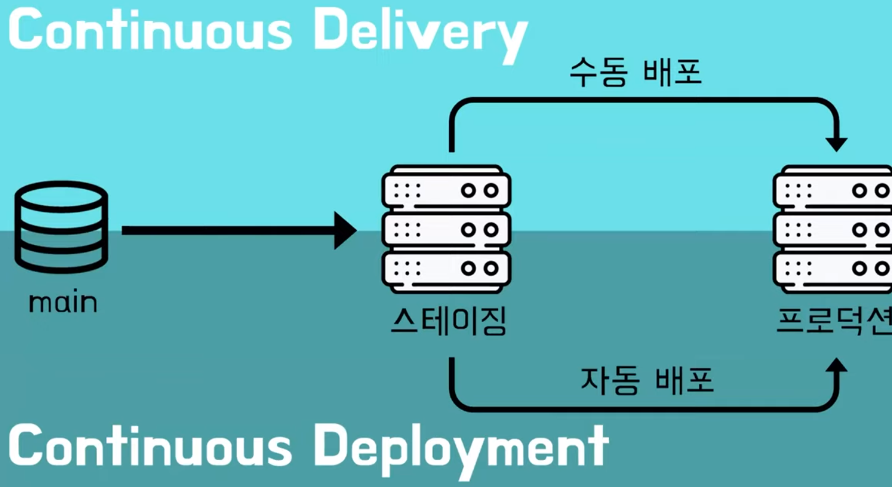
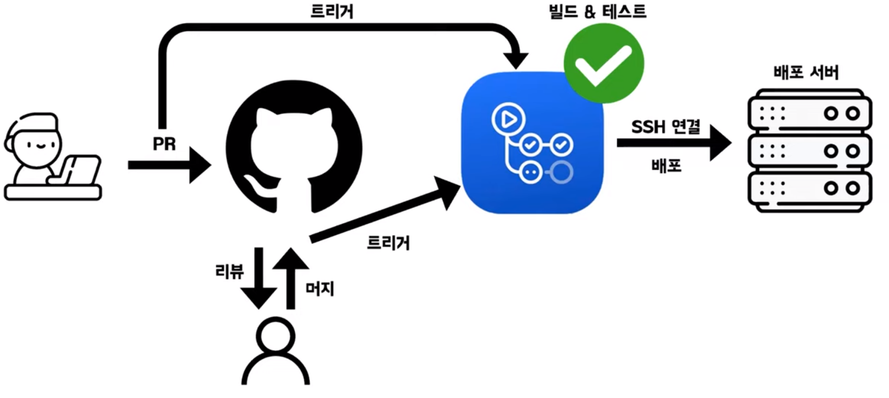

# 루카의 CI/CD
[https://youtu.be/6awJbcWXsts?feature=shared](https://youtu.be/6awJbcWXsts?feature=shared)

# 루카의 CI/CD
* toc
{:toc}

## CI란?
+ CI란 Continuous Integration으로 지속적 통합을 의미
+ 동일한 프로젝트에서 작업하는 모든 사람이 정기적으로 코드의 변경사항을 중앙 저장소에 병합한다
+ 즉 모든 팀원이 정기적으로 메인 브랜치에 병합하는것
+ 
+ 마틴 파울러가 정의한 Continuous Integration의 정의에서 보면 정기적은 최소한 매일이라고 하고 있다 그래서 매일매일 브랜치에 통합을 하게 되면은 이제 feature 브랜치의 생명주기를 짧게 가져감으로써
  각각의 feature 브랜치의 책임을 각 팀원이 갖는 것이 아니라 main repository를 중심적으로 개발을 할 수 있는 이런 방법을 제시를 하고 싶다
+ 작은 변경 사항을 통해서 실패를 줄이고 빠른 문제 해결을 하고 코드 검토가 쉽다 라는 장점을 CI의 장점으로 볼 수 있다 
  + 실패를 줄인다
  + 빠른 문제 해결
  + 코드 검토가 쉽다
+ 
  + CI 사이클은 개발과 빌드와 테스트와 통합을 주기적으로 빠르게 하는 것에 의미가 있다

## CD란?
+ CD는 이제 Continuous Delivery와 Continuous Deployment 두 가지의 개념으로 볼 수 있다
+ Continuous Delivery
  + CI 이후의 코드의 변경 사항을 프로덕션의 릴리즈 할 수 있는 준비 상태로 두는 것을 이야기한다 (스테이징을 자동화)
  + 
+ Continuous Deployment
  + Continuous Delivery에 이어서 프로덕션에 배포까지 자동화하는 단계를 이야기한다
  + 
+ 
  + 전체적인 CI/CD 파이프라인에 대해 살펴 보면 개발, 빌드, 테스트, 릴리즈, 배포까지를 주기적으로 자주 하는 것을 CI/CD 파이프라인으로 설명할 수 있고
  하나의 기능을 짧게 가져감으로써 문제 해결을 쉽게하고 고객에게 빠르게 변경 사항을 전달해준다 라는 의미를 가질 수 있다

## CI/CD 툴
+ 
+ 젠킨스
  + 무료 오픈 소스
  + 레퍼런스가 많고 안정적인 툴
  + 다양한 플러그인이 존재를 해서 커스터마이징이 아주 유용
  + 깃허브 액션과 비교해서 서버 설치가 필요하다라는 특징이있다
  + 각 단계가 동기적으로 실행된다 라는 특징이 있다
+ 깃허브 액션
  + 깃헙과 연동이 용이
  + 클라우드 환경에서 작동 하기 때문에 따로 서버 설치가 필요 없다
  + 각각의 job들은 Runners라는 특정 Virtual Machine 환경에서 실행이 되게 된다
  + 혹은 직접 설정한 환경에서 구동을 시킬 수도 있는데 그럴 때는 이제 Self-hosted Runner를 사용 해서 직접 설정한 환경에서 구동을 시킬 수 있다
  + 파이프라인 Workflow라고 하는데 그 Workflow는 이제 yml 소스코드로 관리가 되게 된다 
  + GitHub Actions 플로우
    + 
    + 개발자가 공통 레파지토리에 PR을 날리게 되면 PR을 어떤 깃허브 액션에서 트리거로 설정 해 놓게 되면 PR이 트리거가 돼서 테스트를 수행하게 된다
    + 이 PR은 테스트가 통과된 PR이다 라는 것이 확인이되면은 PR이 정상적으로 되게 되고 리뷰어가 리뷰를 하게 된다 
    + 그래서 리뷰어가 리뷰가 끝나고 그 PR이 머지가 되게 되면은 공통 레파지토리에 푸시가 변경사항이 있다 트리거가 된다 라고 생각을 하면은 머지된 결과에 대해서 빌드와 테스트까지 진행 하게 된다 
    + 테스트도 마치게 되면 다음 단계로 배포를 하게 되는 과정인데 배포서버 ssh 연결이나 그런 것을 하여 배포까지 하는 것
  
