# 에단의 Flyway
[https://youtu.be/_fgOxPRo8tU?feature=shared](https://youtu.be/_fgOxPRo8tU?feature=shared)

# 에단의 Flyway
* toc
{:toc}

## Flyway 소개
+ flyway 공식 홈페이지에서는 flyway를 다음과 같이 정리하고 있다
  + Flyway is an open-source database migration tool.
  + flyway는 누구나 사용할 수 있는 데이터베이스 마이그레이션 툴
  + 일반적으로 데이터베이스 마이그레이션이란 말은 한 데이터베이스에서 다른 데이터베이스로 이동하는 것을 의미한다
  + 하지만 flyway에서는 모든 데이터베이스의 변경을 마이그레이션이라고 칭하고 있다
  + flyway는 누구나 사용할 수 있는 데이터베이스 변경 관리도구가 되겠다
  + 마치 소스코드 변경을 관리하는 깃허브처럼 데이터베이스의 변경은 flyway가 관리하게 되는 것이다

## flyway 특징
+ 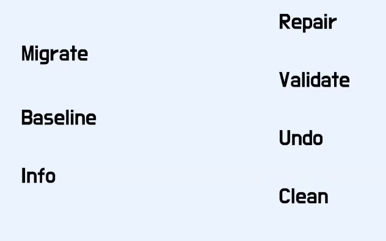
+ flyway 특징은 크게 7가지가 있다
+ Migrate는 데이터베이스의 변경을 의미
+ Baseline은 비어있지 않은 데이터베이스에서 flyway를 적용할 때 사용하는 키워드
+ Info는 데이터베이스 변경이력을 저장한다는 의미
+ Repair는 실패한 마이그레이션 파일을 다시 복구할 수 있다 라는 의미
+ Validate는 flyway를 적용할 때 이게 디비에 적용될 수 있는지 없는지 확인 할 수 있다는 말이다
+ Undo는 최근에 적용됐던 Migration 파일을 적용하지 않은 상태로 돌리는 키워드
+ Clean은 데이터베이스를 깨끗이 지운다는 의미
+ 이 중에서 중요하다고 생각되는 Migrate랑 Baseline, Info에 대해서 좀 더 자세히 알아보겠다

### Migrate
+ 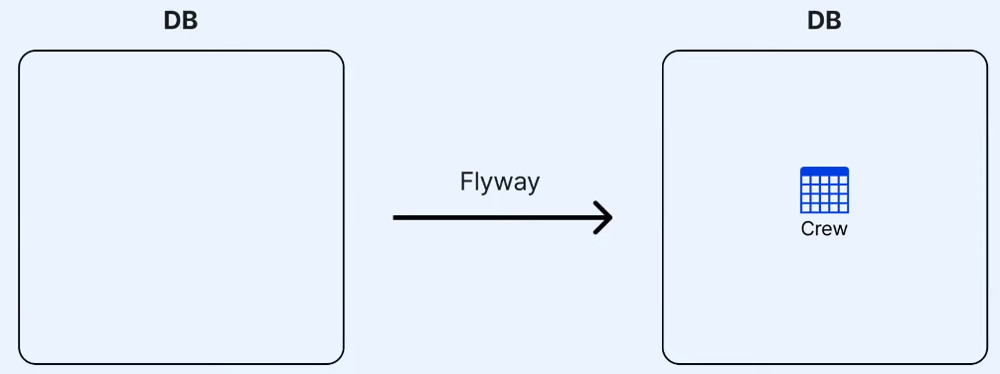
  + 비어 있는 DB에서 flyway를 사용해서 Crew라는 테이블을 만들려면
+ 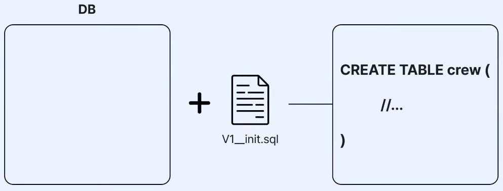
  + V1__init.sql이라는 파일을 만들고 거기 안에 CREATE TABLE crew라는 sql문을 작성
  + 그 다음에 flyway가 적용된 스프링부트 어플리케이션을 실행 시키면
+ 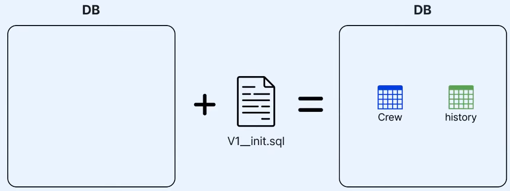
  + 자동적으로 flyway가 crew라는 테이블을 만들어준다
  + 이 때 flyway가 처음 적용됐기 때문에 history 테이블도 자동적으로 만들어주게 된다
  + 이 history 테이블은 데이터베이스 변경 이력을 저장하는 테이블이 된다

### Migrate 파일 이름 규칙
+ 마이그레이션 파일은 명명 규칙이 특별하게 있다
+ 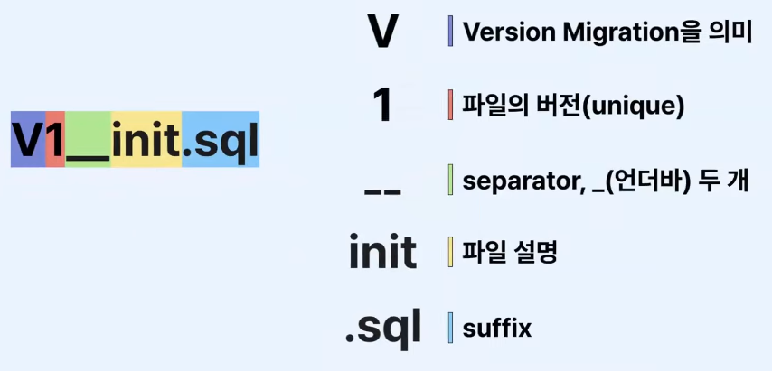
+ 파일의 버전은 유니크하다는 특성을 가지고 있는데 만약에 적용되지 않는 마이그레션 파일 중에서 같은 버전이 2개 이상 있으면 flyway는 어떤 걸 적용 할 줄 몰라서 에러를 뱉게 된다
+ 파일 설명은 히스토리 테이블에 description 항목으로 들어간다
+ 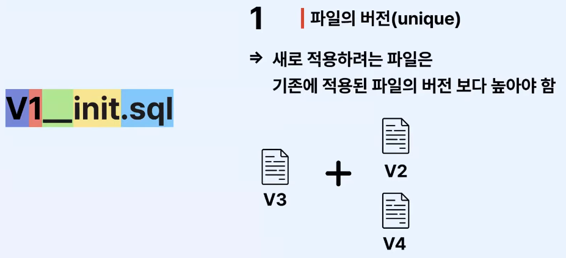
+ 파일의 버전은 유니크한 특성도 있지만 새로 적용하려는 파일은 기존에 적용된 파일보다 항상 높아야 한다는 특성도 또 있다
+ 이 규칙 때문에 V2는 무시가 되고 V4만 적용이 된다
+ 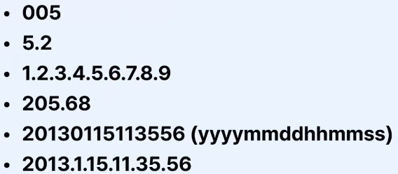
+ 버전같은 경우에는 점이나 날짜 형식으로 자세하게 적을 수 있어서 항상 이 유니크하다는 조건과 파일의 버전이 항상 높아야 된다는 이 조건만 지키셔서 만드시면 된다

### Baseline
+ Baseline은 비어있지 않은 디비에서 flyway를 적용할 때 사용하는 키워드이다
+ 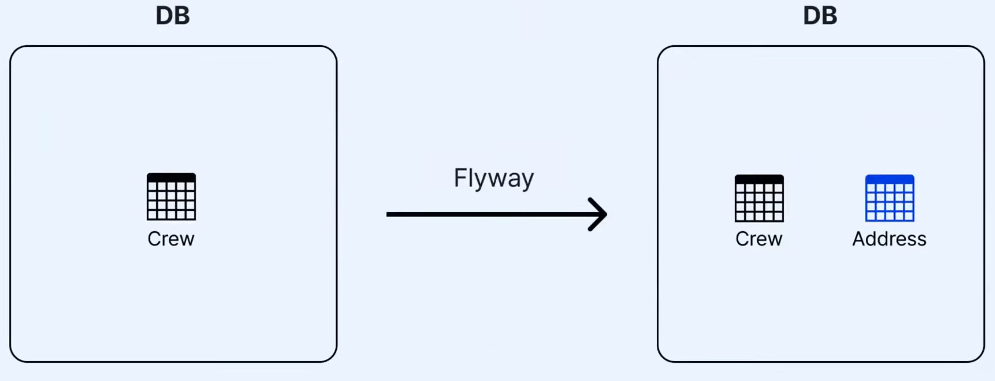
+ 먼저 Crew라는 테이블이 있는 디비에서 flyway를 사용 해서 Address라는 테이블을 생성 하려면 V1__baseline.sql 파일을 만든 다음 아무것도 입력하지 않은 채로 두시면 된다
+ 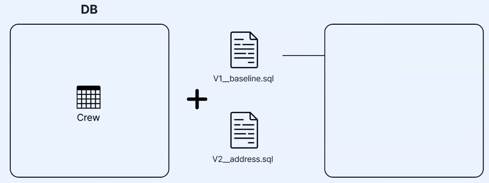
+ 다음으로 V2__address.sql라는 파일을 만들어 쿼리문을 작성하고 flyway가 적용된 스프링부트 애플리케이션 실행시키면 자동적으로 flyway가 Address 테이블을 만들어주게 된다
+ 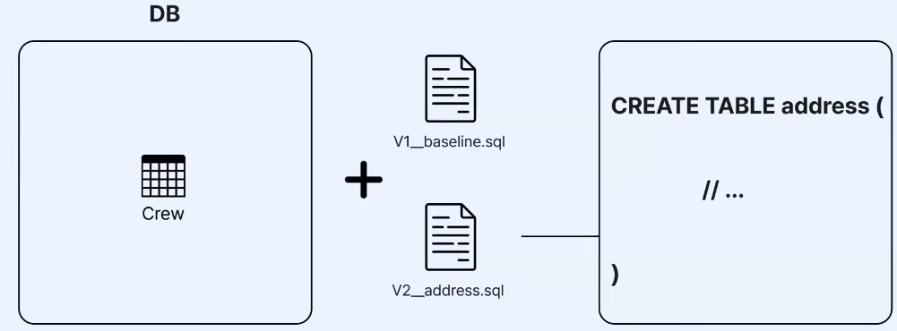
+ 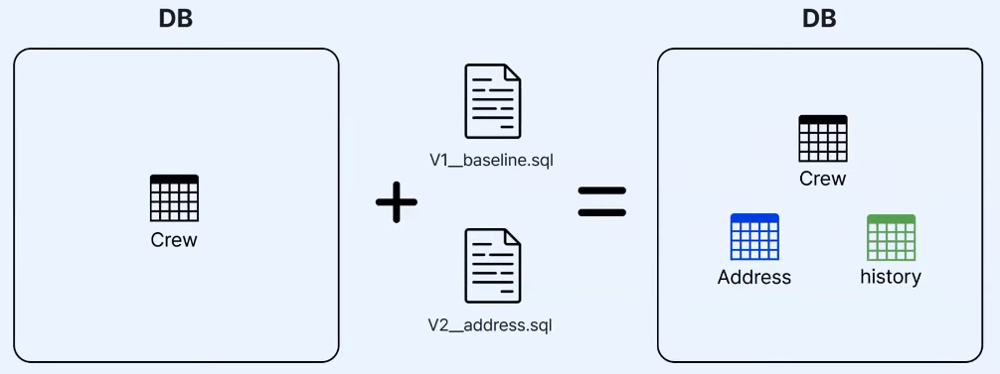
+ 이 때도 앞서 말한 마이그레이션과 마찬가지로 처음 flyway를 적용했기 때문에 history 테이블을 flyway가 자동적으로 만들어준다

### Info
+ 
+ 앞서 얘기했던 history 테이블은 flyway_schema_history 테이블이다 
+ 여러 컬럼들이 있지만 가장 중요한 컬럼은 두 개가 있다 바로 version이랑 checksum이다
+ version같은 경우에는 version의 크기에 따라서 앞에 있는 installed_rank가 결정되기 때문에 항상 최근에 적용됐던 파일의 version 보다 높은 version으로 등록해야 된다
+ checksum은 마이그레이션 파일의 해시값 이다 만약 이 적용된 마이그레이션 파일 중에서 변경이 일어난다면 이 checksum 값이 바뀌게 된다 flyway는 파일이 오염 되었다 라고 간주 한 다음 오류를 뱉게 된다 
그래서 만약 데이터베이스 추가나 삭제와 같은 변경 작업을 하려면 항상 새로운 파일을 추가를 해서 진행하시면 된다

## 예제 
+ flyway를 사용하지 않았을 경우
  + 예를들어 deploy DB에 컬럼을 추가 해야 한다는 사실을 기억하지 못하면 배포날 저장 로직이 되지 않아 장애를 맞게 된다
+ flyway를 사용
  + 만약 flyway를 사용했으면 V2__add_address라는 sql파일을 만들고 컬럼을 추가하는 쿼리를 작성 해 놓으면 자동으로 배포가 될 때 flyway가 적용을 시켜줌으로써 앞서 얘기했던 장애를 맞지 않았을 것이다

## 설정법
+ 기본 설정
  + 
  + 일반적으로는 flyway-core라는 것을 implementation을 하는데 mysql 8점 대 이상부터는 flyway-mysql을 implementation 해야 된다
  + 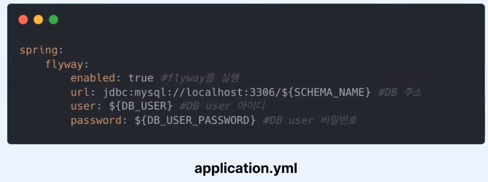
  + flyway를 쓰려면 spring-flyway-enabled를 true로 하고 url, user, password를 사용하시는 datasource와 같은 값으로 입력해 주시면 된다
+ 추가 설정
  + 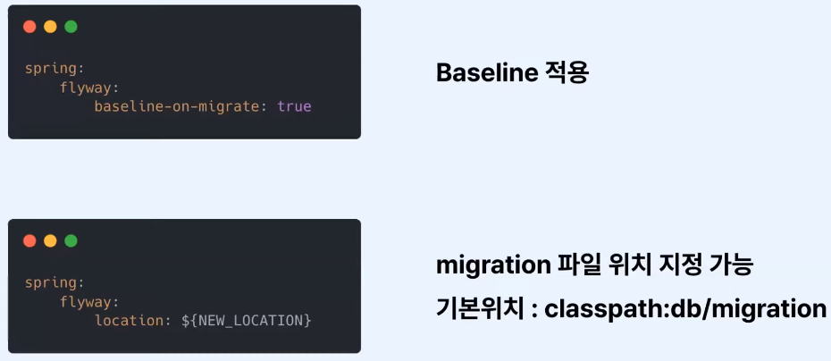
  + Baseline을 적용하고 싶으면 baseline-on-migrate 옵션을 true로 켜주면 된다
  + 기본적으로 마이그레이션 파일들은 classpath:db/migration 하위에 위치하는데 이걸 변경하고 싶으면 spring-flyway-location에 특별한 주소를 넣어주면 된다

## 사용해야하는 이유
+ 실수 방지
  + 가장 큰 이유는 실수 방지의 목적이 있다
  + 프로젝트에서는 local이나 개발 배포 환경의 DB가 다를 수 있다 
  + flyway는 런타임 시에 자동으로 실행되기 때문에 실수할 여지를 줄여준다
  + 또한 hibernate의 ddl-auto 옵션을 validate라고 같이 준다면 엔티티에 컬럼과 데이터베이스 컬럼이 다를 때 스프링에서 오류를 뱉어줌으로 조금 더 안전하게 사용할 수 있다
+ 환경별 DB 관리가 쉽다
  + 쉽게 DB별 환경을 다르게 가져갈 수 있다 
  + local과 개발환경에서 초기 데이터 seed를 넣을 수 있고 운영환경에서는 넣지 않을 수가 있다 이런 경우에 sql파일을 분리를 해서 각각 적용 시켜 주면 되므로 좀 더 쉽게 DB를 관리할 수 있다
