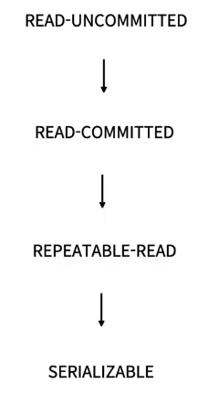
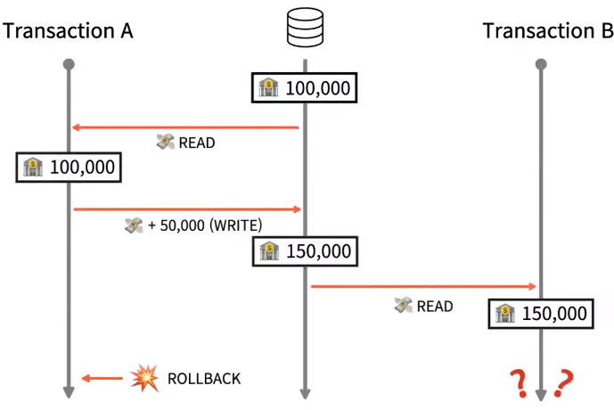
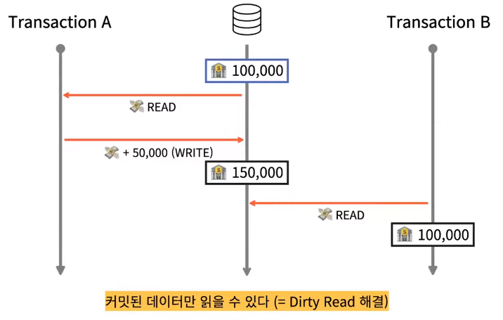
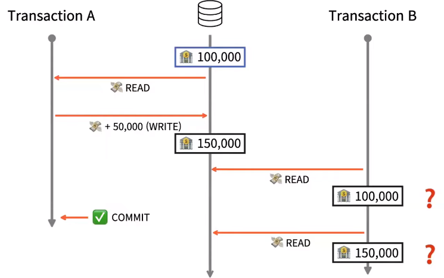
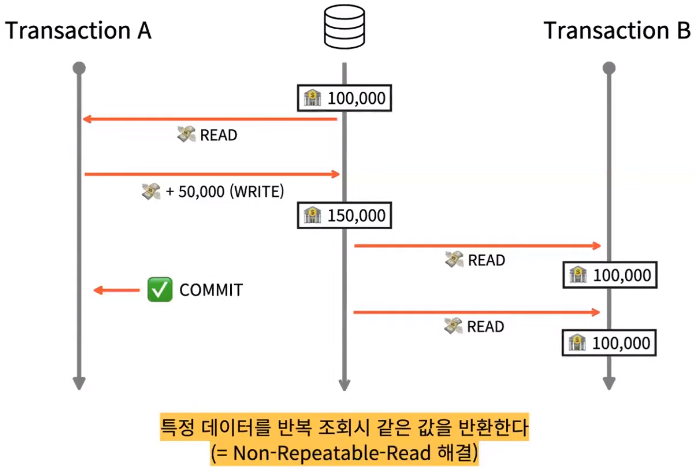
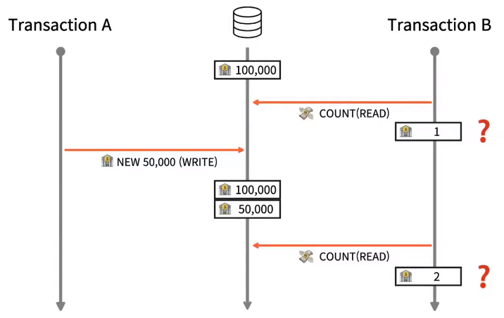
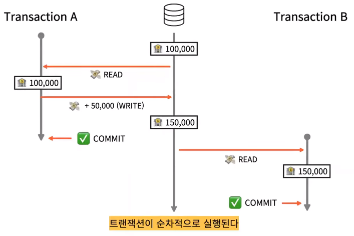
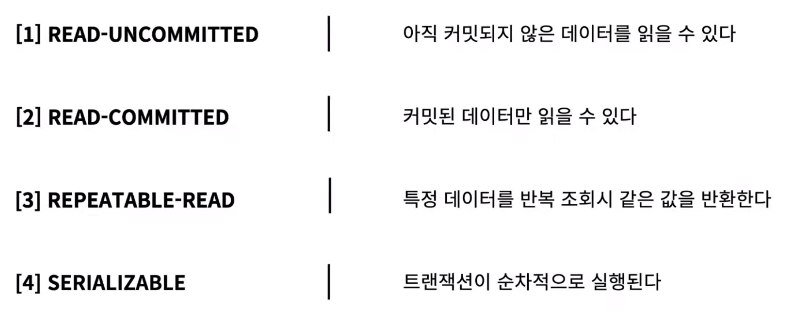

# 로건의 Transaction 
[https://youtu.be/taUeIi6a6hk?feature=shared](https://youtu.be/taUeIi6a6hk?feature=shared)

# 로건의 Transaction
* toc
{:toc}

## 트랜잭션이란?
+ 트랜잭션이란 여러 쿼리를 논리적으로 하나의 작업 단위로 묶는 것을 말한다
+ 트랜잭션이란 더 이상 나눌 수 없는 가장 작은 하나의 단위라고 한다
+ 데이터베이스에서 수행되는 여러 작업을 하나의 논리적 단위로 수행하는 것을 말한다
+ 트랜잭션의 연산은 크게 커밋과 롤백, 두 가지로 나뉘어져 있다

## ACID
+ ACID란 트랜잭션이 안전하게 수행된다는 것을 보장하기 위한 성질이다
+ 첫 번째로는 원자성, 두 번째로는 일관성, 세 번째로는 고립성, 네 번째로는 지속성이다
+ 원자성 (Atomicity)
  + 원자성은 특정 트랜잭션의 안에 들어있는 모든 연산이 수행되거나 수행되지 말아야 한다
  + 그래서 가장 유명한 영어 문장으로는 All Or Nothing이라는 게 있다
+ 일관성 (Consistency)
  + 일관성은 데이터베이스 데이터 무결성 제약 조건에 맞춰야 한다는 것이다
+ 고립성 (Isolation)
  + 고립성은 어떤 트랜잭션에서 연산이 수행되면 다른 트랜잭션에 영향을 주거나 영향을 받아서도 안 된다
  + 같은 데이터를 수정하게 되는 트랜잭션이 존재하게 된다면 순차적으로 처리를 해야 고립성을 만족하게 된다는 것이다
  + 이것은 현실적으로 성능상 단점이 된다 왜냐하면 만약 10만개의 데이터를 수행한다고 하면 10만 개의 데이터를 순차적으로 처리하게 되므로 시간이 굉장히 오래 걸리게 된다
  + 그래서 현실과의 타협을 위해 트랜잭션에서는 네 가지 고립 수준을 소개하고 있다 (Isolation Level)
+ 지속성 (Durability)
  + 지속성은 트랜잭션 연산이 성공적으로 수행되면 영구적으로 데이터베이스에 반영이 되어야 한다는 것이다

## Isolation Level
+ 
  + 위로 올라갈수록 속도는 빨라지지만 데이터의 일관성을 보장하지 못하고 밑으로 갈수록 SERIALIZABLE은 트랜잭션을 순차적으로 처리하므로 속도는 느리지만 데이터의 일관성을 보장할 수 있다
+ READ-UNCOMMITTED
  + 아직 커밋되지 않은 데이터를 읽을 수 있다는 특징을 가지고 있다
  + 예시
    + 
    + 먼저 DB에는 계좌를 한 개 가지고 있는데 해당 계좌는 10만 원을 가지고 있다
    + 이 상태에서 트랜잭션 A가 읽기 요청을 수행하게 된다면 DB에서는 계좌에 있는 금액 그대로 10만원을 반환하게 된다
    + 그 이후에 다시 트랜잭션 A에서 5만원을 추가하게 되는데 이때 DB는 10만 원에서 15만 원으로 변경되게 된다
    + 그 다음에 트랜잭션 B가 읽기 연산을 수행하는데 이때 READ-UNCOMMITTED는 아직 커밋되지 않은 데이터를 읽을 수 있으므로 15만 원을 그대로 가져오게 된다
    + 하지만 이때 트랜지션 A는 커밋이 되지 않은 상태인데 만약 트랜잭션 A에서 오류가 발생하여 롤백이 발생한다면 먼저 트랜잭션 B에서는 15만원이 되었으므로 DB에는 이전에 15만원이 기록되어 있다는 것이고 그 이후에는 10만원이 기록되어 있다는 것이다
    + 그래서 이 둘을 살펴보자면 데이터베이스에서는 10만원인데 트랜잭션 B는 15만원을 가지고 있다
    + 이렇게 되면 서로 둘의 값이 상반되기 때문에 문제가 발생하게 된다
    + 이러한 문제를 Dirty Read 문제라고 한다
  + Dirty Read 문제란 특정 트랜잭션에서 데이터를 변경했지만 아직 커밋되지 않았을 때 다른 트랜잭션이 해당 값을 조회할 수 있는 문제
  + 이 외에도 READ-UNCOMMITED는 Non-Repeatable Read 문제와 Phantom Read 문제를 가지고 있다
+ READ-COMMITTED
  + 커밋된 데이터만 읽을 수 있다는 특징을 가지고 있다
  + 
    + Dirty Read 문제 해결
  + 
    + 트랜잭션 A가 이제 만약 커밋을 한 다음 트랜잭션 B가 다시 리드 요청을 하게 된다면 10만원이 아닌 15만원을 반환받게 된다
    + 그래서 트랜잭션 B는 같은 데이터를 읽기 요청을 했는데 서로 다른 데이터가 나오므로 문제가 발생하게 된다
    + 이러한 문제를 Non-Repeatable Read 문제라고 한다
  + Non-Repeatable Read
    + 트랜잭션 내에서 같은 데이터를 여러 번 조회할 때 읽은 데이터가 서로 다른 값으로 나오는 문제이다
    + 이 외에도 READ-COMMITTED는 Phantom Read 문제를 가지고 있다
  + REPEATABLE-READ
    + REPEATABLE-READ는 특정 데이터를 반복 조회 시 같은 값을 반환한다는 특징을 가지고 있다
    + 
      + 이전에 커밋되기 이전에도 리드를 연산 수행해서 10만원을 받았으니까 다시 같은 요청을 하면 10만원을 받게 된다
      + 그래서 REPEATABLE-READ는 NON-REPEATABLE-READ 문제를 해결할 수 있게 된다
    + 
      + 먼저 트랜잭션 B가 은행 계좌의 개수를 세는 쿼리를 날린다고 가정해 보면 
      + DB에서는 계좌가 한 개 있으니 1을 반환하게 된다
      + 하지만 이때 트랜잭션 A가 새로운 계좌인 5만원 계좌를 추가하게 된다면 DB에서는 10만원, 5만원 두 개의 계좌가 나오게 된다
      + 이때 트랜잭션 B가 이전에 요청했던 필요한 계좌의 개수를 쿼리문을 날리게 된다면 두 개가 반환이 되게 된다
      + 같은 요청을 했는데 첫 번째는 1이 나오고 두 번째는 2가 나오게 되었다 
      + 이건 서로 상반된 데이터이기 때문에 문제점이 발생하였는데 이 문제를 Phantom Read 문제라고 한다
    + Phantom Read는 Non-Repeatable Read의 한 종류로써 새로운 데이터가 생기거나 기존의 데이터가 사라지는 문제를 뜻한다
  + SERIALIZABLE
    + SERIALIZABLE은 이제 모든 문제를 해결했음으로 트랜잭션이 이제 고립성을 완전히 만족하게 되어 순차적으로 트랜잭션이 수행되게 된다는 것이다
    + 
+ 
  + READ-UNCOMMITTED는 아직 커밋되지 않은 데이터를 읽을 수 있다는 특징을 가지고 있다 하지만 문제점으로는 Dirty Read 문제와 Repeatable Read 문제 그리고 Phantom Read 문제를 가지고 있다
  + 두 번째 고립수준인 READ-COMMITTED는 커밋된 데이터만 읽을 수 있다는 장점을 가지고 있는데 READ-UNCOMMITTED에서 Dirty Read의 문제를 해결했지만 아직 Repeatable Read와 Phantom Read 문제를 가지고 있다는 단점이 존재한다
  + 세 번째 고립 수준인 REPEATABLE-READ의 경우에는 특정 데이터를 반복 조회 시 같은 값을 반환한다는 특징을 가지고 있다 하지만 마찬가지로 READ-COMMITTED의 Unrepeatable Read의 문제점을 해결했지만
    Phantom Read 문제점을 가지고 있다는 단점이 존재한다
  + 마지막으로 SERIALIZABLE은 트랜잭션이 순차적으로 실행되어 속도가 느리지만 모든 문제점을 해결할 수 있다는 장점을 가지고 있다 하지만 SERIALIZABLE은 속도가 느리기 때문에 이것을 사용할 경우 좀 깊게 고민을 해보신 후에 반영하는 것이 좋다
