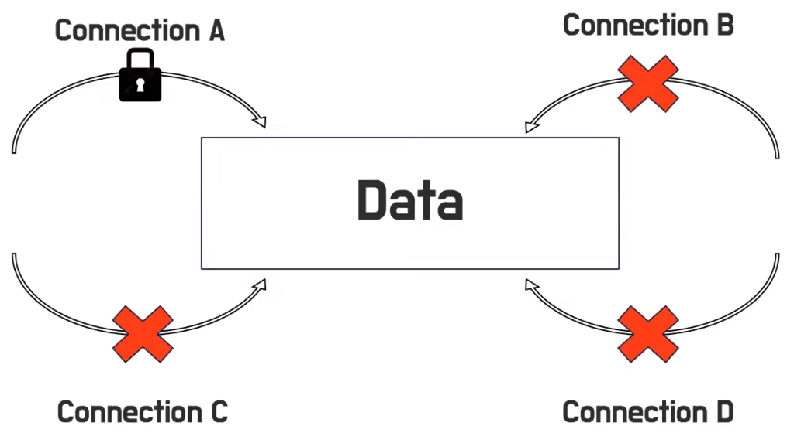
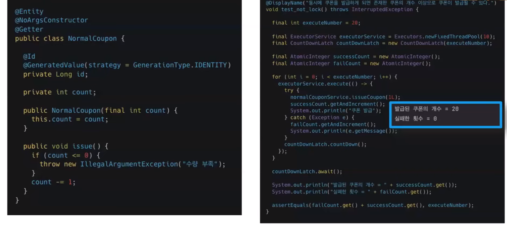
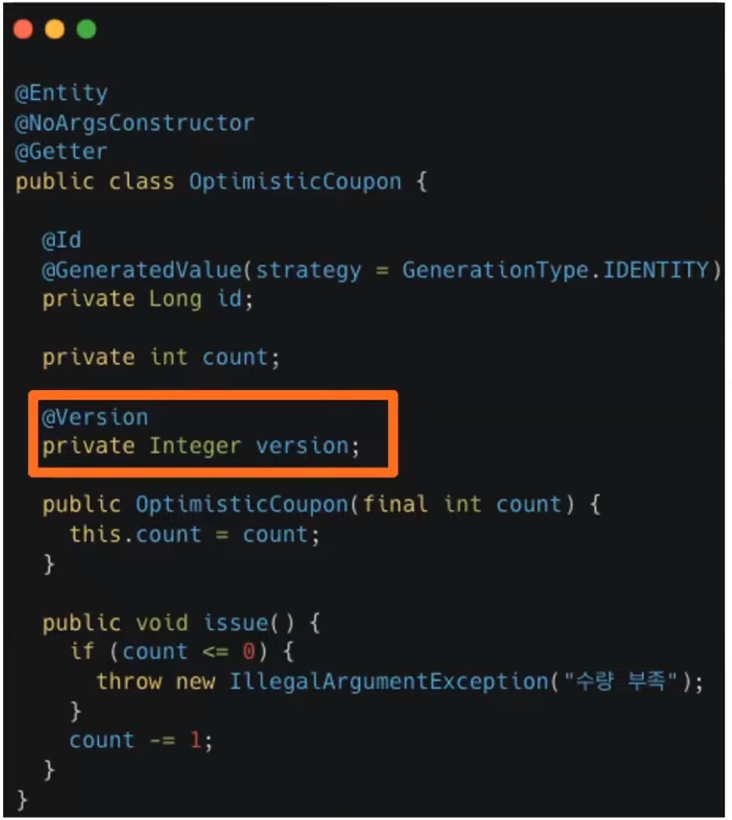
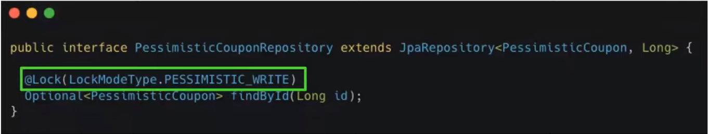
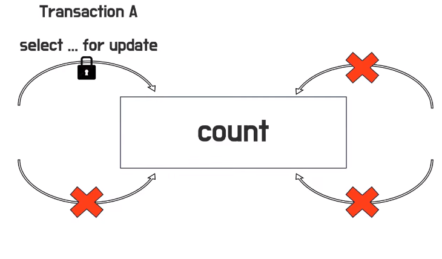

# 우르의 Lock & JPA Lock
[https://youtu.be/LDi5muN2kgI?feature=shared](https://youtu.be/LDi5muN2kgI?feature=shared)

# 우르의 Lock & JPA Lock
* toc
{:toc}

## Lock은 무엇일까요?
+ 
+ 여러 커넥션들이 수정 요청이 동시에 발생하게 되면은 문제가 생기는데 커넥션이 오는 순서에 따라서 데이터 값이 어떻게 될지 아무도 모른다
+ 이때 데이터의 일관성에 문제가 생기게 되는데 이 문제를 해결하는 방법 즉 메커니즘 중 하나가 Lock이다
+ 
+ 자물쇠를 걸고 푸는 행위를 우리는 Lock이라고 한다

## Lock과 Transaction
+ Lock은 동시성 제어 메커니즘 중 하나입니다
+ 트랜잭션은 All or Nothing 작업의 원자성을 보장한다
+ 트랜잭션 격리 수준 때문에 둘의 차이가 헷갈린다 
  + Lock은 동시에 발생하는 수정 요청에 대한 데이터 일관성을 지키기 위한 메커니즘 중 하나이고
  + 트랜잭션 격리 수준은 이 여러 트랜잭션에 대해 각 트랜잭션들을 어떻게 처리할지에 대한 전략이다
  + 결국에는 이 각 트랜잭션들을 어떻게 처리할지에 대한 전략 중 구현 방법 중에 하나가 Lock인것이다
    + 격리 수준을 구현할 방법 중에 하나가 Lock이라고 생각하면 된다
    + 

## Lock 전략 
+ Lock 전략에 대해서는 크게 낙관적 Lock, 비관적 Lock이 있다
+ 낙관적 Lock: 트랜잭션이 애초에 충돌이 발생하지 않는다 라고 가정하고 사용하는 전략
  + 트랜잭션이 충돌이 되면 그때서야 조치를 취하게 된다
  + 그래서 이제 이 낙관적 Lock은 애플리케이션 Lock이라고도 한다 그 이유는 애플리케이션 내에서 버전이라는 것을 통해서 해당 Lock을 구현할 수 있기 때문에  
    애플리케이션 Lock이라고도 한다
+ 비관적 Lock: 트랜잭션이 매번 충돌이 발생한다고 가정하고 사용하는 Lock 전략이다
  + 그래서 데이터베이스 트랜잭션 Lock이라고 하는데 대표적으로 select for update 가 있다 
  + 데이터를 접근할 때 얘는 트랜잭션이 충돌할 것 같으니까 바로 Lock을 걸게 된다

## JPA에서의 낙관적 & 비관적 LOCK
+ 테스트 상황 
  + 쿠폰이 5장이 있고 총 20명의 사용자가 동시에 쿠폰을 발급한다
  + 
    + 자바에서의 테스트에서 동일성 테스트의 방법 중에 하나인 익스큐터 서비스와 카운트다운 래치가 있다
    + 결과가 이제 발급된 쿠폰의 개수가 20개가 된다 분명히 5개의 쿠폰만 발급할 수 있는데 20개의 쿠폰이 발급이 되어버린다
  + 낙관적 Lock을 사용
    + 
    + jpa에서의 낙관적 Lock을 사용하기 위해서는 Version 어노테이션 사용하면 낙관적 Lock을 사용할 수 있다
    + 어떤 값이 변경될 때 이 버전이 같이 올라간다 그러니까 현재 버전이 맞는지 현재 버전이 아니지 검사하기 위한 숫자
    + 저 어노테이션을 붙여준 이유는 이 엔티티에 접근했으니까 버전을 +1
    + 현재 버전이 맞는지 확인을 하고 나서 값을 변경 그리고 값을 변경할 때 같이 버전도 변경
    + 테스트를 돌려보면은 3개의 쿠폰이 동시에 발급되는 것을 알 수 있다 3장의 쿠폰만 발급되는 이유는 바로 JPA 에서의 낙관적 Lock은 최초의 요청만 커밋하기 때문이다 
    + JPA에서의 낙관적 Lock은 최초 요청이 발생하기 때문에 이 동시성 테스트가 JVM이 어떻게 되는지에 따라서 쿠폰의 개수가 1개, 2개, 3개, 4개, 5개까지 될 수 있다
    + 다만 제일 중요한 점은 정상적인 보통적인 상황에서의 테스트와 달리 5개가 넘지 않는 쿠폰 쿠폰의 개수가 5개 넘지 않는다는 것은 보장이 된다
  + 비관적 Lock을 사용
    + 
    + JPA에서의 비관적 Lock은 Lock 어노테이션과 함께 Lock모드 타입을 pessimistic write를 사용하면 된다
    + 테스트를 돌려보면 정확하게 5개 쿠폰만 발급되는 것을 알 수 있다
    + 데이터에 접근할 때부터 바로 자물쇠에 잠그기 때문에 20명의 사용자가 동시에 쿠폰을 발급할 경우에는 트랜잭션 하나가 들어가는 순간 나머지 트랜잭션은 대기하게 된다 그래서 이 앞에 있는 트랜잭션이 끝나고 나서 다음 트랜잭션이 실행이 된다
    + 그래서 20개의 트랜잭션 중에 정확히 5개만 실행이 되고 나서 나머지 것은 쿠폰의 개수가 아예 부족해 버리기 때문에 바로 Exception을 통해서 Exception이 발생해서 정확히 5개 쿠폰만 발급될 수 있다
    + 대표적으로 select for update 가 있는데 트랜잭션이 데이터에 접근할 때부터 Lock을 거는 쿼리라고 생각하시면 된다
    + 
+ 결론
  + 낙관적 Lock 비관적 Lock은 누가 좋다 안 좋다는 없다
  + 어떤 알맞은 상황에 잘 사용하느냐 어떤 상황에 맞게 Lock 전략을 사용하느냐가 되게 중요하다
