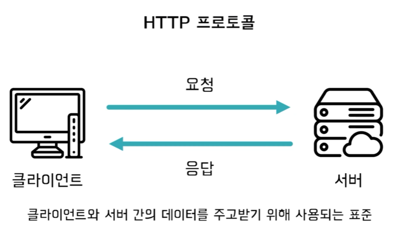
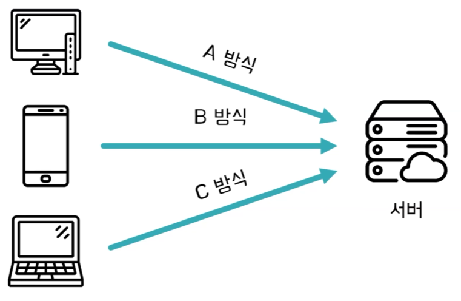
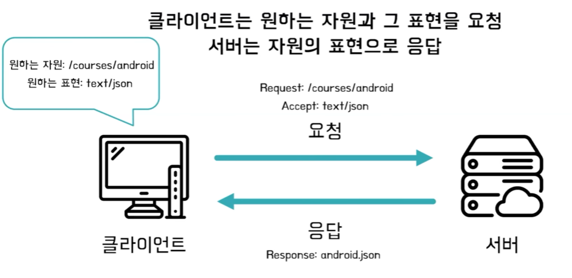
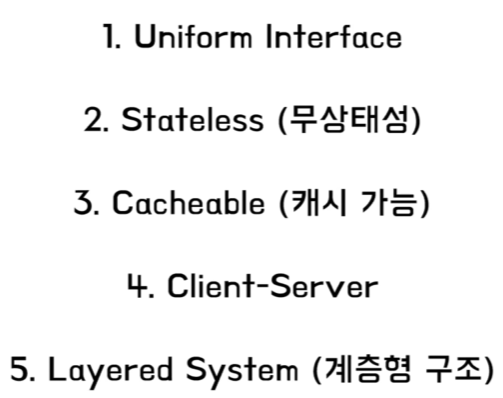

# 베리의 RESTful API
[https://youtu.be/ZuJUk9c2Ujs?feature=shared](https://youtu.be/ZuJUk9c2Ujs?feature=shared)

# 베리의 RESTful API
* toc
{:toc}

## RESTful API?
+ API의 의미: API는 애플리케이션 프로그래밍 인터페이스의 줄임말로 두 애플리케이션이 서로 통신하는 방법을 정의한 것을 의미한다
+ RESTful 의미: RESTful은 말 그대로 REST스러운 API, 즉 REST 아키텍처 스타일로 요청과 응답을 하는 API를 뜻한다

## REST 아키텍처의 탄생 배경
+ REST 아키텍처의 탄생 배경을 알아 보기 위해서는 REST에 기반이 되는 HTTP 프로토콜에 대해 먼저 알아야 한다
+ 
  + HTTP 프로토콜은 서버 간의 데이터를 주고받기 위해 사용되는 표준이다
  + 클라이언트가 서버에게 요청을 하면 서버는 클라이언트에게 응답을 하는 방식으로 작동을 한다
+ REST를 2000년에 개발한 로이필딩은 HTTP 1.0, 1.1의 주요 저자로서 웹표준화에 상당한 기여를 했다
+ 
  + HTTP 프로토콜이 표준화가 되어 있긴 하지만 이를 어떻게 구현해야 될지 그 방식에 대해서는 굉장히 유연하기 때문에 개발자마다 이를 어떻게 해석하는지에 따라 구현 방식이 달라지게 된다
  + 통신에 참여하는 애플리케이션들이 어떤 각기 다른 방식을 사용하게 되면 이는 매우 복잡하고 유지 보수가 어렵게 된다
+ 로이 필딩은 이렇게 서버와 클라이언트가 통신을 할 때 HTTP 통신의 이점을 활용하지 못하는 것을 포착을 했고 웹의 장점을 최대한 활용할 수 있는 REST 아키텍처를 선보이기로 결심했다

## REST란?
+ RESTful API는 요청 메시지만 보고도 무엇을 원하는지 파악이 가능하다
+ REST는 REpresentational State Transfer의 약자로 Representational은 표현으로, State는 상태로 Transfer은 전달로 해석된다
+ REST는 자원을 이름으로 구분하여 자원의 상태를 전달하는 API를 말한다
+ 일단 자원은 URI로 구현이 됩니다 행위나 상태는 HTTP 메소드로 구현이 되고 표현은 요청 헤더에 담겨서 구현이 된다
  + 여기서 표현이라는 것은 클라이언트가 어떤 타입으로 응답을 받을지를 정하는 것을 말한다
+ 자원 - URI
  + 자원은 모든 URI는 자원으로 표현된다
  + REST에서는 URI는 자원으로 표현되어야 된다 즉, 자원 명사로 표현되어야 한다
  + 자원에 대한 조작은 HTTP 메소드로 표현을 해야 한다
  + URI는 슬래시 구분자를 통해 자원 간의 계층 관계를 나타내야 한다
  + 컴퓨터 폰트에 따라서 언더바를 지원하지 않는 경우도 있기 때문에 혼란을 방지시키기 위해 언더바를 대신 하이픈을 사용해야 한다
  + 대문자 대신 소문자를 사용해야 하는데 대문자를 사용할 경우 일관성이 떨어질 수 있기 때문에 대문자 대신 소문자를 사용해야 한다
  + URI의 마지막에는 슬래시를 포함하지 않느다 마지막 슬래시는 아무런 의미도 없기 때문에 혼란만 야기할 수 있기 때문에 슬래시를 포함하지 않는 것이 좋다
+ 행위 - HTTP METHOD
  + 행위는 HTTP 메소드를 통해 나타낸다
  + http 메소드의 종류에는 get, post, put, patch, delete 등이 있다
+ 표현 - 요청 HEADER
  + 표현은 요청 헤더를 통해 요청 헤더를 통해 구현이 된다
  + 리소스의 응답 타입은 요청 헤더로 나타내면 된다
  + accept 헤더를 사용해서 응답 타입을 지정할 수 있다
  + 
  + REST가 해석하는 HTTP 프로토콜은 클라이언트는 원하는 자원과 원하는 표현을 서버에게 요청한다 그리고 서버는 자원의 표현으로 응답한다 
  + 서버가 자원을 그대로 응답하는 게 아니라 클라이언트가 요청한 그 표현으로 변환을 해서 응답을 한다

## REST API 설계 원칙
+ 
+ 지금까지 살펴본 것은 유니폼 인터페이스에 포함되는 원칙들이다 1번을 제외하고 나머지 원칙들은 웹을 인터넷에 사용함으로써 자연스럽게 제약이 지켜지기 때문에 API를 설계하는 개발자들은 1번 유니폼 인터페이스의 원칙을 지키기 위해 노력하면 된다
+ 완전히 RESTful한 API를 만들 수 있을까요?
  + 만들 수는 있지만 제약이 많기 때문에 이거는 굉장히 어려운 일이다
+ 로이필딩은 REST의 모든 제약 조건을 만족해야만 RESTful한 API라고 부를 수 있다고 한다
  + 시스템 전체를 통제할 수 있다고 생각하거나 진화에 관심이 없다면 REST에 대해 따지느라 시간을 낭비하지 마라
    + 여기서 시스템 통제가 가능하다는 말은 서버와 클라이언트 즉 시스템 전체를 내가 개발했다 이를 말하고 진화에 관심이 없다는 것은 오랜 시간을 걸쳐 진화하는 시스템에 관심이 없다는 것을 말한다
    + 꼭 REST의 모든 제약을 준수할 필요는 없다
    + API를 개발하는 개발자의 상황에 맞춰서 RESTful에 제약 조건 중 원하는 제약만 지켜서 api를 설계할 수도 있다
