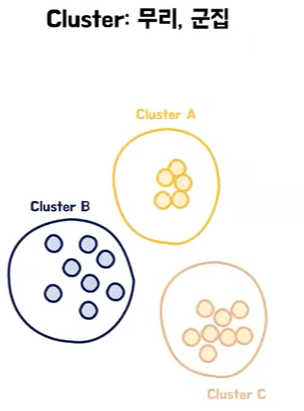

# 로이스의 Index
[https://youtu.be/ywYdEls88Sw?feature=shared](https://youtu.be/ywYdEls88Sw?feature=shared)

# 로이스의 Index
* toc
{:toc}

## Index란?
+ 데이터베이스에서의 인덱스는 검색 속도를 향상시키기 위한 일종의 자료구조

## B-tree (Balanced tree) 
+ 균형 트리
  + 
  + 전반적으로 한쪽으로 치우쳐져 있지 않고 트리들이 각자 적당히 분배하여 노드들을 가지고 있다
  + 이런 균형 잡힌 트리는 검색을 할 때 항상 최적의 성능을 보장하기 위한 특성 중에 하나이다
+ 탐색 트리(정렬)
  + 
  + 탐색 트리는 어떤 값을 기준으로 매번 정렬이 되어 있는 상태를 유지하는 특징이 있다 
  + 내가 원하는 값을 전체 다 조회하지 않고도 쉽게 빠르게 찾아볼 수 있는 특징이 있다
  + 
  + 
  + 항상 정렬을 유지하기 때문에 반대로 삽입이나 삭제 또는 업데이트 같은 부분에 되게 취약한 성능을 보인다
  + 탐색 트리는 항상 정렬 상태를 유지하기 때문에 쓰기 성능을 굉장히 많이 희생하면서 검색 성능을 최대한 끌어올린다는 그런 특징이 있다
+ 하나의 노드에서 여러 정보 저장 가능
  + 
+ 두개 이상의 자식을 가질 수 있다
  + 

## Index로 조회
+ 
+ 데이터들을 트리 구조로 나누어 갖게 된다 

## Index의 종류 
+ Clustered Index
  + 
  + 
  + 클러스터드 인덱스는 PK로 설정을 하면 자동으로 생성이 되기 때문에 PK 인덱스라고도 부를 때가 있고 또 Unique와 Not null 제약 조건을 걸면 자동으로 생성이 된다
  + 
  + 인덱스는 실제 데이터 연관이 있기 때문에 아이디 값으로 정렬을 하면서 실제 데이터들이 저장되어 있는 주소가 변경되게 된다
  + 해당 데이터에 인덱스가 생성되었기 때문에 ID가 6인 값을 찾는다 하면 인덱스를 타고 가서 실제 데이터 주소 실제 데이터가 저장되어 있는 곳에 접근하여 데이터를 조회할 수 있다는 특징이 있다
  + 정리를 해보면 클러스터드 인덱스는 실제 데이터들을 정렬한다는 특징이 있다 또 인덱스의 마지막 페이지 끝점이 리프 페이지가 실제 데이터 값들이라는 것이다 
  + 이런 특징 때문에 테이블당 한 개만 존재할 수 있다 
+ Non-clustered Index
  + index 생성 sql문으로 생성을 할 수 있다
  + 인덱스 이름과 어느 테이블에 어떤 컬럼을 설정할지 명명할 수 있는데 이때 컬럼은 여러개를 둘 수 있다
  + 이때는 컬럼의 명명하는 순서가 굉장히 많은 영향을 미침으로 이점을 고려해서 생성해야 한다
  + Unique 제약 조건을 걸면 non-clustered index가 생성된다
  + 
  + 실제 데이터들은 가만히 있는다
  + 이름으로 정렬되어 있는 인덱스 페이지만 따로 생성하게 된다
  + 여기서 가장 큰 특징은 실제 데이터와 연관되어 있지 않기 때문에 이 인덱스의 리프 페이지 마지막 끝점에는 데이터 실제 값들이 아니라 데이터가 저장돼 있는 그 주소값을 가지고 있다
  + 인덱스와 데이터 페이지가 따로 존재한다
  + 리프 페이지에서는 실제 데이터가 아니라 데이터가 저장되어 있는 주소값을 가진다
  + 이러한 특징 때문에 데이터 페이지가 정렬 될 필요 없고 그래서 한 테이블에 여러 개가 존재할 수 있다
+ Clustered Index & Non-clustered Index
  + 
  + 클러스터드 인덱스는 크게 달라지는 점은 없다
  + 하지만 논클러스터드 인덱스에서 이전에는 데이터 주소를 직접 가르키고 있었는데 이제는 클러스터드 인덱스에서 걸어둔 column 혹은 PK 값을 가지게 된다
  + 검색을 했을 때 주소 값을 통해서 인덱스를 타고 PK 값을 찾아내고 해당 PK를 다시 클러스터드 인덱스 PK 인덱스를 타고 데이터에 접근하는 순서로 동작을 하는데 어떻게 보면 검색에 있어서 성능이 조금 손실을 봤다 라고도 할 수 있는데 
  이렇게 동작하는 이유는 PK 쓰기 작업에 대한 유연성을 갖추기 위해서이다
  + 
  + 예를 들어서 다양한 인덱스들이 있고 클러스터드 인덱스가 모두 데이터 주소를 가리키고 있다 하면은 이 상태에서 PK값이 변경되거나 추가되는 작업이 일어났을 때 해당 주소를 다 가리키고 있던 인덱스에서 이 변경을 다 감지하고 있고 수정 작업이 다 이루어져야 해서
    이런 막대한 연산 비용을 줄이기 위해서 PK값을 저장하고 PK에 대한 변경 사항에 대해서는 클러스터드 인덱스를 통해서 조회를 하는 식으로 동작하게 된다

## Index는 어디에?
+ where과 join 혹은 order by 같은 그런 조건식에 자주 발생하는 컬럼들
+ INSERT, UPDATE, DELETE 적게 발생하는 컬럼
+ 중복도가 낮은 컬럼
+ 범위 검색이 적은 컬럼
+ 데이터가 많은 테이블 
