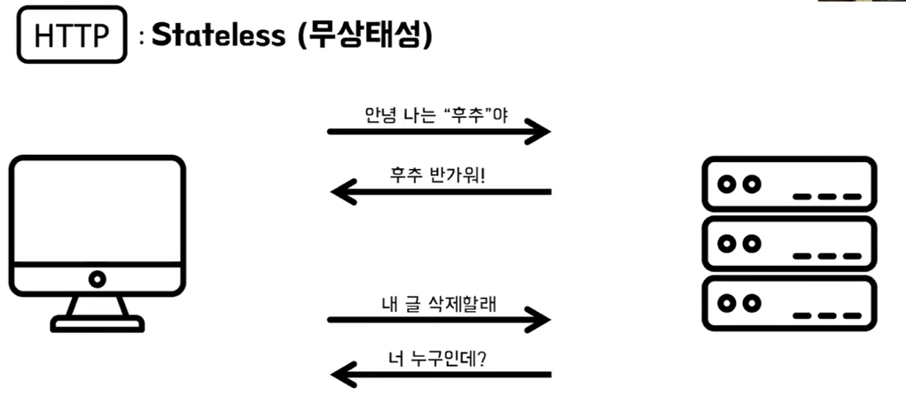
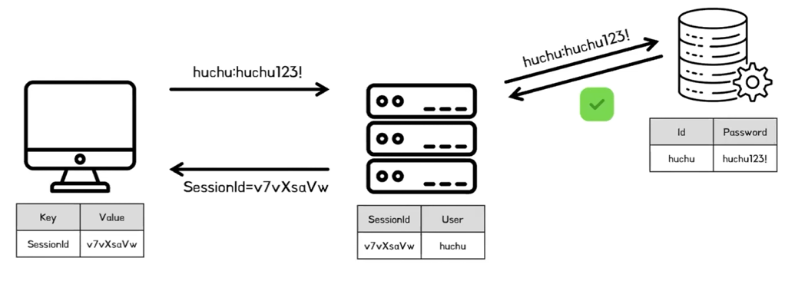
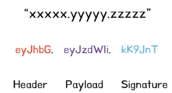
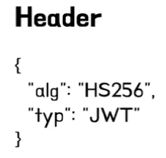
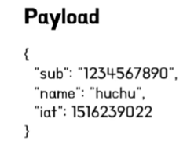
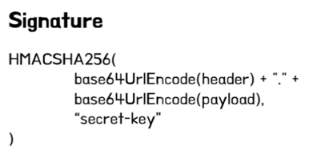
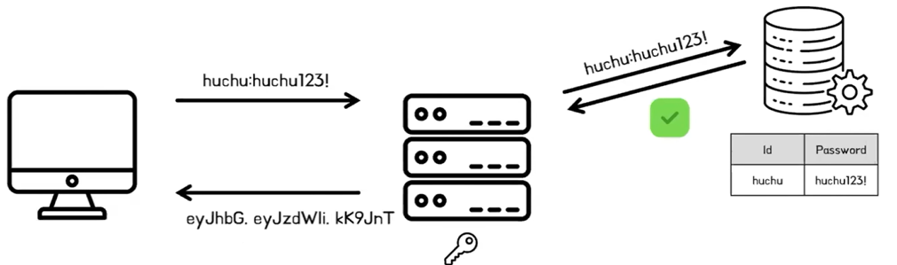
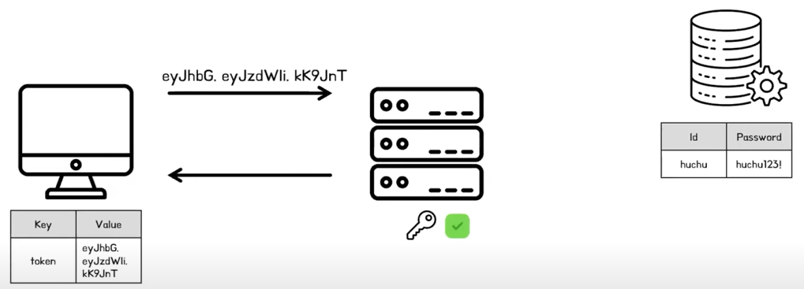

# 후추의 인증 인가
[https://youtu.be/_6L2k3mzXTk?feature=shared](https://youtu.be/_6L2k3mzXTk?feature=shared)

# 후추의 인증 인가
* toc
{:toc}

## 인증, 인가 개념
+ 인증이란 식별 가능한 정보로 사용자가 누구인지 확인하는 절차이다
+ 인가란 인증된 사용자가 특정 자원에 접근할 수 있는지 권한을 확인하는 절차 이다
+ 

## 인증을 유지하는 방법: 세션, 토큰
+ 세션
  + 세션은 서버가 클라이언트와 상호작용을 유지하기 위해서 서버 내에 클라이언트의 상태 정보를 저장하는 방식
  + 
+ 토큰
  + 토큰은 사용자 인증에 대해 정보가 담긴 징표라고 볼 수 있다
  + Json Web Token(JWT)
    

### JWT
+ 
+ Header
  + 
  + 헤더는 토큰의 유형과 서명에 사용된 암호화 알고리즘에 대한 정보를 포함한다
  + Base64 URL로 인코딩 된다
+ Payload
  + 
  + 사용자 정보 혹은 토큰 정보 등을 나타내는 클레임(Claim)을 포함한다.
  + 예를 들어, 대상(sub), 발행 시간(iat), 만료 시간(exp) 등을 적을 수 있다.
  + Base64 URL로 인코딩 된다
+ Signature
  + 
  + 토큰의 무결성을 보장하고 변조를 방지하기 위해 사용된다
  + 헤더와 페이로드를 Base64 URL로 인코딩한 값을, 비밀 키(Secret Key)와 함께 함호화해서 생성한다
  + 토큰의 변조 여부를 확인하려면 헤도와 페이로드를 비밀 키(Secret Key)로 암호화한 값과 Signature가 같은지 확인한다 
  + 
  + 
    
## 세션과 토큰 비교 

### 확장성
+ 세션 
  + 세션은 확장적인 측면에 있어서 추가적인 조치를 필요로 한다
  + 세션은 확장에 굉장히 불리한 구조다라고 볼 수 있다
+ 토큰
  + 토큰이 확장성에 있어서는 유리한 구조다

### 보안 
+ 보안 관련된 측면에서는 세션이 토큰보다 더 안정적인 보안적인 이점을 가지고 있다
