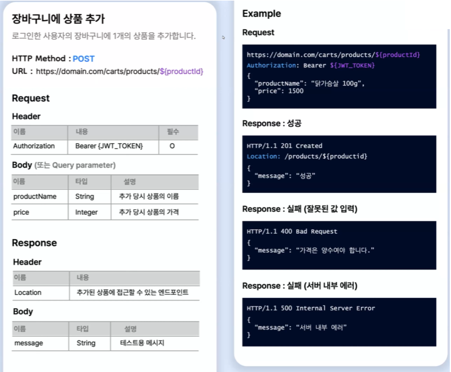
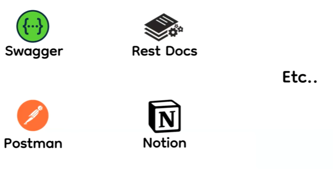

# 체인저의 API 명세서와 협업
[https://youtu.be/r03ObslCNlo?feature=shared](https://youtu.be/r03ObslCNlo?feature=shared)

# 체인저의 API 명세서와 협업
* toc
{:toc}

## API 명세서 작성 방법
+ API 명세서란 API 기능, 동작, 사용법 등을 나타낸 문서
+ API 명세서는 API의 이름과 설명을 간단하게 담고 있어야 한다
+ 접근할 수 있는 주소와 HTTP 메소드 등의 기본 정보도 포함하고 있어야 한다
+ 요청을 보낼 때 필요한 Header, Parameter, Body를 모두 설명하는 내용을 담고 있어야 한다
+ 마지막으로 요청. 마찬가지로 Header와 Body, 들어가는 정보에 대해서 어떤 내용인지를 설명할 수 있어야 한다
+ 여기에 더해서 이 내용을 한눈에 알아볼 수 있는 예시를 포함하고 있는 것이 굉장히 많은 도움이 된다
+ 또 응답이 여러 경우로 나뉘는 경우에는 각각의 응답을 모두 예시를 들어주는 것이 좋다
+ 
+ API 명세서에 어떤 내용과 얼마나 자세히 담을 것인지를 결정하는 것은 굉장히 어려운 일이다 그럴 때 참고할 만한 기준이 'API 명세서만 보고도 사용할 수 있는가' 이다
+ API 명세를 위한 다양한 툴이 존재
  + 
  + 우리는 각각의 장단점을 파악을 하고 나에게 유리한, 나의 상황에 가장 적당한 툴이 어느 것인지 선택할 필요가 있다

## 협업의 자세
+ API 설계를 먼저
  + API 설계를 먼저 해야 된다 API 설계가 이루어지지 않으면 API 구현 기간 동안 프론트엔드 개발자는 작업을 하지 못하거나 작업을 하더라도 추후에 많은 수정이 필요한다 
  + API 명세가 나중에 나오면 API 구현 기간 동안 API 호출 부분 작업을 못하거나, 임의로 API 주소, HTTP method, 속성명을 사용하다가 모두 바꿔야한다
+ API 설계할 때 소통하자
  + API를 설계할 때는 네이밍, 반환 타입, Json 구조랑 그리고 정렬을 서버에서 할지 클라이언트에서 할지 등 소통해야 될 부분이 굉장히 많다
  + 소통을 통해서 API를 설계해 나간다면 나중에 두 번 일할 일이 없다 (서로 리소스를 낭비하지 않을 수 있다)
+ 업데이트를 사전에 공유하자
  + API 스펙이 변경되면 클라이언트 코드도 변경이 되어야 되다
  + 업데이트할 내용을 사전에 공유하고 조율한 이후에 그 다음 업데이트를 진행하는 것이 필수적이다 
+ 상대방 입장에서 설명하자
  + 프론트엔드 개발자와 백엔드 개발자는 관심사가 달라서 같은 문제를 두고도 관심 있는 부분이 다르다
  + 상대방이 가장 궁금해 할 내용을 상대방이 이해할 수 있게 설명해야 프론트엔드는 프론트만의 문제를 해결할 수가 있다
  + 그렇다면 EC2, 메모리 이런 거 말고 프론트 개발자가 가장 궁금해할 내용은 서버가 멈췄다는 사실, 복구 예정 시간 그리고 복구 완료 후 리마인드 드릴 것까지 설명
