# 코건의 Scope & Closure
[https://youtu.be/K8dqJ126th8?feature=shared](https://youtu.be/K8dqJ126th8?feature=shared)

# 코건의 Scope & Closure
* toc
{:toc}

## Scope
+ 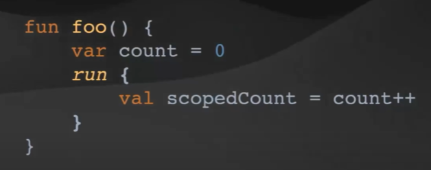
+ 스코프는 코드 블럭

### Function

#### Function Types
함수의 매개 변수와 변환의 타입 지정
+ 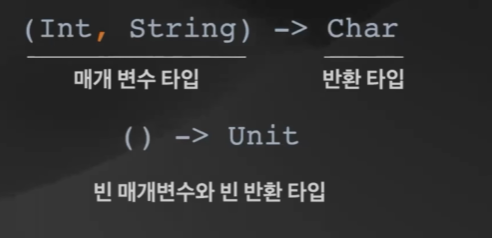
+ 이거는 인자로 Int와 String을 받고 반환 타입으로 Character를 받는 함수를 나타내는 타입이다
+ 빈 괄호는 매개 변수가 아무것도 없고 반한 타입도 존재하지 않는다

#### First Class Functions
Kotlin 함수는 일급 시민으로 취급
+ 1급 함수를 받고 아니면 리턴하고 이런 거를 고차 함수라고 부른다 
+ 1급 시민이 뭐냐 하면은 함수를 매개 변수로 전달 가능하고 함수를 함수에서 반환 가능하고 함수를 변수에 이렇게 할당 가능하고
  함수를 자료구조에 저장 가능하다 이랬을 때 이 함수가 1급 시민 객체
+ 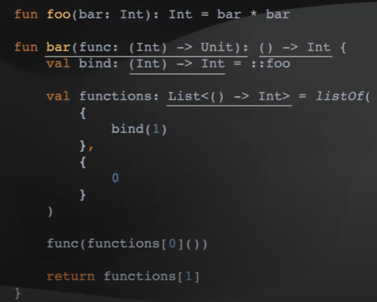
+ 매개 변수로 전달 가능
+ 함수에서 반환 가능
+ 변수에 할당 가능
+ 자료 구조에 저장가능 

#### Lambda
+ 표현식으로 바로 전달 가능한 Function Literal
+ 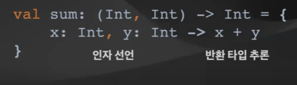
+ lambda는 코틀린에서 1급 시민이니까 이 sum 이라는 변수에 할당을 할 수가 있다
+ 그래서 이 sum 이라는 변수는 int 두개를 인자로 받고 int를 리턴하는 함수 타입이고 어떤 lambda를 저장하냐 보면 X와 Y라는 인자를 받고 X와 Y를 더해서 리턴해주는 lambda이다
+ 여기서 문법을 좀 더 살펴보자면 X, Y는 인자 선언이라 볼 수 있고 그 다음에 함수 본문이라고 볼 수 있다
+ 반환 타입 추론은 코틀린 컴파일러는 타입에 대한 추론을 할 수 있다 그래서 어떤 일정 정보가 주어졌을 때 그 정보를 바탕으로 이 표현식이 어떤 타입인지를 추론할 수 있다
+ 컴파일러 타입 추론에 의한 불필요한 문법 제거 
  + 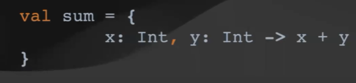
  + lambda 자체에서 인자에 어떤 타입이 있고 이 인자들을 이용해서 리턴 값이 어떤 타입인지 이미 컴파일러가 추론을 할 수 있기 때문에 저희는 이런 불필요한 구문을 제거할 수 있다

#### Lambda Scope에서 외부 변수 참조 
+ 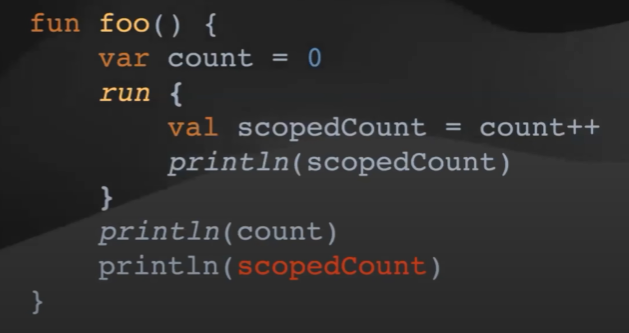
+ 내부에서 외부의 변수 참조 가능
+ 외부에서 내부 변수 참조 불가능 

## Closures
+ 함수와 그 함수와 참조하는 외부 스코프의 지역 변수
+ 
+ 람다, 익명 함수, 지역 함수, 익명 클래스에서 Closure가 생성
+ Closure가 '포획'한 변수는 스코프 내부에서 변경가능 

### Variable Capture (변수 포획)
Closures가 가지고 있는 외부 지역 변수 
+ 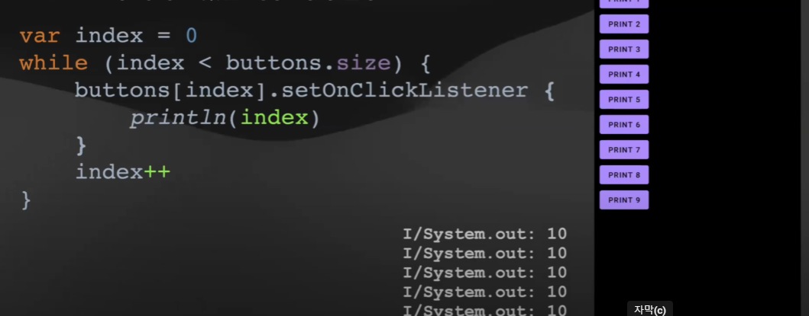
+ 클로저에서 외부 인덱스에 있는 값을 캡쳐해 가지고 저장한게 아니고 이 값에 대한 참조를 캡쳐해 가지고 가지고 있게 된 거다 그래서 이 클릭을 하는 시점에서는 이미 이 인덱스의 값이 10이 되어 있고 그래서 출력할 때 10이 나오는 것이다
+ 값을 변경될 때는 값을 캡쳐하는게 아니고 참조를 캡쳐한다

### Variable Capture in Java
final 변수만 포획 가능
+ 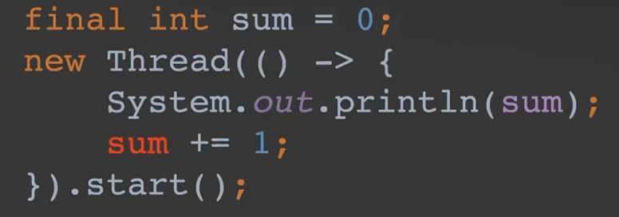
+ 전통적인 절차지향 프로그래밍에서 변수는 스포프에 종속
+ 코드 블러이 실행되고나면 지역 변수는 메모리에서 제거 
+ 자바 8부터 final 변수만 람다에서 포획 가능 
+ 속임수를 사용하여 포획한 변수 변경
  + 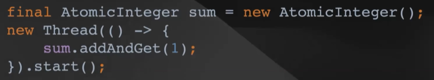
    + atomic integer wrapping하는 클래스를 만들어 가지고 그 클래스에 대한 참조를 캡쳐를 한 다음에 그 클래스에 있는 내부 값을 바꾸는 방법
  + 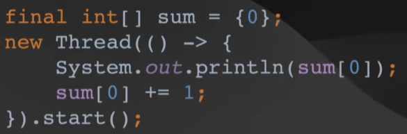
    + 인텔리제이에서 제공하는 방법인데 배열의 사이즈가 하나의 배열을 만들어서 그 배열의 참조를 가지고 와서 그 배열의 첫번째 값을 바꿔준다 이런식으로도 속임수를 써서 바꿀 수 있다
+ 코틀린에서는 어떻게 되냐
  + 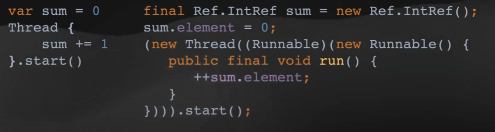 
  + 코틀린 컴파일러가 값이 변경되어야 할 필요가 있다고 하면은 이렇게 Ref.IntRef라는 랩핑 클래스를 만들어 가지고 그 클래스에 값을 넣고
    그 클래스에 있는 참조를 캡쳐해 가지고 변경하는 모습을 볼 수 있다
