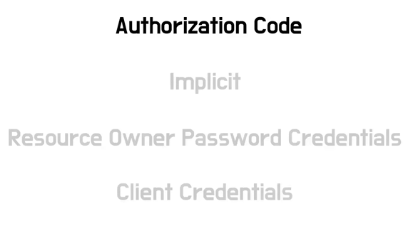
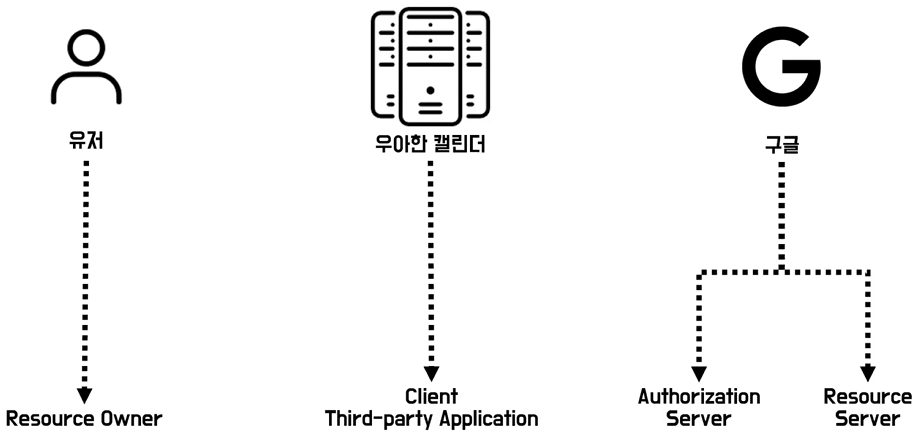
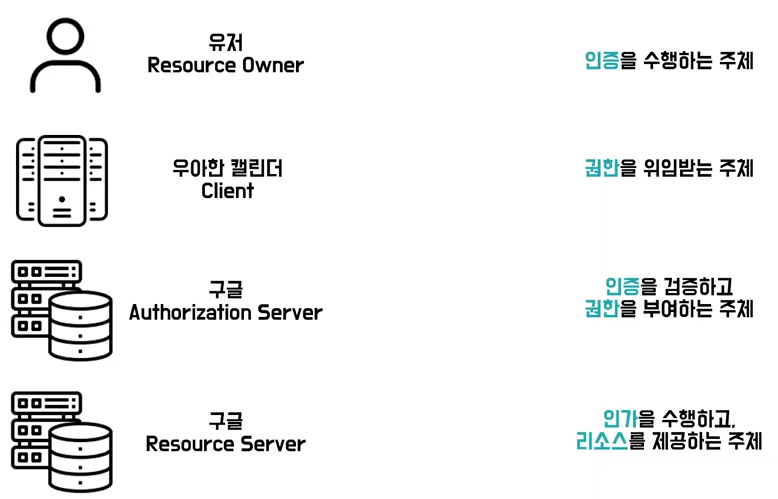
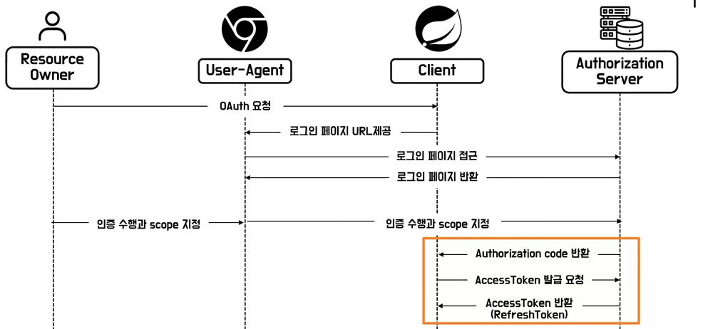
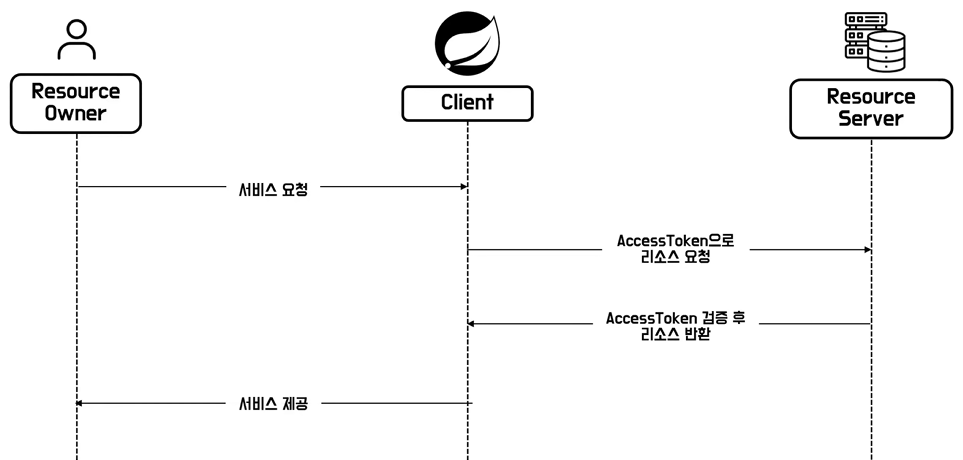
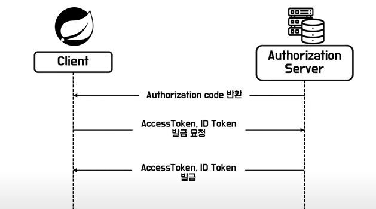
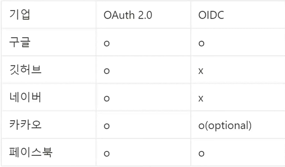

# 홍실의 OAuth 2.0
[https://youtu.be/Mh3LaHmA21I?feature=shared](https://youtu.be/Mh3LaHmA21I?feature=shared)

# 홍실의 OAuth 2.0
* toc
{:toc}

## OAuth 2.0 이란?

### OAuth 사용 이전
+ 
+ OAuth를 쓰기 전에는 유저의 구글 아이디와 패스워드를 받고 구글 로그인을 한 뒤에 사용자 캘린더에 대한 정보를 받고 이를 가공해서 서비스를 제공해줘야 했다
+ 근데 이는 좀 큰 문제가 있어요 유저 입장에서는 우아한 캘린더를 믿을 수가 없다 구글 아이디와 패스워드를 줬는데 구글 캘린더뿐만 아니라 구글 포토나 구글 드라이브 같은 저희가 원하지 않는 서비스에 접근할 수 있는 위험성이 있다
+ 또 우아한 캘린더 입장에서도 구글 아이디와 패스워드를 관리하는 건 되게 부담스럽다
+ 이를 관리하다가 보안적인 조치를 잘못해서 갑자기 노출이 된다면 서비스를 바로 접어야되기 때문이다 
+ 구글의 입장에서도 보안 수준을 엄청 높여서 개발을 했는데 구글 아이디와 패스워드가 외부에서 노출된다면 이러한 보안 조치한 작업들이 다 무용지물이 될 것이다
+ 이 모두가 우아한 캘린더가 구글의 아이디와 패스워드를 직접적으로 관리해서 생기는 문제이다

### OAuth 적용
+ 유저는 구글에 직접 아이디와 패스워드를 입력해서 인증 과정을 수행한다
+ 이때 우아한 캘린더는 이 인증 과정의 어디에도 포함되지 않는다 그렇기 때문에 중간에 탈취당할 염려가 없다 
+ 대신에 이 인증이 유효하다고 확인이 되면 구글 입장에서는 유저의 캘린더에 접근할 수 있는 권한을 우아한 캘린더에게 부여를 한다
+ 우아한 캘린더는 이 부여받은 권한으로 사용자 캘린더에 접근을 한다 이때 유저는 이 권한을 부여받는 과정 어디에서도 관여가 되지 않는다 이는 권한이 탈취될 수 있는 범위를 최대한 좁혀서 보안적인 이점을 얻기 위해서이다
+ 인증은 유저가 직접, 권한은 서비스에게 이렇게 OAuth는 인가를 위해서 탄생한 기술이다

### OAuth flow
+ 
+ 원하는 서비스의 대부분이 다 authorization code flow를 지원해 준다

### OAuth Role
+ 
+ 

## OAuth 2.0 흐름
+ 
+ 클라이언트는 오로지 로그인 페이지에 URL만 제공해주고 실제로 로그인 페이지나 인증 과정 수행 같은 거는 전부 다 Resource Owner와 Authorization 서버만 참여하고 있다
+ OAuth의 가장 기본적인 골자인 인증과 인가의 대상을 분리한 것이다 
+ 권한을 부여하는 과정에서도 Client랑 Authorization 서버만 참여를 하는 것이고 이러한 권한 부여하는 어떤 범위를 줄이면서 권한이 탈취당할 위험을 줄이게 된다 
+ 그리고 이 통신 같은 경우에는 HTTPS로 암호화가 되어야 한다 이게 '공식 문서에서 이렇게 해라'라고 정해둔 건 아닌데 권장하고 있고 대부분의 서비스에서도 HTTPS가 구현되어 있지 않다면
  이 과정 자체에서 불발 에러가 뜰 확률이 높다
+ 

## 소셜 로그인 - OAuth 2.0
+ 
+ 먼저 파라미터로 Authorization 코드를 받으면 GitHub에서 access token을 발급받는다 
+ 그 이후에 GitHub에서 GitHub access token을 가지고 유저를 식별할 수 있는 정보인 GitHub 프로파일을 받고 이 프로파일을 이용해서 저희는 멤버를 생성하거나 아니면 조회할 수도 있다
+ 이런 방식으로 멤버를 받고 이 멤버를 가지고 JWT 토큰을 만들어서 반환을 해준다 
+ 결국 여러분들이 소셜 로그인을 한다 하더라도 멤버 DB는 따로 구축을 해야 한다 
+ OAuth가 대체해주는 거는 이제 아이디와 패스워드를 관리하는 그러한 것들을 다른 OAuth 제공자에 위임해주는 것이지 저희 서비스에는 다른 정보들이 필요할 수 있다 유저의 찜 정보라든가, 유저가 어떤 일정을 추가할지 이런 추가적인 정보를 관리해야 되기 때문에
  별도의 멤버 DB는 구축을 해야 된다

## 소셜 로그인 - Open ID Connect
+ OAuth는 인가를 위한 기술이다 소셜로그인은 인증이라는 말인데 그래서 이거를 지원해주기 위해서 OAuth 2.0에서 추가적으로 서비스가 들어가는 Open ID Connect라는 기술이 있다
+ 이 기술 같은 경우에는 인증 과정은 전부 다 똑같고 권한을 부여받는 과정에서 access token과 함께 ID token 발급 요청을 받는다 
+ 
+ 
  + access toekn 대신에 ID token만 받는다 아이디 토큰 같은 경우에는 JWT로 이루어져 있다 가운데 페이로드를 디코딩을 하면은 유저의 식별자를 얻을 수 있고 이를 통해서 멤버를 만들거나 회원가입을 하거나
    또 JWT를 만들어서 반환해줄 수 있다

## 소셜 로그인 - 무엇을 골라야 할까?
+ 
+ 제공해주는거 사용해야한다 

## 정리 
+ OAuth는 인가 과정에서 인증을 따로 분리하기 위한 기술이고 인증은 유저가 직접 권한을 서비스에게 부여하는 방식으로 동작한다 
