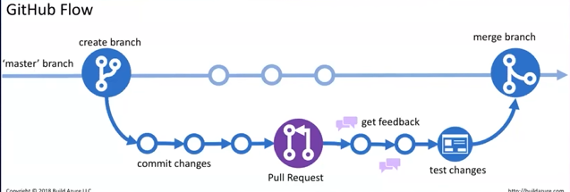
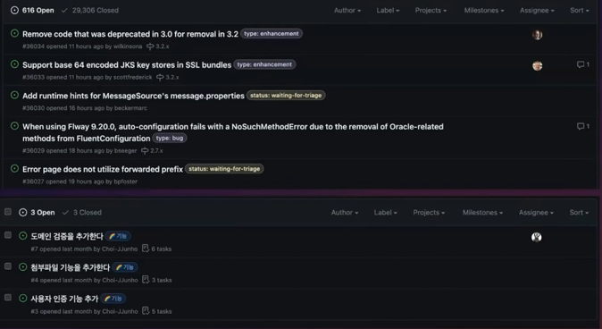
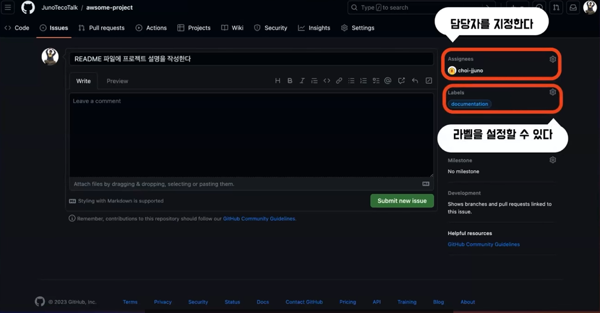
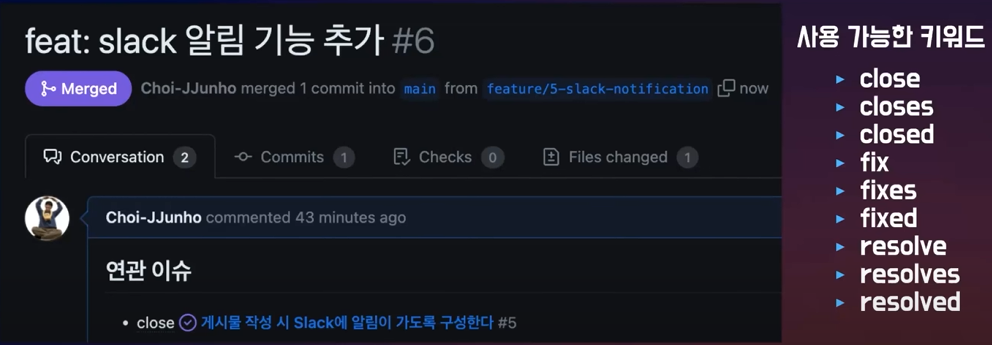
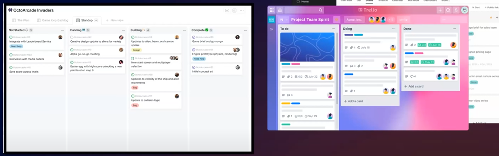
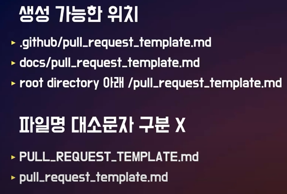

# 주노의 Github와 협업
[https://youtu.be/3doDm--wuJE?feature=shared](https://youtu.be/3doDm--wuJE?feature=shared)

# 주노의 Github와 협업
* toc
{:toc}

## GitHub Organization 생성 및 팀원 초대
+ GitHub Organization은 팀 또는 조직을 관리하는 데 사용이 되고 프로젝트 리포지토리 팀 구성원 관리 등의 기능을 제공한다 
+ 팀장이 Organization을 생성 우측 탭에 Organization 탭에 들어가서 새로운 Organization을 생성 이때 가격대별로 기능이 다 다르다
+ 조직의 이름을 정하고 연락할 이메일을 적고 이게 기업인지 개인적인 그런 조직인지 체크를 하고 다음으로 넘어갈 수 있다
+ 팀장은 멤버들을 초대해서 멤버 혹은 오너의 권한을 부여해서 멤버들을 초대를 하게 된다 근데 이때 이 organization의 멤버를 추가하는 이유는 이 멤버라는 권한이
  레포지토리를 생성하고 팀을 생성할 수 있는 기능이 있기 때문에 권한을 부여해서 초대를 할 수 있다
+ 멤버들은 이메일로 받은 초대 메일을 통해서 Organization에 가입할 수 있다
+ 레포지토리를 생성하고 초기 코드를 올렸다
+ 그 다음에 콜라보레이터를 추가할 수 있다 콜라보레이터는 레포지토리에서 settings에 들어가서 Collaborator and Teams라는 탭에 들어가면 add people 이라는 버튼으로 추가할 수 있다
+ 추가를 하면은 read, write, admin까지 다양한 권한을 초대하는 멤버에게 부여할 수 있다

## GitHub Flow
+ 
+ 협력 과정이 간단하다
+ 피드백이 빠르게 생성되고 교환된다
+ CI/CD를 편리하게 설정할 수 있다 (GitHub Action)
+ 빠른 개발 주기를 가진 프로젝트에 적합하다 

## Issue, PR을 이용해 협업하기

### 기능 개발
+ issue로 요구사항을 등록
+ 팀원이 해당 기능을 개발해서 PR을 올린다
+ 팀장 & 다른 팀원의 코드 리뷰
+ 팀장의 Merge

### GitHub Issue
+ 
+ Issue는 버그, 기능 요청, 개선 사항 등을 추적하고 관리하는 기능이다
+ 이슈를 생성하고, 담당자를 지정하고, 토론을 진행할 수 있다
+ 프로젝트의 진행 상황을 파악하고 업무 조율에 활용할 수 있다 
+ 
+ 상단에 레포지토리에 들어가서 상단에 이슈 탭에 들어가면  뉴 이슈로 새로운 이슈를 생성할 수 있다
+ 팀원이 어떤 내용을 작성해서 새로운 브랜치에다가 작업을 했으면 이 브랜치에서 작업한 내용을 풀 리퀘스트로 작성을 할 수 있다 그래서 레포지토리로 푸시를 한 다음에 자신이 작업한 브랜치에서 메인 브랜치로
  풀 리퀘스트를 생성할 수 있다
+ 풀 리퀘스트를 생성할 수 있고 풀 리퀘스트에서는 리뷰어를 또 지정할 수 있다 이슈와 비슷하게 어사이니와 라벨도 지정을 할 수가 있다

### PR과 ISSUE 연관짓기 
+ 
+ close, resolve 등과 같은 키워드를 사용하여 PR과 Issue를 연관지을 수 있다.
+ 이 때 PR이 Merge되면 연관된 Issue도 close 된다  
+ 이때 PR이 Default 브랜치를 향하지 않으면 연관관계가 적용되지 않는다 

## GitHub Project 생성
+ 
+ GitHub 프로젝트는 프로젝트 작업 관리와 추적을 위한 기능
+ 칸반보드 형태로도 작업을 구성하고 이동시킬 수 있다
+ Trello나 클릭업 같은 다른 회사들의 툴도 있지만 GitHub를 이용해서 이슈나 PR을 이렇게 작업 단위로 관리를 할 수 있다
+ 작업의 상태를 시각적으로 파악하고, 팀원 간의 협업을 원할하게 진행할 수 있다 
+ 생성
  + GitHub 프로젝트 탭에 가서 화살표 버튼을 눌러보면 기존에 있는 프로젝트를 링크하거나 새로운 프로젝트를 만들 수 있다
  + 테이블, 보드, 로드맵 형태로 다양한 뷰 형태로 GitHub 프로젝트를 생성할 수 있다

## GitHub Wiki 생성
+ 프로젝트에 대한 문서, 가이드, 지식 베이스 등을 작성할 수 있는 GitHub 위키라는 기능을 제공을 한다
+ 개발자나 사용자들이 프로젝트에 대한 정보를 쉽게 찾을 수 있도록 도와준다 
+ 레포지토리 상단에 위키라는 탭에서 GitHub 위키를 작성할 수 있다
+ Github 위키는 기본적으로 마크다운 형태로 제공을 하며 에디트 모드를 사용하면 다양한 형태로도 작성을 할 수 있다

## Template

### Issue Template
+ 프로젝트의 settings에 들어가 보면 하단에 features 탭에 있는 issue에 있는 setup templates 버튼을 누르면  창이 뜨는데 여기에서 이제 issue 템플릿을 작성을 할 수가 있다
+ 기본적으로 제공해주는 bug report, feature request라는 템플릿도 있고 커스텀으로 새롭게 템플릿을 만들 수도 있다
+ 이슈 템플릿은 .github라는 폴더 안에 파일 마크다운 파일로 생성이 되는 형태이기 때문에  실제로 코드에 영향이 가는 거라서 commit 혹은 PR로 이 작업을 갱신을 시켜줘야 한다
+ 그래서 이렇게 GitHub 폴더 안에 issue template 폴더 안에 마크다운 파일이 생기는 걸 볼 수 있다

### PR Template
+ 
+ 파일명은 대소문자 구분을 하지 않는다
+ 일반적으로는 .github 폴더 아래에 pull request template.markdown 파일을 생성해서 관리를 하게 된다 
