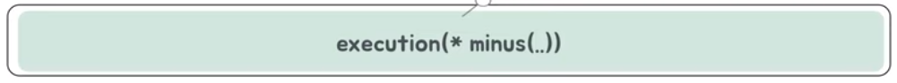
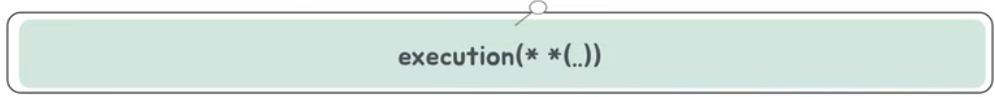

# 콩하나의 스프링 AOP
[https://youtu.be/7BNS6wtcbY8?feature=shared](https://youtu.be/7BNS6wtcbY8?feature=shared)

# 콩하나의 스프링 AOP
* toc
{:toc}

## AOP의 개념
+ AOP란 Aspect Oriented Programming의 약자로 '관점 지향 프로그래밍'를 의미한다 
+ 핵심적인 비즈니스 로직으로부터 '횡단 관심사'를 분리하는 것에 목적을 둔다
  + 횡단 관심사란 애플리케이션에서 코드가 중복이 되고 강력하게 결합이 되어 있어서 다른 로직과 분리를 할 수 없는 어플리케이션 로직이다
  + EX) 로깅, 보안, 트랜잭션 등등 
+ 즉, AOP란 부가기능을 따로 관리하는 것을 의미한다 

### AOP의 장점
+ 전체적으로 흩어져 있는 관심 사항이 하나로 응집이 된다(중복을 제거한다)
+ 자신의 주요 관심 사항에 대한 코드만 포함하고 있기 때문에 코드가 깔끔해진다(가독성이 좋아진다, 유지보수가 용이해진다)
+ 결국 객체지향적으로 코드를 짤 수 있게 도우며 유지보수가 용이해진다 
+ AOP는 실제로 OOP(객체지향 관점 프로그래밍)를 돕는다

## AOP 용어
+ Target
  + 부가 기능을 부여할 대상, 클래스 혹은 객체라고 생각하면 된다
+ Adivce
  + 타깃에게 제공할 부가 기능을 담은 모듈 부가 기능이라고 생각하면 된다
  + AOP에서는 어드바이스를 정의할 때 무슨 기능, 그리고 어느 시점에 이것을 주입해 줄 거야 이 두 가지를 같이 포함하고 있는 의미라고 받아들이면 된다
+ Join Point
  + 어드바이스가 적용될 수 있는 위치를 의미
+ Pointcut
  + 어드바이스를 적용할 조인 포인트를 선별하는 작업을 의미
  + 어떤 메서드에다가 적용해줄 거야?
+ 
+ Advisor
  + 포인트 컷과 어드바이스를 하나씩 갖고 있는 오브젝트
  + 어떤 메소드에 다가 어느 시점에 어떤 기능을 넣어 줄 건지
+ Weaving
  + 조인 포인트에 어드바이스를 적용하는 방법
  + 스프링 AOP에서는 런타임 위빙이라는 걸 사용해서 런타임 중에 어드바이스를 적용

## 스프링에서의 AOP 동작 과정
+ BeanPostProcessor
  + 
  + 스프링 AOP는 빈 후처리기 BeanPostProcessor라는 게 동작하는데 생성된 빈 객체를 스프링 컨테이너에 등록을 하기 이전에 어떤 특정한 조작을 해주는 객체
  + 
    + 생성된 빈 전달
    + 빈 교체 대상 확인
    + 빈 교체 대상이 맞다면 이를 조작 또는 교체 한다
    + 교체하거나 전달받은 빈을 반환한다
    + 반환된 빈 객체를 컨텍스트에 등록 
  + 프록시
    + 
    + 원본 객체를 감싼 새로운 객체로, 스프링 AOP에서 부가기능을 추가할 때 사용하는 패턴 
    + 원래는 프록시 패턴 에서 파생된 용어인데 프록시 패턴에서는 클라이언트가 객체를 직접 호출 하지 않고 이 프록시로 호출하게 되면서 어떤 제어권을 갖도록 하는 게 사실은 프록시 패턴 그런데 스프링 AOP에서 의미하는 프록시는 부가 기능을 추가할 때 사용하는 패턴
  + 
    + 빈 객체를 생성한 뒤 빈 후처리기에게 전달한다 
    + 빈 후처리기는 어드바이저를 싹 훑어본다 다 보면서 어드바이저 내의 포인트컷을 이용해 전달받은 빈이 프록시 적용 대상인지 확인한다 선별하고 '아 얘는 부가기 능을 부여할만한 대상이야' 라는 판단이 되면은 프록시 생성기에다가 전달
    + 프록시 생성 대상 빈들을 대상으로 프록시 객체를 생성한다 그러면은 프록시를 생성해서 다시 반환
    + 프록시를 생성한 빈이라면 프록시 객체를, 프록시를 생성하지 않은 빈이라면 그냥 빈을 반환한다 
    + 결과적으로 빈 후처리기로부터 전달받은 객체를 컨테이너 빈으로 등록을 한다

## 스프링 AOP 구현 예시
+ AspectJ 포인트컷 표현식 
  +  
    1. 접근제한자 패턴: public이나 private과 같은 접근 제한자로 생략이 가능하다 (생략 가능)
    2. 타입패턴: 리턴 값의 타입 패턴이다
    3. 타입패턴: 패키지와 클래스 이름에 대한 패턴이다 (생략 가능)
    4. 이름패턴: 메소드 이름 패턴이다
    5. 타입패턴: ```| .. , ... :``` 파라미터의 타입 패턴을 순서대로 넣을 수 있다. 와일드카드 또한 사용 가능하다
    6. 예외패턴: 예외 이름 패턴이다 (생략 가능)
  + 
    + 반환 타입은 int 두 개의 int 타입 파라미터를 전달 받는 minus라는 이름의 메소드다
  + 
    + 반환 타입과는 상관 없고, 두 개의 int 타입 파라미터를 전달 받는 minus라는 이름의 메소드다
  + 
    + 반환 타입, 파라미터 타입과는 상관없고 minus라는 이름의 메소드 
  + 
    + 반환 타입, 파라미터 타입과는 상관없고 m으로 시작하고 s로 이름이 끝나는 메소드 
  + 
    + 모든 메소드
+ AspectJ 어드바이스
  + After: 메소드가 반환되거나 예외 상황이 발생한 이후에 호출
  + AfterReturning: 메소드가 반환된 이후에 호출
  + AfterThrowing: 메소드가 예외 상황을 발생시킨 이후에 호출
  + Before: 메소드가 호출되기 이전에 호출
  + Around: 메소드의 호출 전과 반환되거나 예외 상황 이후에 호출
+ 실습
  + 가장 먼저 스프링 aop 의존관계를 추가
    + 
  + 어드바이저를 생성, 포인트 컷 설정, 어드바이스 메소드 정의 
    + 
    + AspectJ 애너테이션을 사용해 어드바이저를 생성하면 이를 빈으로 등록해야한다
    + 개발자가 직접 정의한 클래스를 인자 타입으로 받을 때는 패키지명도 추가해야한다
  + @Configuration에서 @EnableAspectJAutoProxy를 추가
    + 
  

