# 리오, 밀리의 Servlet & Spring MVC
[https://youtu.be/3gmOuUWPZV4?feature=shared](https://youtu.be/3gmOuUWPZV4?feature=shared)

# 리오, 밀리의 Servlet & Spring MVC
* toc
{:toc}

## Servlet 탄생
+ 초기 웹 서비스 - 정적 페이지 
  + 
+ WAS - 로직을 수행해서 동적 컨텐츠 생성
  + 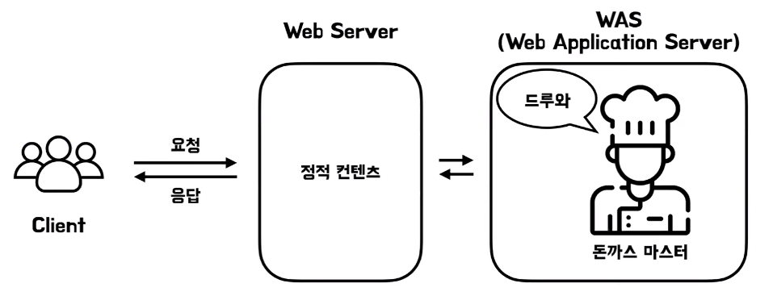
  + Servlet 이란? 
    + 동적 컨텐츠를 만드는데 사용되는 자바 기반의 웹 프로그래밍 기술 혹은 그 기술에 사용되는 객체
+ Servlet은 어떻게 동적인 컨텐츠를 만들까요?
  + 
  + 서블릿 인터페이스 안에는 서비스 메소드가 존재해서 이 서블릿 리퀘스트에 맞는 해당하는 요청에 따른 비즈니스 로직을 수행하고 그 결과를 리스폰스에 담아서 응답
  + service() 메서드로 ServletRequest를 비즈니스 로직으로 처리해서 ServletResponse로 응답
+ 웹에서 오는 요청, 응답 프로토콜마다 구현체가 있을수 있다
  + 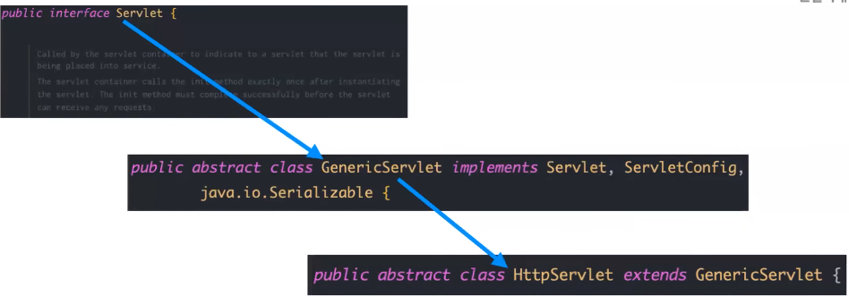
  + Java 내장 라이브러리에는 HTTPServlet 이라는 추상 클래스가 구현이 되어 있는데 이 HTTPSurvlet은 서블릿 인터페이스를 구현한 GenericServlet이라는 추상 클래스를 상속받은 HTTPServlet이다
  + 웹 요청이나 응답에는 굉장히 프로토콜이 다양 지금은 표준 웹 프로토콜이 HTTP다 보니까 Java 내장 라이브러리에는 HTTPServlet만 구현이 되어 있다
+ Servlet 구현
  + 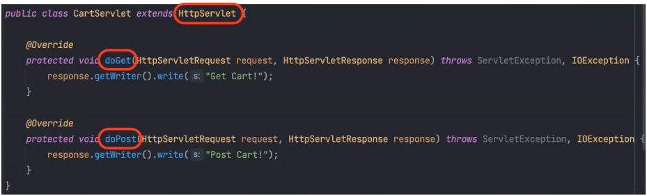
  + HTTP 서블릿 내부에는 doGet이나 doPost처럼 HTTP의 메소드에 맵핑이 되어 있는 메소드들이 존재를 해서 저희가 HTTP 서블릿을 형석을 받은 다음에 이 두 개과 doPost 안에다가 저희가 원하는 로직을 구현을 한 다음에 오버라이딩을 해서 제공을 하면
    이 서블릿으로 Get 요청이 들어왔을 때 나는 이 로직을 수행해서 전달해주고 싶어 라는 뜻이 된다
+ WAS에서 이 Servlet이 어떻게 실해되지?
  + 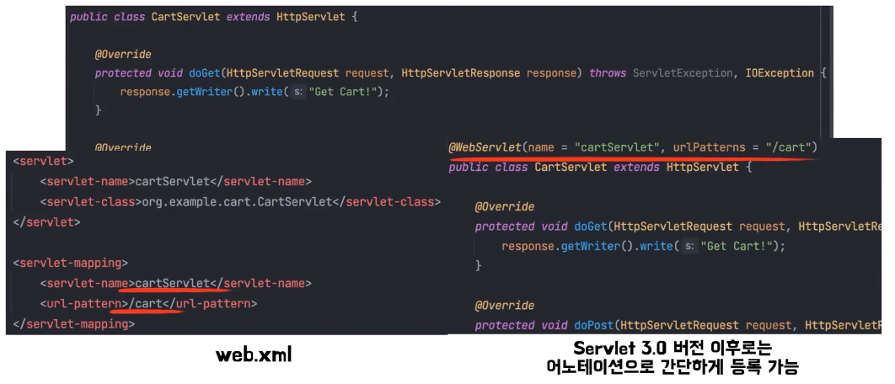
  + 초기에는 이 web.xml이라는 파일에다가 요청에 담기는 URL 그리고 해당하는 서블릿을 같이 맵핑을 해놔서 찾게 만들었다 
  + 근데 매번 이 web.xml에 등록을 하는 게 귀찮다 보니까 이제는 서블릿 3.0버전 이후 이상부터는 WebServlet이라는 어노테이션을 위에 달아나서 간단하게 등록을 할 수 있게 됐다
+ Servlet 구현
  + 서블릿이란 동적 컨텐츠를 만드는 데 사용되는 Java 기반의 웹 어플리케이션 프로그래밍 기술
  + Java 기반의 웹 어플리케이션 프로그래밍 기술이기 때문에 이 WAS가 동적 컨텐츠를 만들 수 있는 다른 프로그래밍 기술도 있다는 뜻이지 않을까
    실제로 Java를 사용하지 않는 언어들을 사용하는 프레임워크에는 이 WAS가 서블릿 기술을 지원하지 않는 경우도 있다(노드나 장고)
+ Servlet을 이용한 웹 요청과 응답 과정
  + 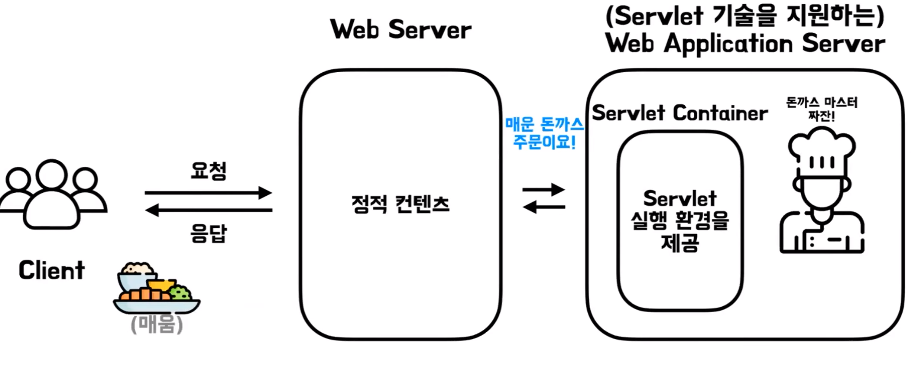

## Servlet의 문제점
+ 보기가 안 좋다
  + 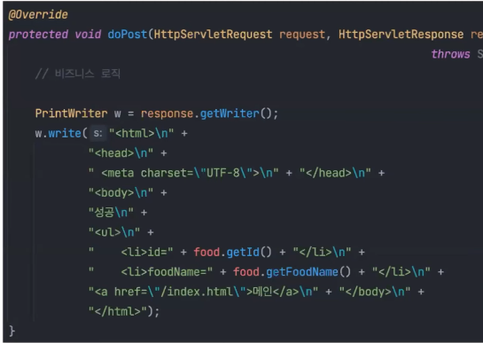
  + 유지보수가 어렵다
+ JSP의 탄생
  + HTML 코드에 Java 코드를 넣어 동적 웹 페이지를 생성하는 서버 사이드 템플릿 엔지  
  + 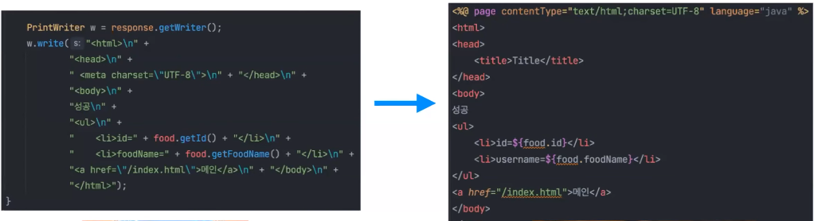

## MVC Model 1 등장 
+ 컨트롤러와 뷰가 분리가 되지 않았다
+ 비즈니스 로직과 HTML 코드가 분리가 되지 않았다 (유지 보수하기가 좀 힘들다)

## MVC Model 2 등장
+ 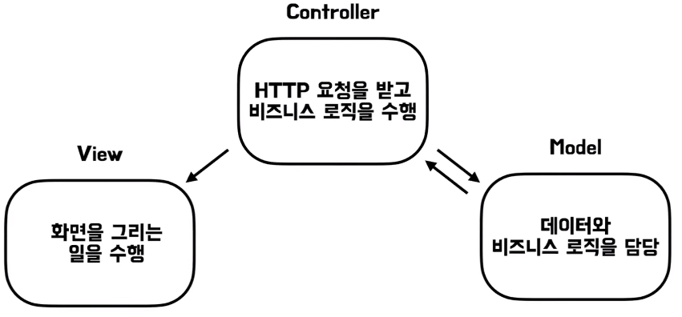
+ 코드 구조가 조금 더 명확해지고 유지 보수성이 증가

## 프론트 컨트롤러 도입
+ 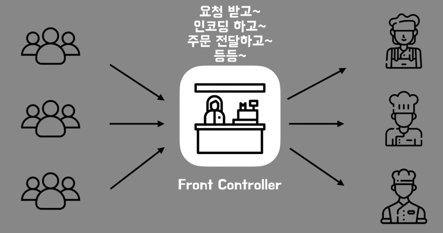
+ 컨트롤러들의 앞단에서 요청을 받고 인코딩을 하고 주문을 전달하고 후에 렌더링 된 뷰들을 다시 받아서 다시 클라이언트에 전달

## Spring MVC
+ 스프링 MVC는 이 앞에서 설명한 프론트 컨트롤러 패턴을 접목한 웹 어플리케이션 프레임워크이다 이 프론트 컨트롤러를 중심으로 여러 컴포넌트들이 협력을 해서 동작을 하는 구조
+ 
  + 주문이 들어오면 매니저는 주문을 처리할 식당을 찾는다 (DispatcherServlet)
  + 돈까스 주문이 들어왔으니까 돈까스 식당을 찾는다 (HandlerMapping)
  + 그러고 나면 총괄 셰프가 식당의 요리사에게 요리를 하도록 부탁을 한다 (HandlerAdaptor)
  + 요리사는 요리를 해서 전달을 해준다 (Handler)
  + 플레이팅 담당 알바가 나와서 플레이팅을 한다 (ViewResolver)
  + 매니저가 최종적으로 완성된 요리를 손님에게 전달을 하게 된다 (DispatcherServlet)
+ 핸들러 맵핑과 핸들러 어댑터, 뷰 리졸버는 모두 스프링이 제공하는 인터페이스 스프링이 이 각각의 구현체들을 다양하게 이미 제공을 하고 있다
+ HandlerMapping
  + 요청이 들어오면 핸들러 맵핑은 요청을 처리할 핸들러를 찾는 역할을 한다
  + 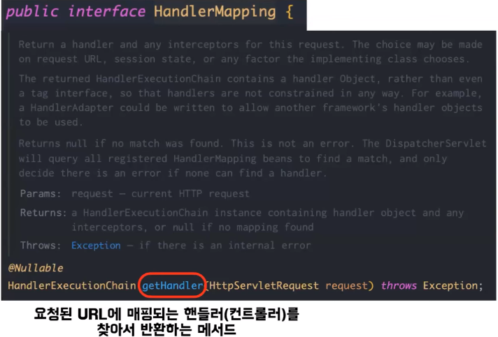
    + 핸들러 맵핑의 구현체 이 getHandler라는 메서드를 구현을 하게 되는데 이 메서드를 통해서 요청된 URL에 맵핑되는 핸들러를 찾아서 반환을 하게 된다
  + 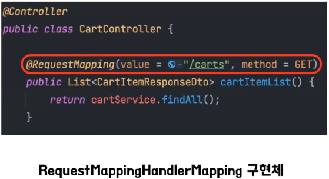
    + 대표적으로 컨트롤러에 requestMapping이라는 어노테이션을 붙여서 사용을 하는데 이거는 requestMapping, handlerMapping이라는 핸들러 맵핑의 구현체가 사용을 하는 방식
    + 그래서 이 구현체는 requestMapping 어노테이션이 붙어 있는 컨트롤러 메소드를 모두 스캔을 해서 해당 메소드와 URL 간의 맵핑 정보를 관리
+ HandlerAdaptor
  + 핸들러의 실제 로직을 수행하는 역할
  + 디스패쳐 서블릿이 핸들러가 어떻게 생겼는지는 관계없이 로직을 수행할 수 있도록 핸들러 어댑터라는 중간 레이어를 둔 것이다
  + 핸들러 어댑터를 통해서 핸들러의 로직을 수행할 수 있고 좀 더 다양한 컨트롤러를 처리를 할 수 있게 됐다
  + 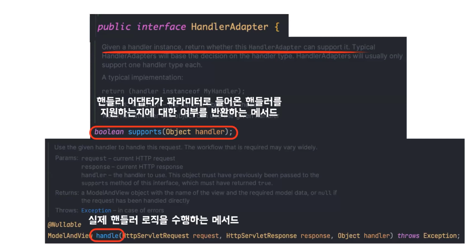
    + support라는 메소드가 있는데 여기 인자로 들어온 핸들러를 이 핸들러 어댑터가 지원하는지에 대한 여부를 반환
    + 들어온 핸들러 어댑터가 이 핸들러를 지원할 수 있다면 true를 반환 그럼 그 핸들러 어댑터로 이 핸들 메소드를 실행을 하면 실제 핸들러 로직을 수행
+ ViewResolver
  + viewResolver는 반환된 view 이름을 실제 view 객체로 변환하는 역할
  + 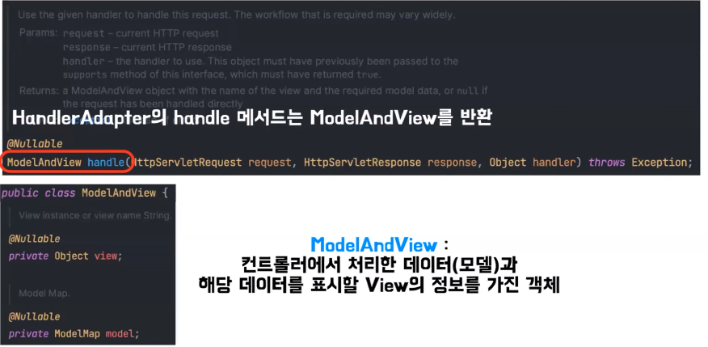
    + 핸들러 어댑터의 handle 메소드는 로직을 수행한 이후에 모델은 view 객체로 감싸서 반환을 하게 된다
    + modelAndView 객체는 컨트롤러에서 처리한 데이터와 해당 데이터를 표시할 view의 정보를 가지고 있다
    + 그래서 이 ModelAndView 객체를 통해서 그 정보를 가지고 ViewResolver는 실제 view 객체를 찾는다
    + 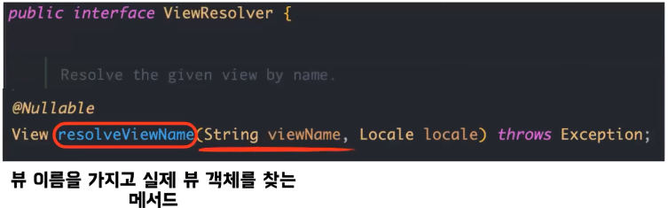
+ DispatcherServlet
  + 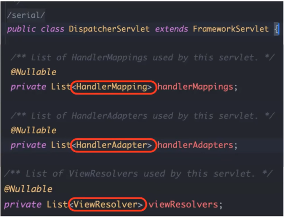
    + 핸들러 맵핑, 핸들러 어댑터, 뷰 리졸버 이 구현체들을 리스트로 가지고 있다
    + 요청이 들어오면 그 요청을 처리할 수 있는 이 구현체들을 선택을 해서 수행을 하게 된다
  + 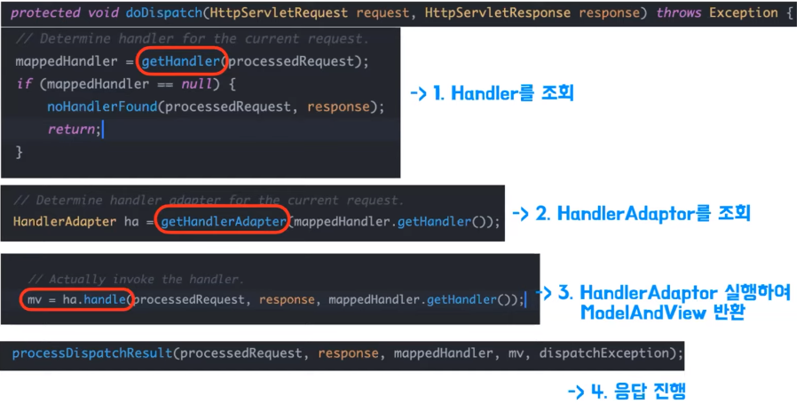
    + 요청이 들어오면 핸들러를 찾아야 되는데 여기 getHandler 메소드에서 핸들러를 찾는다
    + 내부에서는 핸들러 맵핑의 구현체들을 찾으면서 요청을 처리할 수 있는 핸들러 맵핑을 찾고 핸들러를 최종적으로 반환
    + 반환을 한 핸들러를 가지고 로직을 수행할 수 있는 핸들러 어댑터를 조회
    + 내부는 똑같이 핸들러 어댑터 구현체들을 돌면서 해당하는 핸들러 어댑터를 찾고 나서 그 핸들러 어댑터를 가지고 이 메소드를 실행을 하면  비즈니스 로직이 수행이 되고 최종적으로 ModelAndView를 반환
  + 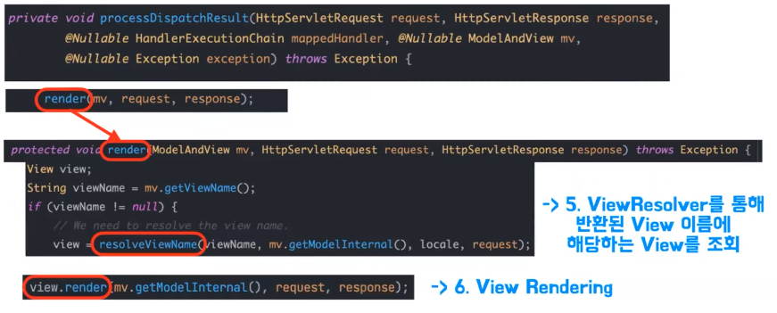
    + 이제 이 뷰를 가지고 최종적으로 응답을 만드는 절차가 진행이 되는데 이 메소드 내부를 보시면 렌더라는 메소드가 있다 여기 내부에는 뷰 이름을 가지고 뷰 리졸버를 통해서 뷰 이름에 해당하는 뷰를 조회를 한 뒤에 최종적으로 렌더링을 해서 응답
    
  

