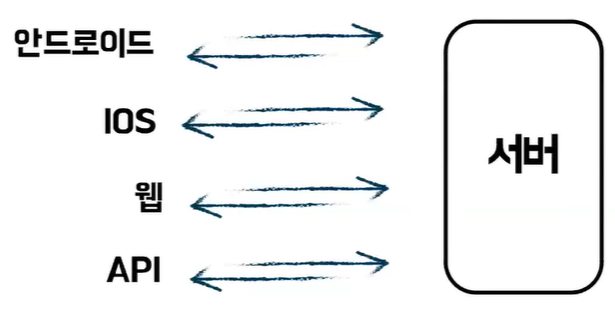
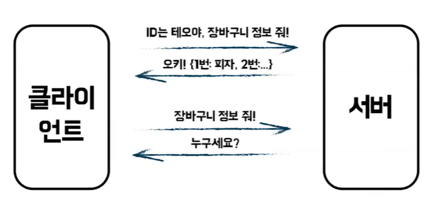
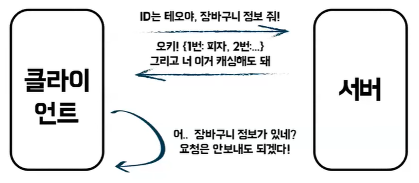
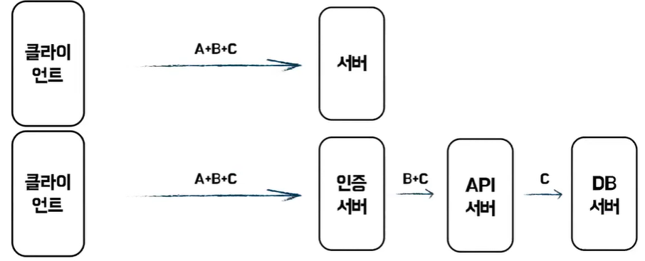
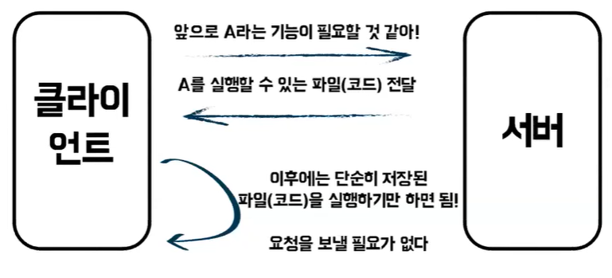
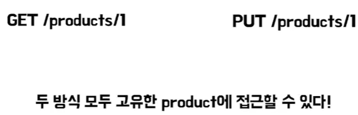
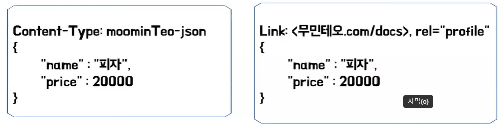

# 무민, 테오의 RESTful API
[https://youtu.be/Tm2mja5_dZs?si=wyKlP2y7Q0BpqG6T](https://youtu.be/Tm2mja5_dZs?si=wyKlP2y7Q0BpqG6T)

# 무민, 테오의 RESTful API
* toc
{:toc}

## World Wide Web
+ World Wide Web을 통해서 사람들은 정보의 공유와 접근이 굉장히 쉬워졌다
+ 접근성과 사용성 때문에 엄청나게 많은 사람들이 몰려들게 되었고 웹상에는 엄청나게 많은 기계들이 소통을 하면서 기준에는 없던 몇 가지 문제점들이 생겨나게 되었다
+ 첫 번째 문제점은 클라이언트와 서버 간의 결합도가 높다 
  + 서버의 변경이 클라이언트에게 심각한 영향을 끼치게 되었다
+ 두 번째 문제점, 자원의 표현 및 상태 관리가 어려웠다
  + 자원을 어떻게 표현할지,어떻게 관리할지에 대한 표준이 부재했기 때문에 이는 높은 복잡도로 이어지게 되었다
+ 기존 웹은 html이나 이미지 파일 같은 정적 자원을 전송하기 위해서 설계가 되었다 그런데 이제 사용하는 사람들이 점점 더 많아지고 한 페이지 안에 정보가 많아지고 복잡해지다 보니까 자원 관리 자체가 어려워진다
그리고 이는 네트워크 성능 문제로도 이어진다

## REST (Representational State Transfer)
+ 분산 하이퍼미디어 시스템을 위한 아키텍처 스타일
+ 대표적인 분산 하이퍼미디어 시스템의 예로는 웹이 있다
+ 아키텍처 스타일이란 제약 조건의 집합을 의미한다
+ 그래서 간단히 이야기하면은 REST는 웹을 위한 제약조건의 집합이다

## REST의 제약조건 6가지
+ 클라이언트 서버 구조
+ 무상태성
+ 캐시 가능성
+ 계층형 시스템
+ 주문형 코드(optional)
+ 균일한 인터페이스 -> 가장 중요하면서 지키기 어려다
+ 6가지 제약조건 중에서 optional한 제약조건을 제외하고 모두를 만족해야 REST하다 즉 RESTful 하다 라고 부를 수가 있다

### 클라이언트 서버 구조
+ 서버는 요청에 대해 반응한다는 제약 조건
+ 이렇게 관심사의 분리를 통해서 클라이언트는 UI의 이식성에만 집중할 수 있고 서버는 확장성에만 집중할 수 있게 된다
+ 

### 무상태성
+ 요청은 상태를 가지지 않는다는 제약 조건
+ 각각의 요청은 독립적이고 필요한 모든 정보를 제공해야 함을 의미
+ 쉽게 말해서 서버는 클라이언트가 이전에 무슨 요청을 보냈는지 모른다
+ 
+ 서버는 클라이언트에 대한 어떠한 가정을 하고 있지도 않고 클라이언트가 누군지도 모르기 때문에 클라이언트가 보내는 메시지는 따라서 모든 정보를 포함해야 된다

### 캐시 가능성
+ 서버는 자원이 캐시 가능한지를 명시해야 한다는 제약조건
+ 
+ 클라이언트는 일정 시간 내에 다시 똑같은 요청을 보내려고 할 때 정보가 있다면 요청을 생략할 수가 있게 되는 것이다
  
### 계층형 시스템
+ 계층형 시스템을 적용해야 한다는 제약조건
+ 
+ 각각의 책임에 맞게 메시지를 해석할 수 있기 때문에 단순성과 확장성이 굉장히 유리하다

### 주문형 코드(optional)
+ 클라이언트가 필요에 의해서 기능을 확장할 수 있도록 해야 한다
+ 
+ 이런 주문형 코드의 대표적인 예시로는 플러그인이 있다 이게 클라이언트의 단순성을 향상시키고 그런 이점이 존재하지만 시스템 전체적으로 적용되었을 때 오히려 성능이 안 좋아지는 이슈가 발생할 수 있기 때문에 optional한 제약조건이다

### 균일한 인터페이스
+ 앞서 말한 제약조건들은 HTTP 프로토콜을 사용하게 되면 어느 정도 쉽게 만족할 수 있다
+ 하지만 이 균일한 인터페이스 같은 경우 신경 쓰지 않으면 쉽게 만족할 수가 없다
+ 균일한 인터페이스는 개발을 할 때 클라이언트와 맞닿아 있는 부분(Http Request, Http Response 등)을 쉽고 일반적으로 설계하라는 제약 조건이다
+ 이 균일한 인터페이스는 또 한 번 하위의 네 가지 제약 조건으로 분류되게 된다

#### 자원의 식별
+ 자원의 식별은 클라이언트와 서버 사이에 상호작용에서 고유하게 자원을 식별할 수 있어야 한다는 제약 조건
+ 

#### 표현을 통한 자원의 조작
+ 표현이란 메타데이터 + 데이터 즉 자원의 특정한 상태를 의미
+ 
+ 이 메시지에서 본문 데이터는 name과 price 그리고 Content-Type 같은 header 메타 데이터 이 표현들을 통해서 자원을 조작해야 함을 의미

#### 자기 서술적인 메시지
+ 자기서술적인 메시지는 자원의 표현은 자기서술적이어야 한다
+ 자원의 표현은 메세지를 처리하게 충분한 정보를 제공해야 한다 
+ 이번 제약 조건은 다음에 설명할 HATEOAS와 함께 가장 지키기 어려운 제약 조건 중 하나
+ 자기서술적인 메시지를 만족하는 대표적인 예시로는 HTML이 존재 HTML 명세가 존재한다 여기서 명세가 존재한다는 것은 해당 메시지를 해석하기 위한 방법이 존재한다는 것인데
  태그를 모른다고 가정해보면 HTML 명세를 찾아가 태그가 어떤 것인지 알아볼 수 있다 즉 이 메시지 하나로 누구든지 해석할 수 있는 상태가 된다
+ JSON도 충분히 자기서술적일 수 있는다
  + 첫 번째로 IANA라는 기관에서 커스텀 media type을 등록할 수 있다 moominTeo-json이라는 커스텀 media type을 등록해 줄 수 있다
  + 두 번째로 메시지 헤더에 명세가 포함된 링크를 등록할 수 있다
  + 이러한 우리가 만든 메시지들을 설명할 수 있는 명세를 만들어 어떤 방식으로든 메시지들에 적용을 해서 자기서술적인 메시지를 만족할 수 있는 것이다
  + 

#### HATEOAS
+ HATEOAS란 Hypermedia AS The Engine OF Application State의 약자
+ 클라이언트는 서버와 상호작용하면서 하이퍼링크를 통해 동적으로 모든 다른 리소스에 접근할 수 있어야 한다는 제약조건
+ HATEOAS을 만족하는 예시로는 HTML이 있다 HTML의 경우 태그에 하이퍼링크가 나와있고 이 하이퍼링크를 통해 다른 리소스에 접근이 가능하다 즉 클라이언트가 어플리케이션의 상태를 동적으로 변경할 수 있으므로 HATEOAS를 만족한다 할 수 있다
+ JSON
  + 첫 번째 방법으로 location 헤더를 이용해 hyperlink을 추가해줘 만족시켜줄 수 있다
  + 두 번째 방법으로 헤더가 아닌 데이터로 링크를 넘겨주는 방식도 존재 이 방법은 말 그대로 공문의 링크를 추가해줘 만족시켜줄 수 있다
  + 결국 이러한 링크들을 추가함으로써 클라이언트가 공적으로 상태를 변경할 수 있게 하여 HATEOAS를 만족할 수 있다

## 우리가 만들었던 API는 RESTful 한가요?
+ 아니다 그렇다면 항상 모든 제약 조건을 지켜 응답마다 명세를 만들어 자기서술적으로 만들거나 응답마다 링크를 걸어 HATEOAS을 만족하게 하여 항상 RESTful 한 게 좋은 걸까?
+ 로이 필딩이 말하는 REST 제약 조건을 모두 지키면서 실무에서 개발하는 경우는 거의 없다 REST는 중요한 개념이지만 실제 일반 기업의 API에서 적용하기에는 복잡도가 매우 증가하고
  개발 비용 대비 효과가 나오지 않아 거의 지켜지지 않는다고 한다
+ 그래서 실제로는 대부분의 RESTful API라고 불리는 것들이 완전히 REST를 따르지 않는 경우가 많다 그래서 엄밀히 따지자면 HTTP API라고 불러야 된다
+ 즉 실무에서는 완전히 RESTful한 API를 만들기는 현실적으로 어렵다
+ 그렇다면 언제 지키면 좋을까? REST의 핵심은 바로 클라이언트와 서버 간의 결합도를 낮춰 독립적인 진화를 할 수 있게 하는 것이다 
+ 로이 필딩은 다음과 같이 말한 바가 있다 시스템 전체를 통제할 수 있다고 생각하거나 진화에 관심이 없다면 REST에 대해 따지느라 시간을 낭비하지 마라
  + 여기서 말하는 독립적인 진화란 서버와 클라이언트 간의 상호작용에서 변경의 영향을 최소화하고 유연성을 제공하기 위한 노력을 의미
  + 여기서 독립적인 진화에 만족하는 대표적인 예시로는 웹과 웹브라우저가 있다 웹페이지를 변경한다고 해서 웹브라우저를 업데이트할 필요가 없다 반대로 웹브라우저를 변경한다고 해서 웹페이지를 업데이트할 필요가 없다
  + 즉, 우리의 비즈니스 및 상황에 맞게 판단을 해서 사용하면 될 것 같은데 우리의 API를 RESTful하게 만들지 고민이 된다면 우리의 서비스가 완전히 REST했을 때
    기대효과는 어느 정도인지 스스로 질문을 한번 던져 보자
