# 파워, 가비의 프로젝트에 도움이 될만한 aws 서비스 소개
[https://youtu.be/_wdOoPBw4bg?si=9pBInLm_Jyov0sRX](https://youtu.be/_wdOoPBw4bg?si=9pBInLm_Jyov0sRX)

# 파워, 가비의 프로젝트에 도움이 될만한 aws 서비스 소개
* toc
{:toc}

## EC2(Elastic Compute Cloud)
+ 배포를 하기 위해 EC2 AWS에 EC2를 사용할 수 있다
+ EC2에 C가 두 개인 것을 보고 C2인 걸 알겠는데 Elastic이라는 단어는 왜 있을까?
  + Elastic이라는 단어에는 탄력있는, 신축성있는 이라는 뜻 그래서 성능, 용량을 자유롭게 탄력적으로 조절할 수 있고 또 비용을 사용한 만큼 탄력적으로 지불한다는 점에서 elastic이라는 단어가 붙은 것
+ EC2는 AWS로부터 한 대의 컴퓨터를 돈을 주고 빌리는 개념

### EC2 구성

#### EC2 스토리지 구성
+ 처음에 이름을 짓고 나서 스토리지 구성이라는 구간이 나온다 스토리지는 AWS의 하드웨어 스펙을 정할 수 있는 곳
+ 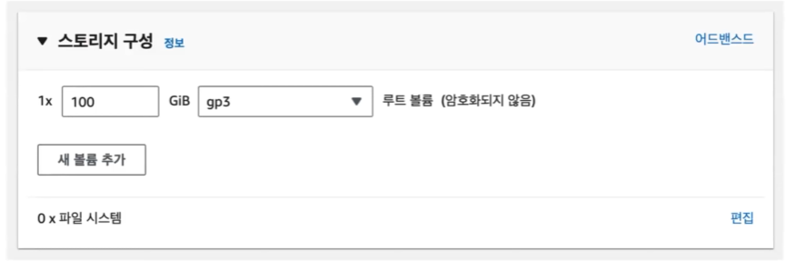
+ 구상하고자 하는 서버의 성격에 따라서 CPU라든지 메모리라든지 종류별로 준비된 다양한 인스턴스를 고를 수 있다
+ 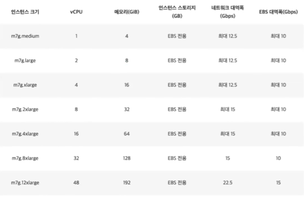

#### EC2 AMI
+ 하드웨어를 골랐으니 소프트웨어를 골라야한다
+ 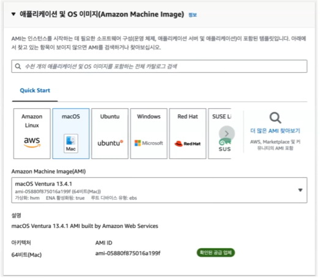
+ AMI라는 구간이 나오는데 AMI는 운영체제와 소프트웨어들이 적절히 구성된 상태로 제공되는 템플릿

#### EC2 키페어
+ 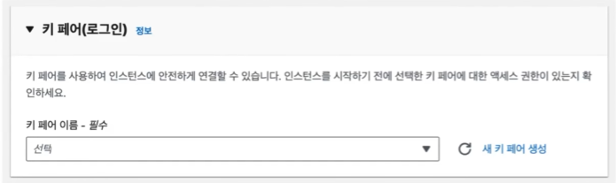
+ 우리가 만든 이 컴퓨터를 아무나 접속하면 안된다
+ 키페어는 EC2에 접속하기 위해 사용하는 암호화된 파일이다 
+ EC2는 아이디와 비밀번호로 로그인하지 않고 키 파일로만 접속할 수 있다

## RDS
+ EC2를 만들고 우리의 서버를 배포했으면 우리 서비스에 중요한 정보를 담을 데이터베이스가 필요 데이터베이스는 RDS라는 서비스를 사용할 수 있다
+ 관계형 데이터베이스를 제공하는 서비스
+ EC2에 관계형 데이터베이스를 설치해서 RDS랑 똑같이 사용할 수 있지 않을까?
  + RDS는 자동 백업 그리고 읽기 전용 복제본이라는 기능을 제공

### 자동 백업
+ 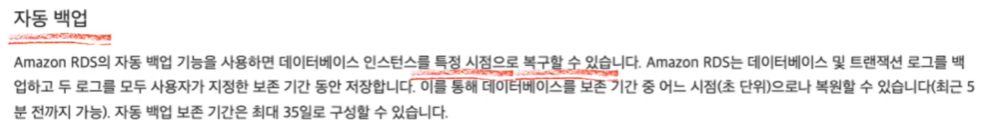
+ 자동백업은 데이터베이스 단위 혹은 트랜잭션 로그를 백업하고 이 백업을 사용자가 지정한 기간 동안 보존을 할 수 있다 그리고 이 저장한 걸 바탕으로 특정 시점으로 복구를 할 수가 있다
+ 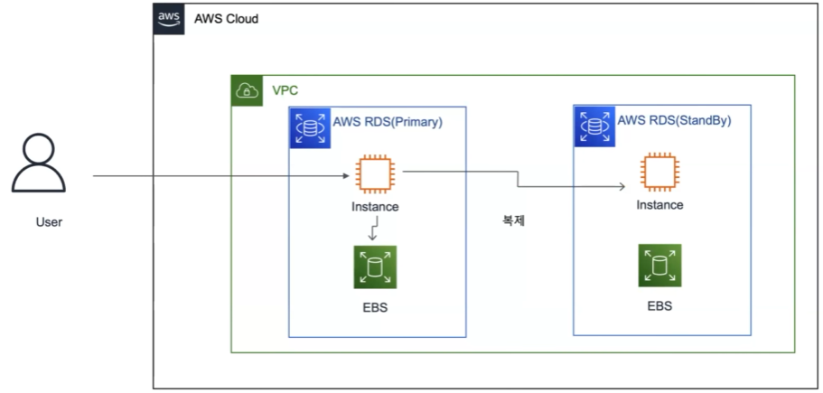
+ 하나의 VPC 안에 RDS가 있다고 가정
+ 사용자가 직접적으로 요청을 보내는 RDS는 Primary RDS이다 요청을 보내고 이 반영된 내역을 EBS(AWS의 일종의 하드디스크) 이 하드디스크에 저장을 하고
  반영된 내역을 다시 복제한다 복제하는 RDS가 스탠바이라는 백업본이다 그래서 이 백업본에 EBS에 다시 트랜잭션 로그를 저장하게 된다
+ 스탠바이 RDS는 단순 백업용이라서 사용자가 직접적으로 접근하지는 못한다 그래서 스탠바이 RDS는 기본적으로 접근이 불가능하고 프라이머리 RDS에 장애가 발생했을 때 백업용으로 복원하기 위한 용도이다
+ 이게 성능상 상승 효과를 가져올 수 있는 서비스가 아닌 안정성을 위한 서비스 성능상 이점을 갖고 올 수 있는 서비스는 읽기 전용 복제본 서비스이다

### 읽기 전용 복제본
+ 데이터베이스에 복제본을 여러개 만들 수가 있어서 여러가지 복제본을 통해 어플리케이션 읽기 트래픽을 처리할 수 있다
+ 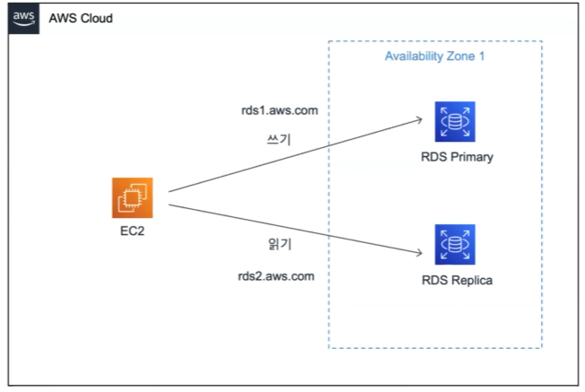
+ EC2에서 RDS에 접근을 해서 요청을 보낸다고 가정할 때 쓰기 요청은 원본인 프라이머리를 통해 쓰기 요청을 보낸다 그 다음에 이 원본의 내용을 복제해서 레플리카에 반영을 한다
+ 읽기 요청을 보낼 때는 이 레플리카 복제본에 요청을 보내게된다
+ 읽기쓰기는 각각 다른 dns 주소를 갖고 있는데 dns 주소를 나눠서 어플리케이션 단에서 쓰기 요청은 쓰기 dns 읽기 요청은 읽기 dns에 나눠 적용함으로써 성능을 향상시킬 수 있다
+ 마스터를 복제해서 쓰기 연산은 마스터에 읽기 연산을 복제해서 읽기 연산은 슬레이브에서 처리해서 이중화를 통해서 부하를 분산시킬 수 있다
+ 각각의 인스턴스에 다른 DNS가 부여가 되고 서버 이중화에서 성능을 늘리는 것처럼 데이터베이스를 이중화할 수 있는 기능이다 

## S3
+ 미디어 파일 저장 세 가지 방식: 서버, 데이터 베이스, 스토리지 

### 서버 저장
+ 장점
  + 기존에 사용하던 서버에 저장하기 때문에 추가적인 비용이 발생하지 않는다
  + 저장이나 조회 시에 추가적으로 네트워크를 타지 않아서 성능상의 이점이 있을 수 있다
+ 단점
  + 서버의 용량은 한정되어 있기 때문에 용량이 찰때마다 늘려줘야 한다
  + 미디어 파일이 하나의 서버에 저장되기 때문에 서버를 여러 대로 확장하기 어려운 문제점이 있다

### 데이터 베이스 저장
+ 장점
  + 데이터베이스에 미디어 파일을 저장한다면 트랜잭션에 미디어 파일을 포함할 수 있다
+ 단점
  + 미디어 파일이 많아질 경우 데이터베이스 병목현상이 발생할 수 있다
    + 병목현상이란 데이터베이스가 느려지는 현상
+ 만개의 데이터에 대해서 테스트를 진행
  + 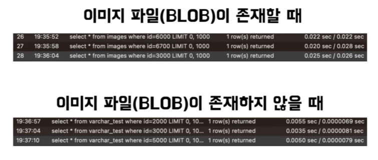
  + 만개의 데이터에 이미지 파일이 존재할 경우 아이디 값으로 검색했을 때 0.02초가 걸리는 것을 확인 이는 이미지 파일이 존재하지 않았을 때 0.005초보다 4배 이상의 성능 차이가 발생하는 것을 확인할 수 있다

### 스토리지 저장
+ 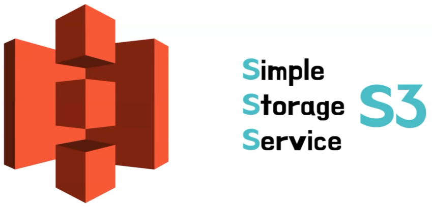
+ S3란 심플 스토리지 서비스로 S가 3개이기 때문에 S3로 불리곤 한다
+ 스토리지는 컴퓨터의 데이터를 저장하는 저장소의 역할을 수행하는 부품으로 쉽게 말해서 하드디스크나 나스 서버를 생각면 된다
+ 장점
  + 내구성과 가용성
    + 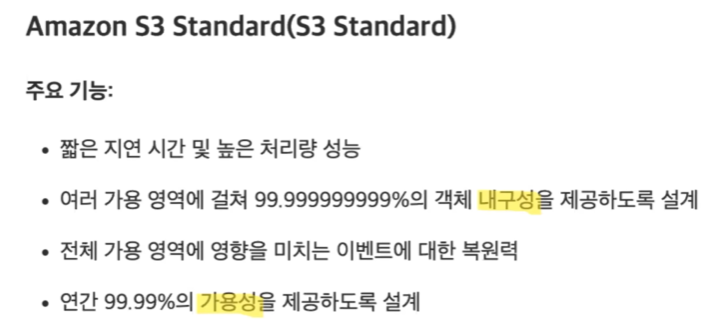 
    + S3에서 가장 보편적으로 사용하는 클래스인 S3 스탠다드 클래스의 설명을 보면 내구성과 가용성이라는 이야기가 나온다
      + 내구성이란 데이터가 손실이나 손상으로부터 얼마나 잘 보호되는지를 나타낸 수치로 스탠다드 클래스의 경우 9가 9개 있는데 해당하는 수치는 10억 개의 데이터가 있을 때 100년의 하나꼴로 손실될 수 있는 수치이다
      + 가용성이란 정상적으로 서비스를 수행할 수 있는지를 나타낸 수치로 1년을 100%라고 했을 때 99.99%의 시간 동안 정상적으로 서비스를 할 수 있도록 보장해준다
      + 이처럼 S3를 사용한다면 미디어 파일을 안정적으로 제공할 수 있다는 장점이 있다
  + Storage Class
    + S3는 각 상황에 맞는 스토리지 클래스를 제공한다
      + 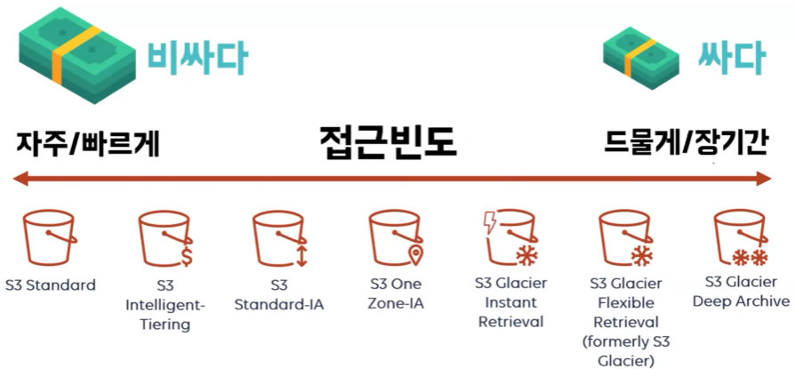
      + 기준을 설명하면 한 달에 한 번 이상 접근하게 된다면 스탠다드 클래스를 사용하면되고 한 달에 한 번 또는 한 번도 사용하지 않을 것 같다 라고 하면 스탠다드 이외의 클래스들을 고려해 보실 수 있다
  + 이외의 장점으로는 일반적인 파일 서버는 사용자 트래픽이 증가하면 스토리지 증설을 하거나 로드 밸런싱과 같은 처리를 직접 해줘야한다 하지만 S3를 사용한다면 트래픽이 상승하더라도 개별 애플리케이션에 영향을 받지 않으며 
  S3에 저장할 수 있는 파일 수의 제한이 없다
  + 버전 관리 기능을 사용한다면 사용자가 실수로 파일을 삭제하더라도 쉽게 복원이 가능하다
+ 단점
  + 잠재적인 위험 발생
    + 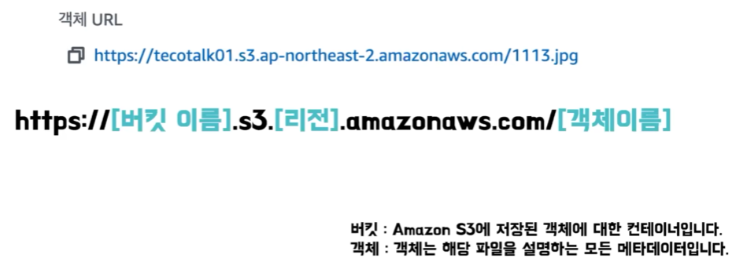
    + S3만을 사용했을 때 객체 URL을 보면 버킷 이름,리전, 객체 이름이 그대로 노출되는 것을 확인할 수 있다 이는 잠재적인 위험이 발생할 수도 있다
      + 필요 이상의 정보가 노출된다면 잠재적인 위험도는 증가하게 될 것이다
  + 프라이빗 컨텐츠 문제
    + 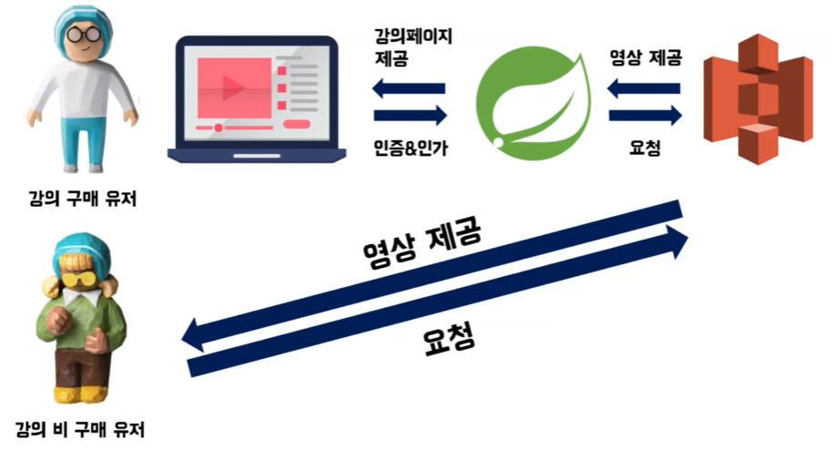
    + 퍼블릭으로 공개된 S3 URL을 통해서 다운로드 받아서 볼 수 있다는 문제점이 있다
  + 데이터 전송 속도
    + 해외 사용자 입장에서는 저희 한국에 있는 서버와 물리적인 거리 차이 때문에 강의를 로딩할 때 많은 지연시간이 발생할 것이다
  + 이러한 문제점들을 어떻게 해결할 수 있을까요? 이런 문제가 발생한다면 클라우드 프론트 사용을 고려해 보실 수 있다

## CloudFront
+ 클라우드 프론트란 AWS에서 제공하는 CDN 서비스이다 
+ CDN은 서버와 사용자 사이에 물리적인 거리를 줄여서 콘텐츠 로딩에 소요되는 시간을 최소화하는 기술이다
+ 장점
  + 클라우드 프론트는 다른 AWS 서비스 waf나 lambda 등과 연동해서 사용 가능하고 오리진 서버에 부하가 몰리지 않고 엣지 서버에 부하가 분산된다는 장점이 있다
  + 그리고 클라우드 프론트 자체 통계 기능을 이용하실 수도 있다

### 데이터 전송 속도 문제 해결
+ 물리적인 거리 차이 때문에 콘텐츠를 로딩하는데 많은 지연 시간이 발생하는데 CDN을 사용한다면 사용자가 파일을 요청했을 때 먼저 가장 가까운 엣지 서버에
  파일이 존재하는지 먼저 확인을 하게된다 그리고 확인을 했을 때 만약에 파일이 존재하지 않는다면 원본 서버로 요청을 보내서 해당 파일을 캐싱을 하게 되고 
 이후에 사용자가 요청을 보냈을 때 가장 가까운 엣지 서버에 해당 파일이 존재한다면 캐싱된 파일을 그대로 반환하기 때문에 CDN을 사용하지 않았을 때보다 성능 차이가 10배 이상 나는 것을 확인할 수 있다

### 프라이빗 컨텐츠 문제 해결
+ 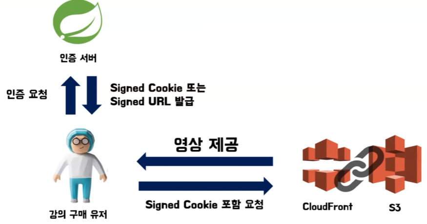
+ 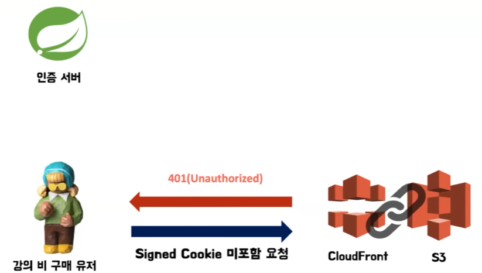
+ Signed Cookie 또는 Signed URL을 발급받을 수 있고 Signed Cookie를 통해서만 제공받을 수 있도록 설정을 할 수가 있다 

