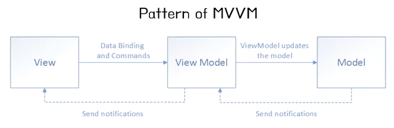
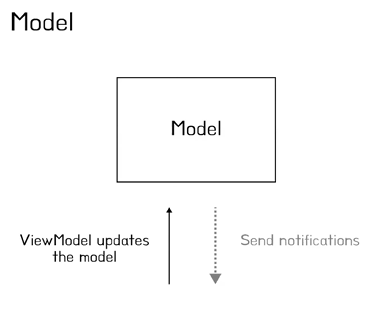
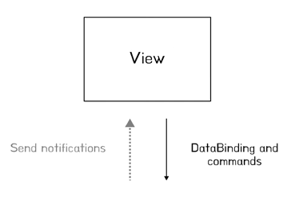
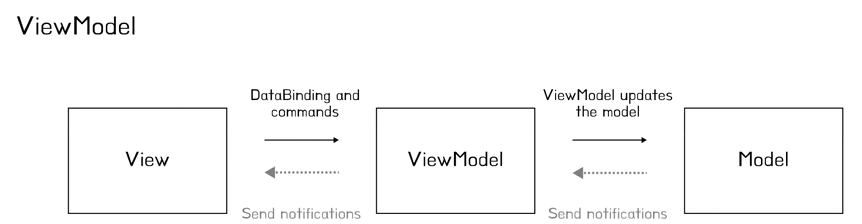
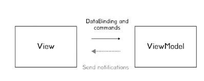
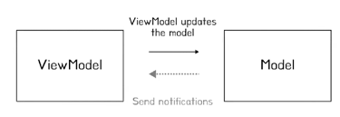

# 산군의 MVVM
[https://youtu.be/JdSwZzdUHrA?si=Wj4be-V01JVZTVlt](https://youtu.be/JdSwZzdUHrA?si=Wj4be-V01JVZTVlt)

# 산군의 MVVM
* toc
{:toc}

## MVVM?
+ MVVM은 과거와 다른 애플리케이션 개발 환경의 변화에 맞춰서 탄생하게 되었다
+ 과거에는 개발자가 디자인 기능 피처작업 등을 모두 다 수행했지만 현재는 그 책임들이 디자이너에게도 분산되고 등 이런 코딩을 덜 필요로 하며 다양한 툴, 언어 사람, 로직 등에 의해 이루어지는 이런 UI 개발환경의 변화가 있었다
+ 하나의 환경 혹은 하나의 언어를 사용하던 과거와 달리 현재 트렌드를 반영해 발전시킨 MVC의 업그레이드 버전이 바로 이 MVVM패턴이다
+ MVVM은 데이터바인딩을 위한 일반적인 메커니즘에 한 가지 더 의존한다 

### 장점
+ MVVM은 모델, 뷰모델, 뷰로 나뉘는데 이렇게 독립적인 모델을 만들고 뷰모델은 뷰와 모델의 일종의 어뎁터 역할을 하며 모델 코드에 간섭을 줄인다
+ 개발자는 뷰를 사용하지 않고 뷰모델과 모델에 대한 단위 테스트를 만들 수 있다
+ 상태와 동작이 뷰모델이 있으므로 UI 수정이 유연하다
+ 디자이너와 개발자는 독립적으로 동시에 작업할 수 있다
+ 정리하면 디자이너는 뷰에 집중할 수 있고 개발자는 기능에 대해 작업 할 수 있다
+ MVVM 패턴은 애플리케이션 의 비즈니스 및 프레젠테이션 로직과 사용자 인터페이스(UI)를 깔끔하게 분리해며, 이는 테스트, 유지보수, 확장, 재사용성, 협업을 용이하게 한다 

### Pattern of MVVM
+ 
+ 고수준에서 저수준으로 단 방향 의존 관계를 유지하고 있다
+ 따라서 이 뷰모델은 뷰를 분리하고 모델이 뷰와 독립적으로 발전할 수 있도록 돕는다
+ 뷰는 뷰모델의 프로퍼티를 바인드한다  

#### Model
+ 
+ 모델은 MVC에서 정의하던 모델과도 같다
+ 애플리케이션의 데이터를 저장하고 도메인에 처리 및 유효성 검사를 수행하는 완전히 UI와 독립적인 데이터 또는 비즈니스 로직이다
+ 모델은 되게 코드로 작성되거나 관계형 테이블 또는 Xml로 인코딩한 순수 데이터로 표현된다

#### View
+ 
+ 뷰는 사용자에게 비추어지는 모든 UI 구성 요소를 담당한다
+ 뷰는 거의 항상 선언적으로 정의되어 있고 대부분 도구를 사용하여 정의된다
  + 여기서 도구는 LayoutInflater 혹은 에뮬레이터, SDK, 라이브러리 등등을 의미한다
+ 이런 도구와 선언적 언어의 특성상 MVC가 뷰에서 인코딩하는 일부 뷰상태는 표현하기가 쉽지 않다
+ 이 시점에서 데이터 바인딩이라는 개념이 작동한다
+ 뷰는 단방향 혹은 양방향 데이터 바인딩을 통해 모델이 직접 연결될 수 있다
  + 하지만 이 뷰가 모델에 직접 연결되는 것은 좋지 않다 왜냐하면 모델을 크게 간섭하는 일이기도 하고 또한 뷰가 원하는 타입을 모델에서 줄 수 없는
    경우도 있기 때문이다 그래서 이런 것들을 돕는 역할을 뷰모델들이 수용하게 된다

#### ViewModel
+ 
+ 관계도를 보면 뷰모델은 뷰의 추상화이자 용어 의미 그대로 뷰의 모델을 의미한다
+ 
+ 뷰모델은 뷰가 데이터 바인딩할 수 있는 속성과 명령을 구현하고 뷰에게 알린다
+ 뷰는 UI 스레드를 차단하지 않은 상태로 유지해야 하기 때문에 뷰모델에서 IO 작업에 비동기 메서드를 사용하고
  이벤트를 발생시켜 뷰의 속성 변경사항을 비동기적으로 알린다
+ 뷰모델과 뷰는 1:N 관계를 유지한다
  + 뷰모델은 뷰를 알지 못하며 뷰의 추상화이기 때문에 따라서 재사용이 용이하다는 장점이 있다
+ 주의할점으로는 뷰모델에서 뷰에 버튼 혹은 리스트뷰와 같은 뷰타입을 참조하게 되면 강한 결합이 발생하기 때문에 이는 지향하는 것이 좋다
+ 뷰모델은 뷰의 추상화이다 그러면 구현의 시작은 뷰부터 해야 되는지 뷰모델부터 해야 되는지가 그 당시부터 현재까지도 이어져 오고 있는 토론 주제라고 한다 
+ 
+ 뷰모델은 이 데이터바인딩에 사용할 수 있는 모델이 특수화도 제공한다
+ 다시 말해서 뷰모델은 뷰가 쉽게 사용할 수 있는 형식으로 모델 데이터를 가공해서 제공해야 한다
+ 뷰모델과 모델은 1대N 관계를 유지하고 이 모델은 뷰모델과 그 누구도 알지 못한다 그렇기 때문에 뷰와 독립적으로 발전할 수 있다

## MVC패턴과 MVVM패턴의 차이

> 그들은 엔지니어가 디자이너에게 ViewModel을 던지기만 하면 디자이너가 코드를 작성하지 
> 않고 GUI를 구축할 수 있다고 상상했습니다. 그들은 MVVM의 가장 큰 정의 특성인 데이터 바인딩을 통해 이를 달성합니다

+ 과거와 다른 애플리케이션에 UI 개발환경의 변화
+ 하나의 환경 혹은 하나의 언어를 사용하던 과거와 달리 현재 트렌드에 반영해 발전시킨 MVC 업그레이드 버전
+ 추상화를 통해서 뷰로부터 프레젠테이션 로직을 분리함
+ 뷰모델 VS 컨트롤러 
  + 뷰모델과 컨트롤러의 차이가 좀 혼동될 수 있다 실제로 뷰모델 개념을 뷰 컨트롤러 라는 이름으로 사용하고 있다고 적혀 있다
  + 차이점을 의존성 관계를 다시 한번 생각해 보면 MVVM 패턴에서는 고수준에서 저수준 모듈로 단 방향 의존 관계를 이루고 1:N 관계를 유지한다는 점 그것이 뷰모델과 컨트롤러의 차이점이 아닌가 싶다

## MVVM과 MVP패턴의 차이점

> 어떤 면에서 MVVM패턴은 MVP(Model-View-Presenter)패턴과 유사합니다
> 두 패턴 모두 MVC(Model-View-Controller) 패턴의 변형이며 둘 다 분리된 프레젠테이션 패턴이며 세부 사항을 불리하도록 설계되었습니다

+ Presenter는 Model과 View의 중재자 역할인 반면에 ViewModel은 View에 추상화 역할이다
+ Presenter와 달리 ViewModel은 View에 대한 참조를 가지지 않는다
+ MVP는 UI를 수동 업데이트 하는 반면에 MVVM은 DataBinding을 이용한 자동 동기화가 가능해진다
+ MVP는 종종 View와 Presenter의 Contract를 가지는 반면 ViewModel들은 중립적으로 설계 되었기 때문에 View와 느슨한 결합을 유지하고 테스트와 재사용이 가능하다
+ 두 패턴 모두 테스트 가능성을 향상시키기 위해 설계 되었지만 MVVM에서 뷰모델은 뷰에 대한 상태와 행동 그리고 비즈니스 로직까지 포함하고 있기 때문에
  View와 느슨한 결합을 또 유지하고 있기도 하고 때문에 MVP 패턴보다 테스트가 매우 용이하다
