# 필립, 박스터의 NGINX의 Everything
[https://youtu.be/l-7XA6gXqzs?si=xZSuF0E9qBc-sIaO](https://youtu.be/l-7XA6gXqzs?si=xZSuF0E9qBc-sIaO)

# 필립, 박스터의 NGINX의 Everything
* toc
{:toc}

## NGINX로 해결할 수 있는 문제
+ 서비스를 만들면서 생길 수 있는 문제들
  + 보안 문제 
  + 사용자가 갑자기 많아져서 트래픽 감당이 안되는 경우
  + 서비스 로딩 성능
  + 유지보수의 번거로움 
+ 이것들을 이제 NGINX로 해결할 수 있도록 도와준다

## NGINX vs APACHE

### APACHE
+ 
+ 아파치는 프로세스들을 미리 prefork로 뽑아 놓는다 뽑아 놓고 다음에 요청이 오면은 커넥션을 열어서 해당 요청이 끝날 때까지 프로세스가 클라이언트와 계속 연결이 되다가 만약에 요청이 많이 오게되는데 prefork에 있는 프로세스가 모자라 지면은
  다른 사람들은 기다려야 된다

### NGINX
+ 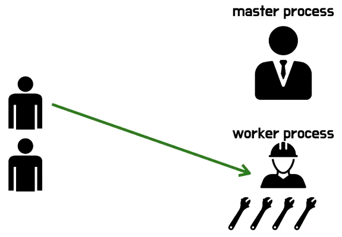
+ 엔진엑스는 마스터프로세스와 워크프로세스가 있는데 요청이 오면은 이제 비동기로 해결해 준다 그래서 엔진엑스가 조금 더 많은 요청이 있을 때 효율적이다

## NGINX의 주요 기능
+ 정적 컨텐츠 호스팅
  + 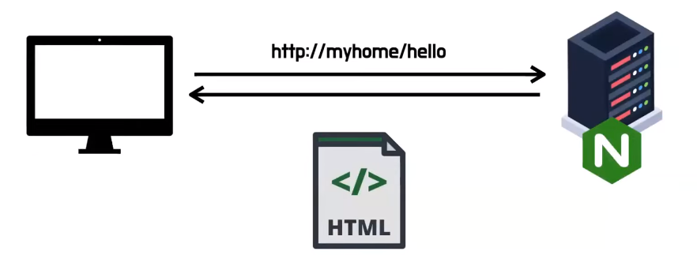
+ Reverse Proxy
  + 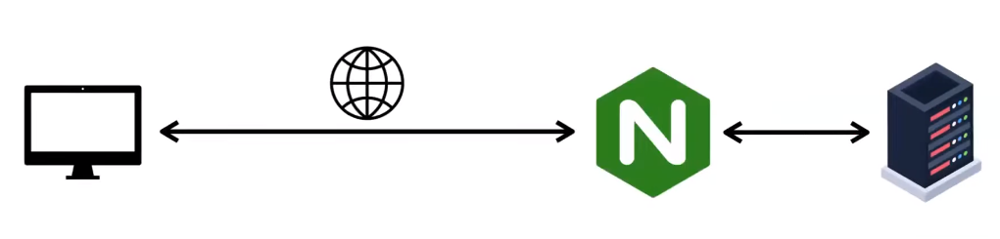
+ Load Balancing
  + 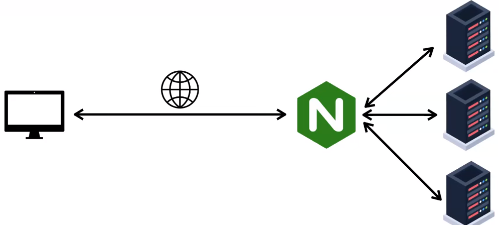
+ SSL
  + 로드밸런싱을 하게 되면은 각각의 서버에서 ssl 키들을 따로 관리하는 게 아니라 로드밸런서인 엔진엑스 서버에서 한 번에 관리하기 쉽도록 도와준다
+ Failover
  + 여러개의 서버가 돌다 보면은 그 중에 이제 몇 개의 서버가 갑자기 고장이 나고 죽을 수가 있다 이럴 경우에 엔진엑스에서 로드밸런싱 하면서 요청을 보내고 해당 요청이 오면은 해당 서버를
  죽은 서버로 인식을 하게 된다 그럼 이제 연결을 끊고 이제 주기적으로 헬스를 체크를 한 다음에 그 서버가 다시 정상 작동을 한다는 걸 확인이 되면
  그때 다시 이제 연결을 해 주는 역할도 해주고 있다
+ Caching
  + 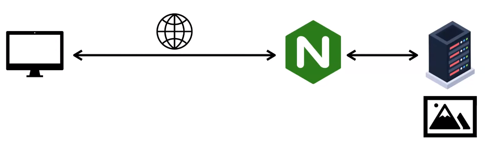
    + 처음에 이미지 같은 정적이 리소스들을 요청을 하게 되면 엔진엑스 뒤에 있는 실제 서버에서 가져와서 호스팅을 해주게 되지만 이런 파일들은 이 엔진엑스에서 캐싱을 해두었다가 그 다음 요청부터는 실제 서버까지 안 가고 커넥션을 횟수를 줄여 가지고 
    호스팅을 해주는 기능도 하고 있다

## NGINX 사용해보기

### 설정 파일 구조
+ 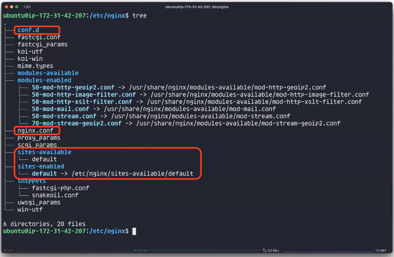
  + 중요한 파일들
    + conf.d 폴더
    + nginx.conf 
    + sites-available, sites-enabled

### nginx.conf 
+ 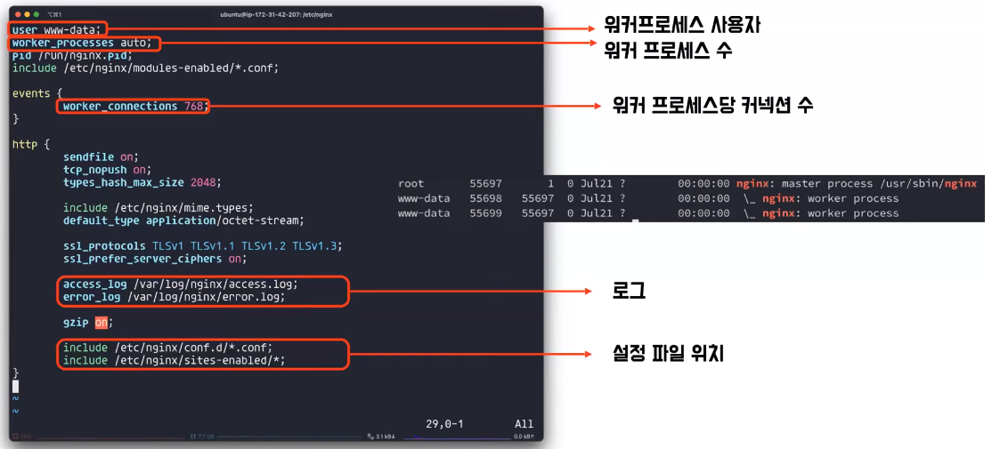
+ nginx.conf 파일에는 처음에 유저라고 돼 있는 부분이 워커프로세스 사용자
+ worker_processes auto가 되어 있는데 워커 프로세스 수를 정의할 수 있다
  + 오토라고 하면은 해당 서버의 CPU 코어 수만큼 자동으로 만들어 준다
+ 워커커넥션은 수를 정하는 것
+ 로그는 로그 파일이 저장되는곳 
+ 밑에는 include할 파일의 위치
  + conf.d의 폴더의 하위에 config라는 확장자를 가지고 있는 파일들과 sites-enabled 아래에 있는 하위 파일들을 include 해온다

### sites-available, sites-enabled
+ 
+ sites-available, enabled는 요즘 사용하지 않는다
+ 왜냐면은 이 방식은 아파치를 사용할 때 어떤 방식을 유지하기 위해서 가져온 건데 이걸 사용하려면 available에 파일을 만들고 심볼릭 링크를 통해서 enabled에 이 파일의 바로 가기를 만든다 그래서 작동 하는 거기 때문에
  그냥 conf.d 폴더에 파일을 넣어 놓으면 된다

### 정적 파일 호스팅
+ 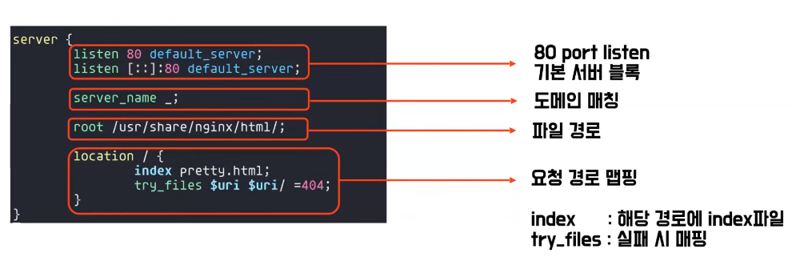
+ listen 80 이렇게 돼 있는 부분은 80 포트를 listen 한다
+ server_name 여기에는 도메인 이름을 적어 넣는데 지금 ```_``` 라고 되어 있는 부분은 default 개념이다 
  + 모든 도메인을 찾아보다가 해당 도메인이 없으면 이거라도 보여주겠다 그래서 ```_``` 로 지금 되어 있다
+ root는 파일경로 그리고 
+ location은 해당 경로로 오면은 인덱스인 pretty.html을 보여주겠다 그리고 다른 로케이션에 하위로 들어오면은 처음에는 그 uri 주소의 파일을 찾고 그 파일이 없으면은 그 해당 폴더를 찾고 폴더도 없으면은 404를 리턴 하는 방식이다
+ 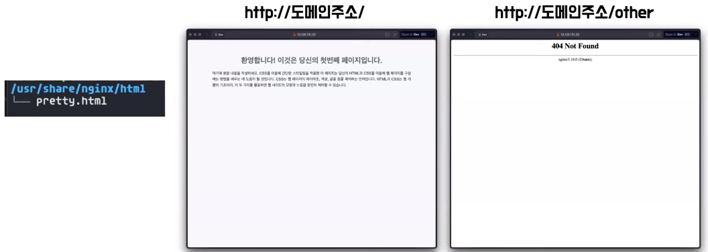
+ 지금 이 폴더 구조에서는 pretty.html 밖에 없기 때문에 도메인주소로 그냥 들어갔을 때는 예쁜 페이지가 나오고 다른 걸로 들어갔을 때는 Not Fount가 뜬다

### PROXY
+ 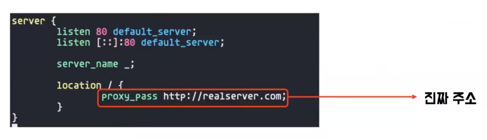
+ 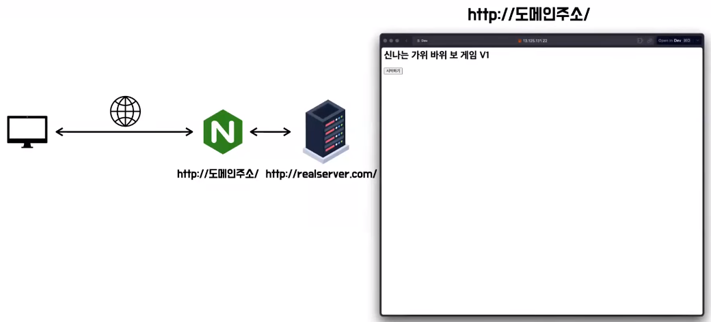
+ 설정은 proxy_pass로 하고 진짜 주소를 놔두면 도메인주소에 들어오면은 진짜 서버인 가위바위보 게임 하는 것이 보여진다

### Load Balancing
+ 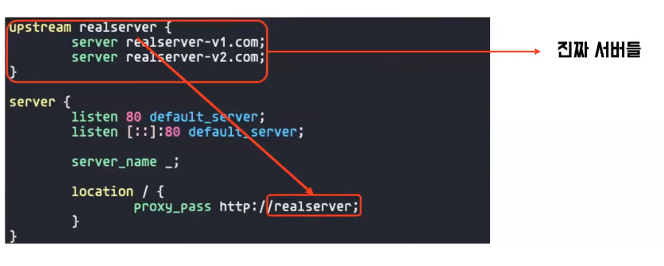
+ upstream에 realserver 이거는 마음대로 하고 서버들을 밑에 로드밸런싱할 서버 주소들을 적어 놓으면은 해당 proxy_pass에 upstream 이름을 넣으면은 로드밸런싱이 된다
+ 기본적으로 로드밸런싱 방식은 라운드로빈이다

#### Weight
+ 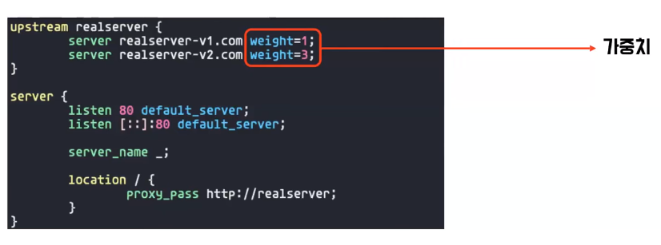
+ 가중치를 줄 수 있다
+ 이렇게 하면은 V1에 한 번 할 때 V2는 3번 한다

#### IP Hash
+ 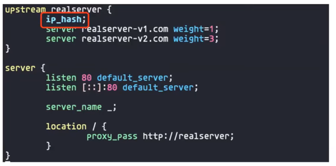
+ ip_hash는 IP를 기반으로 로드밸런싱을 한다
+ 그래서 IP가 같은 곳은 같은 서버만 받는다
+ 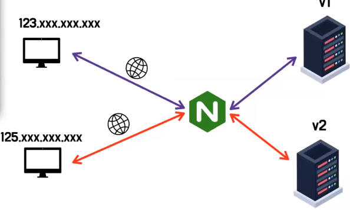

### Caching
+ 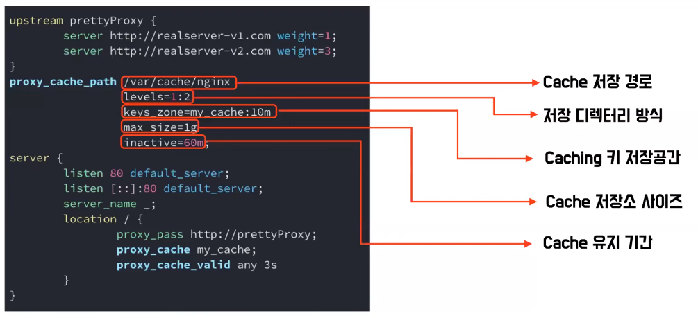
  + 캐싱을 하려면은 우선 설정파일에서 서버 블럭 밖에다가가 proxy_cache_path 라는 것을 설정을 해주어야 한다
  + 처음에 있는 위치가 캐시된 파일들의 저장경로
  + 그다음에 레벨은 이 /var/cache/nginx라는 디렉토리 하위에다가 캐싱을 저장할 때 하는 depth 디렉토리 레벨을 의미
  + 그다음에 캐시 키 값들을 저장하는 공간
  + 그리고 캐시 저장소의 사이즈
  + 마지막으로 캐시 저장소에 있는 것들을 유지하는 시간을 나타나게 된다
+ 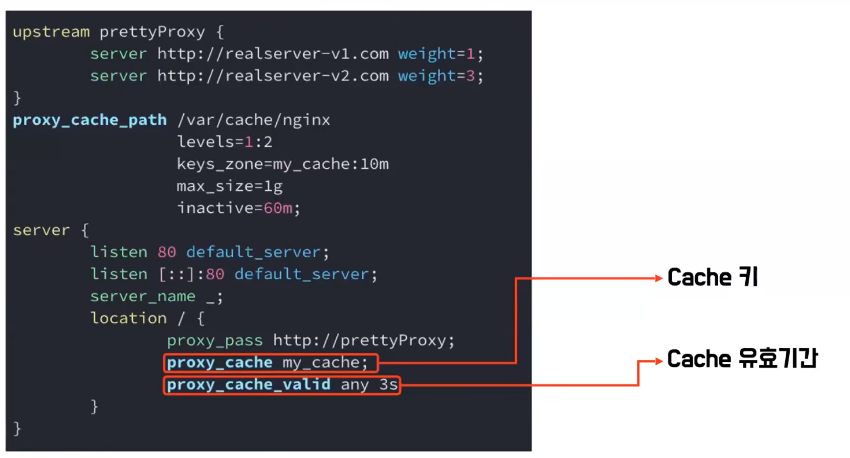
  + 밖에서 설정을 해 놓고 나서 이 location 블록 안에서 캐시를 한다고 설정을 하게 되는데 일단 proxy_cache 에다가 여기 위에서 설정해준 캐시 키를 잡아 주고 proxy_cache_valid 에다가는 여기 보면 any라고 있고 3s라는 것은
    3s는 3초간 이 캐시를 유지한다 라는 뜻이고 any는 여기 프록시서버로 요청을 보내면 응답이 오는데 응답코드가 어떤 코드든지 간에 무조건 캐시를 한다 그런 설정이다 200 됐든 뭐 201이 됐든
+ 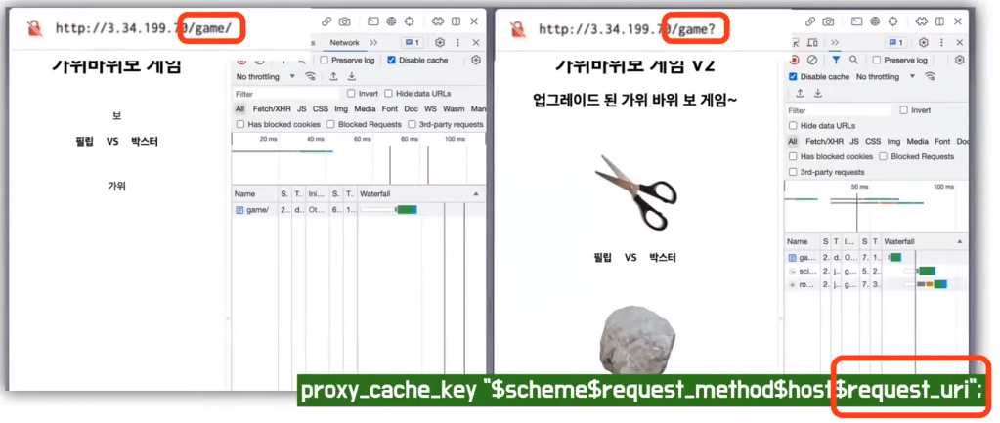
  + 캐시에 사용하는 키가 기본 설정이 default가 이거다
  + $scheme는 프로토콜 $request_method는 어떤 메소드로 보내는지 $host는 도메인 그리고 uri 이렇게 4가지 값으로 캐싱을 하게 되는데 이게 default이고 원하는 대로 키를 설정을 해 줄 수도 있다 
+ 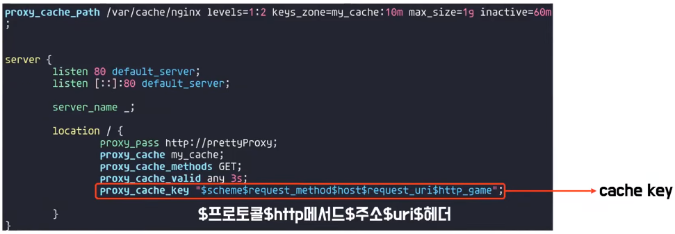
  + http_game 이라고 되어 있는데 헤더를 캐싱 키로 사용한다는 설정인데 이렇게 되면은 게임이라는 헤더의 값에 따라서 캐싱을 따로하게 된다
  + 
  + 그래서 이 두 요청은 저희가 임의로 게임이라는 헤더에 boxster를 넣었고 게임이라는 헤더에 philip 이라는 데이터를 담아서 보내게 되면
    각각이 이제 다르게 캐싱이 되는 것을 확인할 수가 있다
+ 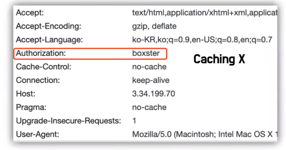
+ 캐싱을 할 때 좀 주의할 점이 있는데 이렇게 Authorization 헤더가 들어가 있으면 이것은 인증이 필요한 것을 나타내고 해당 데이터에 대해서
  캐싱을 하게 되면은 보안 문제가 있을 수가 있어서 엔진엑스에서는 이렇게 Authorization 헤더가 들어가 있으면은 캐싱을 안 해주고 있다
+ 
  + 게임 같이 매번 좀 랜덤성이 중요하거나 아니면은 서비스를 같은 경우에는 좀 실시간성이 중요한 서비스들은 캐싱을 하면 안되는데 
  + 그래서 이런 경우에는 전체적인 요청들은 캐싱을 하지 않지만 이미지와 같은 특정 리소스파일에 대해서만 캐싱 설정을 해 줄 수가 있다
  + 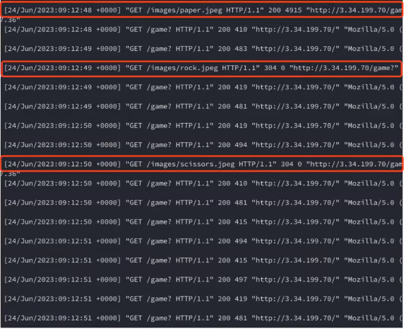
  + 이렇게 되면은 게임이라는 요청들은 전부 다 매번 요청을 보내고 있지만은 실제 서버에다가 이미지로 요청이 오는 것들은 최초 1회씩만 서버로 보내고
    그 이후에는 캐싱된 데이터를 사용하는 것을 알 수 있다

### CORS
+ 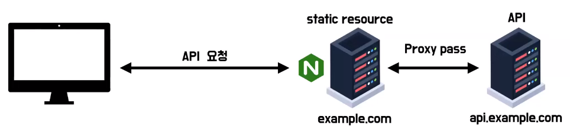
  + 프론트와 협업 하시는 분들은 CORS를 열어 주거나 하는 문제들이 있을 수가 있다 이런 것도 해결할 수 있는데
    가장 쉽게 생각할 수 있는 게 프론트 배포 서버를 api 서버에 리버스 프록시 서버처럼 이용하게 되는것이다 이러면 origin이 같으니까
    CORS 오류가 터지지도 않는다 
  + 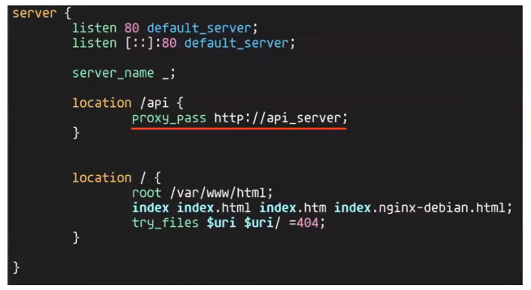
+ 
  + 이제 서비스 사용자들이 많아지면 이제 서버에 관한 요청을 아예 분리 origin을 분리를 해야 될 때가 있는데 이런 경우에 스프링에서 직접 설정을 해서 스프링에서 바로 받을 수도 있지만
  + 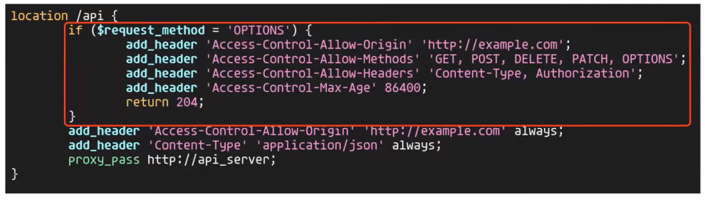
  + 엔진엑스에서를 통해서 가게 되면은 엔진엑스에다가 이 api라고 오는 요청해 대해서 CORS 해제를 해줄 수 있다
  + 이제 여기 if 부분은 CORS가 origin이 같은지 아닌지를 확인하기 위해서 이제 preflight로 먼저 요청을 보내고 있는데 그때 메소드가 OPTIONS이어서 OPTIONS 으로 오는 것들에 대해서 체크를 해 주고
    허용했줄 origin 허용해줄 method header 그리고 기간 이런 것들을 다 설정을 해줄 수가 있다
  
### SSL 
+ 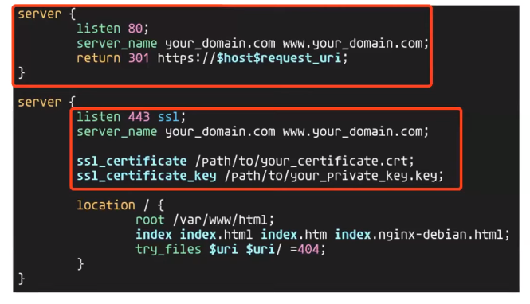
+ 구글 같은 경우도 http 요청을 보내면 저절로 https로 리다이렉트 해 주는데
  엔진에서 이것처럼 80 포트 http로 들어오는 요청은 바로 이제 저희가 원하는 주소로 https 리다이렉트 해 주는 방식으로 설정을 해 줄 수가 있다 서버 블록을 하나 만들어서
+ 443 포트를 듣는 곳에서 이 ssl 인증서 와 인증키들의 위치만 지정을 해 주면은 손쉽게 https 설정을 해 줄 수가 있다
