# 헤나의 HTTPS
[https://youtu.be/KpyzbEFYE_E?si=YLoj6sPbvQKN-Z3V](https://youtu.be/KpyzbEFYE_E?si=YLoj6sPbvQKN-Z3V)

# 헤나의 HTTPS
* toc
{:toc}

## HTTP 전송
+ 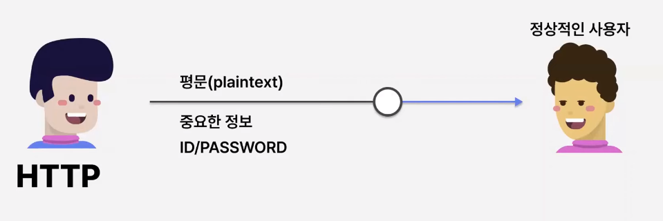
+ 평문으로 암호화하지 않은 데이터를, 중요한 정보를 전송을 하게 되면은 정상적인 사용자 입장에서는 당연히 빠르게 정보를 읽을 수 있으니까 좋다
+ 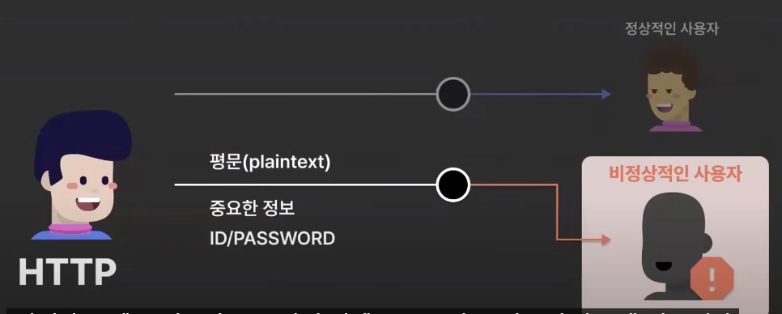
+ 하지만 다음과 같이 비정상적인 사용자가 이 데이터를 읽게 된다면 데이터가 유출되는 문제가 생길 수 있다
+ 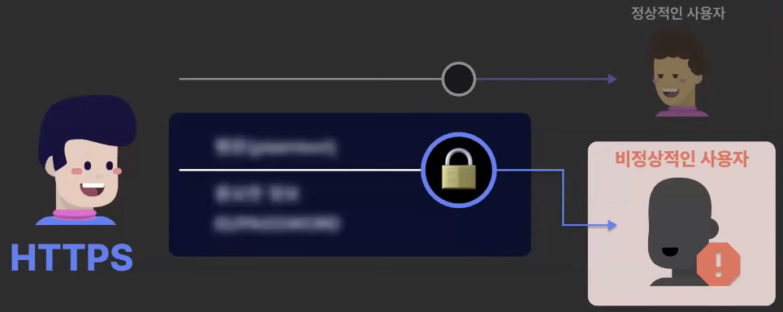
+ 이러한 문제를 해결하기 위해서 이제 HTTPS라는 개념이 나오게 됐다
+ 데이터를 암호화해서 비정상적인 사용자가 데이터를 가로챈다고 해도 데이터를 읽을 수 없으므로 이 데이터를 암호화함의 중요함을 알려주고 있다
+ 그래서 이런 HTTPS는 주변에서 굉장히 많이 사용되고 있다 그리고 의도적으로 사용하게 만들고 있다

## HTTPS 권장
+ HTTP를 통해서 사이트를 들어가려고 하면은 사이트 상에서 이 사이트는 안전하지 않다고 얘기를 하기도 하며 또 HTTPS를 통해서 들어가야만 이 사이트가 안전하다고 얘기를 해주기도 한다 
+ 또한 HTTP를 이용해서 구글에 들어가려고 하면은 HTTP 헤더에 HSTS라는 헤더를 설정해서 다음과 같이 리다이렉트를 자동으로 시켜 HTTP를 통해서 구글로 들어가려고 했지만은 HTTPS로 자동으로 리다이렉트 되는 것을 볼 수 있다

## SSL/TLS
+ Secure Sockets Layer / Transport Layer Security
+ SSL/TLS는 데이터를 암호화하는 통신 프로토콜이고 SSL/TLS가 둘 다 나와서 조금 헷갈리실 수 있지만
  SSL은 구 버전, TLS는 신 버전이라 생각하고 현재는 TLS를 사용한다고 생각하면 된다 
+ 데이터를 암호화하여 제3자가 데이터를 볼 수 없게 보호한다
+ 데이터 변조 여부를 검증한다
+ 상호 인증을 지원한다 

### 과정
+ 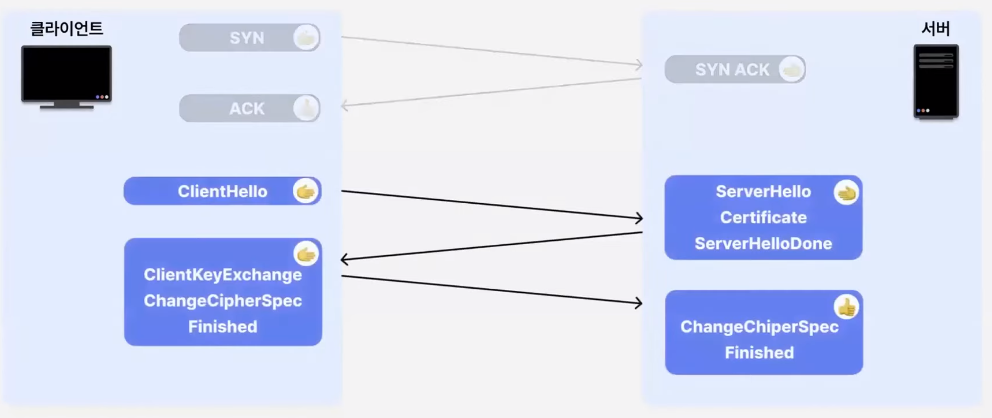
+ 먼저 클라이언트와 서버가 3-way 핸드쉐이크를 한 다음에 다음과 같은 통신을 하게 된다 
+ 클라이언트와 서버가 서로 인증할 수 있는 신뢰할 수 있는 상대인지 확인을 한 후에 데이터를 어떻게 암호화 할 것인가를 결정하게 된다
+ 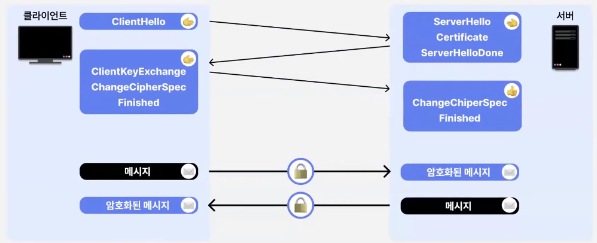
+ 데이터를 어떻게 암호화 할 것인가 결정을 하게 되면은 이 다음부터 메시지를 암호화해서 보내게 된다 이제부터 암호화된 메시지를 보낸다 HTTPS를 사용한다고 말할 수 있다
+ 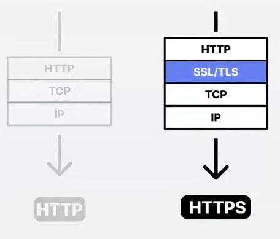
+ HTTP를 보내면 HTTP, TCP, IP의 계층 순서로 보내지만은 SSL/TLS의 계층을 HTTP와 TCP 사이에 넣음으로써 HTTPS로 전수를 한다고 할 수 있다
+ 하지만 이런 HTTPS를 사용한 것이 항상 좋은 것은 아닌데 SSL/TLS 계층이 추가됨으로써 당연히 시간 지연이 일어나기 때문이다
+ 

## HTTPS 사용 이유 세가지

### 데이터 기밀성
+ 데이터를 어떻게 암호화할 것인가?
+ 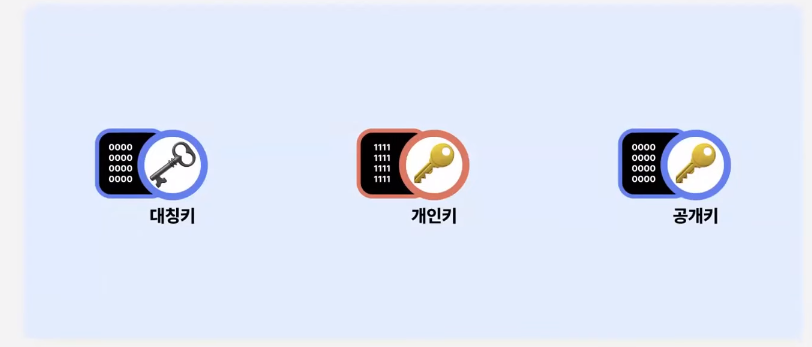
+ 왼쪽에 하나의 키, 대칭키와 두 개의 개인키와 공개키를 사용한 비대칭키 암호화라고 할 수 있다
+ 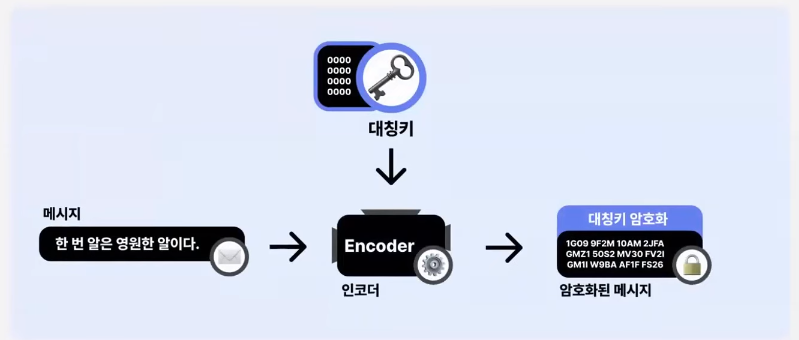
+ 대칭키는 메시지를 대칭키로 암호화하여 암호화된 메시지를 만들면 대칭키라는 말 그대로 똑같은 키로 복호화해서 메시지를 다시 받을 수 있다
+ 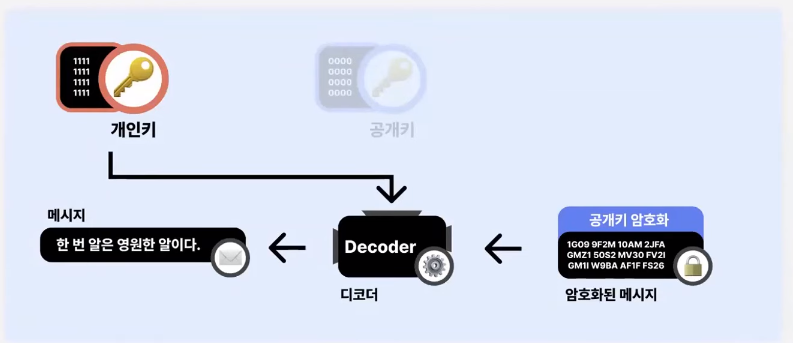
+ 비대칭키 암호화, 이것을 공개키 암호화라고도 얘기를 하는데 메시지를 공개키로 암호화해서 암호화된 메시지를 받고 대칭키였을 때는 똑같은 키였지만은
  비대칭키였기 때문에 개인키를 통해서 복호화를 해서 메시지를 받을 수 있게 된다
+ 데이터의 암호화는 이런 식으로 비대칭키와 대칭키의 개념을 통해서 기밀성을 지키고 있다

### 데이터 무결성
+ 데이터가 조작되지 않았음을 어떻게 알 수 있는가?
+ 암호화 해시 함수라는 개념이 나오게 된다
+ 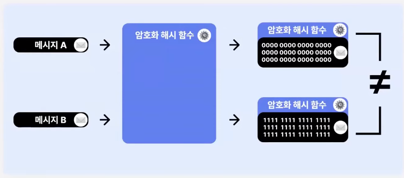
+ 두 해시값을 비교했을 때 서로 다르면 데이터가 같지 않다 즉, 데이터가 변조되지 않았음을 알 수 있다
+ 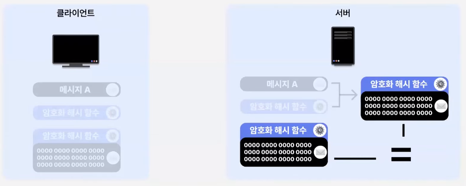
+ 클라이언트와 서버가 서로 동일한 암호화 해시를 갖고 있을 때 클라이언트가 메시지를 암호화 해시 함수를 통해서 해싱하여 해시값을 가지고 클라이언트는 메시지와 해시값을 동시에 서버에게 전송하게 된다
  서버는 클라이언트로부터 받은 메시지와 해시값이 있는데 자신이 가지고 있었던 암호화 해시 함수를 통해서
  클라이언트로부터 받은 메시지 A를 해싱하여 서버 내부에서 해시값을 만들게 된다 그리고 클라이언트로부터 받은 해시값과 서버로부터 만든 해시값을 비교해서 서로 변조되었는지를 검증하게 된다
+ 같다고 하면 데이터가 변조되지 않았음을 증명할 수 있다 이런 식으로 데이터 무결성을 확인할 수 있다

### 통신 상대 인증
+ 통신 상대를 신뢰할 수 있는가?
+ 통신 상대를 확인하지 않는다면 비정상적인 서버를 구별할 수 없다
+ 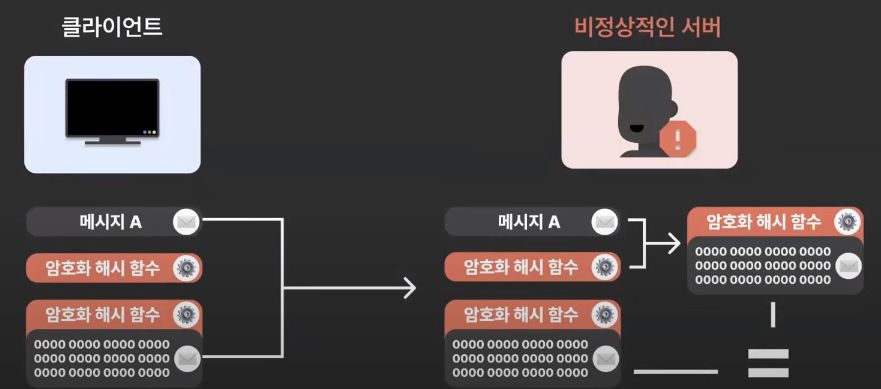
+ 통신 상대 인증은 아까와 같은 데이터의 무결성 상황에서 필요하다고 느낄 수 있다
+ 클라이언트와 서버가 서로 통신을 하고 데이터가 변조되지 않았음을 증명하는 아까와 똑같은 플로우 상황에서 만약에 비정상적인 서버가 데이터를 받았으면 
클라이언트 측에서는 데이터가 변조되지 않았으니 서버에서도 변조되지 않았음을 클라이언트에게 얘기를 하게 되면서 클라이언트 측에서는 데이터를 무사히 전달한 줄 안다 하지만 그 상대는 비정상적인 서버였다는 게 문제이다
이런 문제를 해결하기 위해서 인증 기관이라는 개념을 도입하게 된다
+ 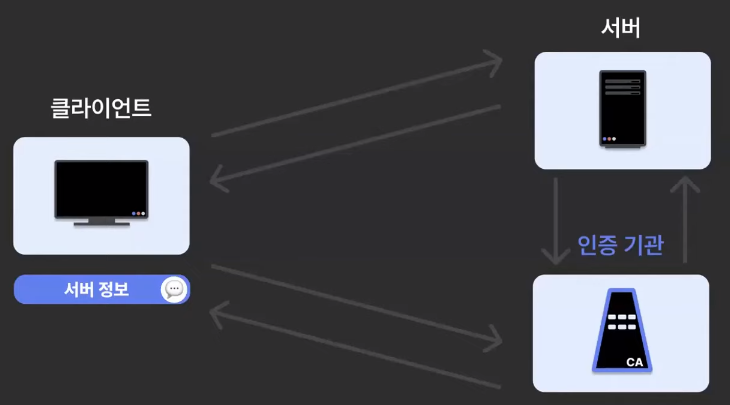
+ 서버가 서버 정보를 가지고 서버 정보를 인증 기관에게 보낸다
+ 인증 기관은 이 서버 정보를 암호화해서 서버 인증서를 만드는데 인증 기관이 다시 서버에게 서버 인증서를 보내게 된다
+ 그리고 서버는 클라이언트한테 서버 인증서를 보내게 된다
+ 그리고 이 서버 인증서 내에는 아까 서버의 정보가 있었으므로 클라이언트가 이 서버 인증서를 가지고 서버 정보를 보고 인증 기관을 통해서 이 서버가 정상적인 서버냐 아니냐를 확인할 수 있는 플로우이다
+ 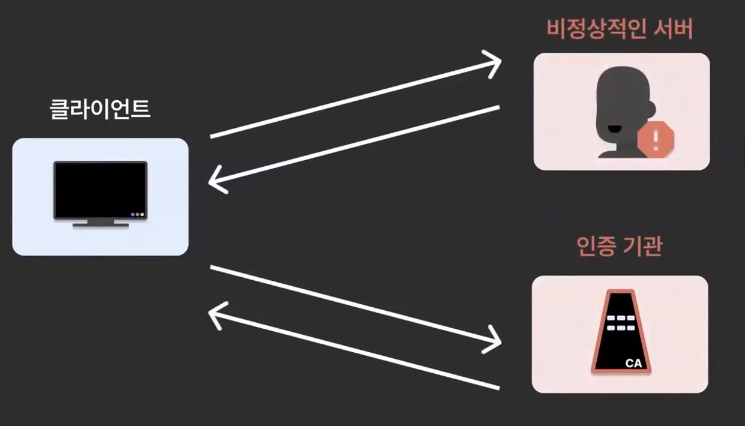
+ 그렇다면 만약에 다음과 같이 비정상적인 서버가 가짜 인증기관을 만들어서 증명하려고 하면 어떻게 될까?  이 문제에 대해서는 걱정하지 않아도 된다
  + 왜냐하면 인증서는 다음과 같이 인증서 체인을 통해서 인증을 하고 있기 때문이다
  + 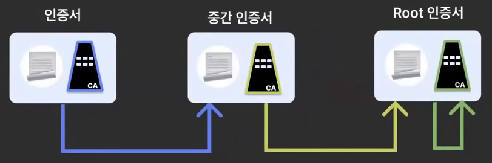
  + 처음에 인증서가 비정상적인 서버라고 했을 때 다음 중간 인증서가 "어? 이 인증서는 인증되지 않은 서버야" 라고 얘기를 한다
  + 정상적인 플로우라면 인증서를 인증하기 위한 중간 인증서, 그리고 중간 인증서가 신뢰할 수 있는 상태인지 또 인증을 하기 위한 루트 인증서로 진행이 된다 

## HTTPS 통신 흐름
+ 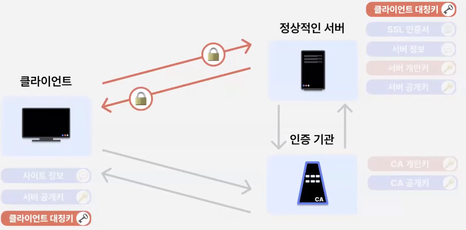
+ 정상적인 서버에서 서버 정보와 서버 공개키를 가지고 인증 기관에게 보내게 된다
+ 그리고 인증 기관은 CA 개인키, 인증기관의 개인키를 가지고 있는데 이 인증 기관이 서버 정보와 서버 공개키를 받아서 CA 개인키로 암호화하게 된다
+ 그리고 이 암호화된 결과를 SSL 인증서 서버 인증서라고 한 것과 같은 SSL 인증서를 가지게 된다
+ 그리고 인증 기관이 다시 서버에게 이 SSL 인증서를 보내게 된다
+ 그리고 인증 기관은 CA 공개키, 인증 기관의 공개키를 클라이언트의 브라우저한테 넘겨주게 된다 이렇게 클라이언트에게 CA 공개키를 넘겨준 상태에서 클라이언트가 정상적인 서버에게 요청을 할 때 이제 정상적인 서버에서 SSL 인증서를 클라이언트에 넘겨주게 된다 
+ SSL 인증서는 인증기관의 개인키로 암호화되었었다 이것을 CA 공개키를 가지고 있기 때문에 복호화할 수 있다
+ 이렇게 복호화하면 사이트 정보와 서버의 공개키를 가질 수 있게 된다 
+ 그리고 사이트의 정보를 가지고 있으니 이 사이트를 인증 기관을 통해서 검증된 사이트냐 아니냐를 확인할 수 있다
+ 검증된 사이트가 맞다고 생각을 할 때 클라이언트는 클라이언트 대칭키를 만들게 된다
+ 그리고 서버의 공개키로 이 클라이언트의 대칭키를 암호화화여 정상적인 서버에게 보내게 된다
+ 그리고 정상적인 서버는 서버의 개인키를 가지고 있기 때문에 암호화된 서버의 공개키를 복호화하여 클라이언트의 대칭키를 만들게 된다 
+ 그리고 이제 클라이언트와 서버가 둘 다 똑같은 클라이언트의 대칭키를 가지고 있기 때문에 서로의 메시지를 암호화 및 복호화하면서 자연스럽게 HTTPS의 통신의 흐름을 볼 수 있다는 것이다
