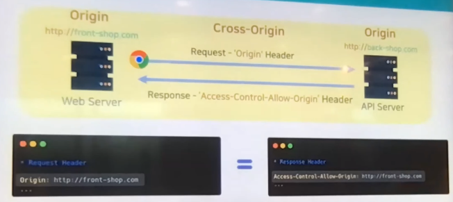
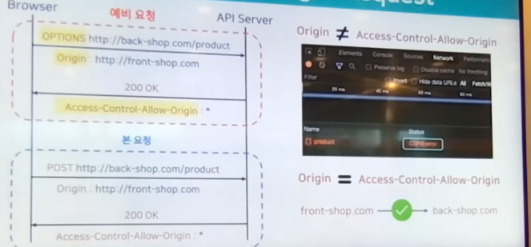
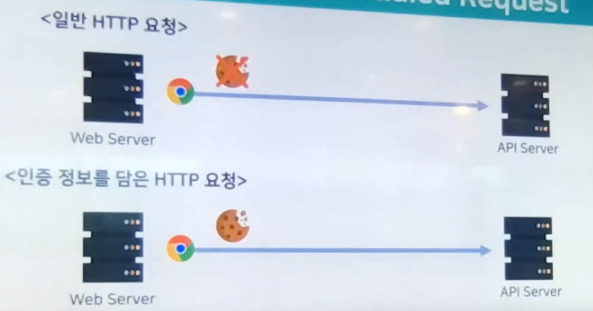
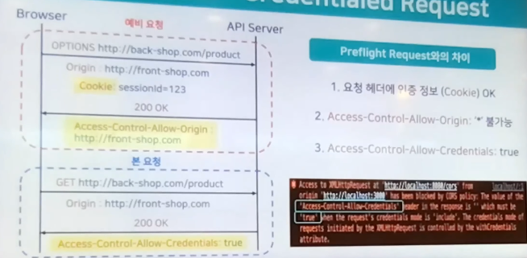
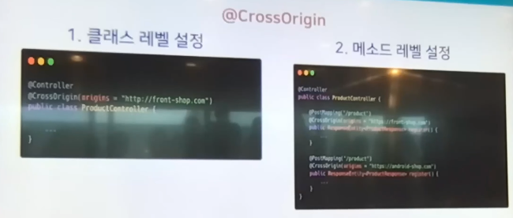

# 성하의 CORS
[https://youtu.be/4iXWkBi2hCA?si=gvc9MFqThSFqWS37](https://youtu.be/4iXWkBi2hCA?si=gvc9MFqThSFqWS37)

# 성하의 CORS
* toc
{:toc}

## SOP & CORS란?
+ CORS를 이해하기 위해서는 SOP라는 개념도 함께 이해해야 한다
  + SOP는 Same Origin Policy, 같은 출처 정책
  + "SOP는 같은 출처끼리만 요청을 보낼 수 있어" 즉, 다른 출처로의 요청은 막는다는 SOP 정책
  + CORS는 Cross Origin Resource Sharing, 다른 출처의 자원 공유를 의미
  + CORS는 "다른 출처라도 요청을 보낼 수 있게 해줄게"라는 정책
  + 여기서 공통적으로 등장하는 이 Origin이라는 출처는 URL에서 Protocol과 Host, 그리고 Port를 합친 것을 의미한다

## CORS 동작 원리 
+ 
+ 현재 예시에서 front-shop 이라는 출처에서 back-shop 이라는 출처로 다른 출처 요청을 보내고자 한다
+ 기본적으로 브라우저에서는 리퀘스트의 Origin 헤더라는 곳에 현재 요청을 보내는 곳의 출처를 담게 된다
+ 이때 요청을 받은 서버에서 CORS 설정을 해 준다는 것은 응답 헤더인 Access-Control-Allow-Origin 헤더에 허용할 출처를 지정해둔다는 것을 의미한다
+ 따라서 서버에서 이렇게 출처를 지정해주면 브라우저는 요청 헤더의 Origin과 응답 헤더의 Access-Control-Allow-Origin 헤더가 같은지 출처가 같은지 판단해 같다면 요청을 허용하고 다르다면 CORS 에러를 반환하게 된다

## CORS 시나리오
+ Simple Request는 거의 CORS 요청에서 거의 동작하지 않기 때문에 제외

### Preflight Request
+ 
+ Preflight Request는 예비 요청이라는 특별한 단계를 거치게 된다
+ 예비 요청에서는 HTTP의 특별한 메소드인 OPTIONS 메소드가 사용되게 되고 이 예비 요청의 역할은 Origin과 Access-Control-Allow-Origin의 출처를 비교하는 역할을 한다
+ 그래서 여기서 비교한 출처가 다르다면 CORS 에러를 응답하고 같다면 본 요청을 정상적으로 보내주는 역할을 한다
+ Access-Control-Allow-Origin 헤더에 서버가 와일드카드(*)를 지정해서 모든 출처를 허용해줄 수 있다 
+ 거의 대부분의 요청은 Preflight Request로 동작하게 된다

### Credentialed Request
+ 
+ 일반적으로 쿠키나 세션같은 정보가 담기지 않는 일반 HTTP 요청일 때는 Preflight Request로 동작을 하고 쿠키나 세션같은 정보가 담긴 HTTP 요청이 올 때 Credentialed Request로 동작하게 된다
+ Credentialed Request는 기본적으로 Preflight와 메커니즘이 비슷하다 
+ 예비 요청을 통해서 앞서 봤던 Origin과 Access-Control-Allow-Origin 헤더를 비교해서 출처가 다르다면 CORS 에러를 반환하고 같다면 본 요청을 보내는 이런 기본적인 메커니즘은 Preflight Request와 동일하다
+ 
+ 다른 점은 요청 헤더에 쿠키나 세션같은 정보가 담겨 온다는 점이고 담겨오기 때문에 Credentialed Request로 동작을 하게 된다
+ 서버에서 Access-Control-Allow-Origin 헤더를 설정해줄 때 Preflight에서는 별표(*)를 설정해서 모든 출처를 허용한다는 의미가 불가능하다
  + 와일드카드, 별표(*)를 사용할 수 없다
  + Credentialed Request는 쿠키나 세션같은 중요한 정보들이 오는 요청이고 그래서 모든 출처를 허용하게 되면 보안상 크리티컬한 이슈가 터질 수 있다 따라서 브라우저가 이를 방지하고자 허용할 출처를 직접 지정해줘야 하는 정책을 만든 것 같다
+ Credentialed Request에서는 본 요청에 이러한 Access-Control-Allow-Credentials라는 헤더도 설정해줘야된다 이 헤더를 설정하지 않으면 콘솔 창에서 'Access-Control-Allow-Credentials를 True로 설정해줘라'라는 에러 메시지를 만날 수 있다

## Spring CORS 설정 방법

### Annotation
+ 
+ Cross-Origin이라는 어노테이션을 통해 클래스 레벨과 메소드 레벨 둘 다 설정이 가능하다
+ Cross-Origin의 Origins 옵션을 통하면 앞서 살펴본 Access-Control-Allow-Origin 헤더에 허용할 출처를 직접 지정해 줄 수 있다

### Configuration
+ 
+ 클래스 레벨과 메소드 레벨을 넘어서 전역적으로 설정하고 싶다면 WebMvcConfigurer를 구현하고 addCorsMappings라는 메소드를 오버라이드해서 구현할 수 있다
+ addMapping()은 현재의 CORS를 적용할 우리 애플리케이션의 API URI를 지정해줄 수 있다
+ allowedOrigins() Access-Control-Allow-Origin 헤더에 허용할 출처를 담아줄 수 있다
+ allowedCredentials() 앞에서 Credentialed Request에서 Access-Control-Allow-Credentials를 true로 설정해줘서 쿠키나 세션같은 정보가 담긴 요청에도 처리를 할 수 있었다 
