# 누누, 다즐의 클린 아키텍처
[https://youtu.be/Ql7CoQminoM?si=xpD2G3Q4K8lBCfgd](https://youtu.be/Ql7CoQminoM?si=xpD2G3Q4K8lBCfgd)

# 누누, 다즐의 클린 아키텍처
* toc
{:toc}

## 아키텍처란?
+ 어떤 대상의 구성과 동작 원리, 구성 요소간의 관계 및 시스템 외부 환경과의 관계를 설명하는 하나의 설명서
+ 간단하게 말하자면 아키텍처는 시스템의 설계 및 동작하는 방식

### 시스템 아키텍처
+ 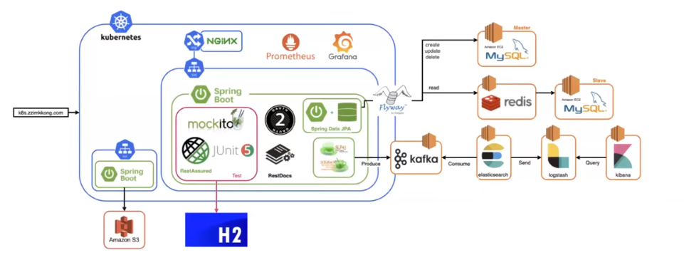
+ 시스템이 전반적으로 어떻게 구성되어 있는지와 각각의 요소들은 무엇이 있는지에 대해 설명하고 있다
+ 아키텍처 구성도를 미리 제공한다면 코드를 이해하거나 작성하는 입장에서 애플리케이션의 전체 설계를 이해하기 쉬울 것이다 또한 시스템의 구조나 계획도 설명할 수 있다

## 소프트웨어 아키텍처란
+ 소프트웨어 구성 요소 사이의 관계를 표현하는 하나의 설명서다시 말해서 소프트웨어 설계 구조 계획을 설명한다고 볼 수 있다
+ 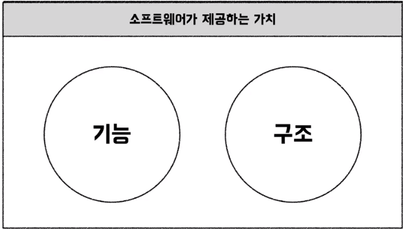
+ 소프트웨어 아키텍처는 소프트웨어가 제공하는 가치인 기능과 구조 중에 구조에 해당한다
+ 클린 코드와 클린 아키텍처를 쓴 로버트 마틴은 구조가 더 중요하다고 설명한다 

### 왜 구조가 중요할까
+ 소프트웨어 비용과 관련 
+ 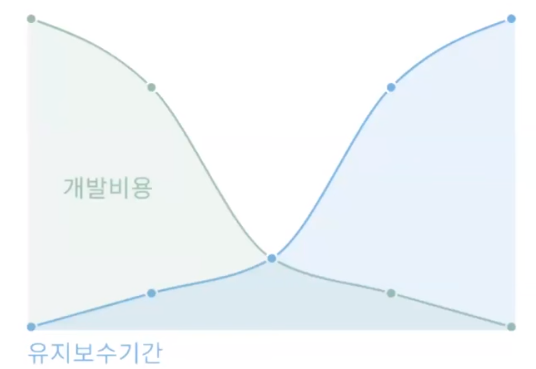
+ 개발 초기 단계에는 많은 기능을 빠르게 개발 해야 되기 때문에 개발 비용이 높은 것을 확인할 수 있는데 개발이 완료되고 나서부터는 계속해서 변화하는 소프트웨어를 유지보수해야 한다 
이때 기능 개발비용보다 유지보수비용이 확 늘어나는 것을 그래프를 통해 확인할 수 있다 장기적으로 봤을 때 기능을 개발하는 비용보다 유지보수비용이 훨씬 크다는 것을 알 수 있다

### 좋은 구조를 만드는 법
+ 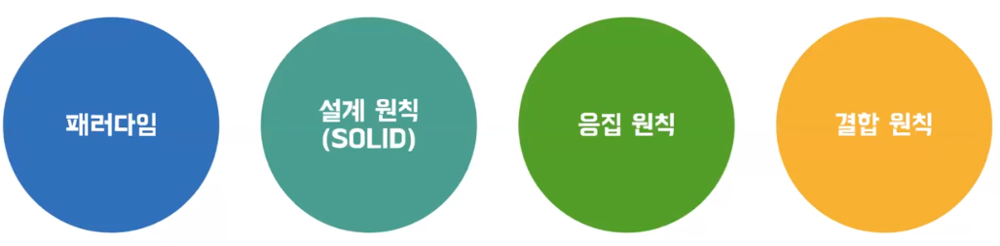
+ 패러다임, 설계 원칙을 잘 지키고 응집성을 높이고 결합도를 낮추면서 개발하면 된다
  하지만 이런 원칙들을 모두 지켜 가면서 개발하는 것은 어려운 일이다
+ 기능 개발도 요소가 엮이면 복잡해지는데 원칙까지 고려하기는 쉽지 않을 것 같다
  그래서 더 쉽게 가도록 방향을 제시해 주는 것이 아키텍처 패턴이다

#### 아키텍처 패턴
+ 
+ 모든 원칙을 꼼꼼히 지킬 수 없지만 따라 하는 것만으로도 원칙들이 일부 지켜지고 기능 개발에도 쉽게 적용할 수 있도록 도와준다 

#### 아키텍처 적용 
+ 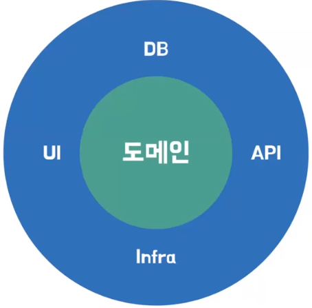
+ 아키텍처를 적용함으로써 소프트웨어를 통해 이루고자 하는 핵심 목표인 도메인을 지킬 수 있다 
+ 외부 요소인 UI, DB, API와 같은 것에 도메인이 의존하지 않도록 도메인을 보호한다

## 레이어드 아키텍처
+ 레이어드 아키텍처는 관심사가 같은 코드를 계층으로 그룹화한 아키텍처
+ 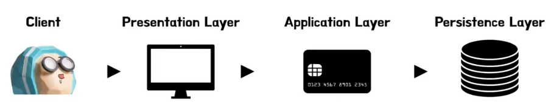
+ Presentation, Application, Persistence 계층으로 나눠 사용하고 필요에 따라서 계층을 추가해서 사용할 수 있다
+ 특징
  + 계층화로 인해 분리된 책임을 가지고 있다
  + 편의에 따라 여러 계층을 추가 가능하다
    + ex) Presentation, Application, domain, Persistence
  + 구조가 단순하고 익숙하기 때문에 많이 사용한다
  + 하지만 Persist 계층이 가장 하위에 위치하는 아키텍처의 특성상 데이터베이스 주도 설계가 될 수 있다는 단점도 존재한다

### 레이어드 아키텍처의 흐름
+ 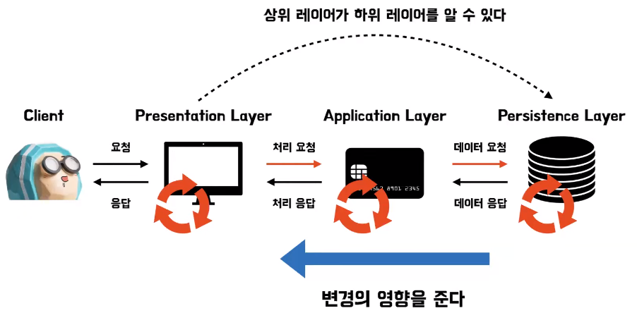
+ 클라이언트는 요청을 보내고 프레젠테이션 계층은 애플리케이션 계층으로 비즈니스 처리 요청을 맡긴다 애플리케이션 계층은 비즈니스 로직에 필요한 데이터를
  Persist 계층에 요청하고 Persist 계층은 데이터를 응답한다 
+ 받은 데이터로부터 로직을 처리하고 완료한 애플리케이션 계층은 외부로부터 전달한 정보를 프레젠테이션 계층에 응답하고 프레젠테이션 계층은 클라이언트에게 이를 전달한다
+ 이 과정에서 레이어드 아키텍처의 문제점을 찾을 수 있다

#### 문제점
+ Persentation, Application, Persist 순으로 의존성이 발생하는데 이는 상위 레이어가 하위 레이어를 알 수 있는 상황을 만들게 된다
+ 상의 레이어가 하위 레이어를 알게 되기 때문에 하위 레이어 변경이 상위 레이어의 변경 까지 영향을 주게 되는 상황을 만든다
  변경에 영향을 주는 상황을 의존성이 생겼다고 할 수 있다
+ Persist 계층의 변화가 애플리케이션 계층의 변화를 발생시키고 프레젠테이션 계층까지 수정이 필요해진다 이러한 의존성을 갖는 경우 무엇보다 큰 문제는 코드 변경이 어렵다는 것이다
  한 계층의 변화가 다른 계층에까지 영향을 주기 때문입니다
+ 추가적으로 테스트도 쉽지 않다 애플리케이션 계층에 존재하는 비즈니스 로직을 검증하기 위해
  데이터와 함께 테스트해야 하는 상황이 발생한다

## 클린 아키텍처
+ 프로젝트 전체가 DB에 의존하는 구조가 문제가 된다면 프로젝트 전체가 DB에 의존하지 않도록 하면 문제가 해결되지 않을까
+ 클린 아키텍처에서는 의존성 역전을 통해서 프로젝트 전체가 DB가 아닌 도메인에 의존하게 하는 방법으로 이런 문제를 해결 했다
+ 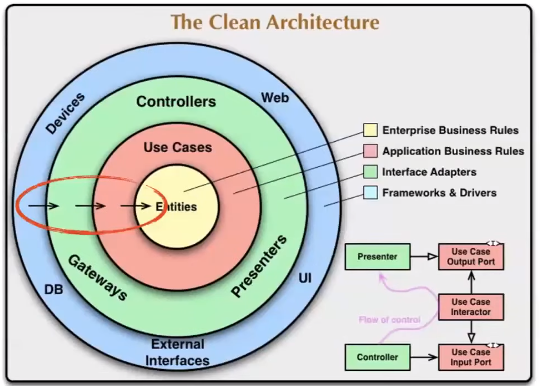
+ 의존성 방향이 한 방향으로 흐르는 것은 레이어드 아키텍처와 큰 차이가 없다
+ 특징
  + 핵심 규칙을 담고 있는 도메인이 중심이 된다
  + 도메인이 세부 사항에 의존하지 않는다
    + 세부 사항 또는 외부 요소란 우리가 사용하는 라이브러리나 DB를 생각해 볼 수 있을 것 같다(입출력 장치, 디비, 웹시스템, 서버, 프레임워크, 통신 프로토콜 등)
      + 웹 어플리케이션이라면 스프링과 Mysql과 같은 코드를 제외한 모든 부분
  + 단점: 팀원이 클린 아키텍처에 익숙하지 않을 수 있고 레퍼런스도 적다는 부분이 있다
+ 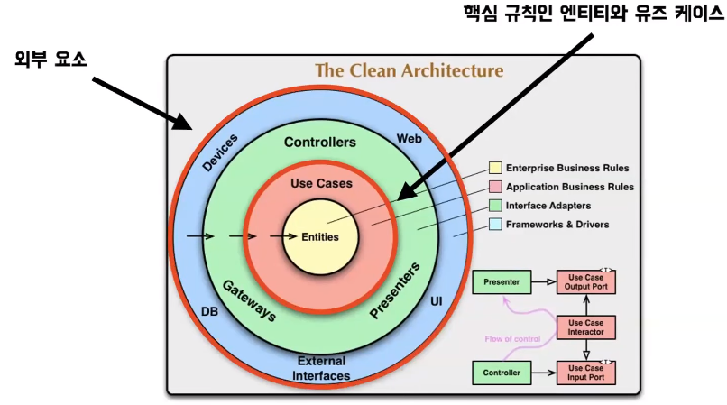
  + 클린 아키텍처는 가장 간단하게 두 가지 계층으로 구분할 수 있다
  + 첫 번째 계층은 Entity와 Use Cases가 있는 계층이다 이 계층은 비즈니스 로직을 캡처한 계층이고 외부 요소에 대해서는 절대로 알면 안된다
  + 두 번째 계층은 외부 요소가 있는 계층이다 어떤 DB를 사용하는지 어떤 프레임워크를 사용하는지와 같은 것들이 있다
  + 이 두 가지 부분을 분리 하는 것이 가장 중요한 핵심이다

### 조금 더 자세하게
+ 클린 아키텍처는 총 4개의 레이어로 구성되어 있다

#### Entity 레이어
+ 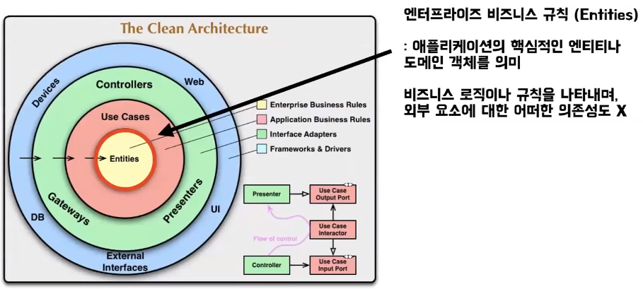
+ 가장 핵심적인 비즈니스 로직이나 규칙을 담고 있는 레이어이다 대부분의 프로젝트에서 도메인 패키지에 들어있는 것들이라고 봐도 된다 
+ 당연하지만 외부 요소에 대해서 어떠한 의존성도 갖고 있으면 안 된다

#### Use Cases 레이어
+ 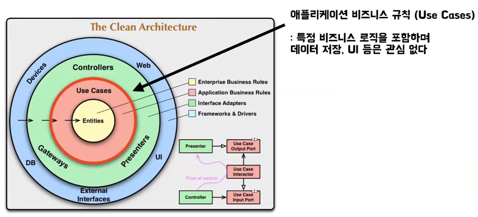
+ 비즈니스 로직을 포함하고 있고 보통 Repository에서 객체를 받아 와서 특정한 행위를 하고 업데이트 하는 부분을 처리하고 있다

#### Adapter 레이어
+ 데이터를 Use Case에서 사용하는 형태로 변하거나 내부에서 사용하는 형태를 외부에 적합한 형태로 변환한다

#### Infrastructure 레이어
+ 
+ DB와 프레임워크 같은 외부와 통신 작업을 해주는 것들 이다

### 클린 아키텍처는 추상적이다 
+ 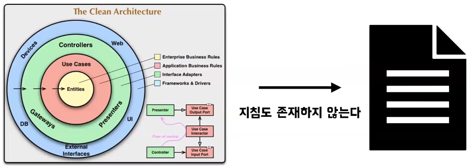
+ 클린 아키텍처에는 정확하게 어떻게 하라는 지침이 전혀 존재하지 않다
+ 그래서 처음 프로젝트에 도입하기 더욱 어렵게 느껴질 수 있다 
+ 그렇다면 프로젝트에 어떻게 도입할 수 있을까 클린 아키텍처와는 약간 다르겠지만 클린 아키텍처를 적용하기에 아주 좋은 레퍼런스가 될 수 있는 아키텍처로 헥사고날 아키텍처가 있다

## 헥사고날 아키텍처
+ 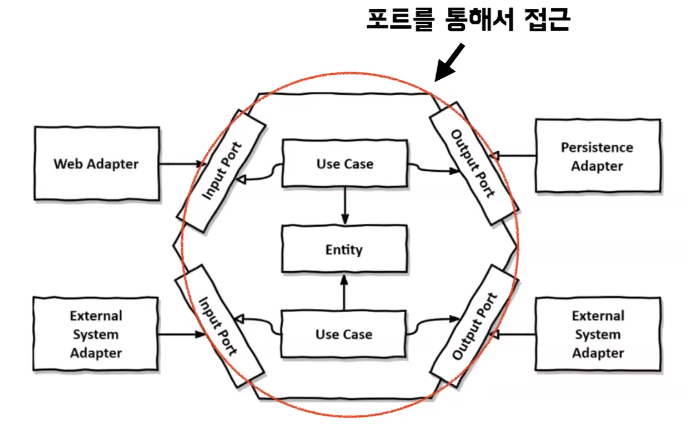
+ 헥사고날 아키텍처의 가장 중요한 핵심은 외부 요소와 핵심 비즈니스 로직이 소통할 때 포트를 통해서 간접적으로 통신해야 한다는 점이다
+ 헥사고날 아키텍처의 특징은 클린 아키텍처의 특징과 대부분 일치하게 된다
+ 특징
  + 큰 비즈니스 가치를 가지고 있는 도메인 모델에 큰 관심
  + 레퍼런스가 클린 아키텍처에 비해 많다 
  + 단점: 포트와 어댑터를 구성하고 관리하는데 복잡성이 따른다 
  + 단점: 도메인에 라이브러리를 직접 활용하기 어렵다, 라이브러리에 특화된 기능을 사용하기 힘들 수 있다

### 도메인 모델 (Domain Model)
+ 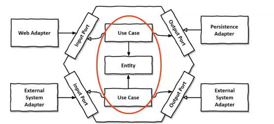
+ POJO로 이루어진 Entity와 Use Case는 클린 아키텍처의 Entity와 Use case와 유사하다 
+ 어플리케이션의 핵심 기능, 비즈니스 규칙 등을 캡슐화한다

### 포트 (Port)
+ 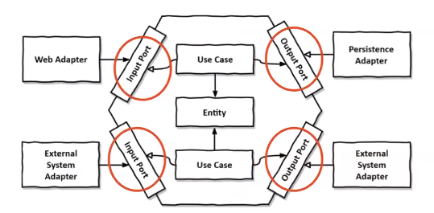
+ 포트는 도메인 모델과 외부 통신 인터페이스를 정의한다
+ Use case에서 포트를 구현하거나 Use case에서 포트를 호출해 외부 요소와 통신을 할 수 있다

### 어댑터 (Adapter)
+ 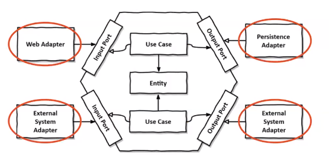
+ 어댑터는 외부 요소를 직접 다루는 부분이다
+ 라이브러리나 프레임워크에 종속적인 코드는 모두 여기에 들어가게 된다
+ 포트를 구현하기도 하고 포트를 통해 Use case를 직접 호출하기도 한다
+ 특정 포트에 연결되어 외부와 도메인간 통신을 가능하게 한다 = 외부요소(웹 요청, 데이터베이스 등)와 실제 통신이 발생 

### 헥사고날을 다른 방식으로 보는 방법

#### 입력포트 & 어댑터
+ 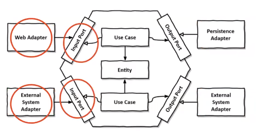
+ 입력포트는 동작을 유발하는 외부 요청을 처리
+ Use case를 호출하는 입력 포트 입력 어댑터라고 볼 수 있다

#### 출력 포트 & 어댑터
+ 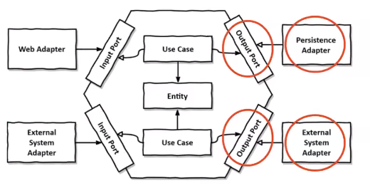
+ 출력포트는 동작의 결과를 외부로 전달
+ Use case로부터 호출되어 외부에 결과를 전달하는 것들을 출력 포트, 출력 어댑터라고 볼 수 있다

### 자세히
+ 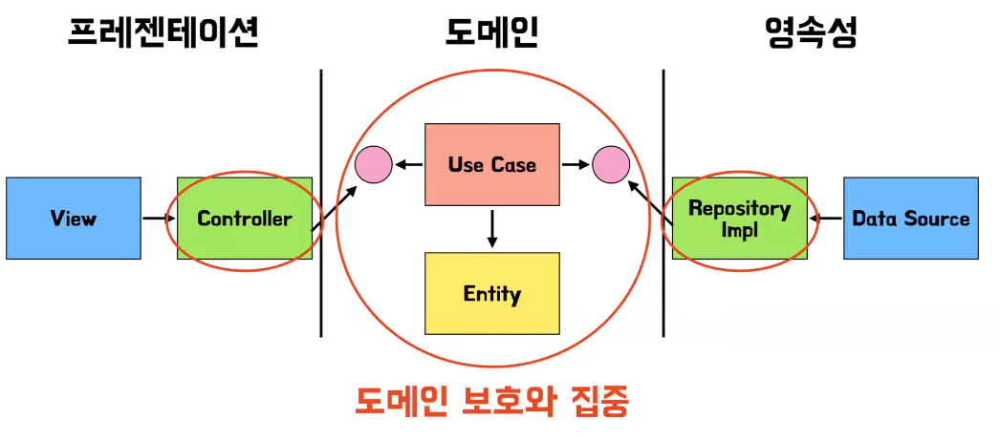
+ 동그라미 친 부분은 외부 라이브러리와 프레임워크를 연결하는 부분을 담당하는 어댑터
+ 핑크색 동그라미는 포트
+ 컨트롤러에서는 포트만 접근할 수 있고 이를 통해서 Use Case를 호출한다
+ Use Case 에서는 도메인 쪽에 구현되어 있는 Repository 포트를 통해서 결과를 보장한다 
+ 이 과정을 통해서 도메인을 POJO로 유지할 수 있고 외부 라이브러리나 프레임워크의 변화로부터 도메인을 보호할 수 있다

### 헥사고날 아키텍처 어떻게 적용할까?  
+ 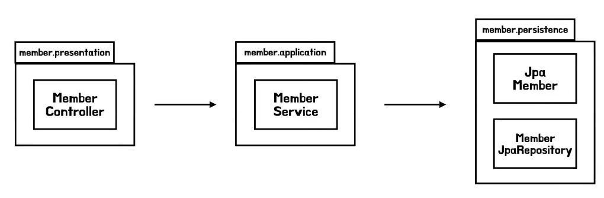
+ 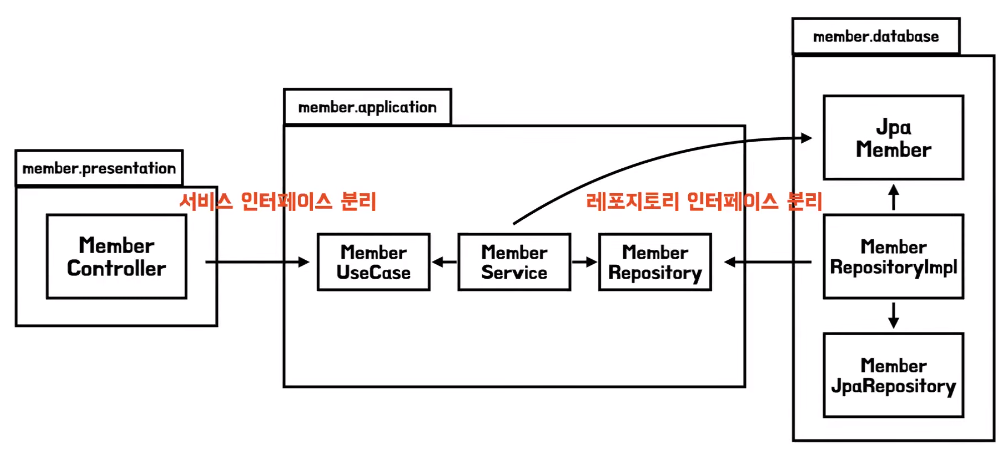
+ 가장 처음 해야 하는 작업은 서비스와 레포지토리의 메서드를 인터페이스로 추출하는 것이다
+ 메서드를 추출해서 MemberUseCase를 만들고 MemberJpaRepository의 메서드들을 추출 해서 MemberRepository 인터페이스를 만든다
+ 지금은 애플리케이션 패키지와 데이터베이스 패키지가 양방향 의존성을 가진다
+ 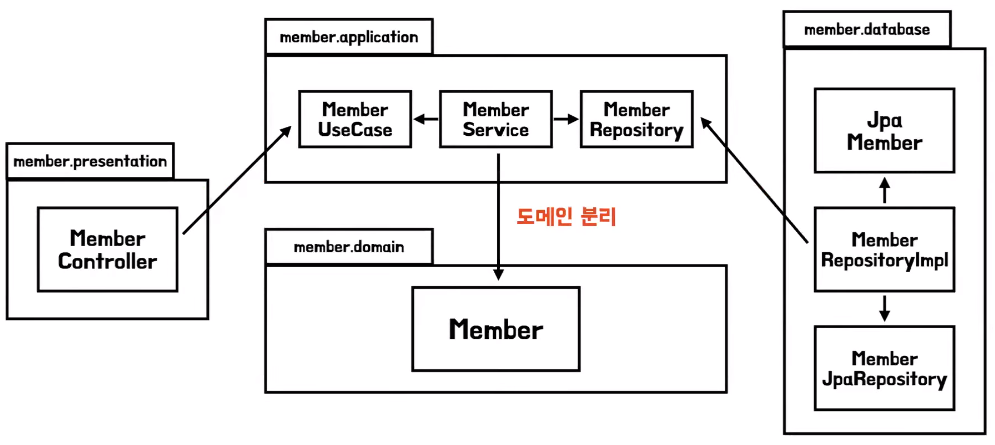
+ 다음 작업으로는 도메인 분리를 해야 한다 JPA Member를 서비스에서 직접 사용하지 않고
  도메인의 Member를 따로 구현하여 서비스에서 이를 의존하도록 바꿔 패키지간 양방향 의존성을 끊을 수 있다
+ 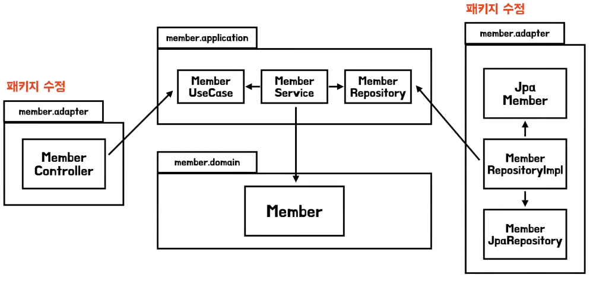
+ 마지막으로 패키지 네이밍만 바꾸면 헥사고날 아키텍처로 바꾸는 작업이 끝이 난다

### 패키지 구조 

#### 레이어드 아키텍처
+ 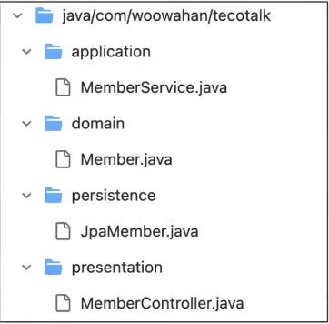

#### 헥사고날 아키텍처
+ 

#### 얼마나 증가 했나요
+ 패키지를 보시면 느낄 수 있으지만 딱 봐도 복잡해 보인다
+ 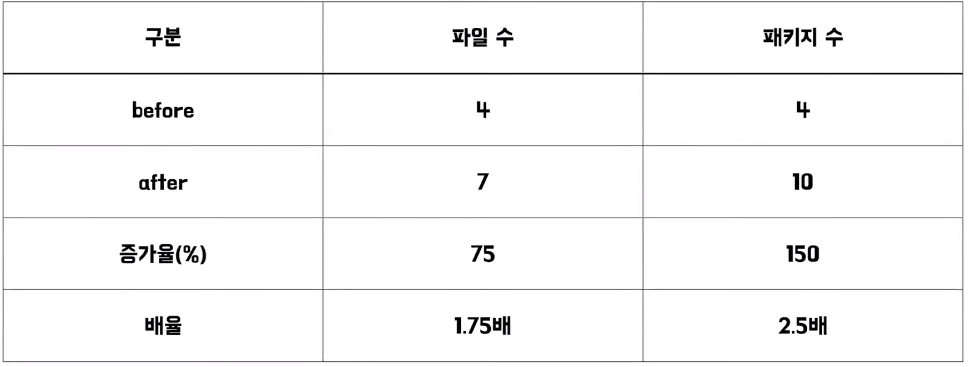
+ 예시와 같은 간단한 프로젝트의 경우에 패키지는 4개에서 10개로 2.5배가 늘어나는 것을 볼 수 있다
+ 규모가 더 커진다면 
  + 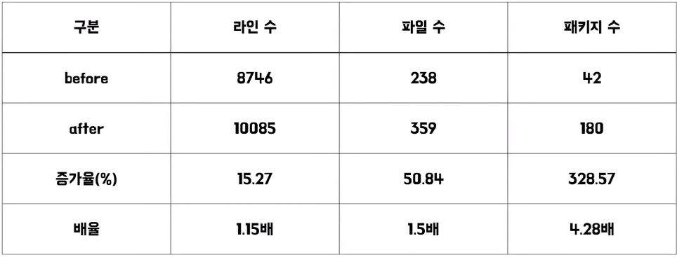
  + 라인은 1.15배 파일은 1.5배 패키지 수는 4.28배 만큼 늘어나는 것을 확인할 수 있다
  + 특히 패키지 수가 더 많이 늘어나는 것을 확인 할 수 있는데 확실히 레이어드 아키텍처와 비교해서 코드 양과 복잡도가 높아지는 것을 확인할 수 있다

## 클린 아키텍처를 적용하면 항상 좋은가?
+ 당연하지만 어떤 아키텍처도 완벽하지 않다
+ 의존 관계가 그렇게 복잡하지 않다면 그냥 레이어드 아키텍처를 통해서 구현하는 것이 훨씬 좋은 해결책이 될 수 있다

### 이럴 때 고려해 보자
+ 대규모 프로젝트를 진행할 때
  + 의존 관계가 복잡하지 않다면 소규모 프로젝트에서는 간단하게 구현하는 것이 훨씬 좋을 수 있다
+ 프로젝트의 일원 모두가 클린 아키텍처를 다 이해하고 그 필요성에 대해서 동의를 할때
+ 외부 요소의 변화가 잦아 변경을 미리 고려할 때
