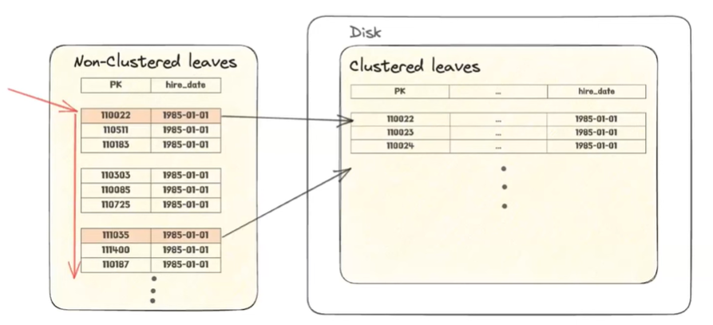
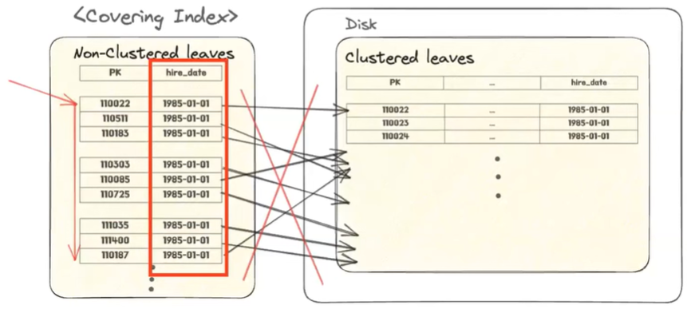

# 모디의 MySQL의 실행 계획
[https://youtu.be/usEsrsaSSuU?si=uZjPPuzUvOYW1RPa](https://youtu.be/usEsrsaSSuU?si=uZjPPuzUvOYW1RPa)

# 모디의 MySQL의 실행 계획
* toc
{:toc}

## 실행 계획이란?
+ 
+ MySQL 서버에 요청을 보내게 되면 MySQL 엔진이 4가지 과정을 거쳐서 응답을 보내 주게 된다
+ 실행 계획은 이 옵티마이저와 관련이 있는데 옵티마이저는 통계 정보를 기반으로 여러 방법들의 비용을 계산을 하게 된다 그 중에 가장 비용이 적은 처리 방식을 최종적으로 선택한다 
+ 그래서 한 줄로 설명을 하면은 옵티마이저가 쿼리를 어떻게 처리할 것인지에 대해서 계산해낸 결과라고 볼 수 있다

## 어떻게 확인하나요?
+ 보내고자 하는 SQL 쿼리 앞에다가 explain, explain format=tree, explain ayalyze 같은 명령어를 추가적으로 붙이기만 하면 된다
+ 

## 왜 확인하나요?
+ 우리의 의도대로 MySQL 동작하는지 점검한다
+ 성능 병목이 있는 부분을 해소한다 (인덱스, 쿼리, 시스템 변수 튜닝...)

## 실행 계획 분석하기 
+ 

### Type - const
+ 
+ const라는 타입은 테이블의 PK를 사용해서 검색하는 경우에 발생한다
+ 실행 이전에 결과가 한 건 이하임을 무조건 예츨할 수 있는 쿼리 

### Type - ref 
+ 인덱스를 사용한 동등 비교를 하는 경우에 나타나게 된다 (PK, UNIQUE, NOT NULL 아님)
+ PK나 UNIQUE NOT NULL 같은 게 아닌 인덱스로 검색을 하게 되면은 여러가지 결과물이 나올 수 있다
+ 
+ 
+ 인덱스 컨디션을 사용한다는건 스토리지 엔진이 디스크에 있는 정보를 가져올 때 전부 다 가져 오는 게 아니라 부서-사원 테이블에서 부서번호가 d005인 것만 한정적으로 필터링을 해서 가져온다는 뜻 이러면은 전체 다 가져 오는 것보다
디스크 I/O가 적게 일어나기 때문에 효율적으로 select 절을 처리할 수 있게 된다
+ 

### Type - range
+ 인덱스를 사용해서 범위 검색을 할 때 나타난다
+ 
+ 앞에서 걸어 준 인덱스가 여기 키라는 컬럼에 표시가 되고 type은 range가 나오면서 아까 같이 인덱스 컨디션
  인덱스 컨디션 푸시 다운이라고도 얘기하는데 동일한 방식으로 스토리지에서 데이터를 RAM으로 가져올 때 필터링을 거쳐서 범위 검색을 통해서 가져온다

### Type - eq_ref
+ 테이블에 PK 혹은 UNIQUE NOT NULL인 컬럼 인덱스를 사용하면 하나로 바로 특정이 되는 칼럼을 동등 비교를 사용해서 조인하는 경우에 나타난다
+ 
+ 부서-사원 테이블에서 먼저 ref를 사용 해서 인덱스를 사용해서 필터링을 거쳐서 데이터를 가져온 다음에 사원 테이블을 참고 하겠다 이 때 사원 테이블을 볼때는 eq_ref라는 type으로
  PRIMARY key를 사용해서 검색을 한다
+ 
+ 먼저 부서-사원 테이블 통해서 dept_no 그러니까 부서 번호가 d005인 결과들을 필터링을 거쳐서 가져온 다음에 사원 번호를 이제 employee 테이블에 가서 PK를 활용해서 바로 한 번에 검색을 할 수가 있게 된다
+ 
+ explain analyze 명령어의 결과를 보면은 index lookup on d using dept_no라고 써있는데 부서-사원 테이블에 부서 번호라는 인덱스를 활용 그 중에서 d005라는 부서 번호로 필터링을 걸겠다 그 다음에 이게 한 33만 개 정도의 데이터가 있는데
  이 중 이것을 한 번에 루프로 쭉 순회를 하면서 그 중에 조건에 맞는 85,000개 정도의 결과물들을 가져 왔다
+ 
+ 그 다음 줄에는 Single-row index lookup on e라고 나와 있는데 PRIMARY key를 참조를 하기 때문에
  한 번에 검색해서 하나의 결과를 바로 찾아 낼 수가 있다 사원 테이블에서 그 과정을 앞에서 나왔던 85,000개의 결과에 대해서 모두 반복을 하게 된다
+ cost가 0.25라고 나와 있는데 이 cost는 MySQL에서 메모리에 저장되어 있는 페이지를 한번 액세스를 할 때 MySQL이 추산하는 비용인데 이런 식으로 비용도 참고할 수 있다

### Type
+ 
+ 4개의 타입들에 대해서는 일반적으로 MySQL이 인덱스를 활용해서 빠르게 처리를 할 때 나타나는 타입들이라고 알려져있어서
  이런 결과물들에 대해서는 보통 걱정을 많이 안 해도 된다
+ index랑 all 대해서는 조금 더 주의깊게 사용을 해야 된다

### Type -index (Index Full Scan)
+ 
+ 인덱스에는 clustered 인덱스와 non-clustered 인덱스가 있다 그 중에서 non-clustered 인덱스의 leaf들을 순차적으로 쭉 순회하는 방식이 index full scan이다 
+ 사실 이걸 순회하는 것 자체는 문제가 없는데 만약에 non-clustered에 있지 않은 정보를 추가적으로 디스크에 찾아가서 그 레코드를 하나로 검색을 해서 다른 컬럼들도 참조를 해야 되는 경우에는
  중간에 디스크 I/O가 발생하게 된다 이게 몇 개만 필터링돼서 디스크 I/O가 몇 개 없는 경우에는 상관이 없는데 디스크 I/O가 많이 일어나면은 여기서 성능 병목이 크게 발생할 수 있으니까 주의를 해야한다 
+ 
+ index란 타입이 괜찮은 경우는 non-clustered 인덱스의 리프들을 쭉 확인을 했을 때 필터링이 다 걸려서 몇 개만 디스크 I/O가 발생하는 상황일때
+ 
+ 아예 커버링 인덱스를 사용해서 non-clustered 이 leaf만으로 조회 쿼리를 처리할 수 있는 경우에는 디스크 I/O가 중간에 추가적으로 많이 발생하지 않기 때문에 사용해도 괜찮다

#### Covering Index
+ 
+ select * from employees를 해서 조회를 하는 MySQL이 type ALL 그러니까 모든 테이블 살펴보면서 테이블 풀 스캔이 일어나면서 조회를 하게 된다
+ 
+ 반면에 hire_date 인덱스를 걸어놨던 타입에 한정해서 컬럼에 한정해서 검색을 하게 되면은 타입이 인덱스로 바뀌면서
  Using index 라는 게 Extra 컬럼에 뜨게 된다 이게 바로 커버링 인덱스를 쓴다는 의미인데 이 경우에는 hire_date만 커버링 인덱스를 사용해서 가져오면 되기 때문에 약 다섯 배 정도의 속도 차이가 나타된다 
+ 더 늘어나거나 아니면 컬럼이 더 다양해지면은 이 결과의 차이가 수십 배까지도 날 수 있다
+ 

### Type - ALL (Table Full Scan)
+ 테이블이 작아서 키를 찾아보는게 오히려 손해인 경우들이 있다 (~10줄 or 짧은 row)
+ 조건절이 인덱스 관련한 조건을 걸기는 했는데 유의미하게 인덱스를 활용할 수 없는 경우들도 있다
+ 인덱스를 활용해도 전체 레코드의 너무 많은 부분을 탐색하는 경우 (20~30%) 
+ 인덱스가 걸린 칼럼의 카디널리티 자체가 너무 작아서 인덱스가 좀 무의미한 경우
+ 
+ MySQL에서는 연속적으로 디스크 I/O가 발생하는게 비용의 손해가 크니까 이거를 Read-Ahead라는 방법으로 조금이나마 최적화를 해주고 있다
+ Read-Ahead를 사용을 하면은 처음에는 페이지를 하나씩 들고 오다가 그 다음에는 두 개씩 네 개씩 들고 하는 방식으로 많은 페이지를 한번에 들고옴으로써 디스크 I/O를 조금이나마 줄여주고 있다

## 실행 계획 수립은 싼 작업이 아니다
+ MySQL은 수립한 실행 계획을 커넥션 내에서만 캐싱하고 재사용을 한다 그래서 다른 커넥션으로 자기가 똑같은 쿼리를 보내도 MySQL은 새로운 실행 계획을 또 계산을 해야된다 
+ 이 과정에서 옵티마이저는 직접 인덱스를 몇 개를 탐색해서 샘플링을 하게 되는데 이걸 Index Dive라고 한다
+ 근데 우리가 보낸 쿼리의 조합이 굉장히 다양하고 많은 인덱스를 사용해야 되는 경우에는 실행 계획을 수립 하는 과정에서 굉장히 비용이 많이 소요 된다 그래서 심지어는 쿼리 자체를 직접 수행하는 것보다 실행 계획을 수립하는데 리소스가 많이 들기도하고
  실행 계획 수립에는 할당된 시스템 메모리가 정해져 있는데 이 메모리를 초과해서 실행을 수립하다가 말고 그거를 이제 실행 계획 수립 자체를 포기하는 경우들이 생긴다
  그래서 풀 테이블 스캔을 하는 경우들이 종종 존재한다 
