# 홍고, 제이미의 무중단 배포 
[https://youtu.be/8sstaLbEBTY?si=BDvUf8IX0MmirbrN](https://youtu.be/8sstaLbEBTY?si=BDvUf8IX0MmirbrN)

# 홍고, 제이미의 무중단 배포
* toc
{:toc}

## 무중단 배포란?
+ 서비스를 중단하지 않고 배포를 진행하는 것
+ 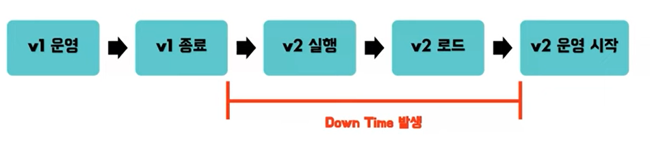
+ 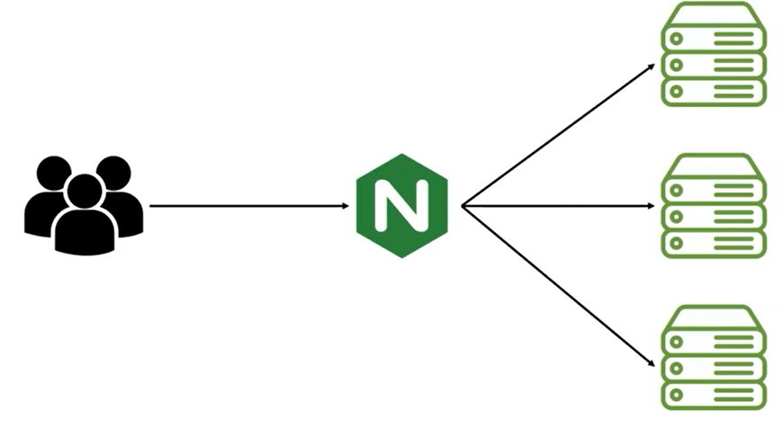
+ 로드 밸런서를 이용해서 두 개 이상의 서버, 혹은 포트를 통해서 트래픽을 조절해 배포를 진행하게 되는데 배포 방식이 서비스에 영향을 주어선 안 되기 때문에 고가용성의 인프라를 구성해야 한다

## 무중단 배포 방식의 종류
+ Rolling 배포 방식
+ Blue / Green 배포 방식
+ Canary 배포 방식

### Rolling 배포 방식
+ 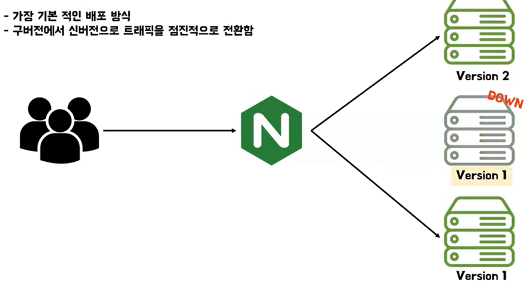
+ 첫 번째 서버에 클라이언트들이 요청을 보내면 안 되기 때문에 로드밸런서와의 연결을 끊어 준다
+ 그리고 서버를 다운시켜 버전 2로 업데이트를 하고 다시 배포를 진행하게 된다
+ 그 동안 클라이언트들의 요청은 두 번째 서버와 세 번째 서버에서 수용하고 있다 
+ 첫 번째 서버에서 배포가 완료된다면 로드 밸런서와 다시 연결을 수행해서 해당 서버에서 클라이언트들의 요청을 받을 수 있도록 하고 그리고 나머지 서버도 동일하게 이 과정을 거쳐 모든 서버가 버전 2로 배포되는 것이 Rolling 배포 방식

#### 장단점
+ 장점
  + 서버의 자원이 많이 필요하지 않다
  + 점진적으로 배포를 진행하기 때문에 상황에 따라서 롤백이 가능
+ 단점
  + 배포 중에 서버가 한 대씩 다운되기 때문에 인스턴스가 감소되어 이 때의 처리량을 고려해야 할 필요가 있다
  + 배포 중 구버전과 신버전이 공존되어 사용되기 때문에 호환성에 문제가 발생할 수도 있다

### Blue / Green 배포 방식
+ 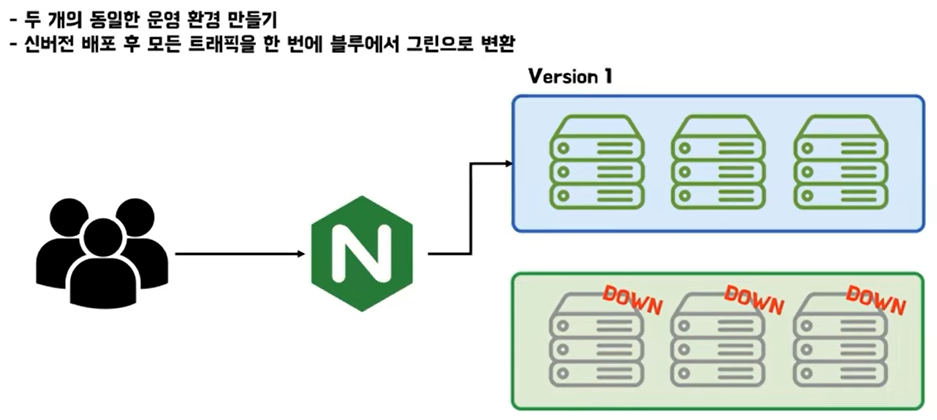
+ Blue란 운영 중인 구버전을 의미하고 Green은 새롭게 배포할 신버전을 의미
+ Blue/Green은 운영 환경과 동일한 환경의 Green에 새로운 버전을 배포해서 배포가 성공했을 때 트래픽을 한 번에 Blue에서 Green으로 변환하는 방식
+ Blue 환경에서 버전 1으로 서비스가 운영 중인 상태이다
+ 그러는 동안 Green 환경에서는 버전 2의 배포 환경을 구성하게 되고 배포를 진행해 클라이언트의 요청을 받을 준비가 되면 Blue에서 Green으로 로드밸런서를 이용해 한 번에 트래픽을 변환하게 된다
+ 그리고 Blue 환경은 더 이상 사용하지 않기 때문에 다운시켜 연결을 끊어준다

#### 장단점 
+ 장점
  + 빠른 롤백 가능
  + Rolling과 반대로 두 버전이 공존하는 일이 없기 때문에 호환성 문제가 따로 발생하지 않는다
  + 운영 환경에 영향을 주지 않고 실제 운영 환경과 동일한 환경에서 신버전에 대한 테스트가 가능하다
+ 단점
  + 단점으로는 운영 환경이 동일한 환경으로 2가지가 필요하기 때문에 시스템 자원이 2배가 필요하다

### Canary 배포 방식
+ 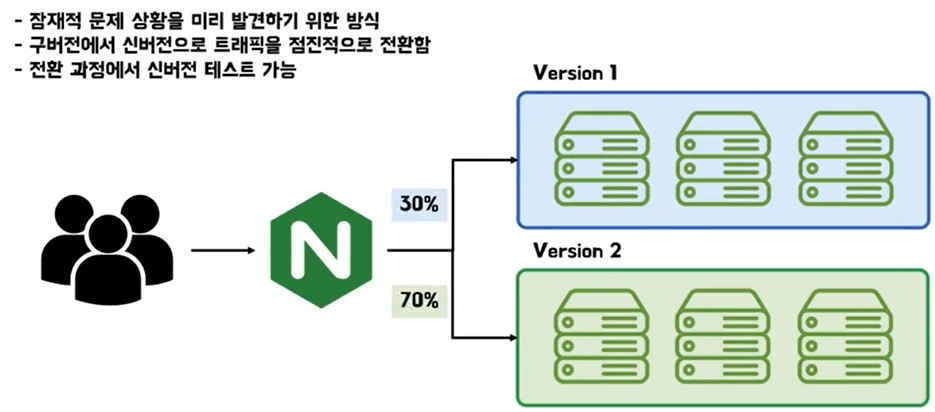
+ 현재 모든 서버에서 버전 1으로 서비스를 운영 중에 있다
+ 버전 2로 릴리즈가 필요하다면 일부 서버를 다운시켜 버전 2로 업그레이드를 한 후 테스트를 통해 문제가 없다고 판단될 시 배포를 수행해 일부 사용자들에 대한 트래픽만 신규 버전에 대한 요청으로 응답을 하도록 하게 된다
+ 이 때 모니터링을 통해 문제가 없고 정상적으로 작동하는 것이 판단된다면 점차 신버전에 대한 요청 비율을 늘려가게 된다 
+ 이 과정을 100%가 될 때까지 진행을 하고 100%인 상황에서도 문제가 없다고 판단될 시 구버전에 대해서도 신버전으로 업그레이드하여 다시 배포를 진행해 클라이언트의 요청을 분산시켜 준다

#### 장단점
+ 장점
  + 빠른 롤백이 가능
  + 단계적으로 배포를 진행하기 때문에 문제 상황을 빠르게 감지할 수 있다
  + A/B 테스트가 가능
    + A/B 테스트란 기존 서비스와 새로운 서비스를 직접 비교해서 새로운 서비스가 실제로 효과가 있었는지에 대해서 확인하는 테스트
+ 단점
  + 배포 중에 Rolling과 동일하게 구버전과 신버전이 공존해 있는 상황이 발생해서 그 때 호환성 문제가 발생할 수다

## Blue / Green을 이용한 무중단 배포 실습

### 무중단 배포 구현 방법
+ 무중단 배포를 구현하는 방법은 여러 가지 방법이 있다 AWS Code Deploy를 사용할 수도 있고 Kubernetes를 활용할 수도 있다 
+ Nginx를 활용해서 무중단 배포를 구현할 수도 있다
+ 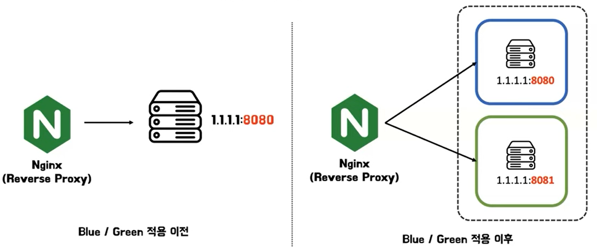

### Nginx - proxy pass 설정
+ 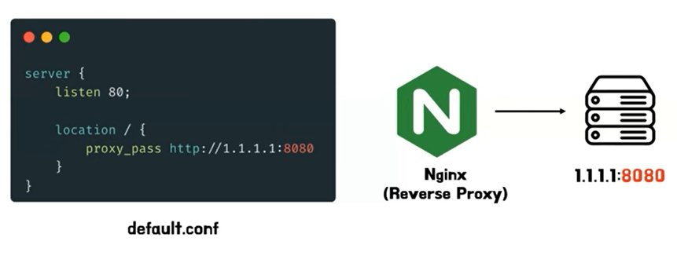
+ 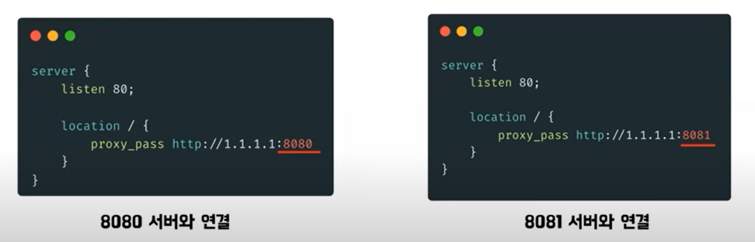
+ 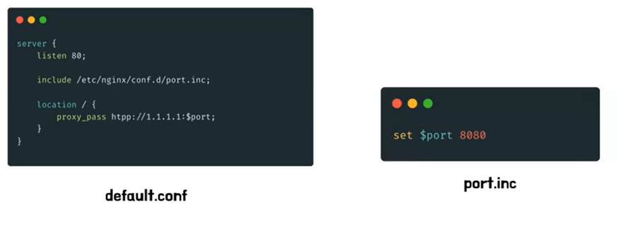
  + port.inc라는 파일을 사용해서 외부에서 주입받을 수 있도록 변경 
  + port.inc 파일같이 inc 파일은 include라는 명령어와 함께 사용되는 파일
  + 자주 사용되는 헤더나 메서드 등을 주입받아 오기 위해서 사용
  + port.inc 파일의 내부를 보면 port라는 변수를 초기화

### Blue / Green 시나리오
+ 첫 번째로 8080 서버와 8081 서버 중 어떤 것이 Blue 서버이고 어떤 것이 Green 서버인지를 판별
+ 서버 판별이 되었다면 Green 서버에 새로운 버전의 애플리케이션을 배포
+ 이후 애플리케이션이 잘 배포되었는지 확인하기 위해서 Green 서버에서 헬스 체크를 수행
+ 헬스 체크가 성공했다면 Nginx 설정 파일을 통해서 Nginx와 연결된 오리진 서버를 Blue 서버에서 Green 서버로 변경
+ 이후 사용하지 않는 Blue 서버는 종료

#### 백엔드 서버 헬스 체크
+ 서버 헬스 체크를 위해 Spring boot actuator를 사용
+ Spring boot actuator는 애플리케이션 모니터링을 도와주는 모듈
+ 이 모듈을 사용해서 서버 헬스 체크를 쉽게 할 수 있다
+ Gradle을 사용해서 spring boot actuator를 설치하면 Spring Boot의 application.yml 파일에서 헬스 체크를 확인할 엔드포인트를 지정할 수 있다
+ 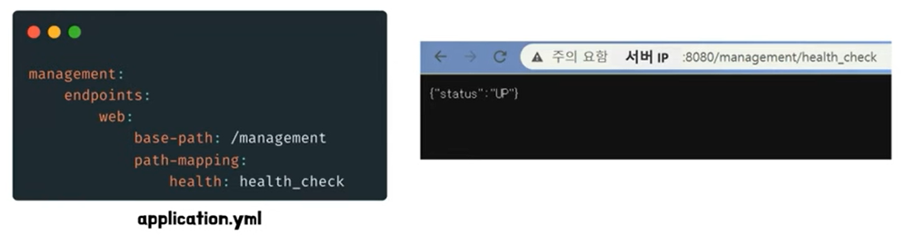

#### 블루 서버와 그린 서버 판별
+ 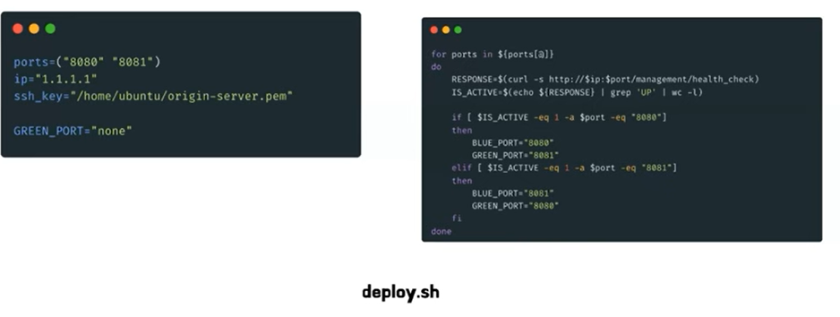
+ 왼쪽 이미지에서는 배포 스크립트에서 사용할 변수들을 초기화
  + 포트 대역과 IP, pem key가 위치한 경로 등을 초기화
  + GREEN_PORT를 초기값으로 none을 할당
+ 오른쪽 이미지는 8080 서버와 8081 서버 중 어떤 것이 Blue 서버이고 어떤 것이 Green 서버인지를 판별하는 로직
  + 포트 배열을 차례차례 for문으로 돌면서 해당 서버의 port에 curl 명령어를 사용해서 요청을 보낸다 
  + 이때 이 요청은 앞서 Spring boot actuator로 설정했던 엔드포인트인 management/health_check로 보내게 된다
  + 만약 서버가 켜져있다면 RESPONSE에는  {"status": "UP"}이라는 응답이 들어오게 된다
  + 만약 이 RESPONSE라는 응답 안에 "UP"이라는 문자가 존재하면 IS_ACTIVE 값을 1로 변경 즉 서버가 켜져 있다면 IS_ACTIVE는 1로 설정되게 된다
  + 이후 아래 if 문에서 IS_ACTIVE가 1일 때 포트가 어떤 포트인지에 따라 BLUE_PORT와 GREEN_PORT를 지정해주었다
  + IS_ACTIVE가 1일 때 포트가 8080이라면 현재 8080 포트의 서버가 켜져 있다는 의미 즉 BLUE_PORT는 8080이 되고 나머지 포트인 8081은 GREEN_PORT로 지정
  + 마찬가지로 IS_ACITVE가 1일 때 포트가 8081이면 BLUE_PORT를 8081로 GREEN_PORT를 8080으로 설정해 주었다
+ 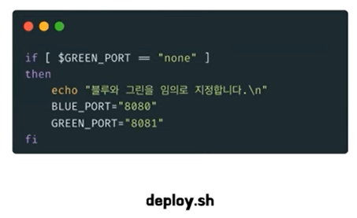
  + 만약 8080 포트와 8081 포트가 전부 꺼져있다면 어떤 if 문에도 들어가지 못해 GREEN_PORT는 처음에 초기화해주었던 값인 none이 그대로 들어있는 상태일 것이다 이 경우에는 서버에 아직 아무것도 배포가 되지 않은 초기의 상태로 간주하고
     BLUE_PORT와 GREEN_PORT를 임의로 지정
+ 
  + GREEN_PORT는 아직 사용되고 있지 않는 서버이므로 GREEN_PORT의 서버가 꺼져 있는지를 검증하는 코드를 추가
  + IS_ACTIVE가 1이라면 현재 GREEN_PORT가 켜져 있다는 의미이므로 비정상적인 상황으로 간주하고 즉시 스크립트를 종료
  + IS_ACTIVE가 1이 아니라면 서버가 꺼져 있는 상황이므로 배포를 이어서 진행

#### 그린 서버에 신버전 배포
+ 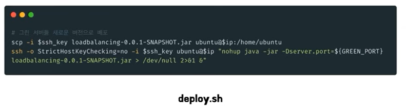
+ Nginx 서버는 Jenkins를 통해서 새로 배포할 애플리케이션의 jar 파일을 받아온 상태 scp 명령을 사용해서 Nginx에 있는 jar 파일을 오리진 서버로 복사
  복사가 잘 되었다면 ssh 명령어를 사용해서 오리진 서버에서 복사받아온 jar 파일을 실행 이 때 실행할 포트는 GREEN_PORT이다 

#### 그린 서버 헬스 체크 
+ 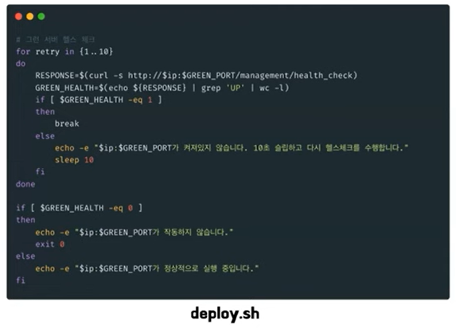
+ 애플리케이션이 실행되는 시간을 받아서 10초의 간격 동안 총 10번의 헬스 체크를 수행 
+ 만약 이 10번의 헬스 체크가 실패하면 예기치 못한 상황으로 인해 Green 서버에 새로운 애플리케이션이 잘 배포되지 않은 것으로 간주하고 스크립트를 중단
+ 헬스 체크가 성공하면 스크립트를 이어서 진행 

#### Nginx 설정 변경
+ 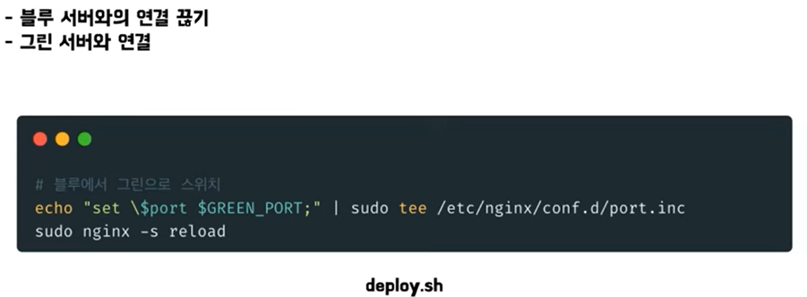
+ Green 서버에 새로운 애플리케이션이 잘 배포되었으니 Nginx와 연결된 오리진 서버를 Blue 서버에서 Green 서버로 변경
+ tee 명령어를 사용해서 port.inc 파일에 있는 port 변수 GREEN_PORT로 업데이트 그리고 업데이트한 port 변수를 proxy_pass에 다시 적용하기 위해 Nginx를 reload

#### 블루 서버 종료
+ 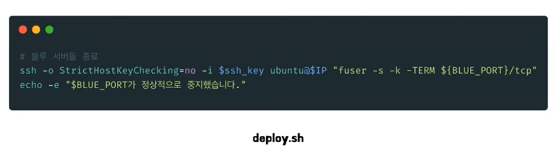
+  Blue 서버는 사용하지 않는 구버전이 있으므로 ssh 명령어를 사용해서 서버를 종료
