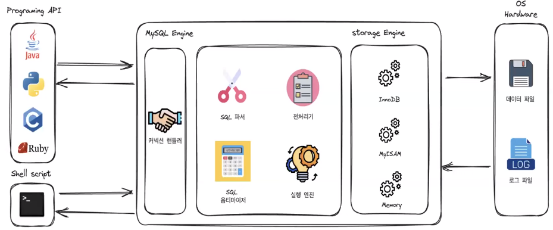

# 아코의 MySQL 아키텍처
[https://youtu.be/w27fZGbtvZ0?si=-B7blD-tUw7dqoDC](https://youtu.be/w27fZGbtvZ0?si=-B7blD-tUw7dqoDC)

# 아코의 MySQL 아키텍처
* toc
{:toc}

## MySQL 서버의 흐름
+ 
+ 흔히 말하는 MySQL은 MySQL 서버이다
+ MySQL 서버 내부는 MySQL 엔진과 스토리지 엔진으로 구분된다
+ 사용자가 프로그램 api나 쉘 스크립트를 통해 MySQL 서버에 요청을 보내게 되면 MySQL 엔진 같은 경우에는 요청을 처리하는 역할을 하고 스토리지 엔진은 이 때 필요한 데이터를 하드웨어에서 가져오는 역할을 한다

## MySQL 엔진 동작
+ 

1. 쿼리 파서 동작
   + 
   + 쿼리 파서가 가장 먼저 동작하게 된다
   + 쿼리 파서는 들어온 요청을 단어 단위의 토큰으로 분리를 한 뒤 문법적 오류를 체크 한다
   + 문법적 오류가 없게 되면은 파서 트리 형태로 구성
2. 쿼리 파서 및 전처리기 동작
   + 
   + 파서 트리 형태가 구성이 완료가 되면은 전처리기가 동작
   + 전처리기 역시 논리적인 오류를 파악하는 것
   + 예를 들면은 레시피 스토리지가 현재 실제로 존재하는 테이블인지 혹은 레시피라는 요리 레시피 테이블 안에 존재하는 것인지 사용자가 레시피 스토리지에 접근이 가능한지를 파악
3. 
