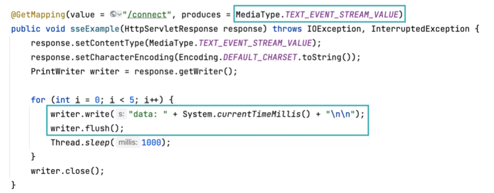
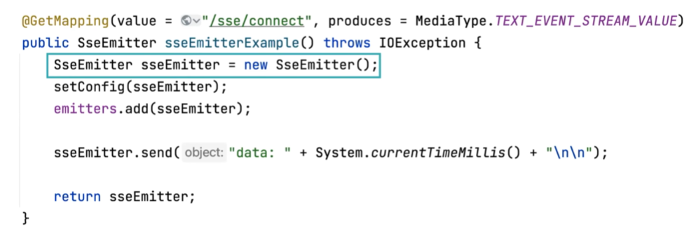
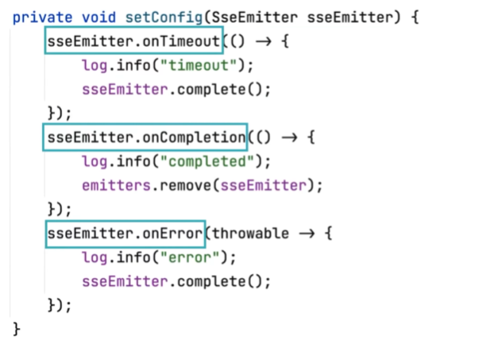
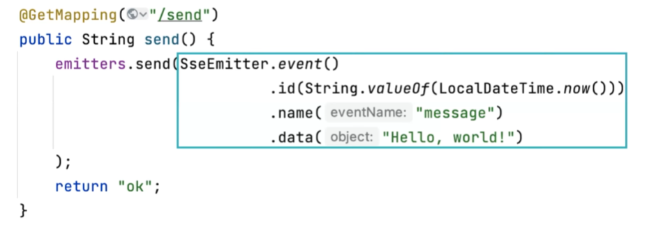

# 주드의 Server Sent Events
[https://youtu.be/Fjj4ZmLlrP8?si=CsgZBqV-CbDGiKNC](https://youtu.be/Fjj4ZmLlrP8?si=CsgZBqV-CbDGiKNC)

# 주드의 Server Sent Events
* toc
{:toc}

## 실시간 통신 방법
+ http 프로토콜에세는  요청이 있어야 응답을 보낼 수 있다
+ 웹 소켓
  + 양방향 통신을 위해 도입된 프로토콜
  + 기존 http 프로토콜 아닌 ws 프로토콜 사용
+ polling
  + 폴링 기법은 클라이언트에서 주기적으로 요청을 보내는 방법 이다
  + 주기적으로 일어나기 때문에 실제로 실시간이 아니다
  + 쓸데없는 요청이 계속 발생해서 서버에 부하가 생긴다 
+ long polling 
  + 클라이언트에서 요청을 보내고 서버에서 응답이 올 때까지 기다린다 서버에서 변화가 생겨서 응답을 보내면 그 즉시 클라이언트에서 다시 요청을 보내고 대기 하는 방법이다
  + 롱폴링은 기존 폴링 방법에 단점을 보완했지만 요청과 응답이 여전히 1대1이라는 점에서 서버에 부하가 발생할 수 있다
+ Server Sent Events
  + 클라이언트에서 단 한번의 요청으로 연결을 지속하고 서버측에서 변화가 생길 때마다 응답을 반복해서 보낼 수 있다
  + 서비스 센트 이벤트에 폴링 보다 나은 점
    + 서버에서 이벤트가 발생할 때마다 실시간으로 메시지를 보낼 수 있기 때문에 실시간성이 훨씬 뛰어나다
    + 폴링 기법 보다 훨씬 적은 통신 횟수를 가지기 때문에 비용적으로 우월하다
  + Server Sent Events가 웹소켓에 비해서 가지는 이점
    + 새로운 프로토콜을 익힐 필요가 없다
    + Server Sent Events는 서버측에서의 단방향 통신을 지원하기 때문에 양방향으로 소통을 하는 웹소켓 보다 비용쪽에서 우월히다

## Server Sent Events
+ 
+ Server Sent Events는 기본적으로 미디어 타입을 text event stream이라는 값을 사용하는데 이 값이 컨텐트 타입 헤더에 들어오게 되면 클라이언트는 Server Sent Events라는 걸 인식하게 되고
  한 번에 응답으로 연결을 끊지 않는다
+ 리스폰스에서 가져온 wirter로 writer.flush()를 할 때마다 클라이언트측에 메시지를 보내게 된다
+ 
+ 이전과 같은 방법으로는 실용적인 구현을 하기 어려운데 스프링에서는 Server Sent Events를 위해 Server Sent Events emitter인 sseEmitter 객체를 지원한다
+ setConfig는 emitter의 특성을 세팅하기 위한 임의의 메소드이다
+ 
+ sseEmitter에서 제공하는 콜백 함수를 지정할 수 있다
+ 순서대로 타임아웃 했을 때 콜백, 완료했을 때 콜백, 에러가 발생했을 때 콜백이다
+ 
+ 레포지토리에 모든 emitter에게 이벤트를 발송하는 메소드
+ sseEmitter는 다음과 같이 이벤트를 발생시키기 위한 정적 메소드를 제공한다
+ 다음에 메서드는 아이디에 로컬데이트타임을 넣어줬고 이름에는 메시지,데이터에는 헬로월드를 넣어 준 모습이다

### 예상되는 문제 
+ emitter 레포지토리는 JVM 메모리에서 작동하기 때문에 컬렉션에서 동시성 문제가 생길 수 있다
  이를 해결하기 위한 방법으로는 스레드세이프한 컬렉션을 사용하는 것이다 예를 들어 ConcurrentHashMap이나 CopyOnWriteArrayList를 사용할 수 있다
+ JVM 메모리를 사용하다 보면 당연히 다중 WAS 환경일 때 문제가 생긴다 세션매니저나 리프레시토큰을 관리 하는 것과 같이 다중 WAS 환경에서 대책을 강구해야 하는데
  Redis pub/sub이라는 구독 발행툴을 사용한다
+ JPA에서 Open In View에 설정은 기본적으로 true인데 이는 트랜잭션 단위가 아닌 세션 단위에서 영속성 컨텍스트를 공유하기 때문에 그 영속성 컨텍스트를 띄워놓는 동안
  데이터베이스의 커넥션을 계속해서 점유하게 된다 따라서 sse를 사용할 때는 Open In View를 필수적으로 false로 설정해야 한다
