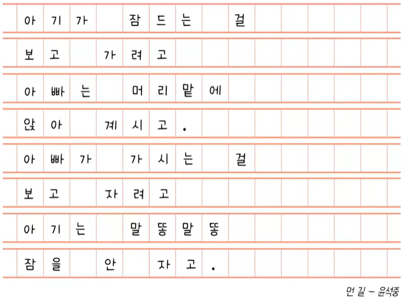
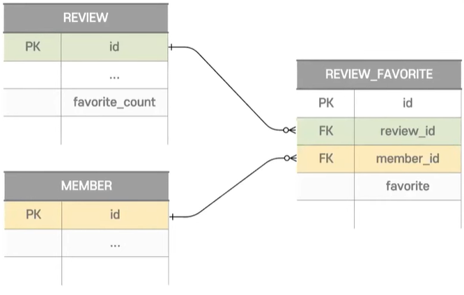
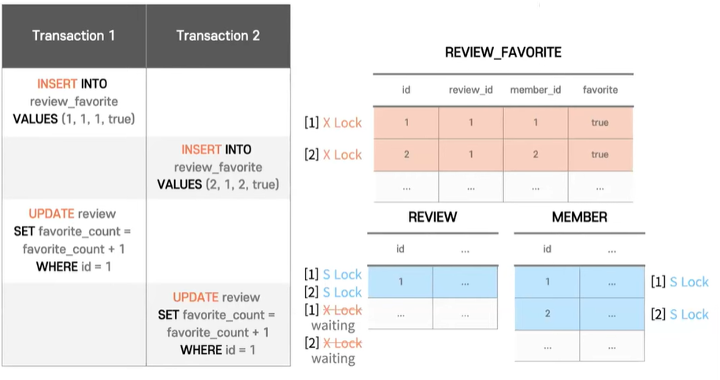
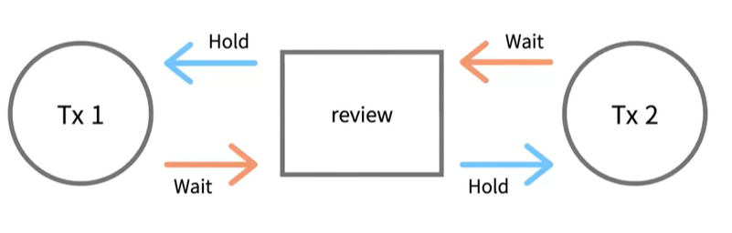
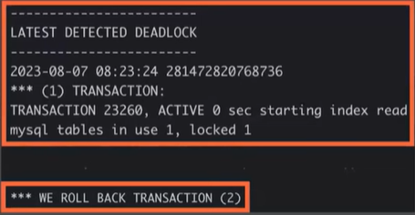

# 망고의 DeadLock
[https://youtu.be/tJauBMXEtJA?si=u1ojVSz-GvX3poZF](https://youtu.be/tJauBMXEtJA?si=u1ojVSz-GvX3poZF)

# 망고의 DeadLock
* toc
{:toc}

## DeadLock
+ 데드락을 우리말로 나타내면 교착 상태 
+ 교착상태 라는 건 서로 다른 둘 이상의 프로세서들이 상대 프로세서가 차지하고 있는 자원을 기다리는 무한 대기 상태 라고 국어사전에 나와있다
+ 
+ 인문학적으로 설명을 하자면 아빠는 아기가 잠자는 걸 보고 가려고 기다리고 있고 대로 아빠가 가는 걸 보고 자려고 기다리고있다

## DeadLock의 발생 조건
+ 상호 배제
  + Mutual exclusion 이라고도 불리는 이 조건은 한 번에 하나의 프로세스만 자원을 사용할 수 있는 상태여야 한다는 뜻이다
+ 점유대기
  + Hold and Wait 라는 말에서 볼 수 있듯이 하나 이상의 자원을 점유한 상태에서 다른 프로세스가 점유하고 있는 자원을 기다리는 상태
+ 비선점
  + 다른 프로세스에 할당된 자원을 뺏을 수 없다는 것이 조건
+ 순환 대기
  + 프로세스들이 순환 형태로 자원을 대기하고 있어야 한다는 것

## 실제 경험 및 예시
+ 
+ 서비스에는 리뷰가 있고 그 리뷰에 사용자들이 좋아요를 누를 수 있다 
+ 1대N 관계로 연관된 3개의 테이블들이 존재 한다 특이사항은 성능 개선 때문에 favorite count라는 컬럼을 리뷰 테이블에 두도록 반 정규화를 진행했다는점이다
+ 
+ 두 명의 사용자가 같은 리뷰에 좋아요를 동시에 누르는 상황이다
+ 첫 번째 사용자가 review_favorite라는 테이블에 데이터를 추가 이때 해당하는 레코드에는 X Lock이 걸리게 된다
  + 이해하기 쉽게 X Lock은 쓰기 Lock, S Lock은 읽기 Lock이라고 가정하고 진행
+ 여기서 review favorite 테이블은 foreign key로 리뷰와 멤버 테이블을 참조하고 있기 때문에 MySQL에서는 락이 전파되고 해당하는 id의 레코드에 읽기 Lock을 걸게 된다
+ 마찬가지로 두 번째 사용자도 동일하게 동작한다 쓰기 Lock을 걸게 되고 읽기 Lock도 전파된다
+ 리뷰 테이블에는 favorite count라는 컬럼이 있다 그렇기 때문에 리뷰 테이블도 업데이트를 해줘야 한다 업데이트 쿼리가 날아가고 리뷰 테이블에 id = 1에 해당하는 레코드에 쓰기 Lock을 걸려고 하지만 
2번 트랜잭션이 읽기 Lock을 걸었던 상태이기 때문에 대기 상태에 빠지게 된다
+ 여기서 2번 트랜잭션도 업데이트 쿼리를 날리게 되면 동일하게 쓰기 Lock을 걸려고 하지만 대기 상태에 빠지게 되고 데드락 상태가 된다
+ 
+ 리뷰 아이디 1번 레코드라는 자원을 두 트랜잭션이 동시에 사용할 수 없으니 상호배제 조건을 만족하고 두 트랜잭션 모두 하나의 자원을 점유하고 있으면서 자원을 다시 대기하고 있는 상태로 점유대기 조건을 만족하고 또한 락이 걸려 있어서
 자원이 필요하다고 한 트랜잭션이 선점할 수도 없고 그림에서도 보이듯이 서로 점유하고 대기 하는 것들이 순환 형태라는 걸 확인할 수 있다 
+ 
+ 이런 경우 mysql에서는 데드락을 감지하게 되고 후순위의 트랜잭션을 롤백 하게 된다 
