# 베베, 허브의 성능 테스트
[https://youtu.be/3cTn53dtzJI?si=O3d_jYtuY3EqVhec](https://youtu.be/3cTn53dtzJI?si=O3d_jYtuY3EqVhec)

# 베베, 허브의 성능 테스트
* toc
{:toc}

## 성능 테스트 소개
+ 성능 테스트를 왜 해야 할까?
  + 클라이언트가 한명이라면 문제없이 작동 하겠지만 클라이언트가 천 명이 동시에 요청한다면 문제가 발생 할 수 있다
  + 성능 테스트를 진행하지 않고 서비스를 배포한다면 처리속도가 저하되거나 서버가 응답하지 않거나 서버에 오류가 발생할 수도 있다
+ 성능 테스트란?
  + api 요청이 많은 상황에서 서버가 어떻게 동작하는지 확인하는 테스트
+ 성능 테스트 필요 이유 
  + 성능 테스트는 가용성 즉, 시스템이 서비스를 정상적으로 제공할 수 있는 상태를 높이기 위해서 실시하는 테스트 (가용성)
  + 목표치를 달성하기 위해 성능 테스트를 진행할 수도 있다 (설정한 목표치 달성)
    + ex) 초당 1000건의 요청 처리 모든 조회 요청을 1초 이내로 응답
+ 성능 테스트 지표 
  + 대표적인 지표로 처리량과 응답시간이 있다
  + 초당 천 건의 요청을 처리하는 부분이 처리량에 해당
  + 모든 조회 요청을 1초 이내로 응답하는 부분 응답 시간에 해당

### 처리량 (Throughput)
+ 처리량은 이제 초당 처리하는 작업의 수를 의미
+ 일반적으로 RPS라는 단위를 사용하는데 이는 Request Per Second의 약자로 1초에 처리하는 http 요청의 수를 의미한다
+ 
+ 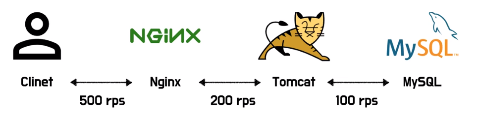
  + 처리량은 서브시스템 중 가장 처리량이 낮은 부분으로 계산할 수 있다
  + 병목 구간: 하위 시스템 중 가장 낮은 처리량을 가지는 부분 (MySQL)
  + 병목 구간을 성능을 개선 하거나 아니면 시스템 확장을 통해 해소를 시킨다면 병목구간이 이동하게 된다
    + MySQL의 처리량을 100 rps에서 300 rps로 높이면 병목구간이 톰캣으로 이동하여 총 시스템의 처리량이 200 rps 된다
  + 만약 병목 구간이 아닌 곳을 성능 개선 시킨다면 전체적인 성능개선에 실패할 수도 있다
    + 예를 들어 병목 구간이 아닌 톰캣의 처리량을 500 rps로 높이면 MySQL의 처리량은 그대로 100rps 때문에 시스템에 전체적인 처리량은 개선이 되지 않는다

### 응답시간 (Latency)
+ 응답 시간은 시스템이 요청을 받고 응답할 때 까지의 시간을 의미
+ 시스템이 요청을 처리할 때까지 대기하는 시간도 응답시간에 포함
+ 
+ 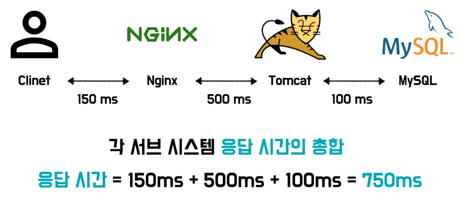
  + 응답 시간은 각 서브시스템 응답 시간에 총합으로 계산할 수 있다
  + 응답 시간의 경우 어떤 부분을 개선하더라도 총 시스템 응답 시간에 영향을 주게 된다
  + 톰캣의 응답시간을 500ms에서 200ms로 개선을 했을 때 시스템의 총 응답 시간이 750ms에서 450ms로 개선된다

### 성능 테스트 지표
+ 처리량은 초당 처리하는 작업의 수를 의미하고 서브시스템 중 가장 처리량이 낮은 부분을 개선하는 것이 필요
+ 응답 시간의 경우 시스템의 요청 처리 시간으로 서브 시스템의 총합이 되기 때문에 가장 긴 부분부터 개선할 수 있을지 고민하는 것이 좋다
+ 상관관계
  + 처리량과 응답시간은 서로 상관관계가 있기 때문에 만약 처리량을 개선한다면 짧은 대기시간으로 응답 시간이 개선될 수도 있고 응답시간을 개선한다면 요청을 빠르게 처리하니 처리량이 개선 될 수도 있다

## 성능 테스트 종류

### 스모크 테스트 (Smoke Test)
+ 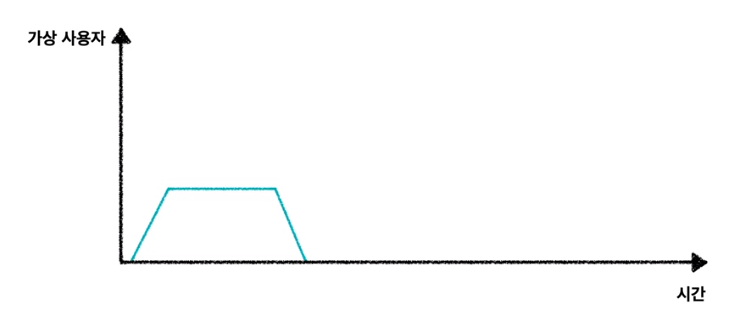
+ 스모크테스트는 최소한의 부하를 주어 시스템이 정상적으로 동작하는지 확인하는 테스트로 부하 테스트를 공격적으로 실시하기 전에 테스트 스크립트가 정상적으로 동작하는지 확인하는 데도 사용

### 스파이크 테스트(Spike Test)
+ 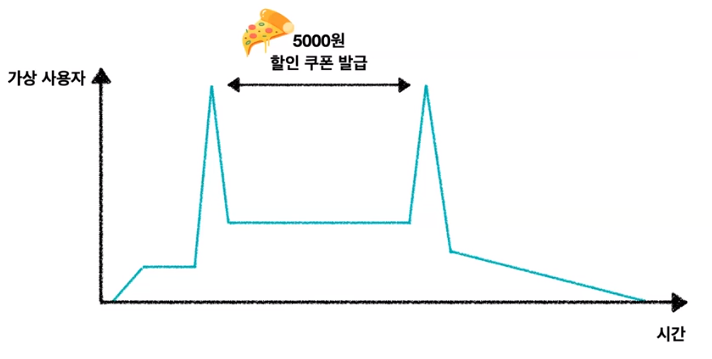
+ 스파이크 테스트는 사용량이 급증하는 상황에서 시스템이 견디고 성능에 문제가 없는지 확인하는 테스트
+ 예를 들어 피자 5,000원 쿠폰을 발급 하는 이벤트가 있다고 가정을 해보면 사용자가 몰릴텐데 스파이크 테스트를 통해서 해당 몰리는 사용자를 시스템이 적절하게 처리하는지 테스트 할 수 있다

### 부하 테스트 (Load Test)
+ 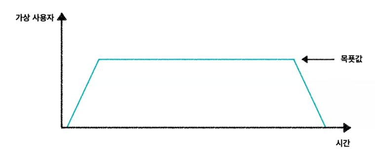
+ 부하 테스트는 가장 일반적인 유형의 테스트이고 목표값에 해당되는 부하를 견딜 수 있을지 확인하는 테스트
+ 예를 들어 시스템의 구성이 변경됐을 때도 이전과 동일한 부하를 견딜 수 있는지 부하 테스트를 통해 테스트를 할 수 있다

### 스트레스 테스트 (Stress Test)
+ 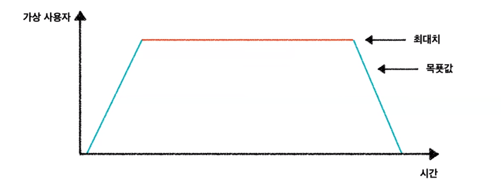
+ 시스템에 최대치에 해당하는 부하를 받았을 때 시스템이 어떻게 동작하는지 확인하는 테스트
+ 스트레스 테스트이 경우 부하테스트 대비 50% 아니면 그 이상의 부하를 주어 테스트를 진행하게 되는데 스트레스 테스트는 부하 테스트를 진행하고 난 뒤에 실시 하는 것이 좋다
  + 왜냐하면 스트레스 테스트를 먼저 진행하게 된다면 병목 구간을 찾기 힘들어 질 수도 있기 때문이다

### 내구 테스트 (Endurance Test)
+ 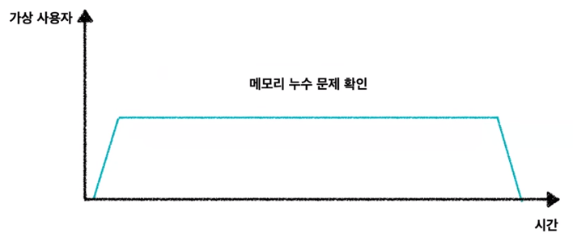
+ 내구 테스트는 이제 평균 사용률로 일정 부하를 지속적으로 주며 시스템이 문제되는 지정을 확인하는 테스트, 흡수 테스트(Soak Test)라고도 한다
+ 메모리 누수 문제와 같이 시스템을 장기간 켜두었을 때 발생하는 문제를 내구 테스트를 통해 확인할 수 있다

### 중단점 테스트 (Breakpoint Test)
+ 
+ 중단점 테스트는 임계 지점을 찾기 위해 부하를 점진적으로 증가시키며 진행하는 테스트
+ 중단점 테스트를 통해 시스템 한계 지점을 파악할 수 있다

### 정리
+ 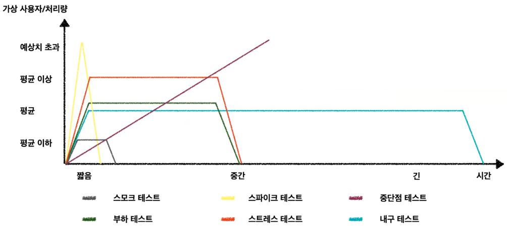

## 성능 테스트 도구
+ 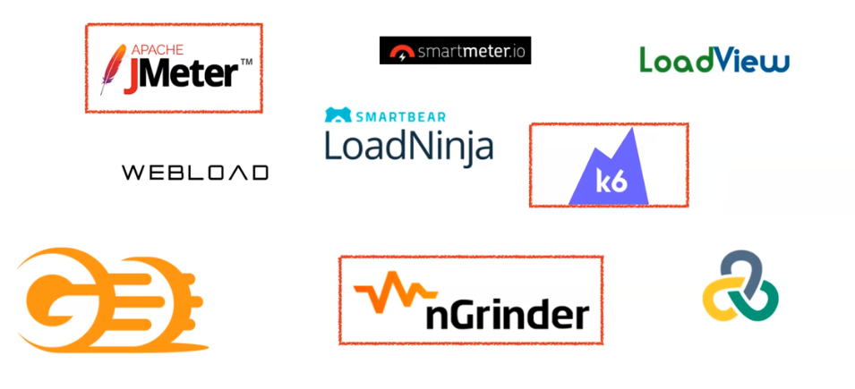
+ api를 하나하나 호출하면서 애플리케이션에 정상적인 부하를 줄 수 없다 그래가지고 수많은 성능 테스트 툴들이 있다

### JMeter
+ JMeter는 아파치에서 만든 오픈 소스 소프트웨어 
+ 1990년대에 나온만큼 굉장히 안정화되고 문서도 많은 오픈소스

+ 장점
  + 잦은 주기의 릴리즈
  + 다양한 프로토콜을 제공
    + 웹 - HTTP, HTTPS
    + SOAP / REST 웹 서비스
    + FTP
    + 데이터 베이스(JDBC 사용)
    + Mail(SMTP, POP3, IMAP)
  + 인텔리제이에서 유용한 플러그인들이 굉장히 많은데 JMeter 역시 스프링과 통합하기 위한 여러 가지 다양한 플러그인들을 제공
+ 단점
  + 애플리케이션 자체가 오래돼서 그런지 문서도 굉장히 오래됐다 복잡한 스크립트도 있고 문서도 가독성이 좋지 않은 문서들이 많다 사용법이나 그래서 가이드에 대해서 좀 찾기가 힘들다
  + JMeter는 한 대의 Worker에서 사용할 수 있는 사용자 수가 한정적이다
    + JMeter의 구조에 따라서 제한이 있는데 JMeter는 단계별 스레드 할당 방식이라고 해서 스레드가 하나 생성될때마다 리소스를 새로 할당 해야한다 그래서 하나의 Worker에서 천 개 이상의 스레드를 할당 하게 되면 조금 무리가 있을 수도 있다
    + GUI와 CLI를 모두 지원
      + 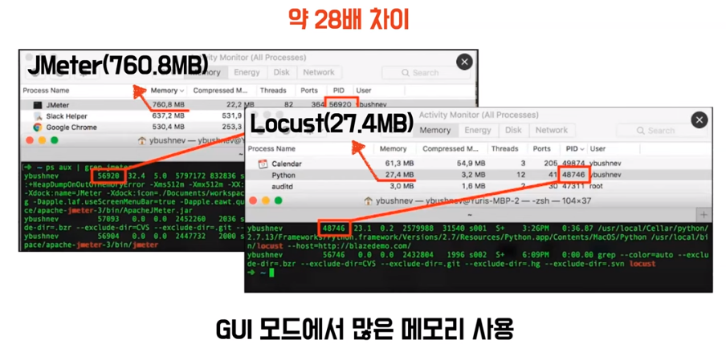 
      + GUI는 단점이 크다 Locust라는 성능 테스트 툴은 27.4MB를 사용하는데 JMeter는 약 760MB를 사용 28배 차이가 난다 
      + JMeter도 이 점을 인지를 하고 성능 테스트를 하는데 GUI를 사용하지 않는 걸 권장한다
  + 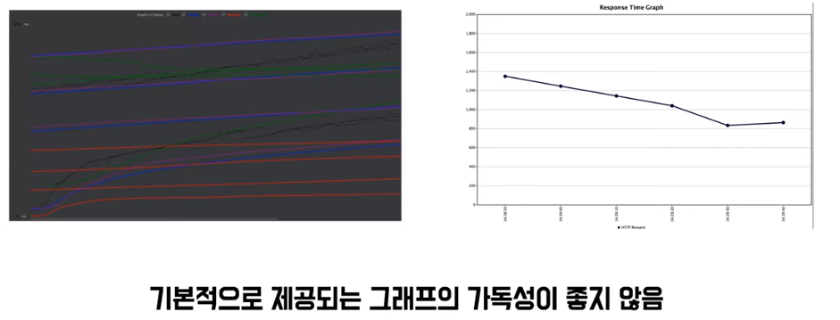
    + 실제로 JMeter의 데이터의 성능 테스트를 진행 하고 나오는 지표인데 기본적으로 제공되는 그래프가 가독성이 굉장히 좋지 않다 
    + 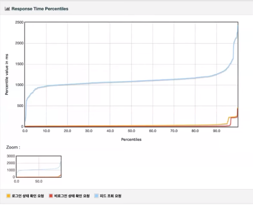
      + 이쁜 그래프를 볼 수도 있는데 이렇게 보려면 html5 변환을 하고 저장하는 과정까지 거쳐야 한다

### K6
+ K6는 Grafana Labs에서 만든 소프트웨어
+ 자바스크립트로 이루어져 있다

+ 장점
  + 깔끔한 공식문서가 있다
    + JMeter 공식 문서 와는 다르게 최신에 만들어져서 굉장히 트렌디하고 보기도 좋다   
  + 비교적 간편한 스크립트를 가지고 있다
    + K6는 자바스크립트로 스크립트를 작성 하기 때문에 JMeter와 같이 xml로 작성하는 것보다 훨씬 간편하고 IDE만 있으면 언제 어디서든 테스트 해 볼 수 있다
  + 메모리를 굉장히 효율적으로 사용
    + 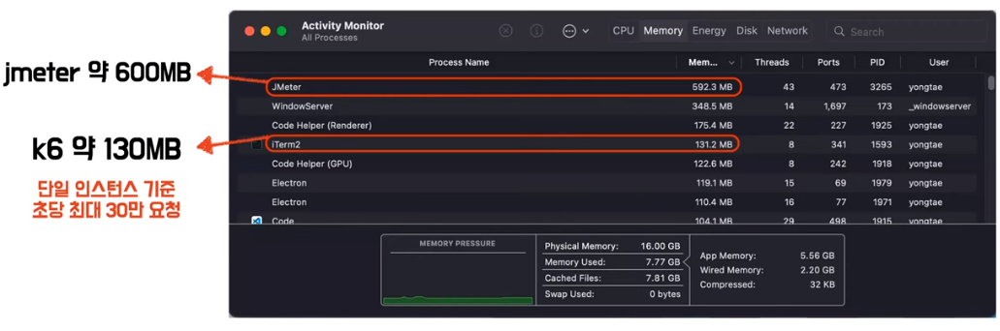 
    + K6는 약 130MB를 사용 JMeter는 600MB를 사용 이거는 실제로 단일 인스턴스 기준으로 초당 최대 30만 요청까지 할 수 있다고 한다
  + K6는 그라파나에서 만든 만큼 그라파나에 호환성이 좋다 그래서 여러가지 매트릭들에 대해서 다양한 gui를 제공한다
+ 단점
  + 클라우드 서비스를 이용하고 싶으면 유료 클라우드 서비스가 필요할 수도 있는데 프리티어 기준까지는 무료로 사용할 수 있다
  + K6는 기본적으로 부하 분산 테스를 제공하지 않는다 
    + 부하 분산 테스트나 대용량 트래픽을 해보고싶다 이러면은 K8s나 K6 operator와 같은 툴들이랑 같이 사용해야 될 수도 있다

### nGrinder
+ nGrinder는 네이버에서 만든 오픈소스
+ 국내 개발자들이 많이 사용

+ 장점
  + 자바와 비슷한 스크립트 언어 지원
  + 기존에 Junit 테스트에 관심이 많으셨던 개발자이면 거부감 없게 쓸 수가 있다  
  + 한국어를 지원해 준다
  + 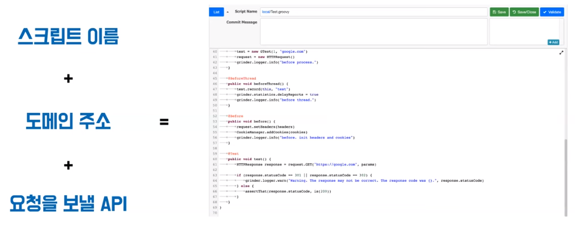
    + 완성도 높은 뼈대 코드를 지원해 준다
    + 리퀘스트 바디나 로그인 요청 PathValiable 같은 전처리 데이터를 뽑아서 같이 넣어줘야 되는 그런 작업 말고는 그냥 이대로 요청만 해도 실제로 부하 테스트가 잘 동작할만큼 완성도가 있다
  + GUI 가독성이 굉장히 좋다 
    + 한 화면에서 모든설정과 부하테스트를 진행할 수 있다
+ 단점 
  + nGrinder 자체가 프로세스가 분리가 되어 있다
    + 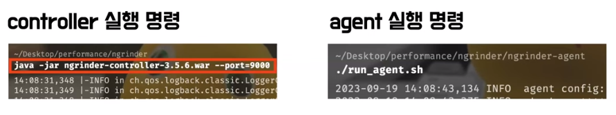
    + 하나는 controller고 하나는 agent인데 각각을 따로따로 실행해 줘야 하는 단점이 있다
    + 도커를 사용하시는 분들이라면 한 번에 띄울 수 있다
  + groovy라는 문법이 흔하지 않다 보니까 IDE를 지원해주지 않는 경우가 많다 그래가지고 nGriner 내부에서 직접 작성해야 하는 점이 조금 불편할 수도 있다

    
## 성능 테스트 실습

### 테스트 계획 수립
+ 응답의 ```최소 레이턴시(latency)``` 정하기
  + 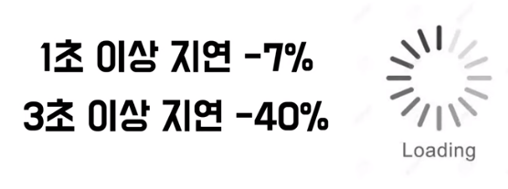
  + 어떤 연구 결과에 따르면 1초 이상 지연되면 사용자가 7% 3초 이상 지연되면 사용자가 40%가 빠져 나간다고 한다
+ 서비스가 ```peek일 때 사용자 수``` 구하기
  + 넉넉 잡아서 설정하는게 좋다

### 테스트 스크립트 작성 (nGrinder)
+ 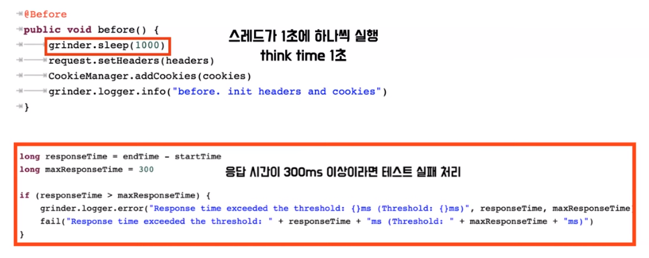
+ 위에 스레드가 1초에 하나씩 실행된다면 think time을 1초로 설정
  + 사용자가 요청을 보내고 그 요청이 만약에 0.2초 만에 답장이 오면 1초 만에 5번 왔다 갔다 할 수 있다 
  + 사용자가 1초에 다섯 번의 요청을 보낸다는거는 좀 이상하다 
  + 조금 더 테스트 결과를 분석하기 쉽게 사용자가 1초에 무조건 요청을 한 번씩만 보낼 수 있도록 이걸 가정하기 위해서 think time을 1초로 걸었다
+ 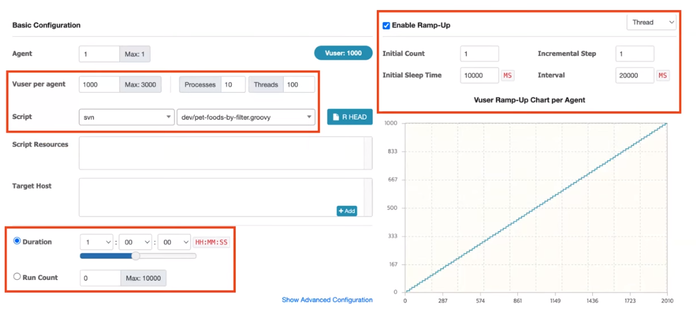
+ 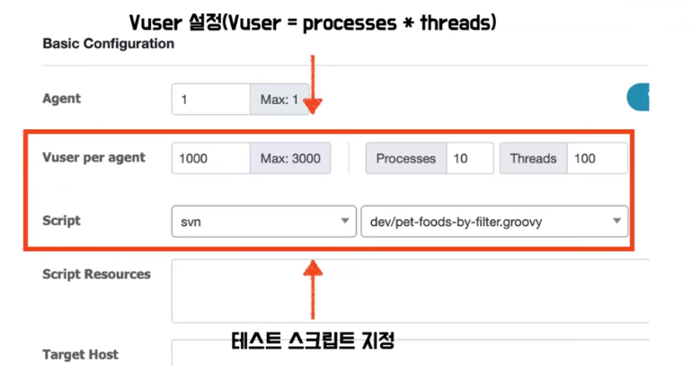
  + Vuser per agent는 agent당 Vuser 수를 지정하는거라고 보시면 된다
  + nGrinder에서 VUser 공식은 프로세서의 수 x 스레드 수 
+ 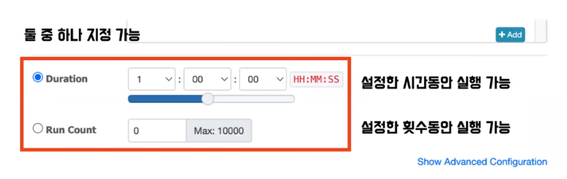
  + Duration이랑 Run Count라는 옵션은 Duration은 설정하는 시간동안 실행이 가능하고 Run Count는 설정한 횟수동안 실행하는 옵션
+ 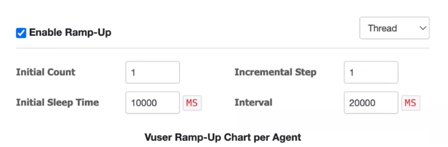
  + Enable Ramp-Up라는 옵션은 시간이 지날수록 점자 Vuser수를 늘려가면서 부하를 늘려가는 방식
+ 이 옵션들은 nGrinder뿐만 아니라 다른 툴들을 사용하셔도 비슷하게 설정을 하는 부분이다 

### Load 테스트 결과 
+ 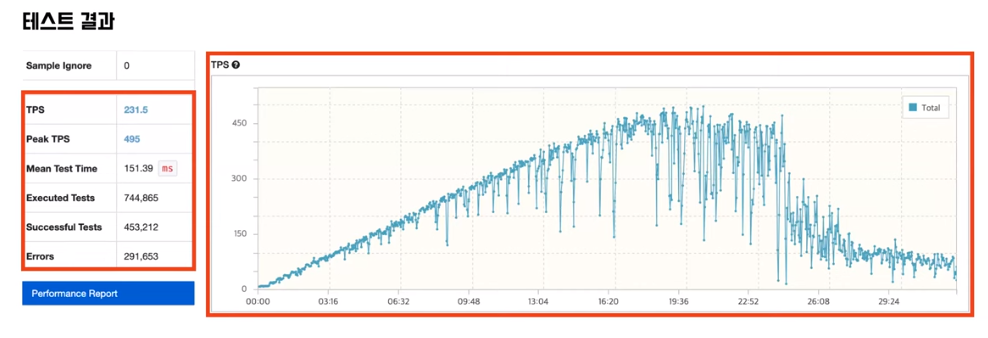
  + 그래프를 보시면 잘 올라가다가 막히고 점점 내려 간다
  + Peak TPS가 495라고 나와 있는데 495를 기준으로 점점 Vuser가 올라가면서 실제로 정상적으로 요청이 처리가 되는 모습이 줄어들고 있다 이쯤되면은 사용자가 레이턴시를 오래 기다려야 되는 그런 현상이 발생한다
+ 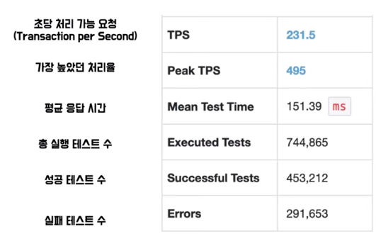
+ 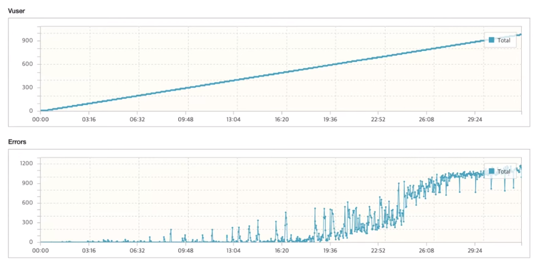
  + Vuser가 증가할수록 Error가 잘 처리하다가 19분이 넘어가면서 점점 올라가고 있다 

### 결론
+ 
+ 해당 api에 대한 점진적인 성능을 개선 해야 하고 임계 지점에서 설정한 레이턴시 값을 만족하도록 성능을 개선하면 된다 
