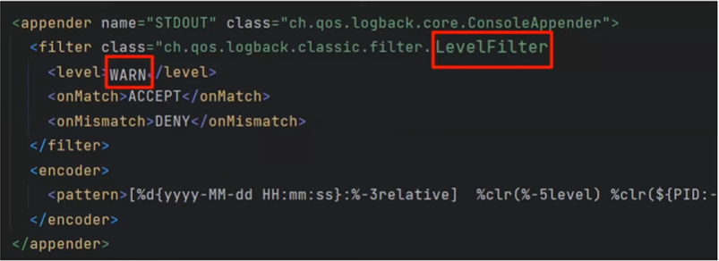

# 아마란스의 로깅
https://youtu.be/X_iE36En9F4?si=fIspkhYcBEw9GU9i

# 아마란스의 로깅
* toc
{:toc}

## 로깅이란?
+ 로깅은 로그를 기록하도록 시스템을 구성하는 작업
+ 여기에서 말하는 로그란 시스템이 동작할때 시간 경과에 따라 기록된 시스템에 상태 및 동작 정보를 의미한다
+ 로깅을 하는 이유
  + 시스템에 오류가 발생했을 때 그 문제의 원인을 추적 하기 위해서
  + 시스템의 성능이나 사용자의 서비스 이용률을 분석하기 위해서 정보를 수집하기 위해 로그를 남긴다

## Logback의 구성요소
+ 
+ 로그백은 크게 어펜더, 인코더, 로거 세 가지 요소로 이루어져 있다
+ 
  + 어펜더는 먼저 로그메시지가 출력될 대상을 결정하는 요소 
  + 예시를 보면 DBAppender가 정의되어 있고 로거가 이 DBAppender를 참조해서 DB에 로그를 출력
  + 로그백에서 제공하고 있는 어펜더를 통해서 콘솔이나 파일, 메일, DB 중 원하는 곳에 로그를 출력할 수 있다
+ 
  + 인코더는 로그 메시지를 사용자가 정의한 포맷으로 변환시켜주는 요소
  + 인코더에 정의되어있는 패턴에 맞춰 메시지가 변환된 뒤 로그로 출력
  + 인코더는 어펜더 내부에 포함 되어 있는 요소
+ 
  + 로거는 실제 로깅을 수행하는 요소
  + 여러개의 어펜더를 한 개의 로거가 참조하게 할 수도 있다
  + 
  + 패키지별로 로거를 설정할 수 있는데 특정 패키지를 네임으로 설정을 해 주면 해당 패키지에서 발생하는 로그를 작성하는 로거를 정의할 수 있게 된다
+ 
  + 트레이더스에서 에러로 갈수록 로그메시지가 중요하고 로그가 발생한 이벤트에 상황이 심각하다는 것을 알려준다
+ 
  + 로거의 로그 레벨을 설정 한다는 것은 인포 레벨로 로그 레벨을 설정 한다고 했을 때 인포 레벨 이상의 레벨인 인포, 원, 에러 레벨에 해당하는 로그만 출력하게 된다
+ 
  + 필터는 이름 그대로 출력할 로그 이벤트를 필터링 하는 요소
  + 어펜더 요소 내부에 포함

## 로그 출력하기 
+ 스프링부트에서 설정하는 기본 로그 레벨은 info 이다 
+ 로그 레벨을 원하는 대로 설정하고 원하는 어펜더와 필터를 적용하기 위해서는 logback-spring.xml이라는 설정파일을 작성해 줘야 한다

## 설정 파일 작성하기

### Console 출력
+ 
+ 
+ 코드가 크게 어펜더와 루트로 분리가 되어 있는 것을 확인할 수 있다
+ 루트는 로거의 일종인데 로그 중에서도 최상위 계층의 로그를 의미 모든 경로에서 발생하는 로그를 루트 로거가 출력을 하는 것이다
+ 좀 더 자세히 보면 어펜더로 콘솔 어펜더를 사용했고 인코더로는 패턴 레이아웃 인코더를 사용했다 그리고 패턴으로 저희가 출력하고자 하는 로그의 패턴을 지정을 해주었고
  이렇게 만들어진 어펜더를 루트로거에서 참조하고 있는 형식이다
+ 루트 로거의 레벨을 워닝으로 설정을 해주었기 때문에 결과에서 워닝 레벨과 에러 레벨에 해당하는 로그만 출력이 되는 것을 확인할 수 있다
+ 
+ 어펜더에 필터를 추가 필터로 레벨 필터를 추가를 해주었고 이 필터는 워닝 레벨에 해당하는 로그에 대해서 허가를 하고 나머지 레벨은 모두 거부를 한다는 설정을 해두었다 
그렇게해서 결과는 이제 워닝 레벨에 해당하는 로그만 출력된다

### 파일 출력 
+ 
+ 어펜더로 롤링 파일 어펜더를 사용 롤링 파일 어펜더는 일정한 특정 기준으로 로그를 작성하는 파일을 변경해주는, 타깃 파일을 변경해주는 어펜더 그래서 타깃 파일이 변경하는 기준을 정의하는 게 rollingPolicy
+ rollingPolicy로 TimeBasedRollingPolicy를 선언을 해주어서 일정한 기간에 따라서 일정 기간 주기로 새로운 파일을 생성해주게 될 것이다
+ fileNamePattern은 이 생성한 로그 파일의 이름을 정의, 여기에서 이제 %d 라는게 보이는데 퍼센트 뒤와 그 위에 날짜 형식이 보인다 이게 바로 로그 파일을 작성할 주기를 설정 디폴트 설정인데 매일에 한 번씩 로그 파일을 생성한다는 의미
 

## 부록
+ 
+ 어펜더와 필터는 로그백 내부에서 추상화된 객체로 존재
+ 인터페이스 또는 추상클래스로 존재를 하는데 콘솔어펜더나 레벨 필터 역시 로그백에서 제공하고 있는 구현체 클래스 
+ 어펜더와 필터를 구현을 직접 해 줄 수 있는데 이 방법으로 커스터 어펜더와 필터를 만들어서 적용할 수 있다

### 로깅 전략
+ 
+ 스프링 프로필이라는 태그를 사용하면은 어플리케이션 프로퍼티 또는 yml 파일에서 지정해준 프로필 대로 로거를 다르게 지정을 해 줄 수 있게 된다
+ 

