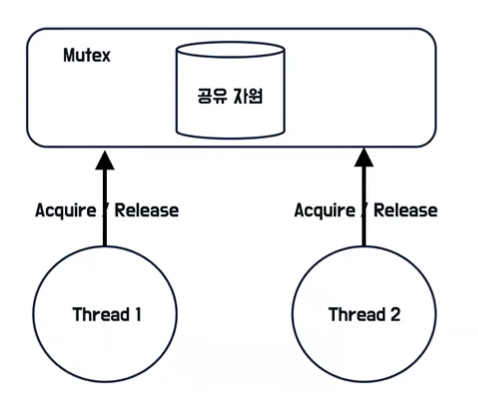
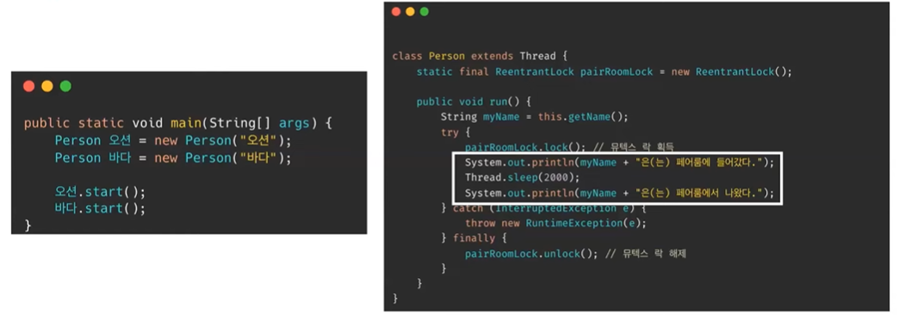
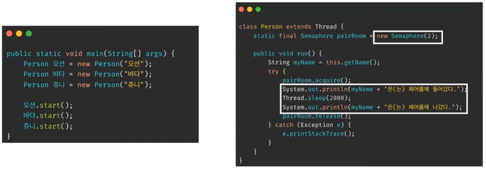
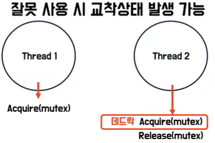
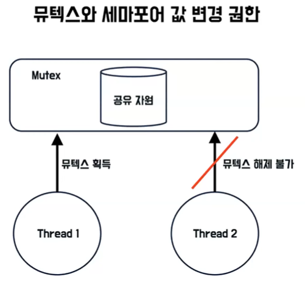
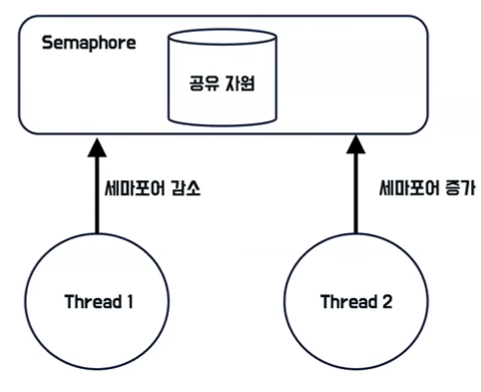

# 오션의 뮤텍스와 세마포어
[https://youtu.be/NL9JQh5bbZ8?si=JvRt2pJB1VpVQ-Ew](https://youtu.be/NL9JQh5bbZ8?si=JvRt2pJB1VpVQ-Ew)

# 오션의 뮤텍스와 세마포어
* toc
{:toc}

## 뮤텍스와 세마포어 배경
+ 여러 프로세스나 쓰레드가 동시에 같은 데이터를 조작할 때 문제가 생길 수 있다 이를 레이스컨디션, 경쟁 상태라고 한다
+ 공유 자원에 여러 프로세스/스레드가 동시에 접근시 ```의도치 않은 동작```이 발생할 수 있다
+ 따라서 프로세스나 쓰레드 공유 자원에 ```동시에 접근하지 못하도록 접근 순서를 제어하는 방법(동기화)```이 필요하다
+ 임계 영역은 특정 프로세스나 쓰레드만 진입해서 실행 가능한 영역
+ 특정 프로세스나 쓰레드만 진입해서 실행 가능하다는 것은 상호배제라고 할 수 있다
  + 상호배제는 임계영역에 한 프로세스나 쓰레드만 접근해서 사용하는 것을 의미
+ 상호배제를 동기화 기법으로 구현한 것이 바로 뮤텍스와 세마포어이다

## 뮤텍스란?
+ 뮤텍스는 Mutal Exclusion 상호배제의 약어로 여러개의 프로세스나 쓰레드가 공유자원에 동시에 접근하는 것을 제한하기 위한 락이다

### 뮤텍스 특징
+ 
+ 프로세스와 스레드는 뮤텍스를 소유하고 해제 할 수 있는데 이를 통해서 Boolean 타입의 잠금(Lock) 여부를 확인할 수가 있다
+ 뮤텍스는 한 개의 프로세스와 쓰레드만 소유를 하고 해제 할 수 있다
+ 프로세스와 쓰레드가 뮤텍스를 획득하기 위해서는 Acquire 메서드를 통해서 뮤텍스 락을 획득하고 Release 메서드를 통해서 뮤텍스를 해제할 수 있다
+ 쓰레드 1이 뮤텍스를 소유한 상태에서 쓰레드2가 뮤텍스를 소유 하려고 할 때 계속해서 대기하는 방식인 Busy-Waiting 방식과 대기큐에서 cpu 자원을 내려놓고 대기하는 Non-Busy-Wait이 있다 뮤텍스는 Non-Busy-Wait이며
  Busy-Waiting 기법을 사용하는 스핀락 기법도 존재한다

### 뮤텍스 자바 예제
+ 
+ 자바에서는 뮤텍스를 직접적으로 지원해 주지 않기 때문에 비슷한 기능을 하는 락을 이용해서 설명
+ 임계영역 전후로 뮤텍스락을 획득하고 해제할 수 있습니다 이 코드의 결과값으로 오션과 바다가 페어룸을 순차적으로 사용을 할 수 있다

## 세마포어란?
+ 세마포어는 여러 개의 프로세스, 쓰레드가 공유자원에 동시에 접근하는 것을 제한 하기 위한 정수라고 할 수 있다

### 세마포어 특징
+ 
+ 세마포어는 정수를 하나 가지고 있다 예를 들어 이 정수가 3이라면은 최대 3개의 프로세스, 쓰레드만이 공유자원에 접근을 할 수가 있다
+ 뮤텍스와 다르게 한 개 이상의 여기 세마포어 정수에서 정해준 수 만큼 프로세스 쓰레드가 접근이 가능하다
+ 세마포어는 스레드나 프로세스가 접근하기 위해서는 wait 작업을 통해서 이 정수 값을 감소시켜 줄 수 있고 Signal 연산을 통해서 세마포어 값을 증가시켜 줄 수 있다, 이는 각각 P 연산, V 연산이라고 부르기도 한다
+ 뮤텍스와 마찬가지로 세마포어는 Non-Busy-Wait로서 cpu 자원을 내려놓고 대기하는 방식을 취하고 있다
+ 세마포어는 이진 세마포어 하고 카운팅 세마포어로 나뉠 수 있는데 이진 세마포어는 최대 한개의 프로세스 쓰레드가 접근 가능한 세마포어 이며
  카운팅 세마포어는 최대 N개의 프로세스 스레드가 접근 가능한 세마포어이다
+ 대기큐에서 나오는 방식에 따라서 강성 세마포어와 약성 세마포어로 나뉘어질 수도 있다
  + 강성 세마포어(FIFO)
  + 약성 세마포어(명시 X)

### 세마포어 자바 예제 
+ 
+ 자바 표준 api 라이브러리에서 세마포어를 지원해 주기 때문에 이를 활용
+ 임계 영역 전 후로 세마포어의 값을 증가시키고 감소시켜 주는데 이거에 대한 결과값으로 오션과 바다가 페어룸을 점유를 하고 난 이후에 쥬니가 페어룸을 점유한 것을 확인할 수 있다
+ 


## 비교

### 공통점
+ 동시에 실행되는 프로세스 스레드들 간에 공유자원을 보호 하고 잘못 사용하게 될 경우 교착상태가 발생할 수 있다
  + 
  + 쓰레드 1하고 쓰레드 2가 다음과 같은 로직을 수행할때 
  + 쓰레드 1에서는 뮤텍스를 잠금 상태로 가지고 있고 해제하지는 않았다
  + 이후에 쓰레드 2가 뮤텍스를 소유하려고 할 때 쓰레드 1에서는 뮤텍스를 해제 하지 않았기 때문에
    이 부분에서 교착상태가 발생할 수 있다

### 차이점
+ 뮤텍스는 락이고 한 개의 프로세스, 스레드만 접근이 가능하다 세마포어는 공유 변수이며 N개의 프로세스, 스레드가 접근이 가능하다
+ 뮤텍스, 세마포어의 값 변경 권한이 다르다
+ 
  + 뮤텍스를 쓰레드 1이 획득했다고 했을 때 쓰레드 2가 이 뮤텍스락 해제하려고 한다면은 불가하다
  + 뮤텍스는 락을 소유한 스레드, 프로세스만 획득하고 해제할 수 있다
+ 
  + 세마포어 같은 경우에는 쓰레드 1이 세마포어를 감소시키고 쓰레드 2가 세마포어를 증가시키면서 다른 쓰레드에서도 이 작업을 처리해 줄 수 있다
+ 이로부터 나온 차이점은 최대 한개의 프로세스 쓰레드만 접근 가능한 뮤텍스와 이진세마포어 는 비슷하지만 다르게 생각할 수도 있고 또한 뮤텍스는 세마포어로 사용될 수 없지만 세마포는 뮤텍스로써 사용될 수 있다
+ 세마포어는 작업간 실행순서를 동기화
  +  
  + 세마포어가 현재 0으로 설정이 되어 있고 사용자는 작업 1, 작업2 작업 3 순서대로 처리를 해야 한다고 함녀
  + 작업 1이 처리가 되고 세마포어 wait 감소연산을 통해서 현재 세마포어가 음수가 되었는데 세마포어가 0 미만이기 때문에
    프로세스 2는 더 이상 작업을 진행하지 못한다 그 이후에 프로세스 1이 작업2를 진행하면서 세마포어 Signal 연산을 통해 세마포어를 증가시켜 있는데 이 이후에
    프로세스 2에서 세마포어가 0 이상이기 때문에 작업을 진행할 수 있게 된다 이로써 작업 1, 2, 3 순서대로 동기화를 할 수 있다
  
### 의문 
+ 뮤텍스와 세마포어 대신 알고리즘 코드로 작성하면 안되는 것인가?
+ 
+ 하드웨어 상에서 상호배제가 깨질 수도 있기 때문에 Atomic한 Operation을 지원하는 뮤텍스와 세마포어를 사용하는 것이 좋다

## 정리
+ 1개 자원에 대한 상호배제만 필요하다면 뮤텍스를 사용하고 공유자원 접근 수를 조절하고 작업 간의 실행순서 동기화가 필요하다면 세마포어를 사용하는 것이 좋을 것이다
+ 또한 뮤텍스와 세마포에 구체적인 동작원리는 OS나 프로그래밍 언어에 따라 다를 수 있으니 유의해 주어야한다
