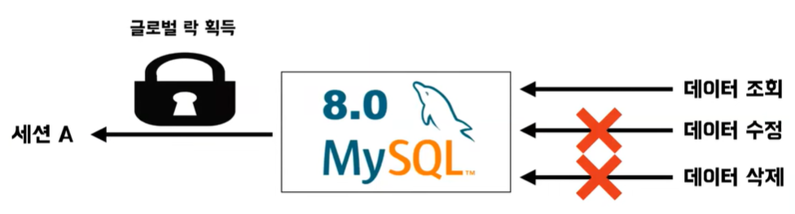

# 두둠, 쥬니의 데이터베이스 락
[https://youtu.be/EBBS_giQ4AM?si=7HCQlenmF1YKpEIl](https://youtu.be/EBBS_giQ4AM?si=7HCQlenmF1YKpEIl)

# 두둠, 쥬니의 데이터베이스 락
* toc
{:toc}

## Lock 이란?
+ 락은 사전에 따르면 자물쇠로 잠그다, 안전한 곳에 넣어 잠가 두다 라는 의미를 가지고 있다
  + 즉, 락은 무엇인가를 잠근다는 의미를 가지고 있다
+ 데이터베이스에서의 락은 새로운 데이터를 추가하거나 삭제 수정할 수 없도록 데이터베이스를 잠그는 것을 이야기 한다
+ 데이터베이스 락은 데이터에 일관성을 유지하고 여러 트랜잭션에서 동시에 동일한 데이터를 변경하지 못하도록 하는 것이다
+ MySQL Lock
  + mysql 에서는 mysql Engine Level의 락과 Storage Engine Level 락을 지원하는데 mysql 엔진 레벨의 락은 각 스토리지 엔진에 영향을 미치지만 스토리지 엔진 레벨의 락은 다른 스토리지 엔진에 영향을 미치지 않는다

## MySql Engine Level

### Global Lock
+ 글로벌 락은 mysql에서 지원하는 락 중 가장 큰 범위의 락
+ 글로벌 락을 획득하게 된다면 이는 mysql 서버 전체에 영향을 미치게 된다
+ 
+ 특정 세션에서 글로벌 락을 획득하게 되었을 경우 다른 세션에서는 단순 데이터 조회를 위한 select 명령을 제외하고는 대부분의 명령을 수행할 수 없게 된다
+ 이런한 글로벌 락은 기존 MyISAM이나 메모리 스토리지 엔진에서 트랜잭션을 지원하지 않았기 때문에 백업을 수행하기 위해 글로벌 락을 사용
+ 글로벌 락은 mysql 서버의 모든 변경 작업을 중단시킨다는 단점이 있는데 이후 트랜잭션을 지원하는 InnoDB가 상용화되면서 데이터의 일관성을 유지하기 위해 모든 변경 작업을
  중단 시킬 필요가 없어졌다 그래서 보다 가벼운 백업 락이 등장하

### Backup Locks
+ 글로벌 락과 달리 단순 데이터 조회 뿐만 아니라 기존의 데이터를 수정하는 명령도 수행이 가능
+ 변경 사항이 발생하면 별도의 로그에 기록을 해뒀다가 해당 백업 트랜잭션이 종료 되기 전에 해당 로그를 참고하여 변경과 관련된 명령어를 일괄적으로 수행
  백업 락을 사용하여 데이터 일관성을 유지하면서 백업을 수행할 수 있다
+ 백업 락에서도 사용할 수 없는 명령어들이 존재
  + 테이블을 새로 생성하거나 삭제하는 불가
  + 사용자와 관련된 권한이나 비밀번호 변경 불가
  + REPAIR / OPTIMIZE TABLE 명령어 사용 불가
  + 이유는 백업을 진행 하는 도중에 테이블의 구조가 바뀐다든지 혹은 사용자 권한 등이 변경됨에 따라 백업 중간에 백업이 실패할 수 있기 때문이다

### Table Lock
+ 테이블 락은 말 그대로 테이블 자체에 걸리는 락을 의미
+ 
+ 테이블의 구조를 변경할 때 묵시적으로 테이블 락을 획득할 수 있다
+ 
+ 테이블에 존재하는 데이터를 변경할 때에도 묵시적으로 테이블 락을 획득하게 되는데 InnoDB에서는 데이터 변경으로 인한 테이블 락이 발생하지 않는다

## Storage Engine(InnoDB) Level
+ Record Rock
+ Gap Lock
+ Next Key Lock

### Record Rock
+ InnoDB에서는 데이터 변경으로 인한 테이블 락이 발생하지 않는다 그 이유는 InnoDB에서는 레코드 기반의 잠금을 지원하기 때문이다
+ 실제로는 레코드 자체에 락이 걸리는 것이 아니라 각 레코드의 인덱스에 락이 발생하게 된다
+ 추가적으로 만약 인덱스가 걸려 있지 않는 컬럼으로 레코드 변경 작업을 수행한다면 해당 테이블에 존재하는 모든 레코드들의 대해서 레코드 락이 발생

### Gap Lock
+ mysql 기본 트랜잭션 격리수준은 Repeatable Read
+ Repeatable Read에서 발생할 수 있는 문제점인 Phantom Read가 있다
+ 하지만 실제 mysql에서는 Repeatable Read의 격리 수준에서도 Phantom Read 문제가 발생 하지 않는데 그 이유가 InnoDB의 이전에서 말씀드렸던 레코드 락과 갭 락의 특징 때문이다
+ 갭 락이란 레코드와 인접한 레코드 사이에 새로운 데이터를 생성할 수 없도록 하는 락
+ 
+ 통장 잔고가 만원 이상 백억 이하인 데이터를 변경을 위해 조회 한다고 가정해 보자
+ 
+ InnoDB에서는 이 두 레코드 사이에 갭 락이라는 것이 존재하게 된다 
+ 이 갭 락으로 인해 새로운 데이터를 추가하고자 할 때 데이터를 삽입할 수 없게 된다
+ 이런 레코드 락과 갭 락의 특징으로 인해 mysql 에서는 Repeatable Read의 격리 수준에서도 Phamtom Read 문제가 발생하지 않는다

## 예시

### Index 설정 시 Lock을 고려해야하는 이유  
+ first_name='전'인 유저의 카운트는 2000이라고 가정, 그리고 first_name='전'이고 last_name='쥬니'인 데이터는 1건 있다고 가정
+ 실행 하려는 쿼리 : UPDATE users SET last_name='정준' WHERE first_name='전' AND last_name='쥬니'
+ 인덱스가 아예 없을 때에는 모든 레코드에 대해서 락을 걸게 된다 
  + 즉, 테이블 락과 같이 모든 데이터에 대해서 락을 걸기 때문에 동시성이 상당히 떨어지게 된다
+ first_name에만 인덱스가 걸려 있는 경우는 first_name='전'인 데이터들의 모든 레코드에 락이 걸리게 된다 first_name='전'인 데이터의 수는 2000개 이므로 2000개에 대한 레코드가 락이 걸리게 된다
  + 2,000개의 데이터에 락을 모두 걸고 실제 테이블로 가서 last_name='쥬니'인 데이터를 찾아서 정준으로 수정을 진행하게 된다
  + 아까보다는 동시성이 늘어났지만 여전히 2,000개 대한 락을 가지고 있기 때문에 동시성이 그렇게 좋다고 볼 순 없다
+ first_name 그리고 last_name에 복합인덱스가 걸려 있는 경우는 하나의 데이터에 대해서만 레코드 락이 걸리게 된다 

#### 정리
+ 인덱스가 아예 존재하지 않을 경우: 테이블에 존재하는 모든 레코드에 대해서 락
+ first_name에만 인덱스가 존재하는 경우: first_name='전' 즉, 2,000개 데이터에 대해서만 레코드 락
+ first_name, last_name이 복합인덱스: 하나의 레코드에 대해서만 락

### 예시를 통한 Next Key Lock
+ 문제 상황
+ 
+ 식당 랭킹 시스템이 있고 새로운 식당이 추가돼서 이 랭킹 시스템을 새로운 식당을 추가 하고 싶은 경우
+ 
+ 레스토랑 테이블을 보면은 레스토랑 아이디 그리고 이름이 있고 쥬니 두둠 포비라는 레스토랑이 있다
+ 그리고 레스토랑 랭크 테이블이 있고 레스토랑 랭크 아이디 레스토랑 아이디 그리고 랭킹이 있다
+ 랭킹은 1등부터 6등까지 있지만 3등이 비어 있다 그리고 랭킹에는 인덱스가 유니크 인덱스가 걸려 있다고 가정
+ 
+ 쥬니의 트랜잭션은 먼저 랭킹 4등 이상인 데이터들을 모두 조회를 하고 3등에 쥬니 레스토랑을 insert하는 쿼리
+ 
+ 쥬니 트랜잭션은 락을 얻게 된다 4번 레코드 5번 레코드 6번 레코드에 대해서 레코드 락을 획득하게 되고 2번 4번 그리고 4번 5번, 5번 6번 사이에 갭 락을 획득하게 된다
  + 이 두 락을 합쳐서 Next Key Lock이라고 InnoDB에서 말한다
+ 
+ 두둠 트랜잭션은 select를 하지 않고 냅다 3등에다가 두둠 레스토랑을 넣으려고 시도를 한다
+ 
+ 하지만 먼저 쥬니 트랜잭션의 락을 가지고 있기 때문에 두둠 트랜잭션은 락 wait를 하게 된다
+ 
+ 락 대기 상황 테이블을 보면은 두둠의 쿼리가 웨이팅 하고 있는 것을 볼 수 있다
+ 
+ 그리고 쥬니 트랜잭션이 커밋 되고 두둠 트랜잭션이 락을 획득 하더라도 랭킹 3등에 쥬니 레스토랑이 먼저 들어갔기 때문에 두둠의 데이터는 Unique 제약 조건에 의해서 insert에 실패하게 된다

### InnoDB락으로 인한 데드락
+ Transaction A
  + 
  + 레스토랑 아이디가 1보다 크고 2보다 작은 데이터에 대해서 select를 한다
  + 즉 1번 2번 코드에 대해서 레코드 락을 얻고 1, 2번 2, 3번 에 대해서 갭 락을 얻게 된다
+ Transaction B
  + 
  + 트랜잭션 B는 4번이상 그리고 5번 이하인 데이터에 대해서 락을 획득한다
  + 즉 4번 5번 그리고 3, 4번 사이, 4, 5번 사이의 락을 획득하게 됩니다
+ Transaction A, B
  + 
  + 트랜잭션 A의 다른 쿼리로 아이디가 4인 데이터에 대해서 접근을 시도 하지만 트랜잭션 B가 먼저 락을 획득하고 있기 때문에 락 wait를 하게 된다
  + 반대로 트랜잭션 B도 트랜잭션 A가 가지고 있는 락에 대해서 접근을 시도 
  + 그렇기 때문에 트랜잭션 A는 있는 트랜잭션 B를 기다리고 있고 트랜잭션 B는 A를 기다리고 있는 데드락 상황이 발생하게 된다
+ 
+ 하지만 mysql InnoDB는 데드락이 발생하기 전에 데드락 감지를 사용 해서 뒤늦게 실행된 트랜잭션은 자동으로 롤백시키는 기능이 있다
+ 그래서 뒤늦게 실행된 트랜잭션 B를 자동으로 롤백시키게 된다 결론적으로는 트랜잭션 A가 모든 데이터에 대한 락을 획득하고 커밋이 된다 하지만 트랜잭션 B는 자동으로 롤백되기 때문에 실패한다

