# 베로의 Monitor & Synchronized
[https://youtu.be/4t8BennljZA?si=qI4xyP9HYGgTzNEq](https://youtu.be/4t8BennljZA?si=qI4xyP9HYGgTzNEq)

# 베로의 Monitor & Synchronized
* toc
{:toc}

## 세마포어의 한계
+ 세마포어는 개발자가 실수하는 순간 발견하기 어려운 타이밍 오류가 발생할 가능성이 존재한다 근데 이 경우 타이밍 오류는 특정 순서로 실행되었을 때만 발생하기 때문에 디버깅이 굉장히 어려운 경우가 많다
+ 세마포어를 release -> acquire 순으로 호출되는 경우에 여러 스레드나 프로세스가 동시에 크리티컬 섹션에 진입할 수 있어서 레이스 컨디션이 발생할 수 있다
+ 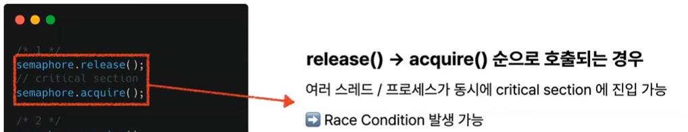
+ 두 번째로 세마포어에서 acquire를 여러 번, 두 번 정도 호출하는 경우에 세마포어의 카운트가 두 번의 acquire로 더 많이 감소하게 되어 Deadlock과 Starvation이 발생할 가능성이 존재한다
+ 이를 통해서 세마포어는 개발자의 실수를 방지하기 어렵다라는 문제점이 있다 이 문제점을 보완하기 위해서 나온 것이 Monitor이다

## Monitor 란?
+ 모니터는 세마포어처럼 상호 배제 기능을 제공하지만 세마포어보다 더 고수준의 동기화 도구를 제공한다
+ Monitor를 통해서 동기화의 복잡함을 좀 더 단순화하고 개발자가 실수를 줄일 수 있도록 돕는다
+ 특히 Mutex를 사용해서 구현했기 때문에 한 번에 하나의 스레드만 실행할 수 있다
+ 조건변수를 사용해서 특정 조건에서만 스레드가 실행하도록 설정할 수도 있다

## Monitor의 동작
+ 생산자 - 소비자 문제 
  + 
+ Monitor 동작에 필요한 변수들
  + 

### 동작 과정 Pseudo Code
+ 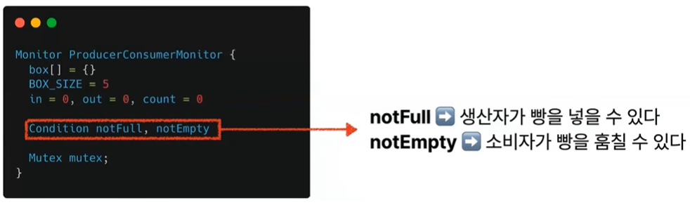
  + 빵이 5개 들어가는 상자가 있고 초기 빵 개수는 0개로 초기화되어 있다
  + 조건 변수가 등장하는데 조건 변수란 말 그대로 특정 조건을 의미하는 것이다 여기에서 이제 notFull이라는 변수는 생산자가 빵을 넣을 수 있음을 의미하고 not empty는 소비자가 빵을 훔칠 수 있음을 의미
  + 그리고 마지막으로 한 번에 하나의 스레드만을 실행하기 위해서 mutex를 변수로 가지고 있다
+ 빵 생성하기
  + 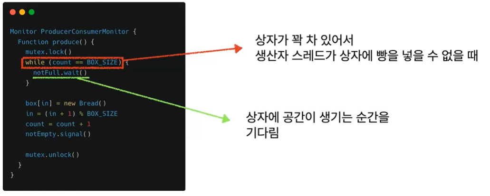
  + 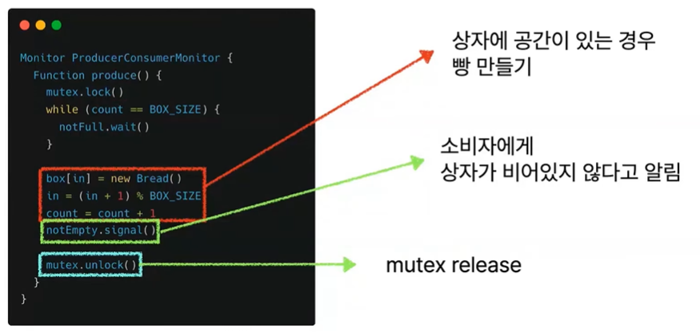
+ 빵 훔쳐가기
  + 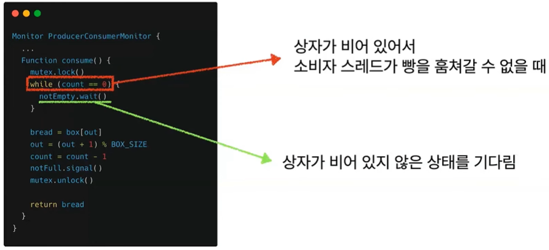
  + 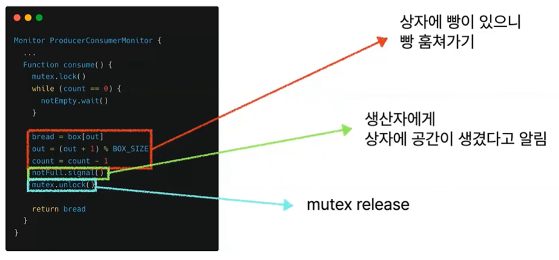

## Java에서는 Monitor가 어떻게 쓰일까?

### Java의 Intrinsic Lock (고유락)
+ Java에서는 intrinsic lock, 즉 고유 락이라는 것으로 Monitor를 구현하고 있다
+ 모든 Java 객체는 객체의 Monitor 역할을 하는 고유 락을 가지고 있다
+ 고유 락을 사용해서 스레드 간의 동기화를 수행할 수 있고 만약 객체 필드에 배타적인 접근이 필요한 경우에 스레드가 객체의 고유 락을 얻어서 접근할 수 있다
+ Synchronized 키워드를 사용해서 고유 락을 활용할 수 있다

### 고유락의 동작 과정
+ 생산자 스레드가 고유 락을 먼저 획득했다고 가정
+ 이 경우 생산자가 빵을 만드는 동안 고유 락을 얻지 못한 다른 생산자 스레드, 소비자 스레드들은 고유 락에 접근할 수 없습니다 따라서 스레드들은 다 blocked 상태 로 전환이된다
+ 그리고 이제 빵을 다 만들고 나서 생산자 스레드가 notify()라는 함수를 실행을 하게 되는데 notify() 함수는 wait()으로 대기 중인 스레드만 깨우게 된다
+ 그러므로 wait()으로 대기 중인 스레드가 없는 경우에는 무시가 되게 되는데 현재 여기에서 wait()으로 대기 중인 스레드는 없기 때문에 JVM이 따로 blocked 상태의 스레드를 임의로 선택해서 고유 락을 얻을 수 있도록 한다
+ 이제 소비자 스레드가 선택되었는데 이 소비자 스레드가 고유락을 얻어서 하나를 훔친 다음 notify()를 다시 호출했지만 여전히 waiting 중인 스레드가 없기 때문에 JVM이 따로 스레드를 선택하게 된다
+ 하나의 상황을 가정을 해면 만약 지금 박스가 비어있는데 소비자 스레드가 새롭게 선택이 되었다면 소비자 스레드는 상자가 비어있을 때 행동을 할 수 없으므로 wait()을 하게 된다 이제 wait() 메서드가 호출이 되게 되었다
+ 이때는 이제 더 이상 이 고유 락을 가지고 있지 않고 해제한 뒤에 JVM이 다시 blocked된 상태에 있는 스레드가 고유 락을 획득하도록 한다 
+ 새롭게 생산자 스레드가 다시 고유 락을 얻게 되었을 때 다시 notify() 메서드를 호출을 하게 된다 이 notify() 메서드는 waiting하고 있는 스레드를 깨우기 때문에 아까 자고 있었던 이 소비자 스레드가 호출이 된다 

### 동작 과정 코드로 보기 
+ 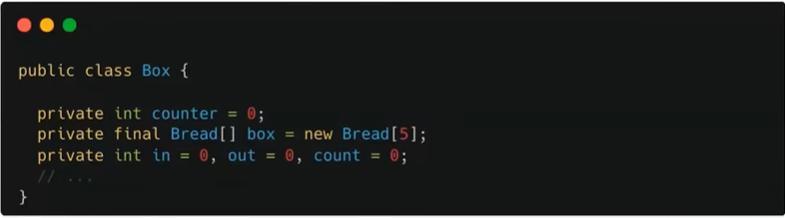
+ 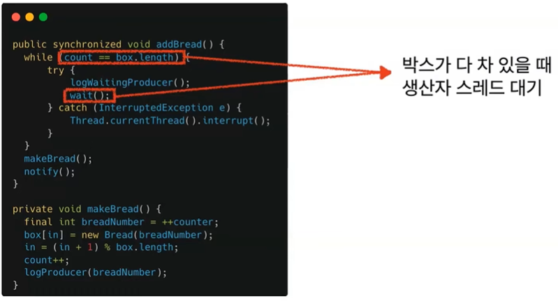
+ 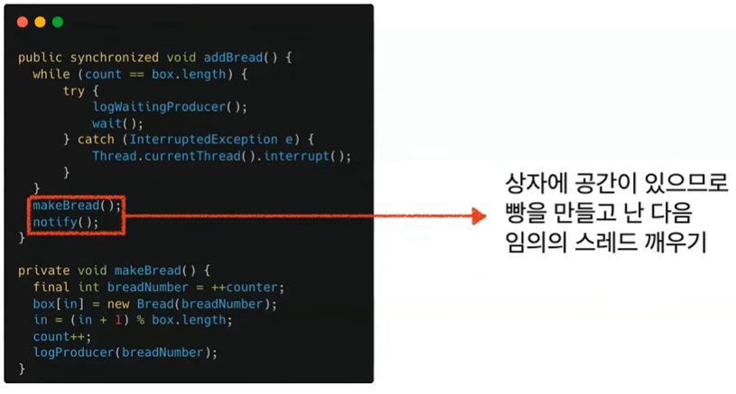
+ 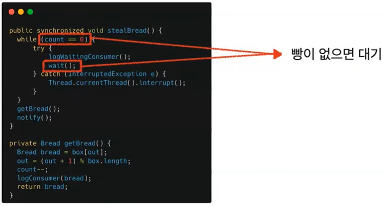
+ 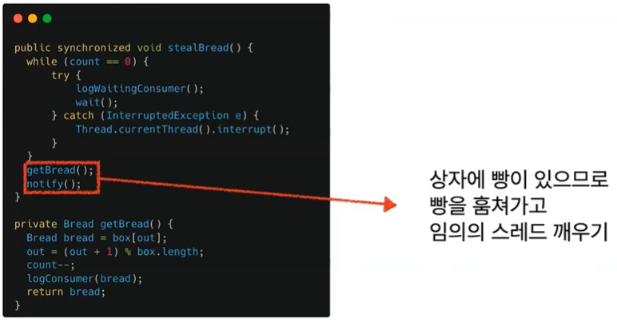
+ 실행해 보기
  + 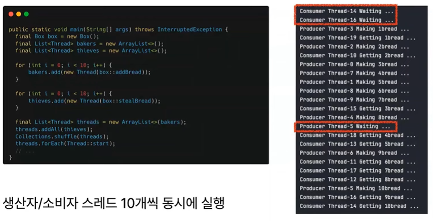
+ 이런 행동이 어떻게 가능했는지는 synchronized 키워드 때문이다

### Synchronized
+ Synchronized 키워드는 특정 메서드나 코드 블록에 대한 동시 접근을 제한해서 여러 스레드 사이의 동기화를 지원하게 된다
+ 다만 주의하실 점은 notify()와 wait(), notifyAll() 메서드는 반드시 synchronized 내부에서 호출이 되어야 한다는 것이다

#### Synchronized 사용하기 
+ 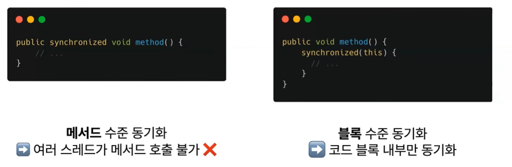
+ 전체 메서드가 아니라 특정 부분에서만 동기화가 필요하다라고 할 때 블록 수준 동기화를 사용면 된다

### Java 고유 락의 특징
+ Reentrancy (재진입성)
  + 재진입성이란 스레드는 이미 가지고 있는 고유 락을 다시 얻지 않아도 된다라는 특성
+ Visibility (가시성)
  + 가시성으로 어떤 스레드가 변경한 값은 다른 스레드에서도 볼 수 있다라는 특징

#### Reentrancy (재진입성)
+ 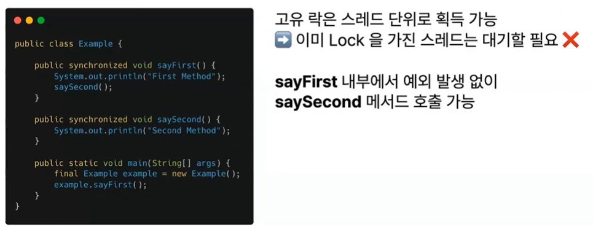
+ 고유락은 스레드 단위로 획득할 수 있기 때문에 이미 락을 가진 스레드는 추가로 대기할 필요가 없다
+ synchronized로 동기화된 sayFirst() 메서드에서 똑같이 synchronized로 동기화된 saySecond() 메서드를 동시에 부름에도 불구하고 예외 발생 없이 잘 호출된다

#### Visibility (가시성)
+ 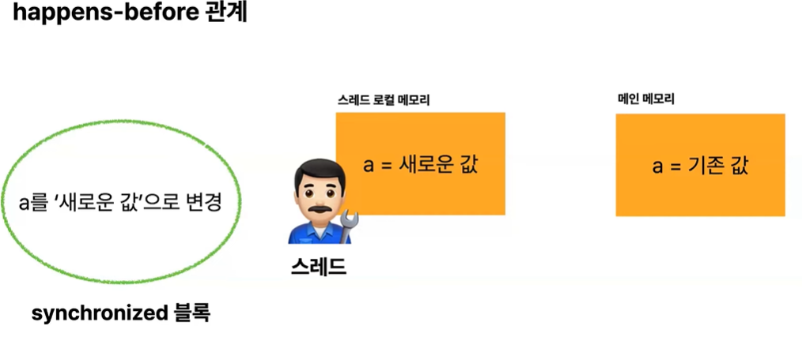
+ 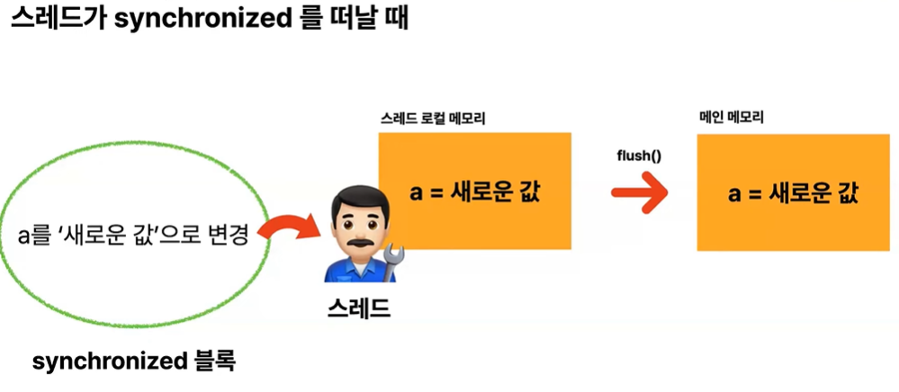
+ 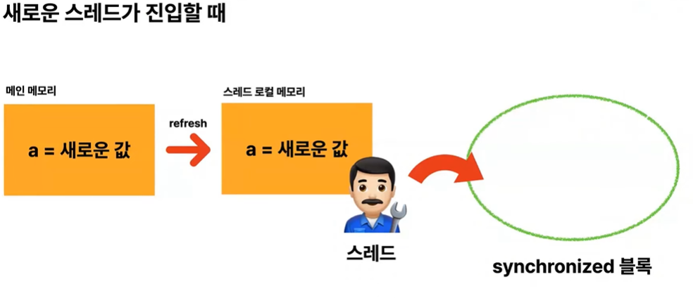
+ 가시성은 happens-before 관계라는 것으로 보장이 되게 된다
+ 스레드가 synchronized 블록 내부에서 a를 새로운 값으로 변경했다고 하면
+ 이 경우 스레드의 로컬 메모리에는 a는 새로운 값이 저장이 되어 있지만 메인 메모리 내부에서는 a가 기존 값으로 여전히 반영되지 않은 채 남아있다
+ 이 경우 synchronized 블록에서 스레드가 떠날 때 스레드 로컬 메모리에 있는 이 값을 메인 메모리로 flush()하는 과정이 이루어진다 
+ 따라서 메인 메모리가 스레드 로컬 메모리에 있는 값으로 동기화가 되는 것이다
+ 그리고 이제 동일한 synchronized 블록에 새로운 스레드가 진입하는 경우 메인 메모리에는 a는 새로운 값이 반영이 되어 있다
+ 이 때 스레드가 synchronized 블록 내부로 진입하는 경우에 스레드가 메인 메모리에서 스레드 로컬 메모리로 값을 refresh해오는 과정을 수행해서 가시성을 보장하게 한다

## 정리
+ Monitor는 세마포어보다 더 고수준의 동기화를 제공
+ Java는 synchronized를 사용해서 고유 락을 얻어서 동기화를 수행
+ synchronized는 스레드 재진입성과 가시성을 가능하게 한다
