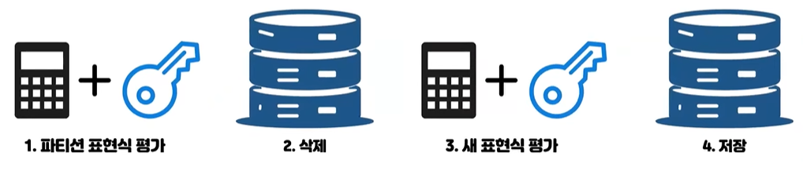
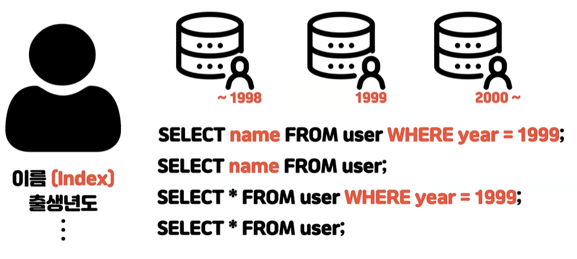
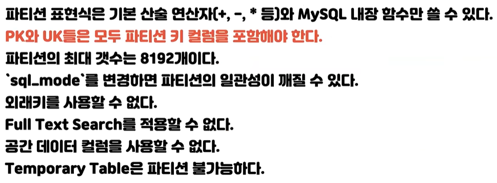
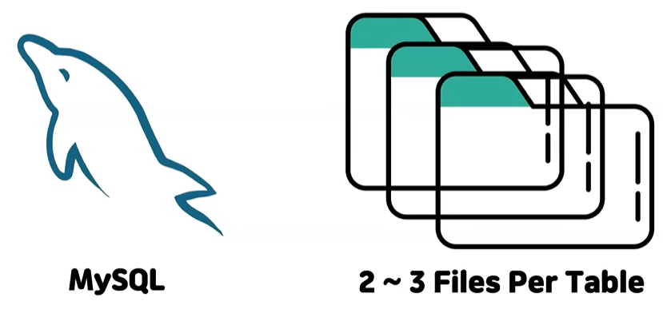
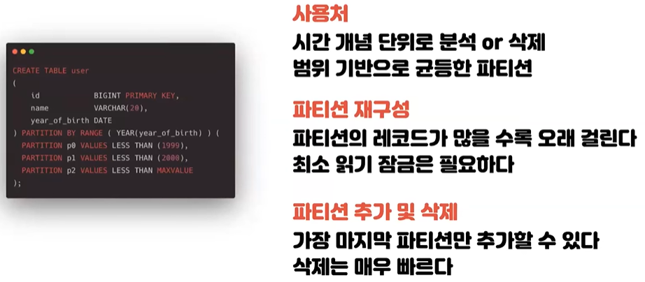
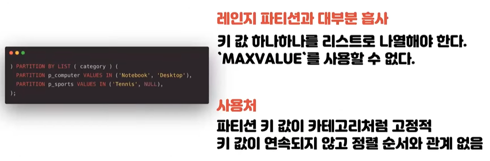
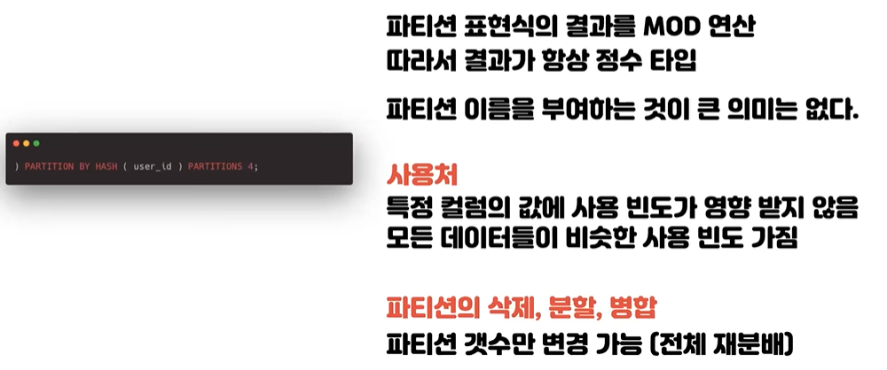
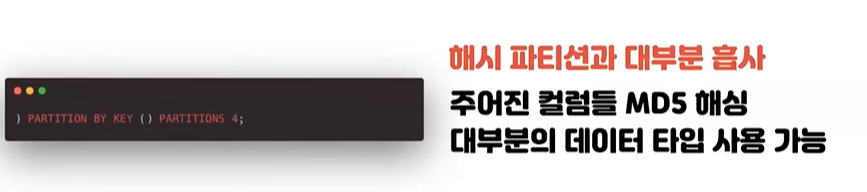
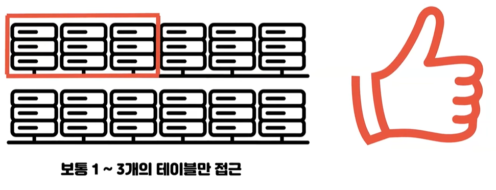
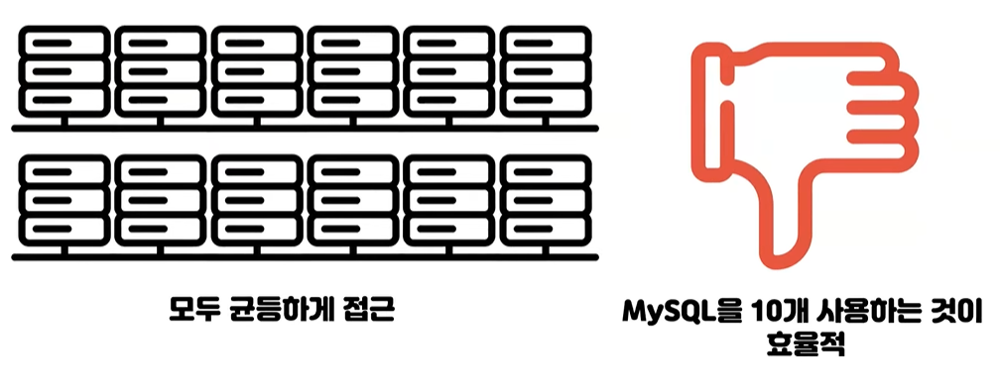

# 연어의 DB Partitioning
[https://youtu.be/VAhZa30j8hA?si=sHU1LAWoxEMsRMlB](https://youtu.be/VAhZa30j8hA?si=sHU1LAWoxEMsRMlB)

# 연어의 DB Partitioning
* toc
{:toc}

## 파티셔닝이란? 
+ 하나의 논리적인 테이블을 여러 개의 물리적인 테이블로 나누는 것입

## 사용하는 이유
+ MySQL 같은 경우는 파일시스템으로 데이터를 관리하는데 (인덱스 파일) 이 파일을 메모리에 한 번에 올릴 수 없을 때 굉장히 느려진다
+ 이럴 때 파티셔닝을 통해서 물리적으로 여러 테이블로 나눈다면 효율적으로 쓸 수 있다
+ 예시로 로그성 파일이 있는데 로그파일은 가장 오래된 것들은 주기적으로 지워져야 되고 로그 데이터가 라이프 사이클이 굉장히 짧다 그 범위를 기간으로 특정 범위만 조회를 하는 경우가 많기 때문에 범위를 기준으로 파티셔닝을 해서 쓴다면 효율적으로 쓸 수 있다

## MySQL에서의 내부 처리 방식

### INSERT 작업
+ 삽입할 때 파티셔닝을 하려면은 파티션하는 기준이 필요한데 기준을 파티션 표현식이라고 하고 로그성 파일 같은 경우는 년도나 월 단위로 기준이 된다
+ 그 기준을 가지고 어느 파티션에 저장을 할지 표현식을 평가를 해서 위치를 찾고 저장을 하면 된다

### UPDATE 작업 - 파티션 키 이외의 컬럼이 변경
+ 파티션 키 이외의 컬럼이 변경될 때는 파티션이 물리적인 위치와 변경되지 않는다 따라서 저장된 위치를 찾고 거기서 수정을 하면 된다

### UPDATE 작업 - 파티션 키 컬럼이 변경
+ 
+ 물리적으로 저장되어 있던 위치를 찾아서 기존 데이터를 삭제하고 원하는 대로 업데이트를 한 뒤에 새로 파티션을 결정해서 저장 하는 방식으로 동작한다

### 처리 방식
+ WHERE 절에서 파티션을 결정할 수 있는가?
+ WHERE 절에서 인덱스를 효율적으로 사용할 수 있는가?
+ 
+ SELECT name FROM user WHERE year = 1999;
  + WHERE절에서 1999년 파티션을 결정할 수 있기 때문에 나머지 파티션들은 옵티마이저가 접근하지 않는 걸로 실행 계획을 세운다 따라서 효율적다
  + SELECT 부분을 보면 커버링 인덱스로 가능하다 따라서 인덱스 레인지 스캔으로 효율적으로 가져올 수 있는 파티션을 했을 때 가장 효율적인 쿼리로 볼 수 있다
+ SELECT name FROM user
  + 파티션을 결정할 수가 없기 때문에 모든 파티션을 다 접근을 해서 각각의 경우에 데이터를 다 가져와서 머지 작업을 해야 된다 따라서 첫 번째 보다는 비효율적이지만 여전히 인덱스 레인지 스캔으로 효율적으로 가져올 수 있다
+ SELECT * FROM user WHERE year = 1999;
  + 1999년 파티션을 결정할 수 있는데 인덱스 레인지 스캔이 안된다 모두 가져오기 때문에 풀테이블 스캔을 돌아서 가져오게 된다
  + 테이블에 레코드가 많으면은 굉장히 느린 쿼리이다
+ SELECT * FROM user
  + 이제 파티션도 결정할 수 없어서 모든 파티션을 다 접근해서 데이터를 각각 가져 온 뒤에 머지 작업을 통해서 합쳐야 한다. 
  + 굉장히 안 좋은 쿼리 
  
## 제약 사항 및 주의 사항
+ 
+ 파티셔닝을 하는 이유가 작업 범위를 좁히기 위해서 하는 건데 예를 들어 어떤 테이블에 유니크키가 걸려있으면 그 테이블에 데이터를 넣으려고 할때
  그 데이터가 유니크 한지를 봐야한다 그런데 파티션이 되어 있다면 물리적으로 다 다른 위치에 저장되어 있기 때문에 각각 접근해서 다 유니크한지 검사를 하고 넣어야 한다
+ 따라서 PK와 UK가 걸려있는 테이블들은 해당 그 인덱스들이 모두 파티션 키 컬럼을 포함해야된다
+ 
+ MySQL 특성상 파일시스템으로 데이터를 관리 한다 보통 한 테이블에 접근을 하면은 두 개에서 세 개의 파일을 동시에 오픈을 해서 사용한다
+ 근데 만약에 이 테이블이 1024개 파티션이 되어 있다면 수천개의 파일을 동시에 메모리에 열어야해서 메모리 부하가 올 수 있다
+ MySQL 환경변수 중에서 동시에 몇 개까지 파일을 동시에 열 수 있는지 limit이 있다 해당값을 적절히 높은 값으로 설정을 해 줘야 한다

## MySQL에서 제공하는 파티션 종류

### 레인지 파티션
+ 
+ 로그 파일을 다룰 때 레인지 파이션을 보통 쓴다
+ PARTITION BY RANGE 괄호 안에 파티션 표현식이 들어가는데 지금은 MySQL 내장 함수를 사용해서 년도를 기준으로 3가지 파티션으로 나눈 모습이다
+ 범위 기반으로 시간 개념으로 분석을 하거나 삭제하는 로그 파일 같은 경우 사용
+ p2가 굉장히 넓게 잡혀 있는데 2000년 이후부터 그냥 최대치까지 잡혀 있는 저 파티션을 두 세개로 쪼개고 싶을 경우 그때 재구성을 하게 되는데
  해당 물리적인 데이터의 위치를 다 옮겨야 되기 때문에 거기 레코드가 많으면 많을수록 오래 걸린다 그리고 그걸 이동하는 동안 쓰기 작업 일어나는 정합성이 깨질 수 있기 때문에 최소한 읽기 잠금이 필요하다는 조건이 있다
+ 파티션을 추가 하고 싶을 때는 지금은 이제 1999년 이전부터 2000년 이후 까지 모든 정수 범위를 다 파티션으로 되어 있는데 이 경우는 파티션 추가가 불가능하고 포함되어 있지 않은 범위가 있으면은 자유롭게 파티션
  추가를 할 수 있다 보통 가장 마지막 파티션만 추가할 수 있고 삭제를 할 때는 해당 그 파일을 삭제만 하면 되기 때문에 원하는 파티션 아무거나 골라서 빠르게 지울 수 있다

### 리스트 파티션
+ 
+ 리스트를 보면 레인지 파티션과 굉장히 비슷한데 다른 점이 있다면 이 데이터들은 범위성 데이터가 아니다 연속적이지도 않고 정렬 할 수가 없다
+ 이런 카테고리성 데이터들을 기준으로  파티션을 할 때 쓰게 되고 특이점으로는 NULL도 하나의 카테고리로 가서 NULL 값도 기준으로 잡을 수 있다

### 해시 파티션
+ 
+ 여기부터는 이제 파티션을 하고 싶은데 어떤 기준으로 파티션을 할지 그 기준을 못 찾을 때 쓴다
+ 파티션 이름이 사라졌고 표현식 안에 유저 아이디를 기준으로 4개의 파티션으로 나누라고 되어 있다 
+ 처음엔 유저 아이디를 모듈로 4 연산을 해서 네가지 파티션으로 나누게 된다 
+ 애초에 해시 파티션을 쓰는 이유가 특정 컬럼의 값에 따라 사용빈도가 영향을 받지 않기 때문에 이름을 부여할 수는 있는데 하는 것이 의미가 없다 따라서 보통 부여를 안 한다
+ 삭제나 분할 병합을 하려면 모듈러 연산을 통해서 한 거기 때문에 특정 파티션을 지우거나 추가하거나 할 수가 없어다
  + 4로 나눠져 있는걸 6으로 나누고 싶다 그러면은 모든 파티션이 데이터들을 다시 모듈로 6 연산으로 재평가를 해야 된다
+ 모듈러 연산을 하기 때문에 괄호 안에 표현식의 결과가 항상 정수로 나와야 된다 

### 키 파티션
+ 
+ 해시 파티션에서 모듈러 연산을 하기 때문에 괄호 안에 표현식의 결과가 항상 정수로 나와야 되는데 그렇게 안 쓰고 싶어서 키 파티션도 있다
+ 괄호 안에 들어가는 컬럼들의 값을 MD5 해싱 알고리즘으로 한번 정수형으로 바꾼 뒤에 모듈로 4연산을 하게 된다 따라서 대부분의 데이터 타입을 사용할 수 있다

## 예시 및 정리
+ 
  + 12개로 파티션 된 경우 세 개의 파티션만 접근을 하면 나머지 파티션은 옵티마이저가 접근할 필요가 없어서 접근을 안 하기 때문에 매우 좋은 예시이다
+ 
  + 모두 균등하게 접근을 하고 있으면 평가하는 시간도 들어가고 각 파티션에서 데이터를 가져와서 머지 하는 작업이 일어나기 때문에 오버 헤드만 커집니다 이런 경우는 차라리 MySQL 서버를 물리적으로 10개를 사용하는 샤딩을 하는 것이 훨씬 효율적이다
