# 저문, 라온의 Cache & Redis
[https://youtu.be/tVZ15cCRAyE?si=Sx1RhxkAYo3OsBBL](https://youtu.be/tVZ15cCRAyE?si=Sx1RhxkAYo3OsBBL)

# 저문, 라온의 Cache & Redis
* toc
{:toc}

## CACHE

### 인트로
+ 서비스가 커지게 된다면 클라이언트도 많아지고 요청도 많아질 것이다 이러면 자연스럽게 DB에 대한 부하도 증가하게 된다 따라서 이 DB에 대한 부하를 줄이기 위해서 이 서버와 데이터베이스 사이에 캐시를 도입한다면 성능적인 문제를 좀 해결할 수 있다

### 캐시란
+ 캐시는 데이터나 값을 미리 복사해놓는 임시 저장소
+ 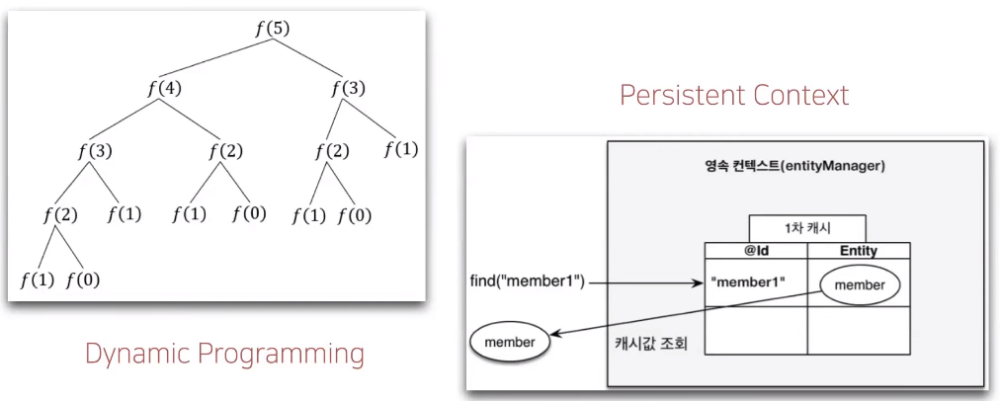
+ Dynamic Programming에서는 이전의 값을 저장할 때 캐시의 역할을 사용하고 있다
+ JPA 영속성 컨텍스트도 내부적으로 1차 캐시를 통해서 직접 데이터베이스에 접근하지 않고 1차 캐시에서 데이터를 가져와서 성능적인 이점을 가져가고 있다

### 캐시 사용 이유
+ 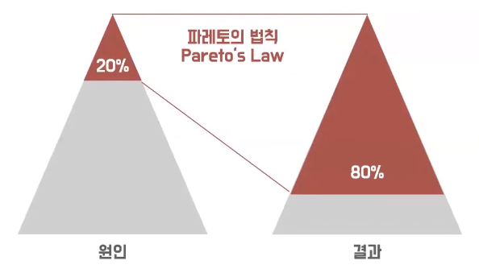
+ 파레토의 법칙이란 많은 성과에서 약 80%의 결과가 20%의 원인으로부터 나온다는 법칙
+ 캐시에 자주 사용되는 약 20%의 데이터를 미리 캐싱해둔다면 효과적인 성능 향상을 이끌어낼 수 있다

+ 공간적 지역성
  + 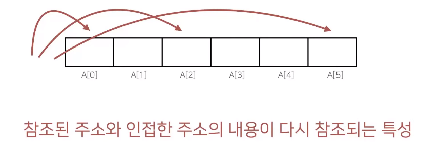
  + 실제 메모리 주소에서 한번 참조되었던 주소와 인접한 주소의 내용들이 다시 참조되는 특성을 공간적 지역성이라고 할 수 있다
+ 시간적 지역성
  + 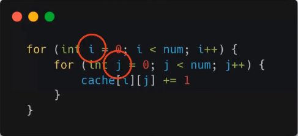
  + i와 j같은 이런 반복되는 변수들이 있는데 이 변수들은 for문이 반복됨에 따라서 계속해서 접근하게 된다
  + 이렇게 사용되었던 데이터가 빠른 시일 내에 다시 사용될 가능성이 높다는 것을 시간적 지역성이라고 한다

### 캐시 전략 패턴
+ 캐시에 데이터가 있어서 바로 받아올 수 있는 상황을 Cache Hit라고 한다
+ 캐시를 조회했는데 원하는 데이터가 없어서 데이터베이스로 직접 찾아가서 조회를 하는 상황을 Cache Miss라고 한다 

#### 읽기 전략
+ 읽기 전략에는 Look Aside 패턴과 Read Through 패턴이 있다

##### Look Aside 패턴
+ Aside란 '옆 또는 곁'이라는 뜻이고 Look은 '보다'라는 뜻
+ 따라서 캐시의 데이터가 없을 때 옆 또는 곁, 즉 데이터베이스를 조회해서 데이터를 읽어오는 전략 
+ 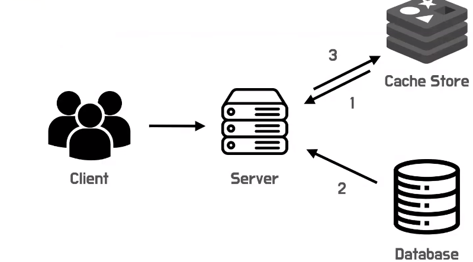
+ 하지만 데이터가 없다면 aside를 본다 즉 데이터베이스에서 데이터를 가져오게 된다 그리고 캐시에 올려놓고 사용을 한다
+ 장점
  + 먼저 캐시에 문제가 생기는 경우 캐시가 없다고 생각하면 전적으로 DB에 위임을 해서 데이터를 가져올 수 있다
+ 단점
  + DB와 캐시를 직접 잇는 그런 연결점 즉 동기화가 되지 않기 때문에 데이터 정합성 유지가 어렵다
  + 첫 번째 조회를 할 때는 항상 데이터베이스로부터 데이터를 가져와서 캐시에 올려놓고 사용을 할 수밖에 없기 때문에 DB에 부하가 발생하게 된다

##### Read Through 패턴
+ Through는 '무엇을 통하여' Read는 '읽다'라는 뜻
+ 항상 캐시를 통해서 읽는 전략
+ 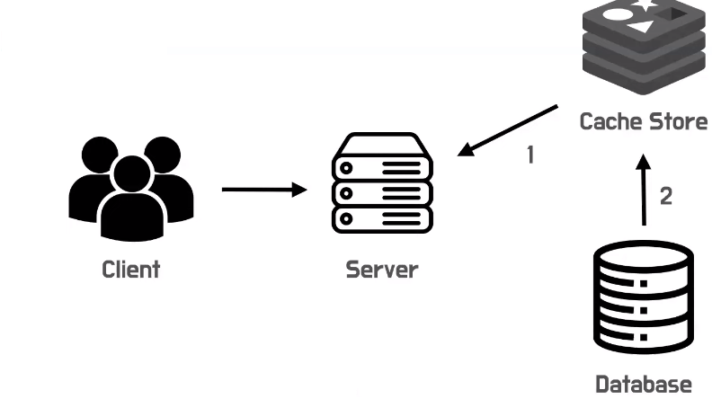
+ 데이터가 캐시에 없다면 데이터베이스로부터 캐시가 데이터를 직접 가져온 다음에 그 데이터를 애플리케이션이 읽게 된다 
+ 장점
  + 캐시와 DB 간에 이런 연결점이 있기 때문에 항상 데이터의 정합성이 보장된다
+ 단점
  + 캐시가 죽어버리면 애플리케이션도 문제가 발생하게 된다

#### 쓰기 전략
+ 쓰기 전략에는 Write Around 패턴 Write Back, Write Through 이렇게 세 가지가 있다

##### Write Around 패턴
+ Around는 '우회' 그리고 Write '쓰기', 즉 쓰기를 우회한다
+ 캐시를 우회해서 직접 쓴다는 것을 의미
+ 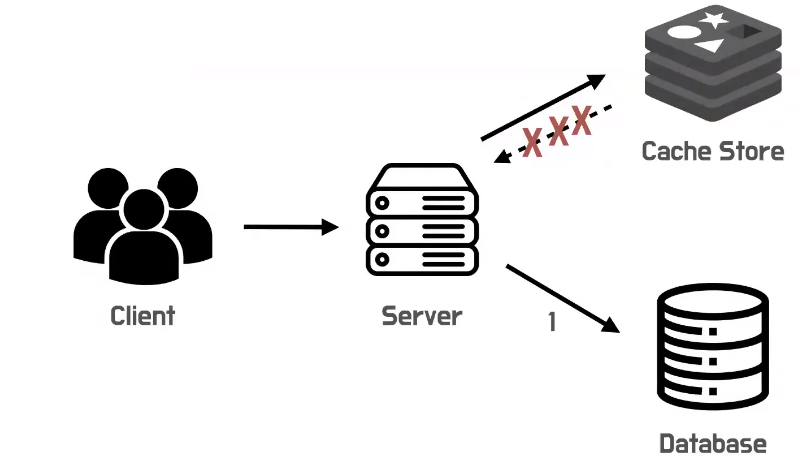
+ 하나의 애플리케이션이 있으면 직접 데이터베이스에 이렇게 바로 쓴다 이 캐시 전략 패턴이라는 이름과는 좀 맞지 않게 캐시에 직접 쓰지 않고 이렇게 DB에 쓰고 있다
+ 하지만 이제 이것을 읽기 전략과 혼합해서 사용할 때는 캐시 미스가 발생한다면 데이터를 캐시 스토어에서 쓰기도 한다
+ 장점
  + 성능이 매우 좋다 데이터베이스에 직접 바로 쓰기 때문이다
  + 불필요한 데이터를 캐시에 올리지 않고 바로 쓰기 때문에 리소스를 아낄 수 있다
  + 캐시를 거쳐서 쓰지 않기 때문에 성능이 좋은 것도 있다
+ 단점
  + 캐시와 DB에 연결점이 없기 때문에 데이터 정합성 유지가 어렵다

##### Write Back 패턴
+ Back은 '나중에', Write는 '쓰다'
+ 캐시에 데이터를 미리 한꺼번에 써 놓고 나중에 DB에 쓰기 작업을 진행
+ 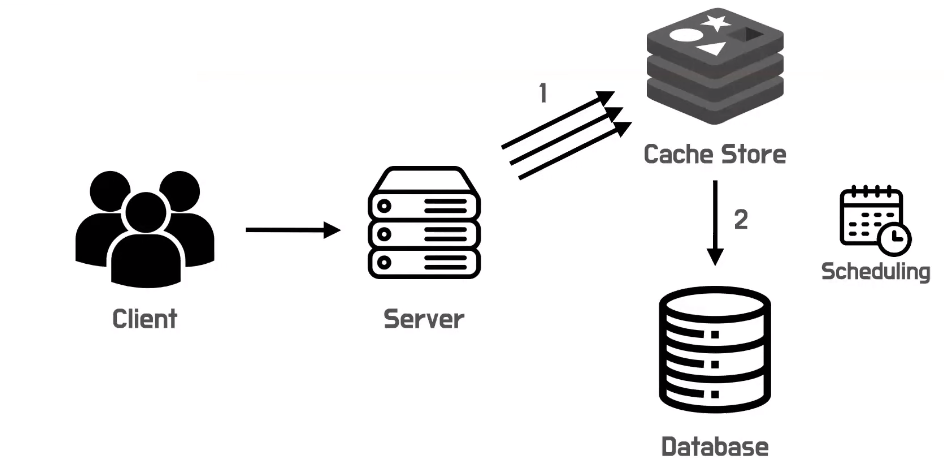
+ 캐시에 먼저 많은 양의 데이터를 써 둔다 그리고 나중에 DB에 쓰기 작업을 진행하는데 이때 Scheduling이라는 방식을 사용한다
+ 따라서 일정 시간이 지난 뒤에 한꺼번에 많은 양의 데이터를 한 번의 쓰기 요청으로 해결할 수 있다
+ 장점
  + 많은 양의 데이터를 쓰게 된다면 insert문이 여러 개 나가서 성능적으로 좀 문제가 생길 수 있는데 하나의 insert문으로 묶어서 데이터를 처리하게 되니까 성능적으로 이점을 가져갈 수 있다
+ 단점
  + 캐시 스토어에만 데이터를 써놓은 상태에서 캐시가 죽어버리게 된다면 데이터가 DB까지 직접 쓰여지지 않아 데이터 유실 문제가 발생할 수 있다

##### Write Through 패턴
+ 항상 캐시를 통해서 쓰기를 진행
+ 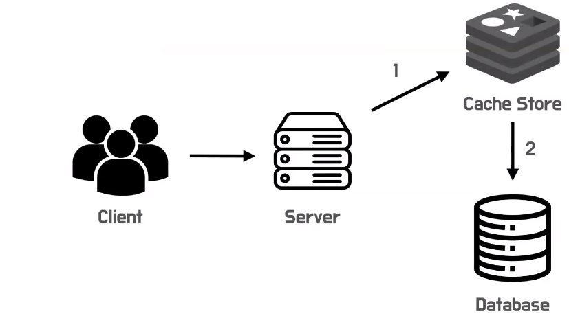
+ 캐시에 먼저 쓰고 데이터베이스에 바로 쓰기 작업을 진행한다
+ 장점
  + 항상 캐시를 거치고 데이터베이스로 가기 때문에 데이터의 정합성은 보장될 수밖에 없다
+ 단점
  + 무조건 필수적으로 이렇게 두 번의 쓰기가 진행되기 때문에 성능 문제를 고려하면서 사용하시는게 좋다

### 캐시 사용 시 주의사항
+ 자주 사용되면서 변경되지 않는 데이터를 캐싱해두는 게 좋다
+ 유실되어도 크게 문제가 없는 데이터를 캐싱하는 게 좋은데 왜냐하면 캐시는 직접 디스크에 쓰는 것이 아니라 메모리상에서 유실되기 때문에 메모리가 죽어버린다면 데이터가 유실될 문제가 있다
+ 데이터베이스와 함께 사용할 때는 데이터 정합성 문제를 고려해서 사용하시는 게 좋다

## REDIS

### 레디스란?
+ Redis는 Remote Dictionary Server의 약자로 외부의 사전 형태로 저장하는 서버라는 뜻
+ 사전 형태란 Key-Value 구조를 의미
+ Java Collection에서 사용하는 HashMap과 유사하다고 볼 수 있다
+ Redis는 메모리에 저장하는 key-value 기반의 NoSQL DBMS라고 할 수 있습니다

+ 캐시와 어떤 관계?
  + 캐시는 데이터나 계산 결과를 미리 저장하여 빠른 액세스와 높은 성능을 제공하기 위한 저장소
  + 캐시 구현 방법으로 Memcached, Redis, Local Memory Cache 등이 있다
  + 즉, Redis는 캐시를 구현하는 방법 중 한 가지라고 할 수 있다
+ 그럼 Redis는 캐시 용도로만 사용이 될까?
  + Redis는 앞서 메모리에 저장되어 액세스가 빠르다는 점에서 캐싱 용도로 많이 사용되지만 그 외에도 임시 작업 큐, 실시간 채팅, 메시지 브로커 등 캐시 외에 다양한 용도로 활용되는 것을 알 수 있다

### 레디스 특징
+ 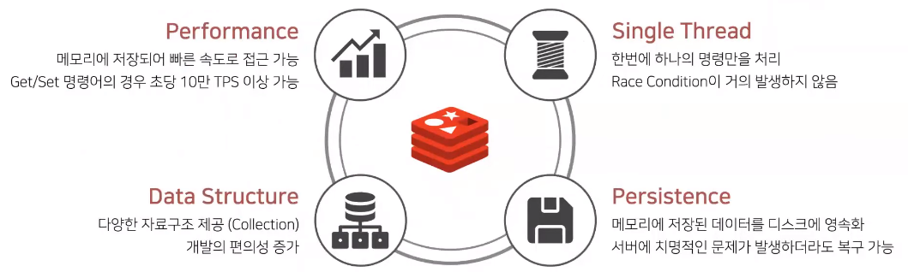
+ 성능 측면 으로는 Redis는 디스크가 아닌 메모리에 저장되어 빠른 속도로 접근 가능하다는 특징을 가지고 있다 단순한 Get/Set 명령어의 경우에는 10만 TPS 즉 1초당 10만번의 명령을 수행 가능하다
+ Data Structure 측면 으로는 Redis는 앞서서 Key-Value 기반의 구조라고 하였는데 이때 Value에 다양한 자료 구조가 제공된다 JPA에서 데이터베이스를 컬렉션처럼 사용하여 개발이 편한 것처럼 이러한 자료구조 제공은 개발의 편의성을 증가시키고
또 개발자가 비즈니스 로직에 집중할 수 있도록 하는 장점을 제공한다
  + 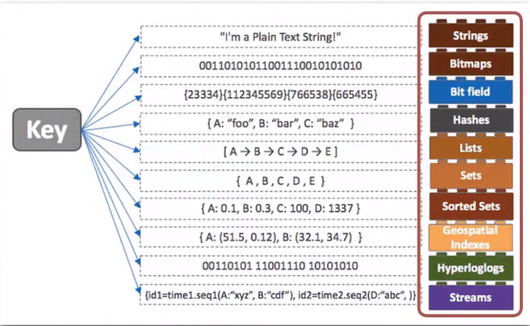
  + key는 기본적으로 String으로 제공되고 value는 Hash, List Set, Sorted Set 등과 같은 다양한 자료구조 형태로 제공된다
+ Redis는 Single Thread로 동작을 하여서 한 번에 하나의 명령만을 처리가 가능한데 이러한 특징 때문에 Race Condition이 거의 발생하지 않는다는 장점이 있다
  + Race Condition: 두 개 이상의 프로세스가 동시적으로 하나의 리소스에 하여서 서로 경쟁하는 상태를 의미한다
+ Redis는 메모리에 저장되어 데이터가 당연히 휘발될 것이라고 생각될 수 있는데 이때 Redis는 메모리에 저장된 데이터를 디스크에 영속화하는 기능을 제공한다 따라서 서버에 치명적인 문제가 발생하더라도 복구 가능하다는 특징을 가지고 있다
  + 이 persistence 기능의 옵션으로 RDB, AOF 총 두 가지 옵션이 있다
  + RDB의 경우에는 특정한 간격으로 현재 Redis 메모리에 존재하는 데이터의 스냅샷을 남기는 방식이다
  + 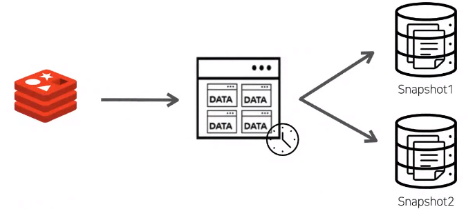
    + 장점: 데이터를 모두 압축하여 저장하기 때문에 AOF 방식보다는 크기가 작고 또 데이터 자체를 저장하기 때문에 로딩하고 복구하는 속도가 빠르다
    + 단점: 백업 중에 서버가 다운될 경우에는 특정한 간격으로 저장을 하기 때문에 그 사이에 발생한 데이터에 대한 유실 가능성이 존재한다
  + AOF는 데이터 변경이 일어나는 insert, update, delete와 같은 명령이 실행될 때마다 그 해당 명령어들을 로그 파일에 기록
  + 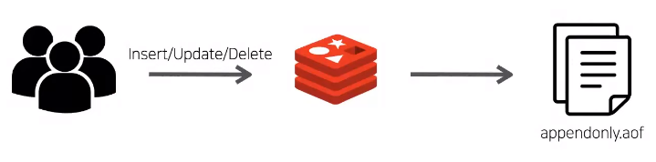
    + 장점: 저장속도가 빠르고 RDB와 달리 실시간 데이터 백업이 가능하여 데이터 손실이 거의 일어나지 않다
    + 단점: 명령 실행 기록을 모두 기록하기 때문에 RDB보다는 파일 크기가 크고 또 데이터 자체를 저장하는 것이 아니다 보니까 복원 소요 시간이 길다는 단점이 있다

### 레디스를 우아하게 
+ 데이터 타입에 따른 적절한 자료구조 사용
  + 최근 검색 목록을 표시할때 Redis의 Sorted Set 자료구조를 사용하면 Sorted Set 자료구조가 가중치를 기준으로 오름차순으로 정렬되는 특징을 가지고 있어서
    가장 나중에 들어온 아이템이 맨 마지막 인덱스에 저장되는 것을 확인할 수 있다
+ O(N) 명령어에 대한 주의
  + Redis는 Single Thread로 동작을 하기 때문에 KEYS, FLUSHALL, FLUSHDB, Delete Collections, Get All Collections와 같은 O(N) 명령어의 경우에는 해당 명령이 처리될 때까지 다음 명령어들이 대기 상태로 전환되는 문제가 발생한다 
  + 따라서 저희가 Redis를 빠른 성능을 위해 사용을 하였지만 오히려 더 느린 성능이 제공될 수 있다
+ Redis의 경우 인메모리 데이터 스토어이므로 메모리 관리가 필수데 메모리 특성상 메모리 단편화가 발생한다
  + 여기서 메모리 단편화란 메모리가 작은 공간으로 나뉘어져 관리되어서 사용 가능한 공간이 충분한데도 불구하고 해당 메모리를 할당하지 못하는 상태를 의미
  + 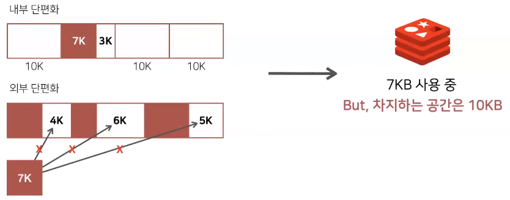
  + 따라서 저희는 실제 물리 메모리 사용량을 나타내는 RSS값을 모니터링하여서 메모리 관리를 해 주어야 한다
+ Redis 목적성
  + Redis는 다양한 형태로 활용될 수 있다고 하였는데 Redis를 도입을 할 때 캐시용으로 사용할지 저장소용으로 사용할지에 대한 목적을 분명히 할 필요가 있다
  + 그 이유로는 앞서 설명드렸던 파일을 DB에 영속하는 기능인 Persistence 기능이 장애 발생 가능성이 높은 것으로 알려져 있어서 Redis에 저장되었던 데이터가 없어져도 문제가 없는지 일부 값이 유실되어도 치명적인지 등을 판단해서 캐시용으로만 사용을 한다면
    persistence 기능을 사용하지 않는 것을 권장하고 있다
