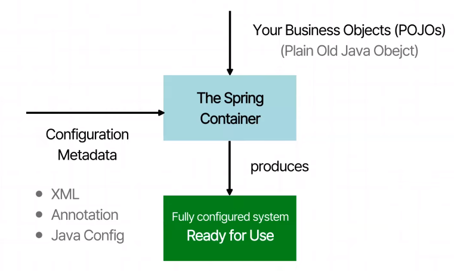
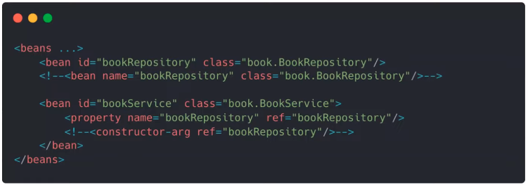
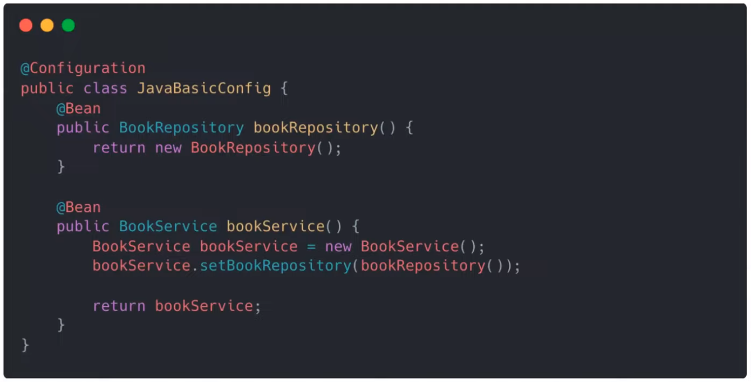
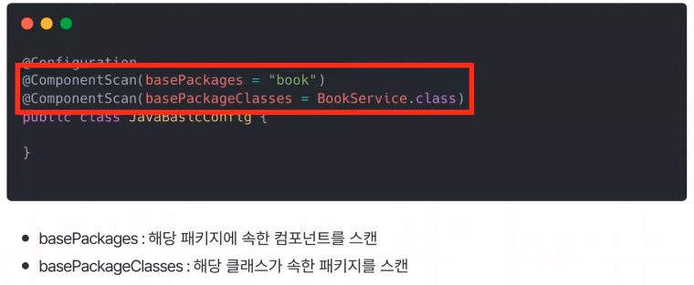

# 토리의 Spring Bean
[https://youtu.be/UcpLNgko8lg?si=va5oD7OYaAixsbXc](https://youtu.be/UcpLNgko8lg?si=va5oD7OYaAixsbXc)

# 토리의 Spring Bean
* toc
{:toc}

## Spring Bean
+ 스프링 빈이란 공식 문서에 따르면 스프링 빈은 스프링 IoC 에서 인스턴스화 하고 조립 및 구성, 관리하는 객체라고 나와 있다
  + 간단히 말해서 스프링 IoC 컨테이너에 의해 관리되는 자바 객체라고 할 수 있다

## Spring IoC Container
+ IoC는 컨트롤 Inversion Of Control의 약자로 제어의 역전이라는 뜻이다
  + 프로그램의 실행 흐름이나 객체 생명주기를 개발자인 저희가 제어하는 것이 아니라 외부에서 관리해주는 것을 말한다
+ 스프링 IoC 컨테이너는 공식 문서에 따르면 스프링 빈으로 알려진 객체를 인스턴스화, 구성 및 조립하고 생명주기를 관리하는 역할을 한다 라고 나와 있다
+ 스프링 어플리케이션에서는 이 스프링 빈을 스프링 컨테이너가 담당해서 관리하기 때문에 이 스프링 컨테이너를 스프링 IoC 컨테이너 혹인 스프링 DI 컨테이너 라고 부르기도 한다
+ 
+ xml 파일 또는 어노테이션 또는 자바 Configuration 파일을 기반으로 한 Configuration 메타데이터와 빈으로 등록하고자 하는 POJO를 통해 빈을 생성할 수 있다
+ 스프링 컨테이너는 빈을 어떻게 등록할지 빈의 라이프 사이클 세부 정보와 빈는 의존관계에 대한 정보를 configuration 메타데이터를 통해서 설정 한다

## Spring Bean 등록 방법
+ 
+ 가장 고전적인 방법인 xml 설정 파일을 통한 방법이 있다
+ 리소스 폴더 하위에 xml 파일을 생성하고 xml 파일에서 beans 태그 아래에 bean 이라는 태그으로 빈을 등록할 수 있다
+ 아이디는 빈의 이름을 클래스는 빈으로 등록하고자 하는 클래스가 위치한 패키지 명이 포함된 위치를 명시해준다
+ setter로 의존성을 주입하고자 할 때는 프로퍼티 태그를, 생성자를 통해서 의존성을 주입하고자 할때는 constructor 태그를 사용할 수 있다
+ 현재 xml 설정 파일을 통한 방법은 잘 사용되지 않고 있다
+ 
+ configuration 어노테이션을 붙이면 자바 클래서 파일을 자바 설정 파일로 등록할 수 있다
+ 자바 설정 파일에서 빈 어노테이션을 사용해서 객체를 생성 하고 반환하는 것만으로도 간단하게 빈으로 등록할 수 있다
+ 메소드의 이름이 빈의 이름이고 메소드의 반환 타입이 빈의 타입 그리고 반환되는 값이 빈의 레퍼런스가 된다
+ xml 설정 파일을 통한 등록 방법과 마찬가지로 수동으로 빈을 등록해줘야 하기 때문에 클래스가 많아질수록 시간이 많이 걸리고 생산력이 떨어진다
+ 
+ 스프링에서는 컴포넌트 스캔이라는 기능을 제공한다
+ 컴포넌트 스캔이란 컴포넌트 어노테이션을 가진 모든 대상을 가져와서 빈을 등록하기 위해 찾는 과정을 말하는데 컴포넌트 스캔은 이 컴포넌트 어노테이션이 붙은 모든 클래스들을 자동으로 빈에 등록해 준다
+ 이때 빈의 이름은 앞글자가 소문자로 변환되어 클래스 이름으로 사용되며 컴포넌트 어노테이션 안에 직접 이름을 지정해 줄 수도 있다
+ 
+ 컴포넌트 스캔의 탐색 위치는 기본적으로 이 컴포넌트스캔 어노테이션이 붙은 자바 설정 파일이 위치한 패키지에서 시작되는데 베이스 패키지 혹은 베이스 패키지 클래스라는 속성을 이용해서 탐색하는 위치를 지정해 줄 수도 있다
+ 베이스 패키지는 typesafe 하지 않기 때문에 철자가 조금이라도 잘못되면 스캔이 되지 않는 오류가 발생할 수도 있다

## Spring Bean 관리 방법
+ 등록된 빈을 컨테이너는 싱글톤으로 관리 하는데 싱글톤이란 객체 인스턴스가 오직 하나만 생성되는 것을 보장하는 디자인 패턴 이다
    + 디자인 패턴과 완전히 동일하지는 않지만 비슷한 개념을 가진 싱글톤 빈은 하나의 정의에 컨테이너에 단 하나의 객체만 존재하는 것이다
    + 기본적으로 스코프를 지정해주지 않으면 빈이 싱글톤의 범위로 등록된다
    + 클라이언트들이 스프링 빈을 요구할 때 컨테이너에서는 같은 참조 값을 가진 빈을 반환해준다
+ 싱글톤 빈 주의점
    + 객체의 상태를 유지하게 설계해선 안 된다
        + stateless 해야한다.
    + 특정 클라이언트에 의존적이거나 값을 변경할 수 있는 필드가 있어서는 안된다
    + 가급적 읽기만 가능해야 한다
+ 빈 태그의 스코프 속성이나 스코프 어노테이션을 프로토타입으로 지정해 두면 stateful한 상태를 가지는 프로토타입 빈을 생성할 수 있다
    + 이때는 클라이언트들이 스프링 빈을 요구할 때마다 컨테이너에서 빈을 생성 하고의존성을 주입하고 만들어진 프로토타입 빈을 반환 해주게 된다
    + 싱글톤 빈과 프로토타입 빈이 다른 점은 빈의 생명주기에도 있다
        + 스프링 빈 생성, 의존 관계 주입, 초기화 콜백드 호출, 사용, 소멸 전 콜백 메소드 호출, 스프링 종료와 같은 생명주기를 가지게된다 싱글톤 빈은 이 스프링 컨테이너와 동일한 생명주기를 가지는 반면 프로토타입 빈은 빈을 생성하고 주입하고
          초기화 콜백 메소드 호출 뒤 클라이언트에 반환해주는 것까지만 컨테이너가 관리하게 된다
    + 이 외에도 request, session, application, websocket 과 같은 스코프가 존재
        + 
        + 이 네 가지 스코프들은 일반적으로 스프링 어플리케이션에서 사용되는 것이 아니라 스프링 웹 MVC 어플리케이션에서만 사용
