# 하마드의 복제와 복제 지연
[https://youtu.be/CXGzd07c_xo?si=HGfTc8L_vgS_gJK-](https://youtu.be/CXGzd07c_xo?si=HGfTc8L_vgS_gJK-)

# 하마드의 복제와 복제 지연
* toc
{:toc}

## 개념과 목적
+ 한 서버에서 다른 서버로 데이터가 동기화 되는 것
+ 원본 데이터를 가지는 서버를 소스 서버 복제된 데이터를 가진 서버를 레플리카 서버라고 한다
+ 소스 서버에서 데이터 변경 사항이 발생하면 레플리카 서버로 동기화가 되는 것이다

### 복제의 목적
+ 스케일 아웃
  + DB 서버를 하나 더 증설 시켜서 단일 DB에 몰리는 쿼리를 분산함으로 인해서 그만큼 부하를 감소
+ 데이터 백업
  + 만약에 소스 서버 한대에서 데이터 백업을 진행한다고 하면 데이터 백업 프로그램이 소스 서버와 자원을 공유해서 사용하기 때문에 그만큼 비즈니스적으로 부하가 발생할 수밖에 없다
  + 그렇기 때문에 복제용 데이터베이스 서버를 하나 분석해서 소스 서버에 받는 영향을 차단시킬 수도 있고 소스 서버에서 장애가 났다 했을 때 백업용 복제 데이터 서버를 소스 서버로 승격시켜줄 수 있다
+ 데이터 분석
  + 통계적 결과물 산출을 위해서 비즈니스적인 것 말고 분석용 쿼리를 날리는 경우도 있는데 이때는 보통 대량의 데이터를 줘야 하거나
    아니면 집계용 함수를 사용하는 등 상당히 좀 무거운 작업이 동반되는 경우가 대다수이다 그렇기 때문에 이런 분석용 복제 데이터베이스를 따로 구축해서 실제 비즈니스에 대한 영향을 차단할 수 있다
+ 데이터의 지리적 분산
  + CDN이랑 비슷한 개념
  + 예를 들어서 애플리케이션 서버와 DB 서버가 물리적으로 거리가 멀어서 응답 속도가 느리다 하는 경우에는 지리적으로 가까운 곳에 복제 서버를 둬서 응답 속도를 개선 시킬 수 있다
+ 종합적으로 말하면 고가용성을 위한 것

## 바이너리 로그와 복제 스레드

### 바이너리 로그
+ 바이너리 로그는 데이터, 테이블 구조, 권한 변경 정보가 저장되는 파일
+ 바이너리 로그는 소스 서버에 존재하는 로그 파일 바이너리 로그를 활성화 시키면 소스서버 있는 모든 데이터에 대한 변경내역들이 바로 바이너리 로그에 기록이 되고 저장이된다 
그리고 바이너리 로그에 기록된 이벤트들이 레플리카 서버에 있는 릴레이 로그로 전달이 된다 그러면은 릴레이 로그에 있는 기록 내용을 실제적인 레플리카 서버의 데이터 파일에 저장되게 되는것이다
+ 릴레이 로그는 소스 서버의 바이너리 로그를 읽어 레플리카 서버에 저장해둔 파일 
+ 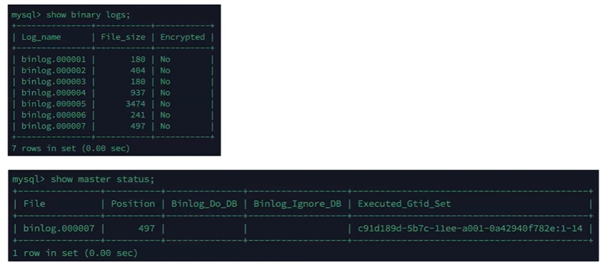

### 복제 스레드
+ mysql 복제에서는 소스 서버에 존재하는 바이너리로그 덤프 스레드 그리고 레플리카 서버에 존재하는 애플리케이션 I/O 스레드와 레플리케이션 SQL 스레드가 존재하고 있다

#### 바이너리 로그 덤프 스레드
+ 소스 서버의 바이너리로그에서 아직 반영되지 않은 이벤트 내역을 레플리카 서버로 전송한 역할을 갖고 있습다
+ 소스 서버에서 show processlist 명령을 실행하면 실행 상태를 확인할 수 있다
+ 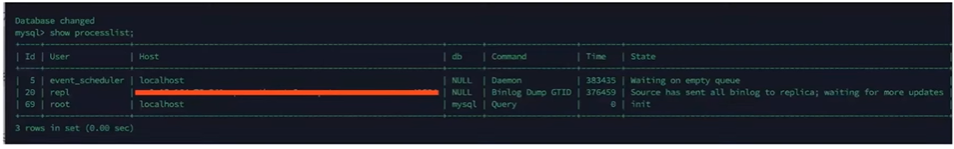

#### 레플리케이션 I/O 스레드
+ 바이너리 로그 덤프 스레드로부터 읽어온 이벤트 내역을 릴레이 로그에 저장
+ show replica status; 명령어의 결과의 Replica_IO_Running 컬럼에서 상태 확인

#### 레플리케이션 SQL 스레드
+ 릴레이 로그 파일의 이벤트를 읽고 실행시켜, 실제 데이터파일에 적용
+ show replica status; 명령어의 결과의 Replica_SQL_Running 컬럼에서 상태 확인 
+ 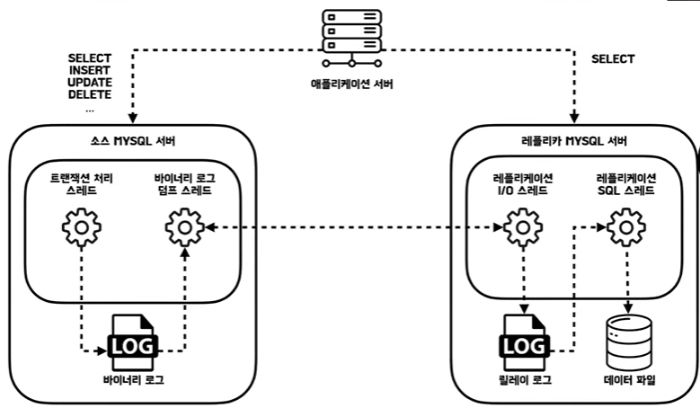

## 복제 타입
+ mysql 복제는 바이너리 로그에 있는 변경을 어떻게 식별하냐에 따라서 바이너리 로그 파일 위치 기반 방식과 글로벌 트랜젝션 아이디(GTID) 기반 복제 방식으로 나누어 지게 된다

### 바이너리 로그 파일 위치 기반 방식
+ 레플리카 서버가 데이터를 동기화 시키기 위해서 바이너리 로그 파일 이름과 그 위치를 기반으로 다음 데이터를 요청하는 방식
+ 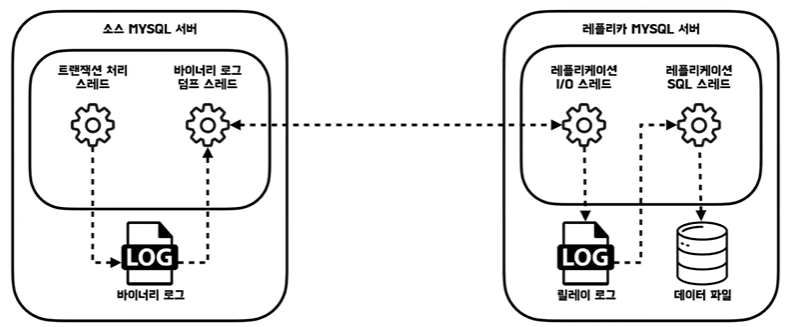
+ 레플리카 mysql 서버가 소스 서버에게 요청을 한다 소스 서버야 너가 가진 바이너리 로그 007파일의 320번째 위치까지 동기화가 완료됐다 이 이후의 데이터를 보내 줘 라고 하면
소스 서버는 그 이후의 내용만 보내주면 되는 것이다 바이너리 로그 파일 위치 기반 방식은 한 가지 문제가 존재한다
+ 소스 서버 A가 존재하고 소스 서버 A와 완벽하게 동기화된 레플리카 서버 B가 존재한다 그리고 복제 지연 등의 이유로 이벤트 120번째까지 밖에 동기화 안된 레플리카 서버 C가 존재한다고 가정을 해보고
이때 소스 서버가 장애가 나서 사라지게 됐다 그러면은 동기화가 완료된 레플리카 서버 B를 새로운 소스 서버로 승격시키게 된다 그러면 레플리카 서버 C는 동기화를 해야되서 소스 서버야 너가 내가 007 파일의 120번째 
위치까지 동기화가 완료됐는데 이후의 데이터를 나한테 보내 줘 라고 했는데 갑자기 소스 서버가 그런 거 없는데 내가 가진 파일은 바이너리 로그 001파일이야 이렇게 얘기 한다
그 이유는 똑같은 이벤트가 복제에서 참여하는 모든 서버에 동일한 파일 명과 동일한 위치가 저장되지 않는다는 것이다 그러니까 이전에 소스 서버 A에는 007파일의 120번째 줄에 저장이 됐다면 얘한테는 001파일, 어느 위치에 저장 될지 아무도 모르는 것이다
그래서 결국 바이너리 로그 파일명과 위치값의 조합은 딱 한가지 서버 안에서만 유효하게 된 것이다

### 글로벌 트랜젝션 아이디(GTID) 기반 복제 방식
+ 모든 이벤트들이 모든 복제에 참여하는 서버에서 똑같은 식별자를 가지고 똑같이 식별하게 할 수는 없을까 그래서 등장한게 바로 이 GTID 방식이다 
+ GTID
  + 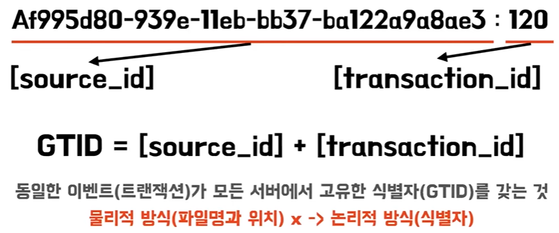
  + 복제에 참여하는 서버의 유니크한 ID값과 트랜잭션 ID의 값의 조합으로 만들어진 ID 값
  + 이제는 이 GTID를 활용해서 똑같은 이벤트가 모든 서버에서 똑같은 식별자를 갖도록 구성이 되게 된다 
  + 이전에는 파일명과 위치라는 물리적인 방식을 사용했다면 이제는 이 GTID라는 논리적인 방식을 사용하도록 바뀐 것이다
+ 레플리카 서버 C는 소스 서버 A에 비해서 아직 소스 서버 A가 19번째까지가 됐는데 레플리카 서버 C는 16번째 트랜잭션까지밖에 동기화가 안된 상태이다  소스 서버 A가 사라지고 레플리카 B가 승격되게 된다
  이제는 레플리카 서버 C가 요청을 한다 소스 서버야 내가 지금 GTID 16번까지 동기화가 완료 됐는데 이 이후의 데이터를 보내 줘 라고 하면 소스 서버 B는 16번 이후의 GTID 번호를 찾는다 그 이후의 번호를 그리고 이 GTID가
  맵핑된 바이너리 로그를 찾아서 그 이후의 데이터를 보여주면 되는 것이다 그럼 이제는 레플리카 서버 입장에서는 내가 가져오려는 바이너리 로그 파일명과 위치가 어디에 있는지를 알 필요가 없다
  그냥 GTID를 소스 서버에 요청하기만 하면 소스 서버가 알아서 그와 매핑된 바이너리 로그를 알고 있으니 그 이후의 데이터를 보내주면 된다
+ 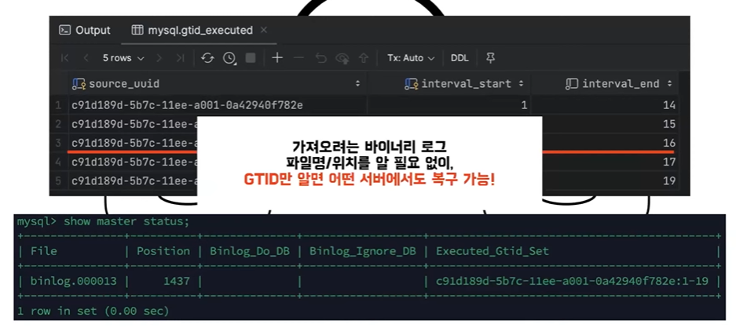

## 동기화 방식

### 비동기 복제
+ 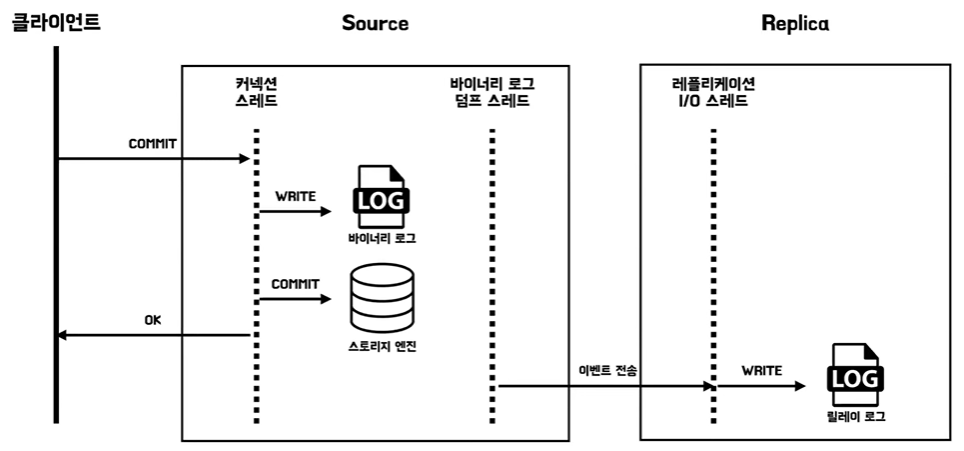
+ 간단하게 생각해서 소스 서버와 레플리카 서버가 소스 서버가 레플리카 서버의 본인의 변경 내역이 반영됐는지를 확인을 안 하는 것이다

### 반동기 복제 
+ 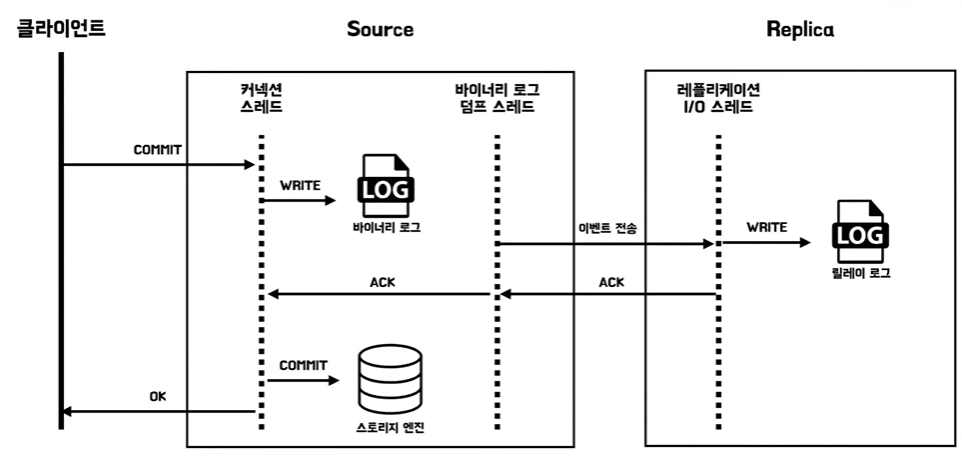
+ 소스 서버가 레플리카 서버로 어느 정도 동기화가 됐음을 보장하는 방식
+ 릴레이 로그에 쓰여짐을 보장하는 것이지 실제로 데이터 파일이 쓰여진 것까지는 보장하지 않는다 그래서 용어가 동기 복제가 아니라 반동기 복제인것이다

## 복제 지연 문제
+ 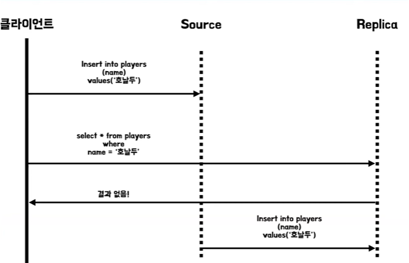
+ 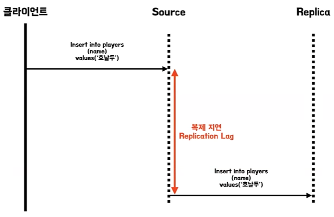
+ 소스 서버부터 레플리카 서버까지 동기화가 일어나기까지 시간을 복제 지연 레플리케이션 렉이라고 한다
+ 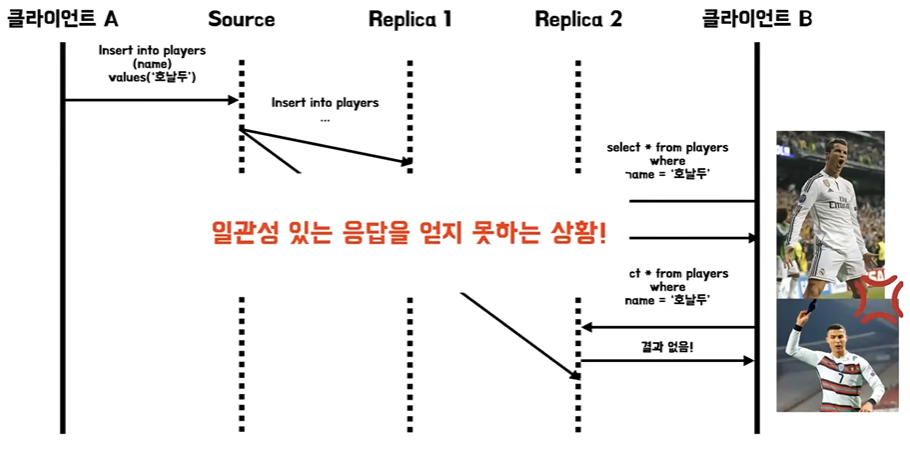
+ 이때는 단조 읽기라는 방식을 사용해서 문제를 해결하도록 한다

## 복제 지연 해결 

### 자신이 쓴 내용 읽기
+ 복제 지연을 해결하기 위해서는 자신이 쓴 내용 읽기 쓰기 후 읽기 일관성을 채택하는 방식을 생각해 볼 수가 있다
+ 이는 사용자가 페이지를 재 로딩했을 때 항상 본인이 제출한 모든 데이터를 다 볼 수 있도록 보장을 하는 방식인데 하지만 다른 사용자의 제출에 대해서는 보장을 하지 않는다 
+ 예를 들어서 사용자가 본인이 수정한 내용을 읽을 때는 소스 서버 DB에서 읽도록 라우팅을 하던지 아니면 해당 레코드의 마지막 갱신 시간을 찾아서 그 레코드가 갱신 뒤에 1분 동안은 소스 DB에서 읽도록 라우팅을 한다던지
  아니면 해당 클라이언트의 가장 최근 쓰기 타임스탬프를 찾아서 여기까지 갱신된 복제 서버에서만 읽도록 하거나 아니면 복제 서버가 여기까지 갱신되기 전까지는 질의를 대비하는 방식이다
+ 

### 단조 읽기
+ 각 사용자 읽기가 항상 똑같은 복제 서버로 라우팅되도록 보장하는 것이다
+ 예를 들어서 사용자 ID의 해시값을 찾아서 그걸 기반으로 복제 서버를 선택하도록 한다든지 하는 방식을 사용할 수 있다
+ 근데 이때는 어떤 복제 서버 하나가 고장 났을 때 그 복제 서버를 사용하는 모든 사용자들의 요청이 다른 쪽으로 라우팅 되도록 보장이 되어 있어야한다
