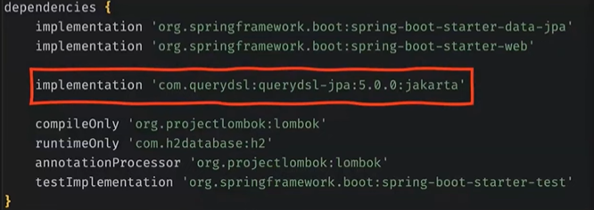
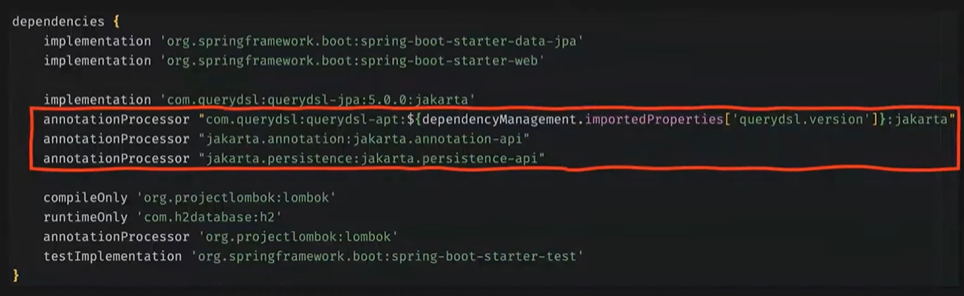
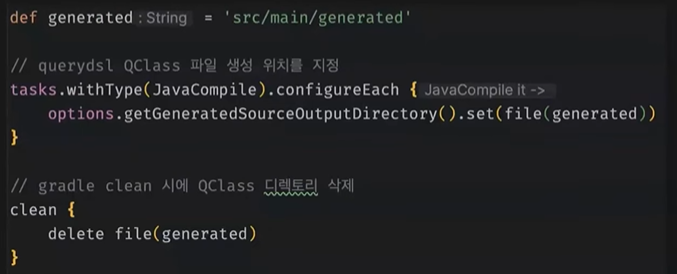
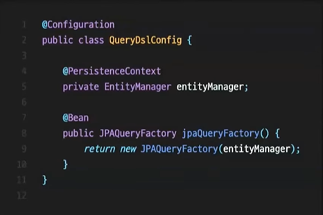
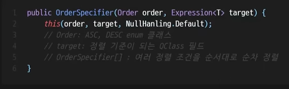
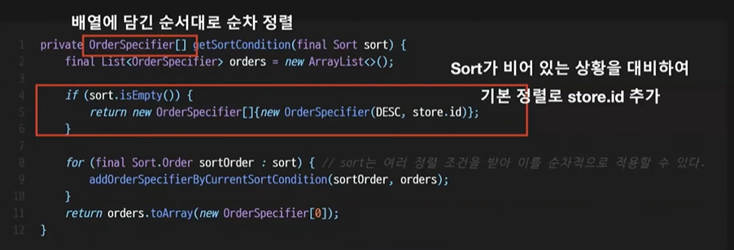
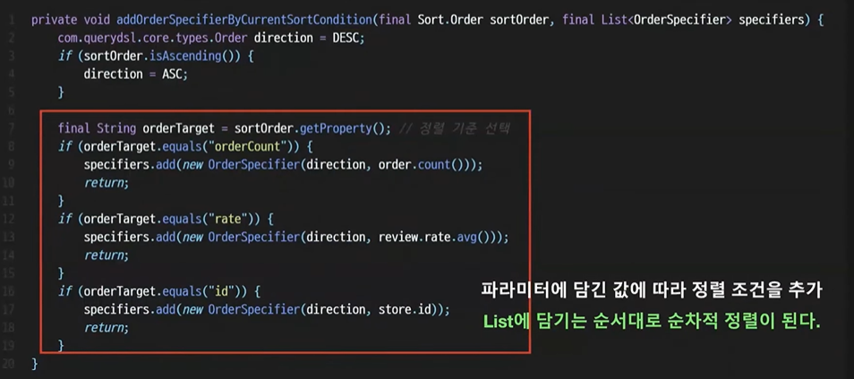
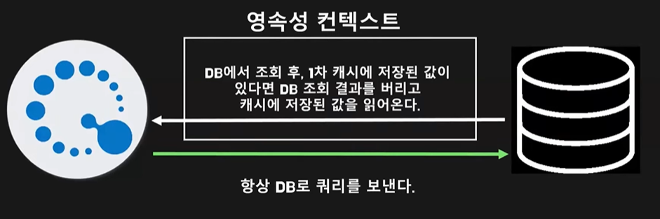

# 바론, 블랙캣의 Querydsl with JPA
[https://youtu.be/Dz-46mPfkGo?si=Io7O4UPT_zDVvjUR](https://youtu.be/Dz-46mPfkGo?si=Io7O4UPT_zDVvjUR)

# 바론, 블랙캣의 Querydsl with JPA
* toc
{:toc}

## Hello Querydsl
+ Spring Boot 프로젝트를 하시면서 Spring Data JPA를 많이 사용 이때 N+1 문제와 같은 네임드 쿼리로 해결되지 않는 문제들을 JPQL 을 많이 사용을 해서 해결
  + 런타임 에러가 발생해야 에러를 알 수 있다
  + 이러한 문제를 Querydsl을 통해서 어느 정도 해소를 할 수 있다
+ DSL
  + DSL이라는 용어는 특정 도메인 에서 발생하는 문제를 효과적으로 해결하기 위해 설계된 언어를 의미
  + 예를 들어서 데이터 베이스 내에 CRUD를 하기 위한 SQL 웹의 디자인 레이아웃, 스타일링을 위한 CSS 문자열 내에서 특정 패턴을 검색, 추출하기 위한 Regex 등이 이에 해당
+ Querydsl은 SQL 형식의 쿼리를 Type-Safe하게 생성할 수 있도록 하는 DSL을 제공하는 라이브러리라고 볼 수 있다

## Querydsl 설정 방법
1. Spring Boot 3로 올라오면서 javax에서 jakarta로 변경 그렇기 때문에 Querydsl JPA의 버전 명시 뒤에 꼭 ':jakarta'를 추가
   + 
2. QClass라는 걸 생성하기 위해서 annotationProcessor 추가
   + 
3. 협업을 위한 gradle script 추가
   + 
4. 만약에 src/main/generated/를 QClass 생성 위치로 사용하고 싶다면 gitignore 등록 이는 Querydsl의 라이브러리 버전에 따라서 생성되는 QClass 생김새가 달라질 수 있기 때문에 추가를 해 주시는 걸 추천
5. JPAQueryFactory 빈으로 등록
   + 
6. CustomRepository 인터페이스를 생성 CustomRepository에는 저희가 Querydsl로 수행할 메서드를 선언
7. CustomRepositoryImpl 클래스 구현
8. CustomRepository 인터페이스를 JPARepository에 extends

## Q 클래스
+ QClass는 엔티티 클래스 속성과 구조를 설명해주는 메타데이터라고 볼 수 있다
+ 이런 메타데이터를 통해서 Type-safe하게 쿼리의 조건을 설정할 수 있다

## 조회
+ 두 테이블간 연관 관계가 없게 된다면  join 메서드 안에 연관관계가 없는 두 테이블을 넣어 주고 where 조건으로 해당하는 걸 걸어 주시면 되는데 문제는 연관관계가 없는 테이블간 join은 카테시안 곱이 발생하므로 이제 주의
+ 연관 관계가 없는 테이블 간에 outer join은 from절에 join하고 싶은 테이블명을 leftJoin()에 걸어 주면 된다 단 여기서 주의할 점은 연관 관계가 없는 테이블간의 외부 join은 join 메서드에 하나의 QClass만 명시를 해 주셔야한다
+ N+1 문제를 해결하려고 Querydsl은 더 명확하게 fetchJoin()이란 메소드를 직관적으로 제공을 하고 있기 때문에 이를 통해서 N+1 문제를 해결할 수 있다
+ 두 개 이상의 OneToMany 관계에서는 연속된 fetchJoin()이 불가능하다,  예외가 발생
  + 이는 Querydsl 특징이 아니라 JPQL의 특징

## 페이지네이션

## 서브쿼리
+ Querydsl이 에서 서브 쿼리를 작성할 수 있는 방법 JPAQuery, JPAExpressions가 있다
+ JPAQuery를 사용, 일반적으로 사용하는 쿼리문을 만들어 주는 방법 그렇다 보니까 사용 범위가 굉장히 넓다
+ Querydsl에는 JPAExpressions라는 서브 쿼리에 훨씬 더 최적화가 많이 되어 있는 기술이 존재
  + 유틸성 클래스
  + 다양한 select 메서드를 지원
  + 사용 범위가 서브 쿼리에 더 맞춰져 있다
+ 서브 쿼리를 만들기 위해 직접 QClass를 새로 하나 만들어 줘야하는데 이유는 leftJoin()에 사용된 QClass와 서브 쿼리를 작성하기 위해 사용한 QClass가 서로 다른 목적을 가지고 있기 때문이다

## 동적쿼리
+ Querydsl로 동적 쿼리를 작성하기 위해서는 BooleanExpression이 무엇인지 알아야 한다
+ BooleanExpression은 조건을 나타내는 부분에 들어가는 참 또는 거짓을 반환하는 표현식
+ 여려 BooleanExpression을 조합해서 사용
+ null이 반환되면 자동으로 조건에서 무시 
+ 고정된 정렬 주건을 동적인 정렬 조건으로 변경
  + 동적인 OderSpecifier 생성
  + 
  + OrderSpecifier는 Querydsl이 제공하는 클래스 안에 이런 오름차순이랑 내림차순을 의미하는 enum값을 가지고 있고 어떤 걸 기준으로 정렬을 할지에 대한 필드 값을 가지고 있다
  + 배열로 첫 번째 값에 들어온 걸로 먼저 정렬을 하고 그 값이 같은 경우에 두 번째 기준으로 정렬을 다시 한다고 순차적으로 정리를 하는 조건을 줄 수도 있다
+ 
+ 

## 정리 
+ Querydsl의 장점을 정리해보자면 가독성이 향상
+ 메서드 네이밍을 통해서 쿼리의 조건이나 정렬 방식을 유추할 수도 있다
+ 메소드가 분리되기 때문에 만들어진 쿼리를 재사용하는 것도 충분히 가능
+ Type-safe한 Q클래스를 통해서 기본적인 문법으로 인한 런타임 에러 방지

### 주의할 점
+ 
+ 1차 캐시의 장점을 누릴 수 없다
  + Querydsl의 단점이라기보다는 JPQL의 특징
  + Querydsl로 뭘 작성하고 실행을 시키면 기본적으로 JPQL로 변환이 되어서 DB한테 쿼리가 실행 그래서 항상 DB로 쿼리를 보내게 된다
  + 결과를 조회해 올 때도 DB한테 조회한 결과를 한번 보고 1차 캐시에 저장된 값이 있으면 DB결과를 버려버리고 1차 캐시의 값을 가져 온다
  + Querydsl은 엄청 특별한 기능을 가진 뭔가 새로운 기술이 아니라 그저 Type-safe한 JPQL 빌더일 뿐
+ Querydsl의 마지막 업데이트가 21년도 7월 22일
  + 업데이트 자체도 Java 8을 기준으로 한 것 업데이트가 더 이상 없을 가능성이 높다
+ 한 방 쿼리를 조심
  + 쿼리가 문득 점점 너무 길어지고 있다라고 느낀다면 쿼리에 코드로 해결해야 하는 비즈니스 로직이 들어가 있는 건 아닐까 라는 걸 한 번쯤은 꼭 의심을 해 보면 좋다
