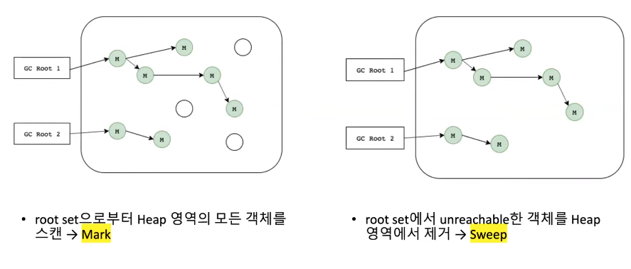
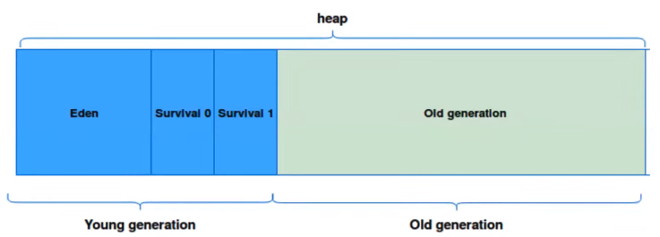
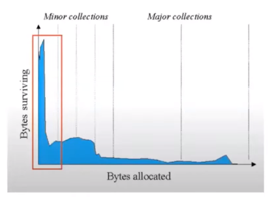

# 주디의 Garbage Collector
[https://youtu.be/Dz-46mPfkGo?si=Io7O4UPT_zDVvjUR](https://youtu.be/Dz-46mPfkGo?si=Io7O4UPT_zDVvjUR)

# 주디의 Garbage Collector
* toc
{:toc}

## GC란 무엇인가
+ C랑 C++에서는 코드 레벨에서 메모리를 할당 받고 해제해야 한다 그래서 개발자가 자칫 실수하면 메모리 누수가 발생 될 수 있다 이렇게 수동으로 메모리를 관리하는 건 정말 번거롭고 어려운 일이다
+ 자바에서는 GC가 Heap 메모리에서 unreachable한 객체를 삭제 시켜 준다 따라서 코드 레벨의 메모리 관리에서 벗어나 편리함을 개발자들은 누리고 있다

## GC의 장단점

### 장점
+ Memory Leak이 발생되지 않는다
+ 휴먼 에러 발생 가능성이 낮아진다
+ 대표적인 휴먼 에러
  + 해제된 메모리에 접근을 시도
  + 해제한 메모리에 대해서 다시 해제(이중 해제)

### 단점
+ 성능 저하
  + 어떤 메모리를 해제해야 될지 검사하고 삭제하는 이 과정이 결국 CPU 자원과 메모리를 필요로한다
  + 그래서 어플리케이션에 따라서 대규모 데이터가 있을수록 프로젝트가 클수록 비용은 더 증가된다
+ 개발자는 언제 메모리가 해제되는지 모른다
  + JVM은 GC를 실행시키기 위해서 잠시 어플리케이션 실행을 멈추는데 어플리케이션에 따라 실시간성이 매우 강조되는 어플리케이션이라면 이런 특징이 단점으로 다가올 수도 있다

## JVM의 GC Algorithms: Mark and Sweep
+ 
+ Mark는 root set으로 부터 Heap 영역의 모든 객체를 스캔하는 것을 말하고 sweep은 root set에서 unreachable한 객체를 heap 영역에서 제거하는 것을 말한다

## Mark and Sweep의 2가지 특징
+ 의도적으로 GC를 실행시켜야 한다
  + JVM에게는 내가 이쯤 되면 GC를 실행시켜야지 라는 나름의 기준이 존재한다
  + 이 기준을 알기 위해서 JVM의 Heap 영역을 같이 들여다봐야한다
+ 어플리케이션 실행과 GC 실행이 병행된다

> Heap이 바로 GC에 의해 관리되는 영역이기 때문에, Heap 영역에서 Mark and Sweep이 이루어진다

### 의도적으로 GC를 실행시켜야 한다
+ 
+ Young Generation, Old Generation으로 나뉨
+ generation 마다 GC도 나뉜다
+ young generation: 새로운 객체들이 할당되는 곳
+ old generation: young generation에서 오랫동안 살아남은 객체들이 존재하는 곳

#### generation을 왜 둘로 나누는 이유
+ 
+ 할당된 객체는 오랫동안 참조되지 않는 게 대부분 즉, 금방 garbage 상태가 되어버린다
+ 반대로 오래된 객체에서 젊은 객체로의 참조는 거의 발생하지 않는다
+ 따라서 Heap이 하나라면(generation이 하나라면), 오래된 객체까지 스캔해서 비효율적이다
+ 차라리 이 제너레이션을 둘로 나눠서 오래된 객체는 따로 빼두고 할당된지 얼마 안 된 객체들만 주기적으로 스캔하는 게 훨씬 효율적이며 비용을 줄일 수 있기 때문에 generation을 이렇게 둘로 나누게 된 것이다

#### young generation
+ 객체가 생성 되면은 Eden이라는 곳에 객체가 차게 되는데 Eden의 객체가 꽉 차게 되면 minor GC라는 게 실행된다
+ minor GC가 실행이 되면  Mark and Sweep 알고리즘이 실행이 되면 root로부터 reachable 하다고 판단된 객체는 Survival 0 영역으로 옮겨지게 된다
+ 옮겨지면서 이 객체가 age bit라는 걸 가지고 있는데 이 age bit를 1씩 증가시켜 준다
+ Java 버전마다 다르겠지만은 age-bit가 특정 숫자만큼 높아진다면 이 친구는 오래 쓰이는 친구구나 라고 인식하고 young generation에서 old generation으로 객체를 옮겨준다
+ 또 다시 한번 Eden 꽉 차면 minor GC가 또 다시 실행되면 reachable하다고 판단된 객체들이 아까는 Survival 0에 저장되었는데 이번에 Survival 1로 저장하면서 age-bit를 1씩 증가시킨다
+ 이때 Survival 0에 있던 아까 저장된 친구들도 다시 Survival 1로 이동시켜주면서 age-bit를 1 또 증가시켜준다

#### old generation
+ 여기서 발생한 GC는 major GC
+ major GC는 minor GC보다 더 오래 걸린다
+ young generation과 마찬가지로 generation이 꽉 차면 major GC가 실행되며 Mark and Sweep 알고리즘을 이용한다

### 어플리케이션 실행과 GC 실행이 병행된다
+ 사실 완전히 같이 실행되는 건 아니다
+ JVM은 GC를 실행하기 위해서 어플리케이션 실행을 멈추는데 이거를 우리는 Stop the World라고 한다
+ 이 Stop the World 시간이 짧을수록 최적화된 것
+ Stop the World를 최적화하는 방법은 정말 여러 가지가 있다

#### parallel GC
+ parallel GC는 Java 8에서 기본적으로 쓰이는 GC 방식
+ 멀티 코어 환경에서 주로 사용
+ 여러 개의 스레드로 GC를 실행하기 때문에 Stop the World 시간을 단축시킬 수 있다

#### G1 GC
+ Java 9부터 기본적으로 쓰이는 GC 방식
+ Heap을 일정 크기의 region으로 잘게 나눠서
+ young generation, old generation으로 나눠서 활용
+ 이때 region은 그때그때 개수를 이 친구가 알아서 튜닝을 해주기 때문에 이에 따라 stop the world를 최소화시킬 수 있다
