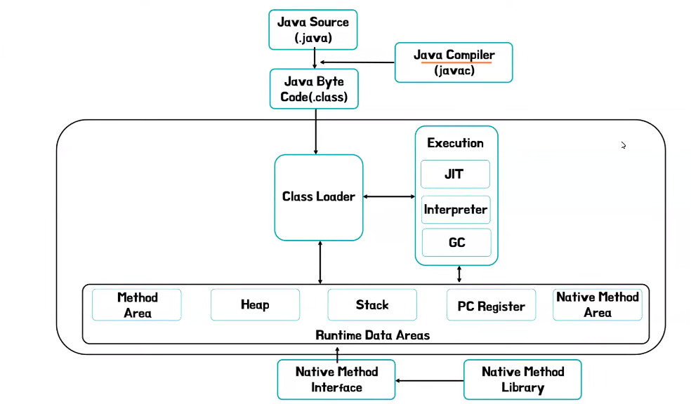
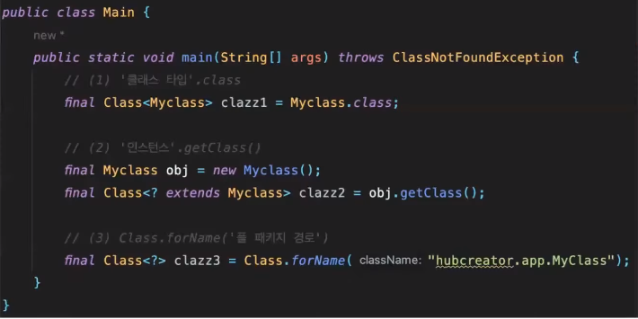
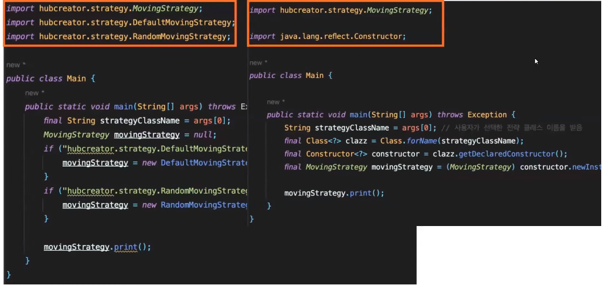
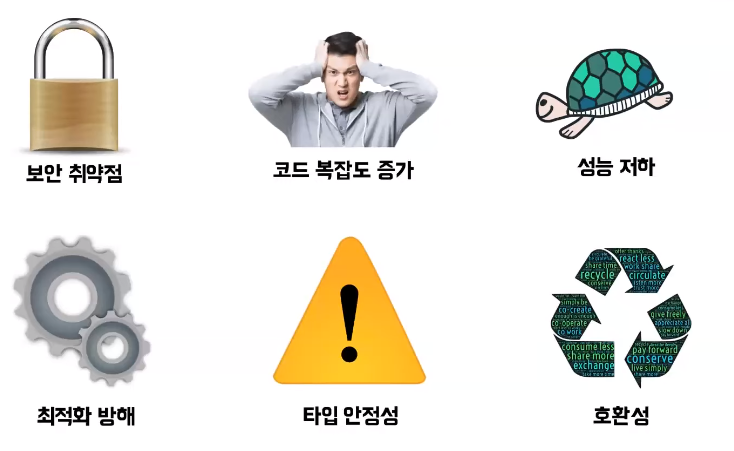
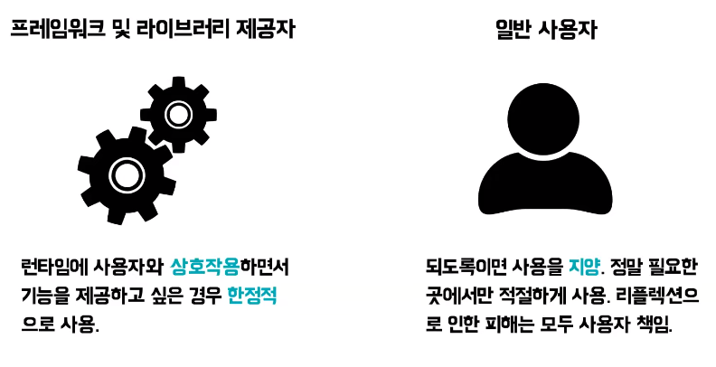

# 헙크의 자바 Reflection
[https://youtu.be/RZB7_6sAtC4?si=q6H05ASCqWczyuLQ](https://youtu.be/RZB7_6sAtC4?si=q6H05ASCqWczyuLQ)

# 헙크의 자바 Reflection
* toc
{:toc}

## 리플렉션이란?
+ 리플렉션의 어원: 리플렉스란 반사하다, 비치다 라는 뜻
+ 리플렉션이란 런타임에 클래스와 인터페이스 등을 검사하고 조작할 수 있는 기능
+ 컴파일 타임은 우리의 소스 코드를 컴파일러가 컴파일 해주는 하나의 단계
+ 런타임이란 이런 컴파일 된 코드를 실제로 실행시키면서 외부 링크와 운영체제, 사용자와 상호 작용하는 단계
+ 이 두 타임을 시간적인 관점으로 특징을 뽑아내 보면 컴파일 타임은 스냅샷 그 다음에 런타임은 상호 작용을 한다
+ 따라서 과거의 정의했던 리플렉션의 정의를 조금 더 구체화시켜 보자면 리플렉션이란 실행중에 사용자와 상호작용하면서 클래스와 인터페이스 등을 검사하고 조작할 수 있는 기능

## 리플렉션 동작 원리
+ 
+ 먼저 자바 소스를 컴파일러가 컴파일하면 바이트 코드가 된다
+ 이걸 클래스 로더가 JVM 런타임 데이터 에리어에 올려주게 되는데 그중에 메서드 에리어의 클래스 수준의 정보 클래스에 어떤 정보들이 있는지 메타 정보를 저장하게 된다
+ 리플렉션이란 결국 메서드 에리어에 있는 메타데이터를 가지고 런타임에 클래스를 검사하고 조작하는 기능

## 리플렉션 사용법
+ 메서드 에리어에 어떻게 접근 방법: 클래스를 사용하면 된다 클래스는 일종의 리플렉트 할 수 있는 거울로서 메서드 영역의 클래스 및 인터페이스 정보를 가져오는 전용 클래스라고 생각할 수 있다
+ 
+ 클래스를 만드는 방법은 세 가지가 있는데 먼저 클래스 리터럴 이라고 부르는 클래스의 닷 클래스를 붙여서 가져오는 방법 그 다음에 이미 생성된 객체를 통해서 객체의 get 클래스를 통해서 가져오는 방법
  그 다음에 클래스 닷 포네임에서 인자로 풀 패키지 경로를 주어서 가져 오는 방법이 있다

### 필요한 값 가져오기 
+ 리플렉션으로 가져올 수 있는 정보
  + 필드
  + 메서드
  + 생성자
  + Enum
  + Annotation
  + 배열
  + 부모 클래스와 인터페이스 
+ 가져올 수 있는 이런 메서드는 크게 두 가지 종류가 있다
+ 먼저 getXXXs 메소드는 해당클래스와 상위클래스에 있는 public 요소들만 가져오게 되고 getDeclaredXXXs 메서드는 접근 제한 상관없이 해당클래스의 모든 요소를 가져오게 된다

## 리플렉션의 활용 전략패턴
+ 
+ 기존에는 구현체에 의존했지만 리플렉션을 사용하면 구현체제 의존하지 않고 인터페이스만 의존하고 프로그래밍이 가능하게 된다
+ 이는 결국 dependency를 외부에서 주입했기 때문에 당연히 DI도 있겠지만 외부에서 의존성을 주입해주었기 때문에 의존성이 역전되었다 IOC도 일어났다고 볼 수 있다

## 리플렉션 단점
+ 

## 마치며
+ 
