# 제나의 컨테이너란?
[https://youtu.be/5UiPIqmK_G4?si=OODKIcirog8WCnCF](https://youtu.be/5UiPIqmK_G4?si=OODKIcirog8WCnCF)

# 제나의 컨테이너란?
* toc
{:toc}

## 우리는 도커 컨테이너를 이렇게 사용하죠
+ 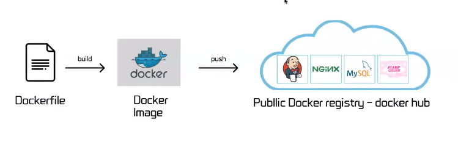
+ 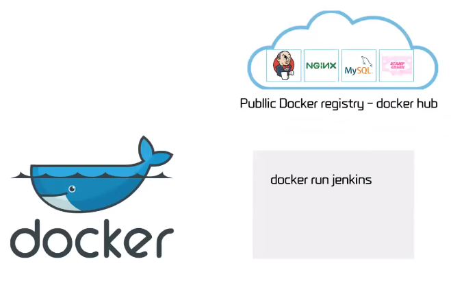
+  보통 도커 컨테이너를 이렇게 사용하고 있다 이미지를 빌드해서 도커 허브에 푸쉬를 하고 도커 런과 같은 명령어를 사용해서 허브에서 이미지를 받아서 컨테이너를 실행시킨다 같은 이미지를 여러번 컨테이너로 실행시킬 수도 있다

## 도커 구조
+ 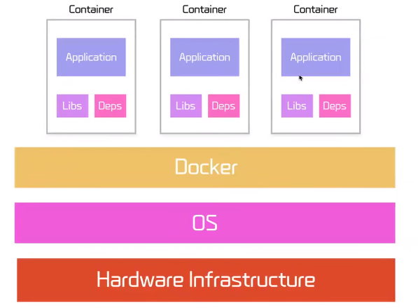
+ 도커는 하드웨어 인프라 위에 OS 위에서 도커 엔지니어 있고 그 도커 엔진 위에서 컨테이너가 구동되게 된다

## 컨테이너?
+ 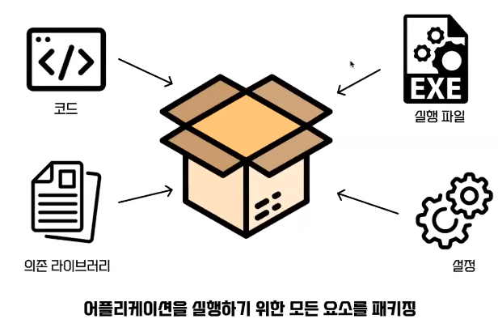
+ 컨테이너를 어플리케이션을 실행하기 위한 모든 요소를 패키징해 둔 것이라고만 알고 사용하고 있다 하지만 컨테이너가 되려면 네 가지 기술들도 사용이 되고 있다
  + 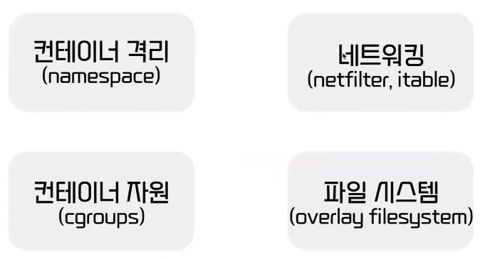

### 컨테이너 격리 - Namespace
+ 컨테이너 격리를 하려면 이제 네임스페이스라는 기술을 사용을 한다 
+ 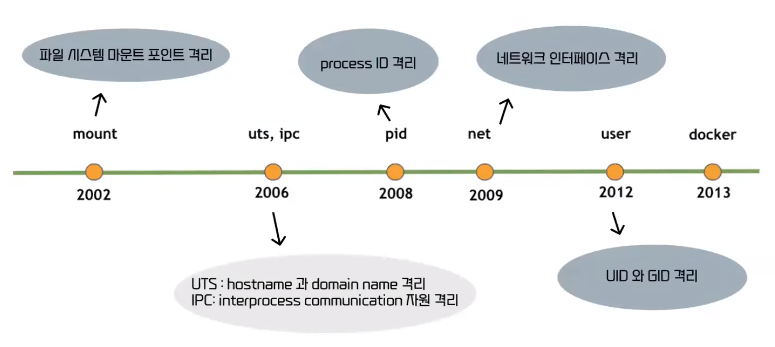
+ 네임스페이스는 프로세스를 격리할 수 있는 공간을 갖고 있는 가상화 기술이다

#### 컨테이너 격리 - 명령어
+ 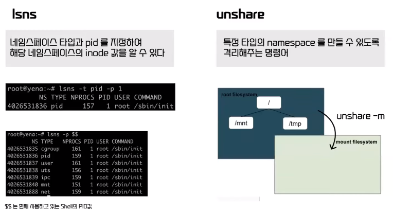
+ lsns라는 명령어를 통해서 네임스페이스의 식별자인 inode 값을 확인할 수 있다
+ unshare라는 명령어를 통해서 특정 타입의 네임스페이스를 만들 수 있도록 만들고 또 부모 네임스페이스로 부터 격리를 시켜준다
+ unshare -m이라는 명령어를 통해서 mount 네임스페이스를 새로 생성해주고 부모 네임 스페이스로부터 격리된 모습을 볼 수 있다

#### 컨테이너 격리 - Namespace (mount)
+ 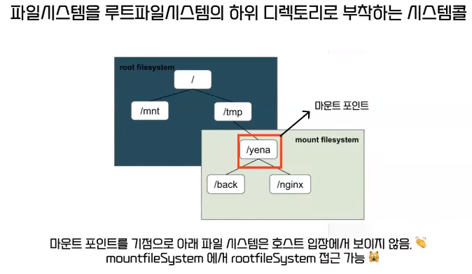
+ 마운트는 파일 시스템은 루트 파일 시스템의 하위 디렉터리로 부착하는 시스템 콜 그래서 이 yena라는 디렉터리를 이 tmp 밑에다가 마운트를 시키면 이 네임 스페이스가 격리되었기 때문에 이 루트 파일 시스템에서는 이 마운트 포인트 아래에 있는 파일 시스템은
확인할 수가 없다
+ 하지만 아직 문제점이 있는데 이제 네임 스페이스를 새로 생산을 할 때 부모 네임스페이스에 있는 내용이 그대로 상속을 받기 때문에 이 마운트 된 네임스페이스에서는 부모에 있는 루트를 파일에 접근을 할 수가 있다
  이것을 막아주기 위해서 pivot root라는 기술을 사용한다
+ 
+ 그래서 설정한 마운트 포인트를 루트 파일 시스템으로 만들어주면 cd root라는 명령어를 실행을 해도 이전에 있던 루트 파일 시스템에 접근을 못하게 할 수 있다

##### 컨테이너 격리 - Namespace (mount) - 도커
+ 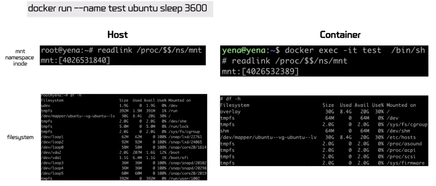
+ Docker 컨테이너를 실행을 시켜보면 host와 컨테이너의 mount 네임스페이스, inode 값이 다른 것을 확인할 수 있고 각각의 파일 시스템도 독립적으로 갖고 있는 걸 확인할 수 있다

#### 컨테이너 격리 - Namespace (PID)
+ 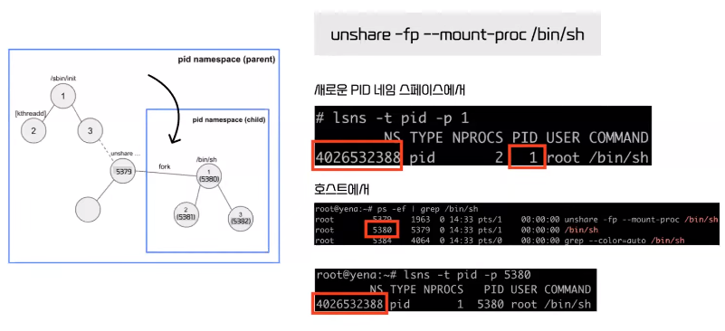
+ unshare -fp라는 명령어를 통해서 PID 네임스페이스를 생성을 하고 sh 명령어를 fork를 떠서 실행을 하면 새로운 PID 네임스페이스에서 sh 프로세스는 PID가 1이 되지만 호스트에서 동일한 명령어는 지금 PID가 5380인 것을 알 수 있다
+ 그리고 이 프로세스들의 PID 네임스페이스는 동일한 것을 확인할 수 있는데 이렇게 동일한 프로세스가 다른 PID를 갖고 있는 것을 PID가 중첩되었다고 말을 한다 

##### 컨테이너 격리 - Namespace (PID) - 도커
+ 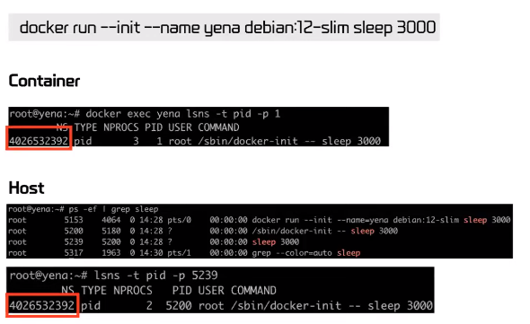
+ 도커를 실행시키고 sleep 3000이라는 명령어를 실행시켜보면 컨테이너에서는 PID가 1이지만 호스트에서 확인을 했을 때는 5200인 것을 확인할 수 있고 둘의 PID 네임스페이스 inode 값은 동일한 것을 확인할 수 있다

#### 컨테이너 격리 - Namespace (User)
+ 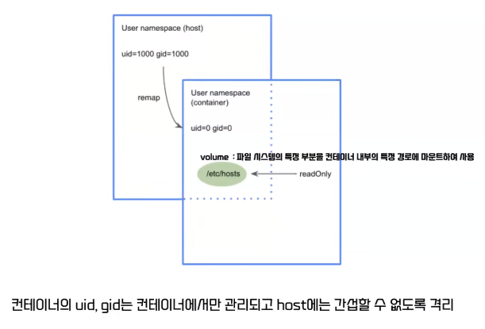
+ 볼륨이라는 기술은 호스트의 파일 시스템을 컨테이너와 공유할 수 있게 해주는 기술이다
+ 근데 컨테이너의 루트 권한이 호스트의 루트 권한과 같다면 이 호스트에 있는 파일 시스템을 컨테이너가 막 수정을 할 수 있다 이런 걸 방지해주기 위해서 리맵이라는 기술을 사용해서 컨테이너에서는 루트지만 호스트에서는
  루트가 아니도록 그렇게 권한을 분리해줘서 컨테이너에서 함부로 호스트에 간섭할 수 없도록 격리를 해줄 수 있다

### 네트워킹 - Net Namespace
+ red 네임스페이스를 생성하고 블루를 만들어서 두 개의 네임스페이스를 통신 시키기
+ 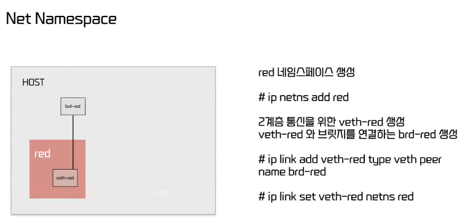
+ 우선 red 네임스페이스를 생성해주고 이더넷을 생성
+ 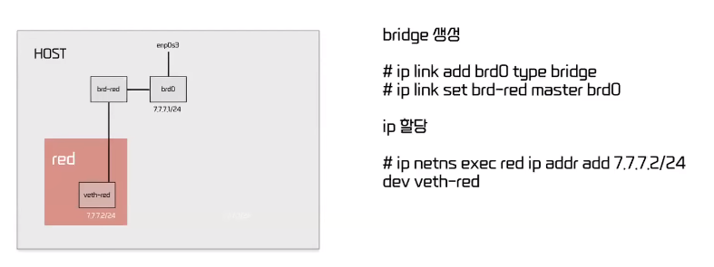
+ 그리고 브릿지를 만들어주고 IP를 할당
+ 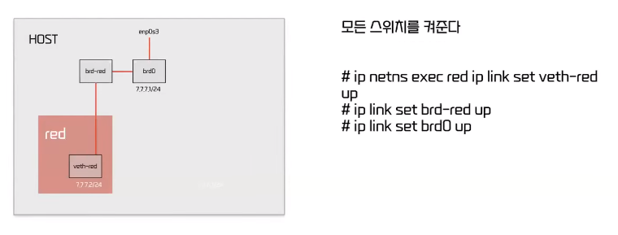
+ 통신을 시켜주기 위해서 스위치를 켜줬다
+ 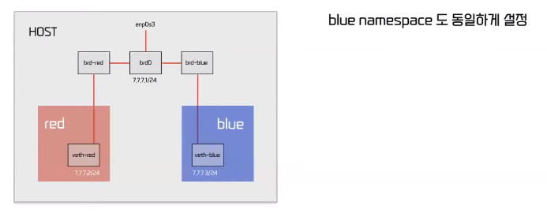
+ 블루 네임스페이스도 동일하게 설정
+ 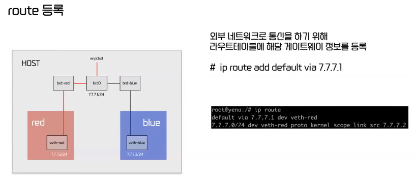
+ 레드에서 블루로 통신을 보내기 전에 외부 네트워크로 통신을 하기 위해서 라우트 테이블에 이 브릿지 정보를 등록
+ 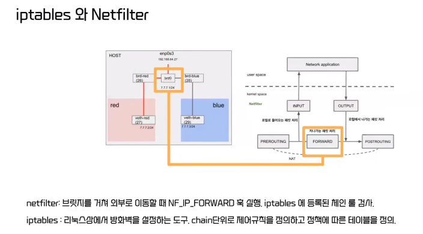
+  이제 레드에서 패킷을 보내면 브릿지에 패킷이 도착을 한다 브릿지에 패킷이 도착을 하면 네트워크 패킷을 제어하는 Netfilter라는 데서 훅이 실행이 되는데 이 훅이 실행이 되면
   iptables라는 방화벽 관리하는 툴에서 권한을 확인하게 된다 그래서 거기에 적절한 정책을 추가해주게 되면 패킷이 무사히 통신을 할 수 있게 된다
+ 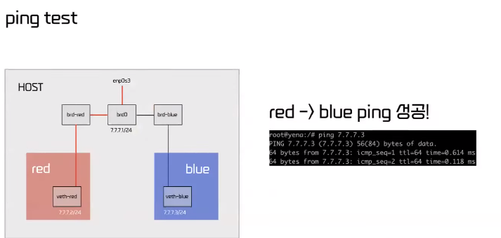

#### 네트워킹 - Net Namespace - 도커
+ 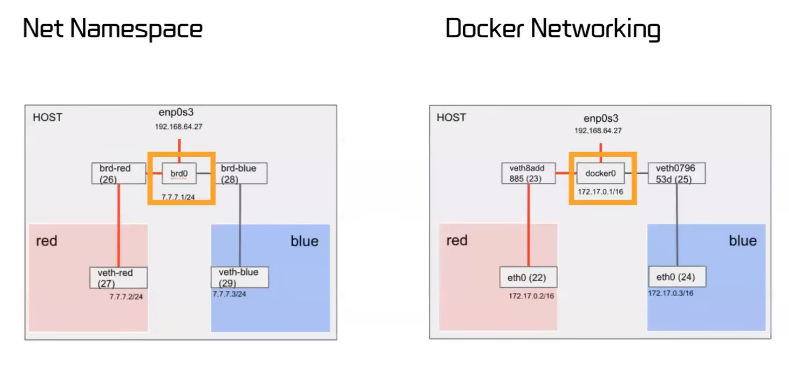
+ 도커의 네트워크랑 비교를 해보면 도커 제로가 브릿지 역할을 하는 걸로 보면 된다 

### 파일 시스템 - Overlay filesystem
+ 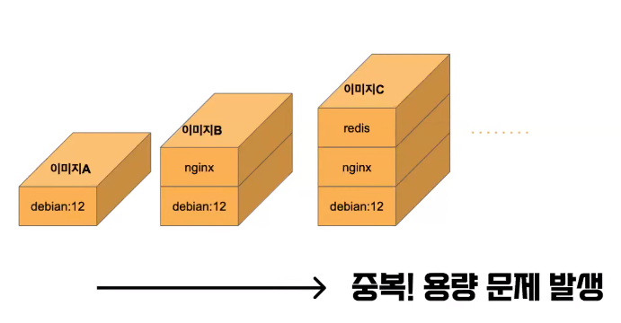
+ 이미지를 3개를 받았는데 동일한 Debian12 라는 파일 시스템으로 구성이 돼 있으면 이미지를 받을 때마다 새로 Debian12 라는 파일 시스템도 같이 받게 된다면 중복이 발생하게 되겠고 용량 문제가 발생할 수 있다
+ 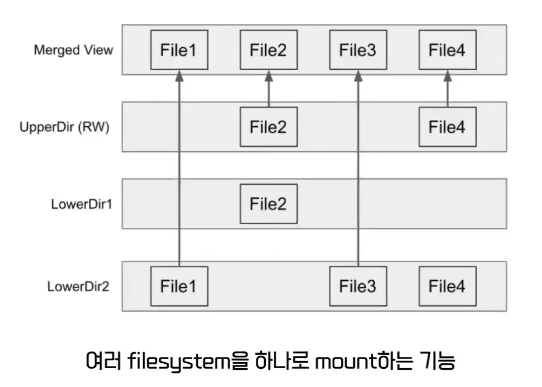
+ 그래서 Linux에서는 오버레이 파일 시스템이라는 기술을 사용한다
+ 이제 이 통합 뷰에서 이 아래에 있는 레이어들의 파일 내용을 겹쳐서 볼 수 있게끔 해줘서 오버레이라는 말이 붙었고 merge 뷰에서 file1은 lower directory 2에 있는 걸 읽게 되고 file2는 upper directory에
  있는 걸 읽게 된다
+ 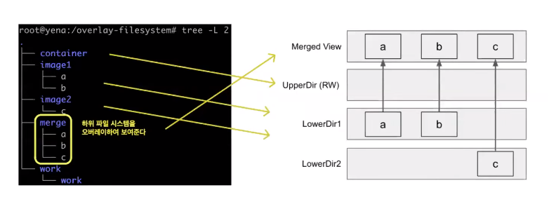
+ 오버레이 파일 시스템 구성
+ image1 directory, 2 directory 각각 lower directory1, directory2에 대응하고 저 container directory가 upper directory에 대응을 한다 
+ 그래서 Merge에서 중요한 것은 lower directory 두 개는 이제 읽기 전용이라서 Merge에 있는 걸 수정하고 싶으면  lower directory에 있는 게 수정이 되는 게 아니고 이 upper directory에 우선
카피가 되고 거기서 이제 수정이 돼서 Merge에서는 이제 수정된 upper directory의 파일이 보이게 되는 것이다 
+ 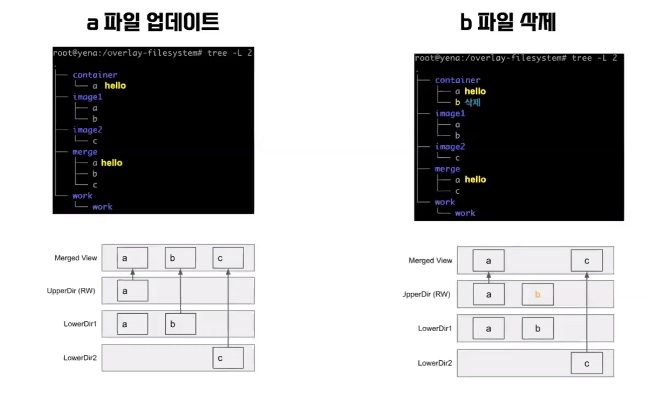
+ 테스트를 해보면 Merged Directory의 A 파일에 hello라는 내용을 쓰면 Lower Directory에 있는 A가 수정이 되는 게 아니고 Upper Directory에 그 내용이 카피가 되고 수정이 된 게
  Upper Directory에 있고 그 값이 오버레이 되어서 Merged View에서는 hello라는 값에 수정이 된 게 보인다
+ 파일 삭제와 동일하게 Lower Directory에 있는 B 파일에는 영향을 가지 않고 Upper Directory에서 없어졌다는 변경 사항만 저장이 되면 Merged View에서는 없어진 채로 볼 수 있게된다

#### 파일 시스템 - Overlay filesystem - 도커
+ 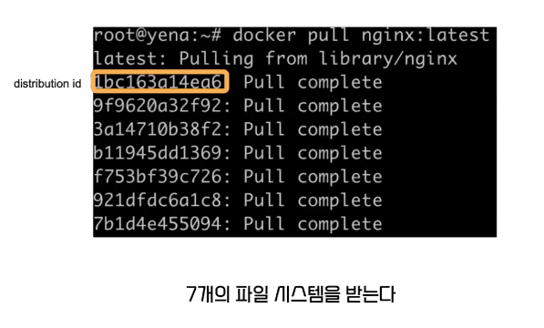
+ 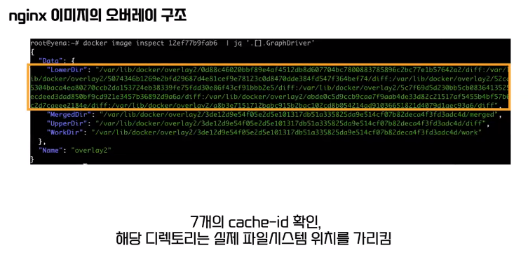
+ nginx라는 이미지를 받으면 7개의 파일 시스템이 받아지는데 7개의 직접 nginx 이미지의 오버레이 구조를 확인해보면 7개의 캐시 아이디가 확인이 되고 여기서 7개 받았으니까 이 각각의 디렉터리는 실제로 이 파일 시스템들이 저장되는 위치이다
+ 
+ 그래서 nginx를 아까 받았고 이번에 debian12를 받아보면 이미 존재한다는 문구가 뜬다 그럼 이게 debian12가 안 받아진 걸까? 근데 이미지는 확인해보면 잘 받아진 것을 확인할 수 있다
+ 이는 왜냐면 이미 존재하는 파일 시스템은 공유를 해서 새로 추가로 안 받는다는 걸 확인을 할 수가 있다

### 컨테이너 자원 - Cgroups
+ 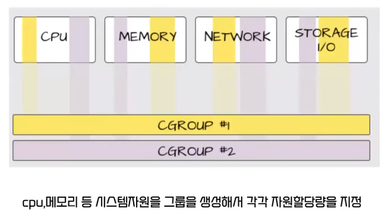
+ 컨테이너 자원은 시스템 자원을 그룹을 생성해서 각 그룹의 각각 자원 할당량을 지정을 해주는 것
+ 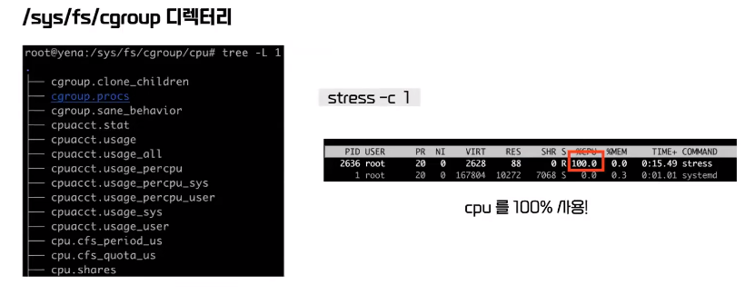
+ 그래서 아무런 설정에 되어있지도 않을 때 호스트에 스트레스를 줘보면 CPU를 100 % 활용하는 걸 볼 수 있다
+ 
