# 도치의 도커 엔진, 스윔, 컴포즈 이론편
[https://youtu.be/RxQPo5CY_98?si=gAC5qZJOgoAypM-r](https://youtu.be/RxQPo5CY_98?si=gAC5qZJOgoAypM-r)

# 도치의 도커 엔진, 스윔, 컴포즈 이론편
* toc
{:toc}

## 도커 엔진 - 컨테이너 관리
+ 도커를 통해 어플리케이션과 실행환경을 이식 격리해서 실행할 수 있다
+ 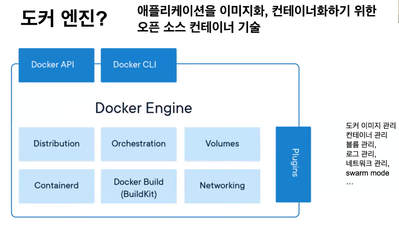
+ 도커 엔진은 어플리케이션을 이미지화, 컨테이너화하기 위한 오픈 소스 기술이다
+ 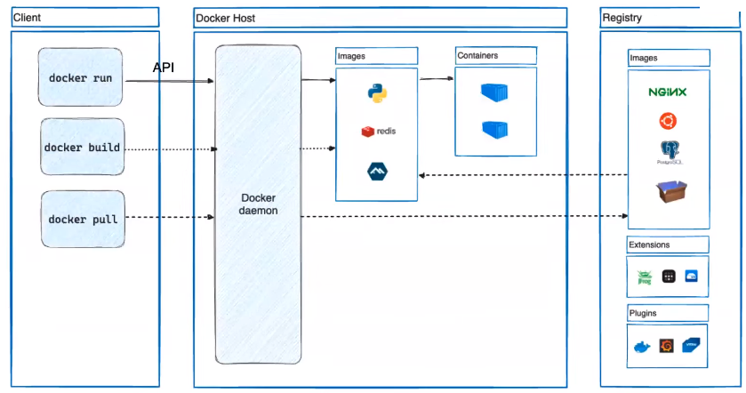
+ 도커는 클라이언트 서버 구조로 이루어져 있는데 사용자가 입력하는 docker run과 같은 명령어는 도커 CLI를 통해 적절한 API로 변환되어서 서버 역할을 하는 도커 데몬에게 전달된다 도커 데몬은 실제적인 요청을 처리하는
  백그라운드 프로세스이다 
+ 도커 엔진은 클라이언트 그리고 요청을 받는 도커 데몬 그리고 이들이 통신하는 API를 통틀어서 도커 엔진이라고 한다
  + Docker Engine = docker cli + api + docker daemon
+ 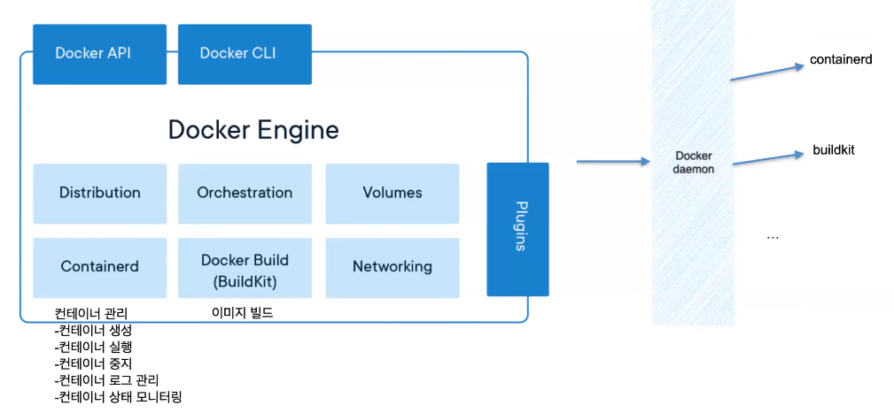
+ 도커 엔진이 제공하는 기능들은 도커 엔진의 도커 데몬들을 이용해 처리되는데 처리 되는 방식은 어떤 기능에 대한 요청인지에 따라 상이하다
  + 예를 들어 볼륨 처리에 대한 요청이라면 도커 데몬의 자체적인 스레드로 인해서 처리될 수 있지만 도커의 컨테이너 관리나 이미지 빌드 같은 경우는 외부 오픈소스 프로젝트를 통해서 위임 되어 처리 되는데
    여기서 컨테이너에 관리는 Containerd를 이용해서 처리 된다
+ 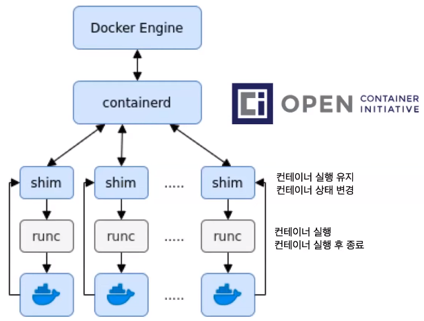
+ Containerd는 open container initative 즉, OCI라고 하는 컨테이너 기술 표준을 구현하는 프로젝트인데 표준에는 컨테이너는 어떻게 실행되고 또 어떤 실행 주기를 가지며 컨테이너 이미지는 어떤 포맷으로 구성되는지 등이 정의되어 있다
+ Containerd는 이 정의에 따라 기능들을 제공해주는데 Containerd는 또한 도커 엔진과 함께 같이 실행되는 백그라운드 프로세스이다
+ 여기서 도커 엔진이 컨테이너 실행 명령을 Containerd에 요청한다면 Containerd는 shim 프로세스를 생성한다 그리고 이 shim 프로세스는 runc 통해서 컨테이너를 실행하게 되는데 굳이 runc를 이용해서 실행을 하는 이유는 
컨테이너 실행시에 리눅스의 기능을 이용해야하기 때문인데 리눅스가 제공하는 chroot, namespace 등의 기능을 이용해야 하는데 시스템마다 이것에 접근하기 위해서 가상화를 해야 하는 등의 차이가 있기 때문에 runc를 통해 이를 위임해서 
도커는 일정하고 표준화된 형태로 컨테이너들을 다뤄서 실행할 수 있게 된다
+ runc는 컨테이너 실행 후 종류 되고 이렇게 실행된 컨테이너는 shim 프로세스에 의해서 관리되게 된다 
+ shim 프로세스에서 shim이라는 의미는 벽돌 사이에 끼우는 끼임새 같은 의미를 지니는데 그 의미처럼 컨테이너와 Containerd 사이에 존재해서 Containerd의 상태와 상관없이 컨테이너의 실행을 안정적으로 유지하게 해주는 역할을 한다
+ 또한 컨테이너와 통신해서 컨테이너의 상태를 모니터링 할 수 있게 해주는 역할도 한다
+ 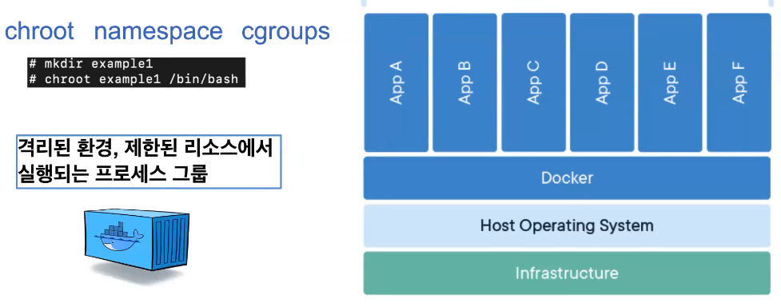
+ 리눅스의 기능들을 이용해서 프로세스를 격리된 환경 제한된 리소스에서 실행을 할 수 있게 된다
+ 좀 더 예시를 들어보자면 chroot 명령어는 프로세스의 루트디렉토리를 지정할 수 있게 만들어주는 명령어인데 다음과 같이 디렉터리를 새로 만들고 프로세스의 루트 디렉터리를 이 디렉터리로 지정해준다면
  이 프로세스는 보통의 방법으로는 디렉터리 파일시스템을 벗어날 수 없게 된다 
+ 여기에 더해 namespace와 cgroups 기능을 이용해서 프로세스를 격리하고 제한된 리소스를 사용할 수 있게 막아 준다면 이 프로세스는 같은 기기에서 실행됐다고 하더라도 다른 기기에서 실행된 것과 같이 격리된 효과를 누릴 수 있을 것이다 
그리고 이것이 바로 도커 컨테이너인 것이다
+ OS 입장에서 이는 컨테이너 기술로 인해 각각의 파일시스템과 격리된 리소스에서 실행된 프로세스일 뿐이다

### 정리
+ Docker Engine = docker cli + api + docker daemon
+ 컨테이너 관리: containerd, runc 컨테이너 기술로 수행
+ 컨테이너 기술은 리눅스의 기능을 사용해 프로세스 격리

## 도커 스윔
+ 서비스를 제공할 때 하나의 서버보다는 여러 서비스를 구성해서 하나의 시스템으로 다루는게 더 장점이 많다
+ 서버가 하나라면 서버에 문제가 생기면 서비스는 중지가 된다 하지만 하나의 시스템으로 여러 서버가 구성 되어 있다면 서버 하나의 문제가 생겨도 다른 서버로 이를 대체할 수도 있고 서비스의 확장면에서도 병렬적으로 시스템에 서버를 추가하기만 
하면 되기 때문에 확장성에 면에서 장점이 있다
+ 그리고 이런 시스템을 구축해주는걸 도커에서 제공해주는데 이것이 바로 도커 스웜이다
+ 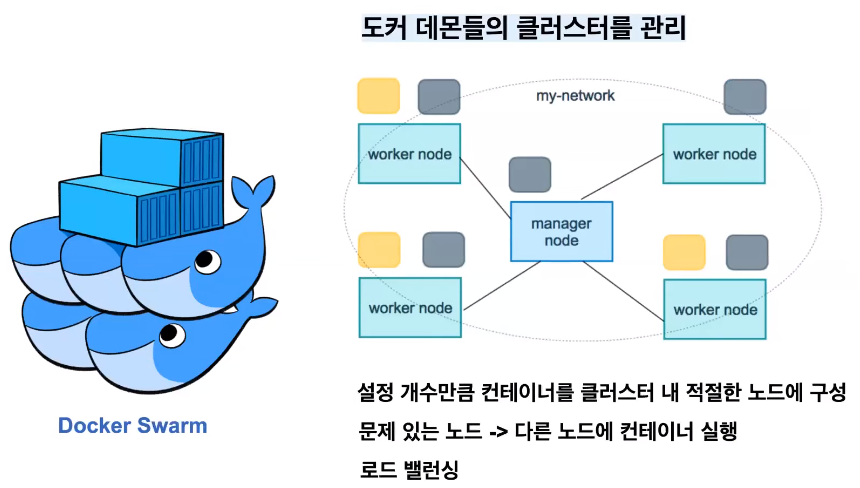
+ 도커 스웜은 도커 데몬들의 클러스터를 관리해 주는데 이는 한 네트워크로 묶어서 관리해준다 여기서 관리를 해준다는 말은 설정한 개수만큼 컨테이너를 클러스터 내 적절한 노드를 선정해서 컨테이너를 실행해 준다는 말 
또 컨테이너를 실행할 때 문제 있는 노드를 인식하고 다른 노드의 일을 자동으로 다른 노드에 자동으로 컨테이너를 실행해 주는 기능 또 로드밸런싱 기능 등을 제공해준다는 말을 의미 한다
+ 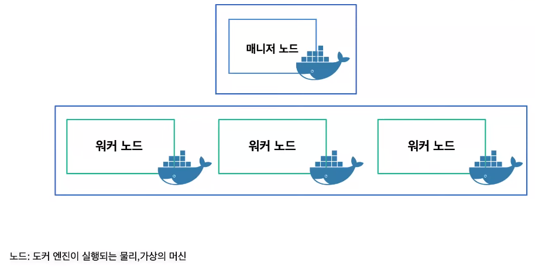
+ 도커 스웜은 워커 노드와 매니저 노드라는 두가지 종류의 노드로 운영이 되는데 여기서 노드는 도커 엔진이 실행되는 물리, 혹은 가상의 머신을 의미하는데 보통 일반적으로 하나의 물리 머신에 하나의 도커 엔진만을 실행하기 때문에
  이 상황에서는 하나의 노드는 하나의 서버를 의미한다고 봐주면 될 거 같다
+ 워커 노드는 도커 스웜 클러스터에 할당된 작업에 대해서 실제로 컨테이너를 실행해 작업을 수행하는 노드를 의미
+ 매니저 노드는 워커 노드들을 관리하는 노드를 의미
+ 그리고 매니저 노드는 워커 노드 또한 될 수 있는데, 워커 노드의 역할 또한 해 줄 수 있는데 이 말은 즉 매니저 노드에도 작업의 수행을 위한 컨테이너가 실행될 수 있다는 말이다
+ 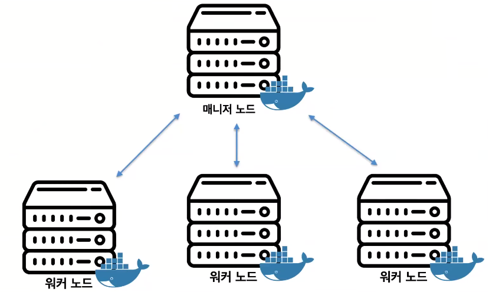
+ 4개의 서버가 있는 상황에서 어떤 것을 매니저 노드로 할 지 결정한 후 docker swarm init 명령어를 사용한다면 서버는 매니저 노드로 등록된다
+ 그리고 나머지 서버에서 docker swarm join 명령어을 사용한다면 워커 노드로 등록되고 클러스터 구축이 되게 된다 나머지 서버에 대해서도 docker swarm join 명령어을 사용하면 한꺼번에 클러스터 구축이 가능하게 된다
+ 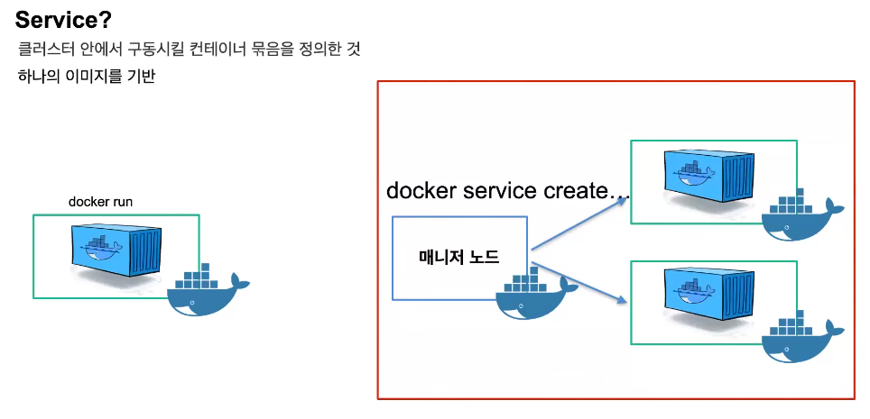
+ 도커 스웜에서는 컨테이너 배포 단위가 서비스인데 서비스란 클러스터 안에서 구동시킬 컨테이너들을 묶음을 정의한 것이고 묶음은 하나의 이미지에 기반한다
+ docker run과 같은 명령어는 해당 서버에만 영향을 미쳐서 컨테이너를 띄우게 되는데 클러스터 내의 매니저에서 사용한 서비스 명령어는 클러스터 내에 있는 노드 전체에 영향을 미쳐서 다른서버에 있다 해도 컨테이너를 한꺼번에 여러 개
  띄울 수 있게 되는 것이다 
+ 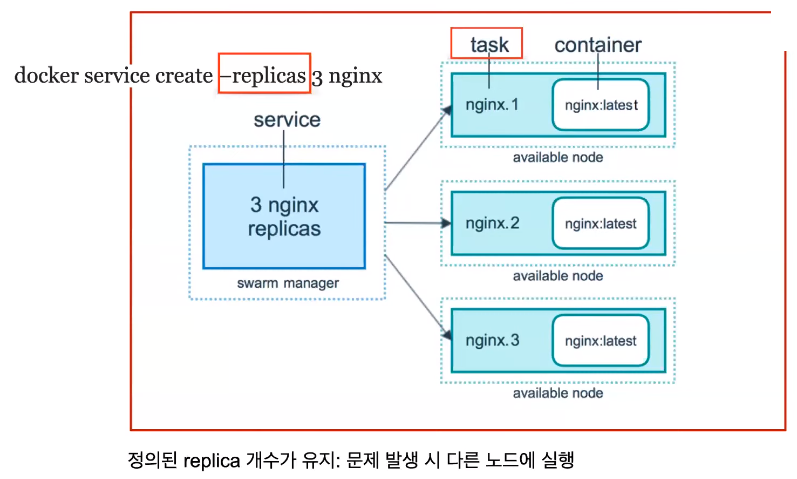
+ 이 상황은 하나의 매니저 노드에 세 개의 워커 노드로 구성된 클러스터인데 명령어를 실행하는 상황이다
+ 서비스는 하나의 이미지에 기반한다 여기서는 엔진엑스 이미지에 기반해서 각각의 워커노드에 컨테이너가 실행되는 모습이다
+ 이렇게 실행되는 각각의 컨테이너는 task라고 하고 서비스에 의해 한꺼번에 실행된 테스크들을 하나로 묶어서 레플리카라고 부른다
+ 레플리카의 개수는 설정한 대로의 개수를 유지 하는데 즉 헬스체크를 통해서 노드에 문제가 있는 것을 인식하면 다른 노드의 개수만큼의 컨테이너를 실행해서 레플리카의 개수를 맞춰 줄 수 있게 된다 이를 통해서 가용성을 보장해 줄 수 있다

### 정리
+ 도커 스웜은 도커 데몬에 내장이 되어 있고 상대적으로 쉬운 사용법과 낮은 러닝 커브를 가지고 있다
+ 가벼우면서도 기본적으로 제공할만한 스케일링, 가용성 기능을 제공하기 때문에 도커를 사용하면서 쉽고 빠르게 오케스트레이션 툴을 적용해 보고 싶다고 하면 도커 스웜을 적용해 볼 만 할 것 같다

## 도커 컴포즈
+ 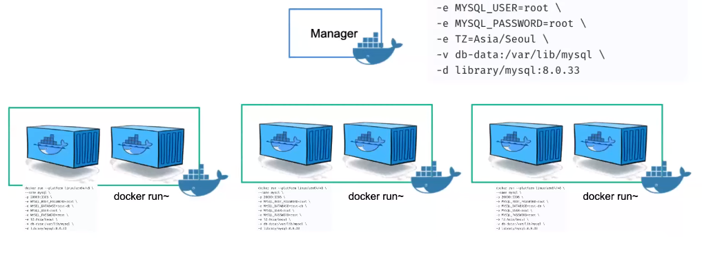
+ 앞서 설명한 도커나 도커 스웜은 주로 명령어를 통해서 실행이 되는데 하지만 명령어를 일일히 입력하는건 때론 불편한 일이 될 수 있다
+ 명령어를 여러서버에 입력하는 건 번거로운 일이고 디비 뿐만 아니라 다른 의존성 때문에 컨테이너를 더 실행해야 한다면 명령어를 입력하는 갯수가 더 든다
+ 도커 스웜을 이용한다고 하더라도 클러스터를 구축하고 이미지의 종류 만큼의 명령어를 입력해야 하기 때문에 불편함이 있다
+ 때문에 컨테이너 여러 개를 한꺼번에 실행하게 해주는 기능을 도커에서 제공해주는데 이것이 바로 도커 컴포즈이다
+ 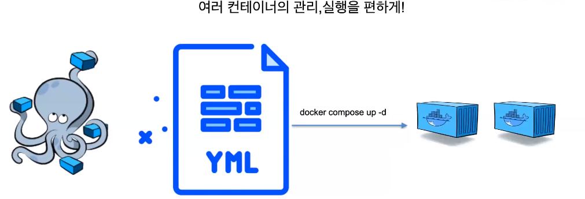
+ 도커 컴포즈는 yml 파일을 정의해서 여러개의 컨테이너를 한꺼번에 docker compose up 명령어로 실행하게 해주는 기능이다
+ 서비스 아래 여러개의 컨테이너를 정의해서 한꺼번에 실행도 가능하다

### 도커 컴포즈 특징
+ 도커 컴포즈를 사용할 때는 docker run을 통해서 컨테이너를 띄울 때와는 기본적으로는 다른 네트워크를 사용한다
  때문에 호스트의 네트워크를 경유하거나 아니면은 사용자 정의 네트워크를 사용해서 이들을 하나로 묶어서 통신 해야 할 상황이 생길 수 있다
+ 도커 컴포즈 컨테이너는 컨테이너를 새로 create 하더라도 기존의 볼륨을 지우진 않고 변경된 컨테이너만 recreate 한다 이 말은 즉 도커 컴포즈를 수정 후 재실행 했을때 새로 띄워지지 않는 컨테이가 있다고 해서 잘못된 상황은 아니라는 뜻이며
  이렇게 도커 컴포즈를 새로 recreate 했을 때 기존의 볼륨이 지워졌을까 하는 걱정은 안 해도 된다는 뜻이다
