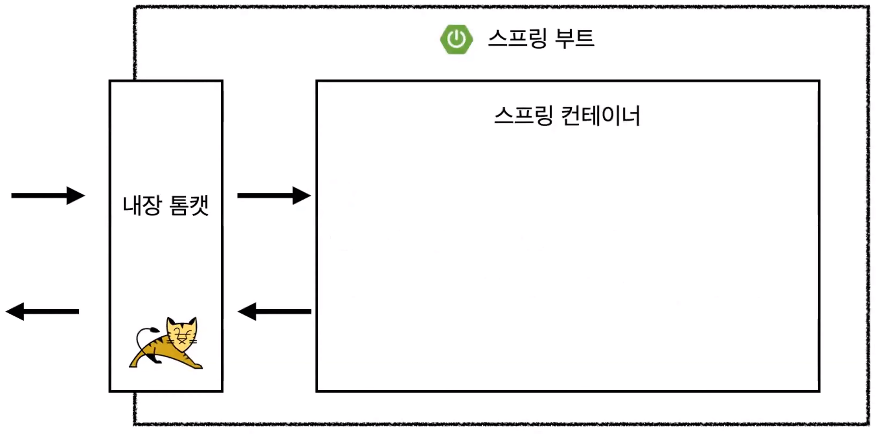
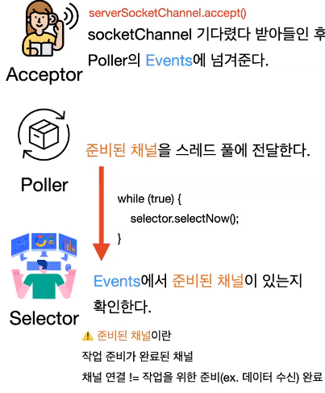
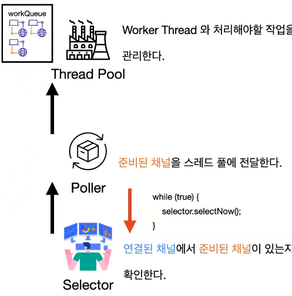
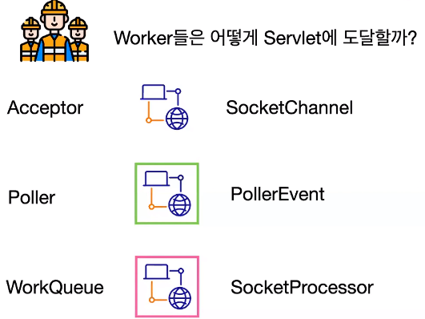
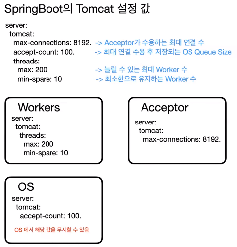
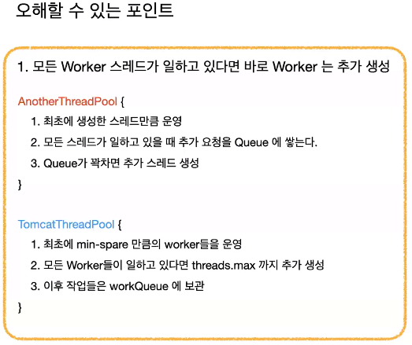
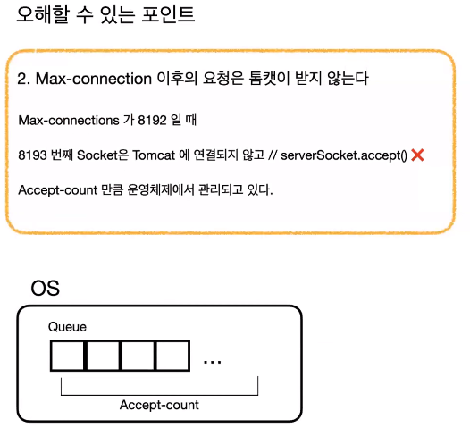
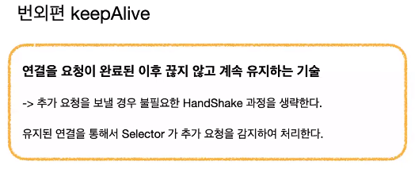

# 푸우의 Tomcat Thread Pool
[https://youtu.be/prniILbdOYA?si=2xpUHukUb-pHI22I](https://youtu.be/prniILbdOYA?si=2xpUHukUb-pHI22I)

# 푸우의 Tomcat Thread Pool
* toc
{:toc}

## 프로세스, 스레드, 스레드 풀이란?
+ 프로세스란 실행 중인 프로그램을 의미하고 스레드란 프로세스의 작업 단위를 의미 한다
+ 하나의 프로세스는 여러 개의 스레드가 할당될 수 있다 
+ Java의 스레드는 OS에 One to One으로 할당되기 때문에 생성 비용이 비싸고 많은 스레드는 빈번한 컨텍스트 스위칭을 발생시킨다
+ 그래서 스레드를 스레드 풀이란 곳에 미리 만들어 두고 필요한 시점에 꺼내어 쓰는 방식으로 사용한다
+ 
+ 스레드를 얻기 위한 스레드 풀은 내장 톰캣에서 관리되고 있다

## NIO Connector 구조
+ NIO Connector란 것은 Tomcat 8 버전 이상부터 기본적으로 사용된다 버전에 따라서 NIO Connector가 사용이 안될 수 있다
+ 
+ 사용자의 요청이 들어오면 요청이 Workers라는 스레드에 할당이 되어서 Dispatcher Servlet까지 도착한다
+ 서버가 실행되면 NioConnector가 생성되고 NioConnector 안에는 NioProtocol이 생성 된다
+ 그 안에 NioEndPoint라는 객체가 생성되는데 중요한 객체 3개를 이해해야 한다
+ 
+ NioEndPoint 안에 Acceptor와 Poller와 Sellector라는 객체가 존재한다
+ Acceptor는 소켓 채널을 기다렸다가 받아들인 후 Poller의 Events에 넘겨 준다
+ Poller의 Events란 Poller가 관리하고 있는 채널들의 큐를 의미하는 것이다
+ Poller는 준비된 채널을 스레드 풀에 전달하는데 여기서 준비된 채널이란 것은 작업 준비가 완료된 채널이다
  + 채널 연결과 작업을 위한 준비 완료 시점이 달르다 소켓이 연결이 되고, 연결된 소켓으로 데이터가 넘어오기까지 시간이 걸리기 때문에 연결되고 데이터가 다 넘어와야지 준비 완료됐다고 이해하면 된다
+ Sellector는 이 Poller의 채널들을 관리하고 있는 Events에서 준비된 채널이 있는지 확인하고 있다 계속 모니터링하고 있는 것이다
+ 생성이 되면 Poller는 이 Selector에게 while문으로 계속 반복적으로 준비된 채널이 있는지 묻는 코드가 계속 내부적으로 돌아가고 있다
+ 
+ 스레드 풀이란 워커 스레드와 처리해야 할 작업을 관리하는 녀석이다
+ Poller가 Selector에게 준비된 채널이 있는지 묻다가 Selector가 준비된 채널이 있는 걸 감지하고 있다고 반환한다 그럼 그 시점에 Poller는 준비된 채널을 달라고 Selector에게 요구하고 Poller가 스레드 풀에게 해당 채널을 넘겨 준다
+ 
+ 이 스레드 풀에는 방금 전 작업을 넘겨준 처리해야 될 작업의 WorkQueue가 있고 실질적으로 이 작업을 처리하는 worker라는 스레드가 있는데 스레드가 http-nio 시작하는 스레드이다
+ worker들은 큐에다가 자신이 처리해야 될 작업이 있는지 getTask()로 while문으로 지금 이게 blocking이 걸려있는 상황이고 큐에 넘어온 다음에 작업을 할당받는다 
+ worker는 WorkerQueue에서 작업을 할당받아서 작업을 처리하기 위해서 서블릿으로 가는데 이 구조가 WorkerQueue에는 Selector에 의해서 준비 완료된 작업들이 등록이 된다
+ 그래서 worker들은 연결된 시점에서 데이터가 넘어온 시점을 안 기다리고 처리할 수 있는 바로 그 시점의 태스크를 건네받기 때문에 idle한 시간 없이 바로 작업을 할 수 있는 이런 효율적인 구조가 완성이된다
+ 
+ worker들이 태스크를 전달 받았는데 결국엔 이 worker들이 서블릿까지는 도착을 해야 된다
+ Acceptor가 소켓을 연결한 시점에 받는 객체는 소켓 채널이다
+ Acceptor가 Poller에 넘기는 시점에 이 채널을 래핑해서 PollerEvent라는 걸 만들어서 보내주고 그리고 Poller가 나중에 스레드 풀에 넘길 당시에 SocketProcessor라는 객체로 래핑해서 보낸다
+ SocketProcessor라는 것은 Adapter와 Mapper라는 객체를 알고 있는데 Adapter와 Mapper를 통해서 알맞은 서블릿을 찾고 그 서블릿에 맞는 형태로 래핑하는 역할을 담당해준다
+ 그래서 worker는 전달받은 태스크를 그냥 task.run()만 해주면 스레드에 할당돼서 요청이 Dispatcher Servlet을 거쳐 Controller까지 도달할 수 있는 것이다
+ 
+ 톰캣에서 몇 가지 설정값으로 튜닝을 할 수 있다
+ Acceptor가 수용하는 최대 연결 수인 max-connections과 최대 연결 수용 후 저장되는 OS 큐 사이즈는 accept-count 늘릴 수 있는 최대 워커 수인 threads.max 최소한으로 유지하는 워커 수인 min-spare가 있다
+ 두 값(threads.max, min-spare)은 워커의, 값(max-connections)은 Acceptor의, accept-count는 OS에 의미를 가져다 주는데 accept-count의 경우에는 OS의 설정 값인데 이게 무시할 수도 있다고 하고
  accept-count를 1로 설정했다고 꼭 1개만 대기하는 것도 아니다 max threads 1, accept-count 1일 때 네 번째 요청도 원래는 deny가 떠야 되지만 또 꼭 그렇지만은 않다 무시될 수 있기 때문이다
+ 
+ 모든 워커 스레드가 일하고 있으면 워커 스레드는 추가 생성된다 다른 스레드 풀의 구현체는 최초에 생성한 스레드만큼 운영을 하다가
  모든 스레드가 일하고 있을 때 요청을 큐에 쌓은 다음에 큐가 꽉 차면 그때서야 스레드를 생성하는 메커니즘으로 돌아가는 스레드 풀이 있는 반면 톰캣의 스레드 풀은 최초의 min-spare만큼의 워커들을 운영하고 있다가 
  워커들이 모두 일하고 있다면 큐에 쌓지 않고 일단 threads.max까지 추가 생성을한다 그리고 추가 생성이 더 이상 할 수 없을 때 그때부터 workQueue에 저장하고 워커들이 작업이 끝났다면 그 다음 큐에서 할당받는 방식으로 동작을 한다
+ 
+ max-connection 이후의 요청은 톰캣이 받지 않는데 8193번째 소켓 연결은 톰캣에 연결되지 않는다 
+ 8192번째 소켓이 연결된 시점부터 serverSocket.accept()라는 메서드를 통해서 Acceptor가 소켓을 받는데 이걸 실행하지 않는다 그리고 8191이 될 때까지 무한 대기하고 있다
  그럼 그 추가 요청은 톰캣에 연결되는 게 아니고 OS에서 큐로 Accept-count만큼 관리되고 있다 근데 이 값은 무시될 수 있다
+ 
+ keepAlive란 연결을 요청이 완료된 이후 끊지 않고 계속 유지하는 기술이다 그래서 추가 요청을 보낼 경우 불필요한 HandShake 과정을 생략할 수 있는데 처음에 연결했을 때 요청이 와서 Acceptor에 연결되어서 Poller의 채널에 등록이 되면
  그 다음 요청부터는 Acceptor에서 Events로 등록하는 이 과정 없이 Selector가 해당 채널로 데이터가 넘어왔으면 준비된 채널이라 감지를 해서 그 다음 Poller에 의해서 스레드 풀에 전달되고 방금 전 봤던 그 모든 플로우를 거쳐서
  다시금 요청을 처리할 수 있는 이런 구조로 되어 있다
+ NioConnector의 Nio가 Non-Blocking을 의미한다
