# 레오, 하디의 Process Scheduling
[https://youtu.be/RZB7_6sAtC4?si=JD3Df1BDa02sGRrS](https://youtu.be/RZB7_6sAtC4?si=JD3Df1BDa02sGRrS)

# 레오, 하디의 Process Scheduling
* toc
{:toc}

## Program vs Process 
+ 프로그램
  + 하드디스크 등에 저장되어 있는 정적인 상태이다
  + 명령어 리스트를 내용으로 가진 실행 파일
+ 프로세스
  + 실행을 위해 메모리에 올라온 동적인 상태
  + 동일한 프로그램으로부터 별도의 실행을 가질 수 있다
    + 예를 들면 크롬을 다운받았을 때 그걸로 이제 브라우저 하나만 띄울 수 있는 게 아니다 다양한 이제 여러 개의 프로세스를 띄울 수 있다

## Process Loading
+ 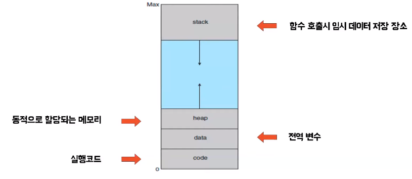
+ 프로세스가 메모리에 적재가 되면 네 개의 섹션을 가진 형태로 존재
+ 코드 영역은 텍스트 영역이라고도 많이 불리는데 프로그램을 짠 코드가 이 부분에 이제 올라간다
+ 데이터 영역은 Java에서 static 변수하면서 전역 변수 설정을 많이 하는데 해당 부분이 올라간다고 보면 된다
+ 힙 영역은 동적으로 할당되는 메모리인데 예를 들어서 c언어는 memory allocation 함수 Java는 new 키워드를 쓰면서 힙 영역에 동적으로 할당을 할 수 있다
+ 스택 영역은 함수 호출 시 임시 데이터가 저장되는 장소인데 예를 들어서 함수 호출 시 매개 변수나 아니면 함수 내에서 정의된 지역 변수 등이 담기게 된다

## Process State
+ 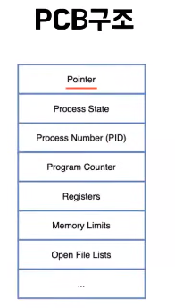
+ PCB는 Process Control Block의 약자로서 프로그램이 메모리에 로드될 때 프로세스가 되면 PCB 또한 같이 생기게 되는데 PCB는 현재의 메모리에 적재되어 있는 프로세스의 상태를 알려 준다고 보면 된다
+ 포인터는 메모리에 보통 많은 프로세스들이 올라가있는데 CPU는 PCB를 보면서 이제 프로세스를 실행을 하게 된다 그러면 어떤 프로세스가 실행됐을 때 그 프로세스가 끝나면 다음 프로세스가 어떤 게 실행이 되어야 할까' 에 대한 정보를 담고 있는 게 바로 이 포인터 부분이다
+ 프로세스 스테이트는 running, waiting, ready 등 많은 상태를 가질수 있다
+ PID는 프로그램 프로세스로 되면은 프로세스에 식별자를 부여하게 되는데 그 부분이 여기에 저장된다
+ 프로그램 카운터는 예를 하나 들어보면 100줄짜리 코드를 짰는데 실행을 시키는데 55줄까지 실행이 될때 누가 CPU를 뺏어갔고 고 다시 돌려받았는데 '어, 다음은 어디서부터 실행을 해야되지?' 해당 문제에 대해서 프로그램 카운터에 다음 실행을 실행을 할 주소를 담고 있다
+ 레지스터 값은 프로세스가 실행이 되면서 레지스터 값이 되게 많이 변하게 되는데 마지막 상태를 저장하기 위해서 있다

### 프로세스 스테이트에 대해서 조금만 자세히
+ 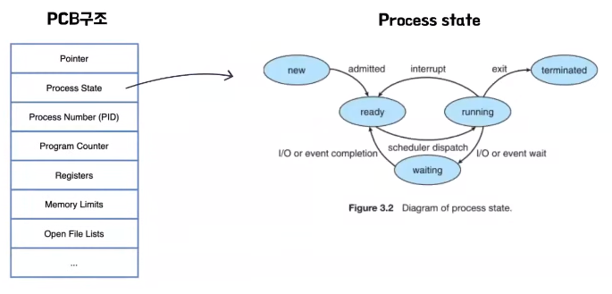
+ 처음에 프로그램이 메모리에 로드가 돼서 프로세스가 되면 new 상태로 되어 있는데 그 다음에 ready 상태로 들어가고 다음에 이제 ready 상태에서 running 상태로 되는 것 
+ dispatch라고 되어 있는데 ready 상태에서는 아직 CPU의 할당을 못 받은 상태이다 CPU의 할당을 기다리는 상태 running 상태가 되면은 이제 CPU를 점유하고 자신의 프로세스 실행을 할 수가 있게된다
+ 그래서 running 상태에서 interrupt라는 걸 받으면 이제 ready 상태로 돌아가게 되는데 그리고 running 상태에서 이제 I/O 이벤트 등이 일어나면 waiting 상태로 가게 된다
+ 이 I/O 이벤트들은 예를 들어서 '뭐 키보드로 입력을 받아야 된다'하면은 그 프로세스가 CPU를 잡고 있을 이유가 없다 다른 걸 실행해주면 되니까 그래서 waiting 상태로 갔다가 I/O 이벤트 completion이 일어나면 다시 ready 상태로 돌아간다
+ 그리고 실행 중인 프로세스가 자기 실행 다 끝냈다 이러면 빠져 나간다

### 조금 더 깊게 dispatch
+ 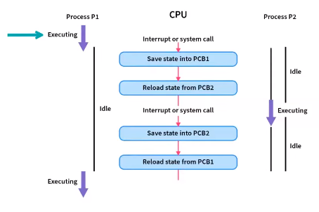
+ 첫 번째로는 프로세스가 P1이 실행이 되고 있다
+ 그런 다음에 프로세스 P2가 자기도 이제 실행을 해야 되니까 "너 나와!" 한다
+ 그러면 이미 실행 중인 프로세스 P1은(정확히 CPU가 하겠지만) 첫 번째로 자신의 실행하고 있던 정보를 저장을 한다 '지금까지 내가 어디까지 했더라'를 저장한다 그래서 자신의 PCB 영역에 저장을 하게된다
+ 그 다음에 P2 올라온다 프로세스 P2의 정보를 PCB2가 담고 있으니까 CPU로 리로드를 해서 가져온다
+ 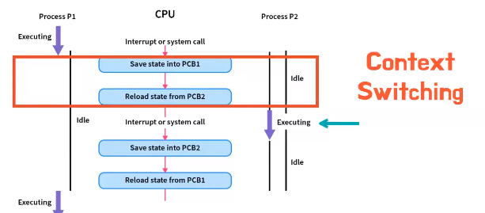
+ 그런 과정 뒤에 이제 프로세스 P2가 실행이 되는데 그림을 보면 보라색 부분은 프로세스가 실행이 되고 있는 부분인데 빨간색 부분은 비어있다 저기서는 프로세스가 실행이 되고 있지 않다는 건데 실행 중인 프로세스를 PCB에 저장하고
  실행될 것을 다시 가져오는 이 과정을 컨텍스트 스위칭(Context Switching)이라고 부르는데 이 컨텍스트 스위칭 과정이 이게 되게 순수한 오버헤드(Overhead)이다
+ 그래서 이 기간 동안은 어떠한 프로세스도 실행을 할 수가 없다 이게 계속 반복이 되면 되게 효율이 떨어지된다
+ 그 다음에 똑같이 컨텍스트 스위칭이 일어나면서 P1에게 돌아가게 된다 

## Scheduling Algorithm
+ 어떤 프로세스가 언제 어떻게 CPU를 할당받을지 결정하는 것을 CPU Scheduling이라는 기법을 통해서 결정을 하게 된다
+ CPU Scehduling은 크게 비선점 알고리즘 그 다음에 선점 알고리즘으로 나뉘게 된다
+ 각각의 알고리즘의 종류가 다양하다
+ 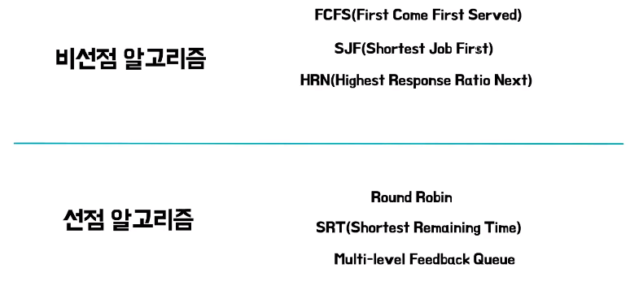
+ 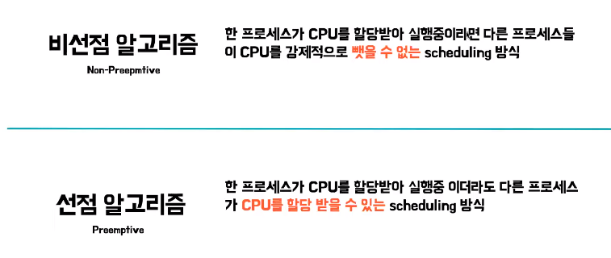
+ 비선점 알고리즘이란 한 프로세스가 CPU를 할당 받아서 자신의 작업을 처리하고 있으면 다른 프로세스가 해당 CPU를 뺏을 수 없는 방식을 비선점 알고리즘이라고 한다
+ 선점 알고리즘은 한 프로세스가 CPU를 할당 받아서 실행 중이더라도 언제든지 다른 프로세스가 해당 CPU를 뺏어 와서 자신의 작업을 처리할 수 있는 방법을 선점 알고리즘이라고 한다

### 비선점 알고리즘

#### FCFS(First Come First Served)
+ FCFS란 First Come First Served인데 흔히 알고 있는 큐 방식처럼 처리를 하는 것이다
+ 메모리에 먼저 로드된 프로세스에게 우선 순위를 먼저 부여해서 해당 프로세스에게 CPU를 할당해주는 비선점형 스케쥴링 기법이다

##### 예시
+ 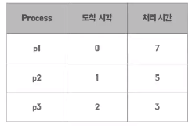
+ P1, P2, P3 프로세스가 각각 0초, 1초, 2초 이렇게 순서대로 메모리에 로드된 것을 볼 수가 있는데 0초의 시점에 지금 현재 메모리에 로드되어 있는 프로세스는 P1밖에 없기 때문에 P1이 CPU를 할당 받아서 자신의 작업을 처리한다
+ 이후 이제 7초가 지난 시점에 P2, P3가 메모리에 로드되어 있다 그런데 이제 P2가 P3보다 먼저 메모리에 로드되었기 때문에 P2가 CPU를 할당 받아서 자신의 작업을 처리하고 P3가 이제 다시 CPU를 할당 받아 자신의 작업을 처리 한다
+ 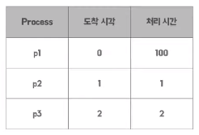
+ P1이 먼저 도착했지만 처리 시간이 매우 긴 것을 볼 수가 있다 
+ 이 상황에서도 먼저 CPU는 0초의 시점에 메모리에 로드되어 있는 프로세스는 P1밖에 없기 때문에 P1에게 CPU가 할당되고 P1은 약 100초 동안 CPU를 독점하면서 자신의 작업을 처리하게 된다 
+ 이후 P2가 처리되게 되는데 P2는 막상 도착한 것은 1초에 도착을 했지만 P1 때문에 약 100초를 기다린 후에야 CPU를 할당받아서 자신의 작업을 처리할 수 있다
+ P3도 마찬가지로 많은 시간을 기다린 후에야 CPU를 할당 받아서 자신의 작업을 처리할 수 있다

> 이와 같은 효과를 콘 보이 효과라고 한다
> P1처럼 처리 시간이 매우 긴 프로세스가 CPU를 차지하면 현재 CPU를 할당받기를 원하고 있는 프로세스들이
> 매우 긴 시간 동안 대기해야 된다는 효과를 콘 보이 효과라고 하는데 FCFS에서는 이런 효과가 발생할 수 있다

#### SJF(Shortest Job First)
+ SJF는 FCFS와는 달리 먼저 메모리에 로드된 순서대로 CPU를 할당하는 게 아니라 현재 CPU를 할당받기를 기다리고 있는 프로세스중에서
  처리할 작업량이 가장 적은 프로세스에게 우선순위를 부여해 CPU를 할당해주는 비선점형 스케쥴링 기법

##### 예시
+ 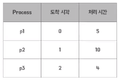
+ 현재 0초의 시점에는 P1만 메모리에 로드되어 있기 때문에 P1이 CPU를 할당받는데 자신의 작업을 처리한 이제 5초의 시점에서 보면 P2, P3 모두 메모리에 로드되어 있게 된다
+ 근데 이제 각각의 처리 시간을 보면 P2가 먼저 왔지만 P3보다는 처리 시간이 긴 것을 볼 수가 있다
+ 그래서 이제 P2가 아닌 P3가 작업 시간이 더 짧기 때문에 P3가 CPU를 할당받게 되고 이후 P3가 끝난 다음에 P2가 CPU를 할당받아서 작업을 완료하게 된다
+ 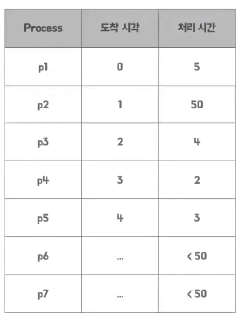
+ 0초의 시점에 P1에게 CPU가 할당된다
+ 그럼 이제 P1이 자신의 작업을 끝낸 5초 뒤에는 P2, P3, P4, P5가 메모리에 로드되어 기다리고 있다
+ 그럼 여기서 처리 시간이 가장 짧은 P4에게 CPU가 할당되어 자신의 작업을 처리하고 그 다음으로 짧은 P5, P3 그 다음에 이제 P6, P7도 다 처리 시간이 50초 미만이기 때문에 P6, P7이 이어서 CPU를 할당받게 된다
+ 이렇게 되면 처리 시간이 가장 긴 프로세스는 우선순위가 계속 뒤로 밀리면서 CPU를 영원히 할당받지 못하게 되는데 이를 starvation 현상이라고 한다

> 처리 시간이 긴 프로세스는 우선 순위가 뒤로 밀려 starvation 현상이 일어난다
> 
> starvation은 한국말로 기아라는 뜻으로
> 'CPU를 할당받지 못해서 계속 굶주리고 있다'
> 이런 의미를 가지고 있다

> 현실적으로 Queue에 있는 프로세스들의 작업량을 알 수 있는 방법이 없다
> 
> 현재 메모리에 로드되어서 CPU 할당받기를 기다리고 있는 프로세스들이
> 각각의 프로세스가 얼마 동안 CPU를 할당받아야 되는지를 현실적으로 알 방법이 없다는 특징이 있다

#### HRN(Highest Response Ratio Next)
+ SJF는 각 프로세스들의 작업량이 짧은 것만 보고 우선순위를 결정했다면 HRN은 거기에 더해서 이제 해당 프로세스가 CPU를 할당받기까지
  얼마나 기다렸는지를 종합적으로 고려해서 우선순위를 부여해 스케쥴링을 할당하는 방법
+ 

##### 예시
+ 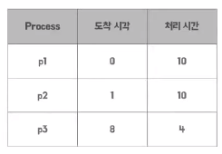
+ P1이 CPU를 할당받는다 그 다음에 10초가 지난 시점에 이제 P2와 P3 중에 어떤 프로세스에게 CPU를 할당할지 결정을 해야 되는데 우선순위를 계산해 보면
  P2가 처리 시간은 더 많지만 1초에 도착해서 지금 현재 10초까지 기다렸기 때문에 P2가 우선순위가 더 높게 계산되어 P2가 CPU를 할당받아서 작업을 처리하고 다음으로 P3가 CPU를 할당받아 작업을 처리하게 된다

### 선점 알고리즘

#### Round Robin
+ Round Robin이란 한 프로세스가 할당받은 시간 동안 작업을 하다가 자신의 작업을 타임 슬라이스 안에 모두 처리하지 못하면
  대기 큐의 맨 뒤로 가서 다시 자기 차례를 기다리는 선점형 스케쥴링 기법

##### 예시
+ 
+ 0초에 시점에 그동안 마찬가지로 P1이 먼저 CPU를 할당받게 된다
+ 하지만 P1이 자신의 작업을 처리하는데 필요한 시간은 5초인데 타임 슬라이스는 4초밖에 되지 않아서 자신의 작업을 모두 완료하지 못하고 CPU를 내놓게 된다
+ 다음으로 이제 메모리에 P1 다음으로 메모리에 로드된 P2가 CPU를 할당 받아서 처리하게 되는데 P2도 마찬가지로 자신의 작업을 처리하는데 6초가 필요하지만 타임 슬라이스는 4초기 때문에 약 4초간 작업을 처리하고 CPU를 P3에게 뺏기게 된다
+ P3는 이제 타임 슬라이스 안에 자신의 작업을 모두 처리할 수 있기 때문에 다시 대기 큐의 맨 뒤로 가지 않고 프로세스가 종료된다
+ 이후 다시 P1이 CPU를 할당받고 P2가 CPU를 할당 받아서 모든 프로세스가 처리된다
+ 이런 식으로 타임 슬라이스를 정해놓고 해당 타임 슬라이스가 끝나면은 다른 프로세스가 CPU를 할당 받는 방법을 Round Robin이라고 한다

#### SRT(Shortest Remaining Time)
+ SJF(Shortest Job First)에 선점형 스케쥴링 방식을 혼합한 방식이다 
+ SJF의 선점형 스케쥴링 방식이라고 이해를 해주시면 편하다

##### 예시
+ 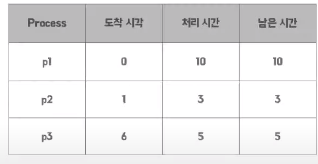
+ P1이 먼저 CPU를 할당받아서 작업을 처리
+ 1초가 지난 시점에 P2라는 프로세스가 메모리에 지금 로드돼서 도착을 했다 
+ 근데 P2의 처리 시간을 보면 3초고 P1이 자신의 작업을 처리하려면 남은 시간이 9초가 필요하다
+ 처리 시간이 더 짧은 프로세스가 지금 현재 메모리에 로드되어 있기 때문에 P2가 CPU를 할당받아서 자신의 작업을 처리하게 된다
+ P2가 마저 작업을 다 처리하게 되면 P1이 다시 CPU를 할당받게 된다
+ 6초가 지난 시점에 이제 다시 또 P3라는 애가 들어오게 된다 
+ P3는 또 P1의 남은 시간보다 처리 시간이 더 짧기 때문에 다시 P3가 CPU를 할당받아서 작업을 마저 처리하게 된다
+ 이후 P3가 끝나고 P1이 자신의 작업을 마저 처리하게 된다
+ 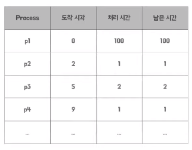
+ P1이 가장 먼저 도착했지만 처리 시간이 다른 프로세스보다 압도적으로 긴 것을 볼 수가 있다
+ P1이 CPU를 할당받아서 처리를 하고 있는데 P2가 들어오면 P2의 처리 시간이 더 짧기 때문에 P2에게 뺏긴다 
+ 이후 다시 P1이 CPU를 할당받고 다시 또 5초가 되는 시점에 P3가 들어왔는데 P3 역시 P1보다 처리 시간이 짧기 때문에 다시 P3에게 CPU를 뺏기게 된다
+ 이런 식으로 계속 돌아가다 보면 P1처럼 대기 시간이 매우 긴 프로세스는 SJF와 마찬가지로 starvation 현상이 일어나면서 계속해서 다른 프로세스에게 CPU를 뺏기는 현상이 일어날 수 있다

#### Multi-Level Feedback Queue
+ 여러 개의 waiting queue를 두고 각 큐에 우선순위를 부여해 만약에 우선순위가 높은 큐에 프로세스가 존재한다면 해당 프로세스에게 CPU를 할당하는 선점형 스케쥴링 기법이다
+ 크게 다섯 가지 규칙이 있다
+ 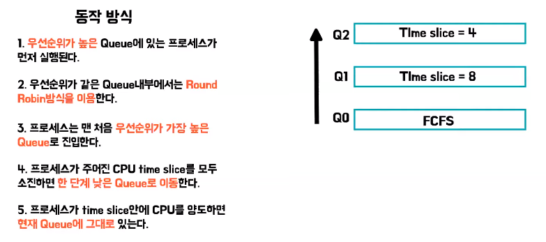

##### 예시
+ 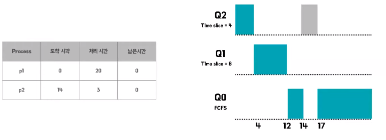
+ P1이 이제 0초에 메모리에 로드가 됐다
+ 그러면 가장 높은 우선순위 큐에 적재가 된다
+ 그럼 이제 Q2에 적재가 되게 된다 근데 P1이 해당 타임 슬라이스동안 작업을 수행했지만 모두 처리하지 못하기 때문에 Q1으로 강등이 된다
+ 그 다음에 또 Q1에서도 자신의 작업을 모두 처리하지 못한다 그래서 이제 Q0로도 다시 강등이 된다
+ 이제 14초가 지난 시점에 P2가 새롭게 메모리에 로드되면은 P2는 Q2라는 가장 높은 우선순위 큐에 적재가 되면서 Q0보다 우선순위가 높은 Q2에 프로세스가 존재하기 때문에
  P2가 CPU를 할당 받아서 자신의 작업을 처리하게 되고 P2같은 경우에는 타임 슬라이스 안에 자신의 작업을 모두 처리할 수 있기 때문에 자신의 모든 작업을 처리하고 종료되게 된다
+ 이후 Q0보다 높은 우선순위에 남아있는 프로세스가 없기 때문에 P1이 이제 CPU를 할당 받아서 자신의 작업을 모두 처리할 수 있다

## 마치기 전에 
+ 비선점 스케쥴링 방식은 이제 CPU를 다른 프로세스에게 뺏기지 않기 때문에 컨텍스트 스위칭이 상대적으로 좀 적게 일어날 수 있다
  근데 그 대신에 좀 불공평한 starvation 현상같은 좀 불공평하게 프로세스에게 CPU가 할당되는 특징이 있다
+ 선점형 알고리즘 기법은 다른 프로세스들이 CPU를 뺏을 수 있기 때문에 기회는 공평하게 가지지만 그 과정에서 컨텍스트 스위칭이 발생하면서 성능적으로 오버헤드가 발생할 수 있다는 특징이 있다
