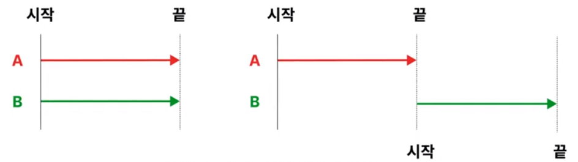
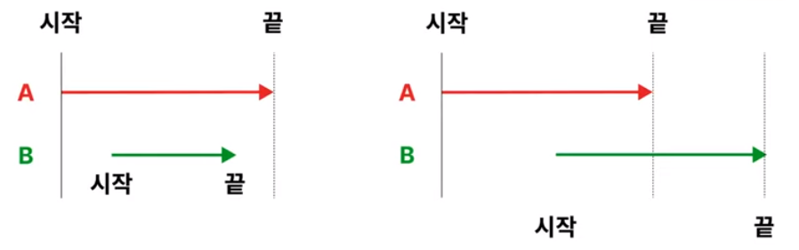
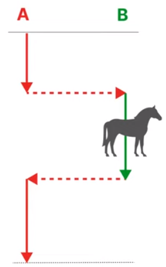
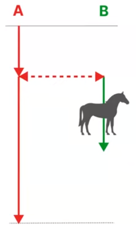
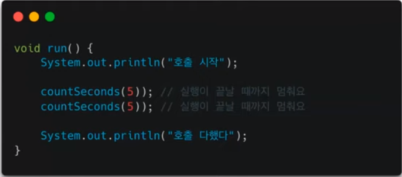
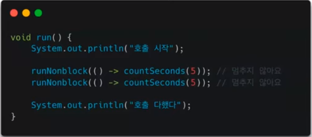

# 땡칠의 Blocking vs Non-Blocking과 Sync vs Async
[https://youtu.be/ohz7uHnza6A?si=d3TkoI97GKKhP62b](https://youtu.be/ohz7uHnza6A?si=d3TkoI97GKKhP62b)

# 땡칠의 Blocking vs Non-Blocking과 Sync vs Async
* toc
{:toc}

## 목적
+ CPU는 소모되지는 않지만 분명히 한정적인 자원이다 그래서 아끼지 말고 최대한 많이 사용해야 효율적으로 활용하는 것이라고 할 수가 있다
+ 효율적으로 사용해서 성능 향상을 꾀하기 위한 방법이다

## Sync &Async
+ Synchronous의 Syn는 함께 라는 뜻이고, Chrono는 시각이라는 뜻이다

### 구분
+ 동기는 먼저 작업들이 같이 시작해서 같이 끝나는 것으로 구분할 수 있다 
+ 비동기는 작업들의 시작과 끝이 다른 것으로 구분할 수 있다

### 목적
+ 동기
  +  
  + 동기는 작업들이 같이 시작해서 같이 끝나도록 처음과 끝을 같이 하도록 하기 위해서 사용한다
  + 비동기는 시작과 종료 시기를 신경 쓰지 않고 처리를 하기 위해서 사용한다
  + 동기는 둘 이상의 작업을 동시에 시작해서 동시에 끝나게 하기 위해서 사용하고 또 작업 중에 다른 작업이 끼어들지 못하게 하기 위해서 사용한다
+ 비동기
  + 
  + 비동기는 시작과 끝이 달르다 작업들의 시작과 끝이 다르다는 것이 가장 큰 차이점이라고 할 수 있다
  + 작업 중에 끼어들어도 괜찮다
  + 그래서 이 비동기는 작업들의 시작과 종료 시기를 신경 쓰지 않고 처리하기 위해서 사용한다

## Blocking & Non-Blocking

### 구분
+ 다른 작업의 실행이 현재 작업의 실행을 막는지 여부로 구분한다
+ 블로킹은 다른 작업의 실행이 현재 작업의 실행을 막고
+ 논블로킹은 다른 작업의 실행이 현재 작업의 실행을 막지 않는다
+ 다르게 얘기하면은 호출한 함수가 멈춰있는다 혹은 멈춰있지 않는다로 구분할 수가 있다

### 목적
+ 제어할 수 없는 대상의 제어 방법을 정의하기 위해서 사용
+ 여기서 제어할 수 없는 대상이라는 것은 실행한 작업을 얘기하는 거고 제어 방법은 대상이 제어권을 빼앗을 것인지 아니면 별도로 제어권을 하나 줄 것인지 이것을 얘기하고 있다
+ Blocking
  + 
  + A 함수는 B 함수를 호출한다
  + A가 B 함수 호출했을 때 블로킹에서는 B함수가 끝날 때까지 A는 실행할 수가 없다
  + 그리고 B 실행이 끝나고 나서야 비로소 A가 실행된다
  + 여기서 우리는 A가 제어할 수 없는 대상인 B가 제어권을 빼앗았다라는 것을 알 수 있다 
  + 그래서 블로킹의 목적을 달성했다고 할 수 있다
+ Non-Blocking
  + 
  + A는 B를 호출하고 싶어한다
  + 블로킹과 다르게 호출했을 때 둘 모두 실행 상태로 들어간다
  + 여기서 A가 제어할 수 없는 대상인 B가 별도의 제어권을 얻었다는 것을 알 수 있다 
  + 그래서 논블로킹의 목적을 달성했다고 할 수 있다

### 예제
+ Blocking
  + 
  + 함수를 실행하는데 10초 정도가 걸린다
  + 10초가 걸리는 이유는 처음에 함수가 실행되었을때 카운트 함수를 호출
  + 그리고 블로킹이기 때문에 run은 실행을 멈춘다
  + 그리고나서 5초가 지난 후에서야 다시 run 함수로 돌아온다
  + 그 다음에 다시 카운트 세컨즈를 실행 하기 때문에 총 합쳐서 10초가 걸린다
+ Non-Blocking
  + 
  + 이 함수 실행하는데는 약 5초 정도가 걸린다
  + 멈추지 않고 즉시 다음 함수도 호출 했기 때문에 이 두 함수가 비슷한 시기에 호출됐고 결과적으로 총 약 5초 정도가 걸렸다고 얘기할 수 있다

## 정리
+ 동기, 비동기, 블로킹, 논블로킹의 목적은 cpu를 가장 효율적으로 사용하고 성능을 향상시키기 위해서 사용
+ 동기, 비동기는 작업들이 함께 시작되고 끝나는지 여부로 구분할 수가 있다 그리고 목적은 작업들의 동시 실행과 종료를 보장하기 위해서였다
+ 블로킹, 논블로킹은 다른 작업의 실행이 현재 작업의 실행을 막는지 여부로 구분할 수가 있다 목적은 제어할 수 없는 대상의 제어 방법을 정의하는데 있다

### 선태의 기준
+ 논블로킹 비동기가 가장 성능이 좋을까? (처리량 / 시간)
  + 시간당 처리량으로 봤을 때 그럴 수도 있겠다 싶은데 블로킹 동기랑 멀티스레딩으로도 충분히 성능을 올릴 수 있다
+ 대신에 고려해야 될 대상 스레드 관리 비용이 존재한다
  + 만약에 한 작업이 오래 걸린다?
    + 스레드 할당 오버헤드가 적기 때문에 딱히 불리하다고는 얘기할 수가 없다
  + 짧게 끝나는 작업이 여러 번이다?
    + 그러면은 매 작업마다 스레드를 할당해줘야 되기 때문에 거기서 발생하는 오버헤드가 있다
    + 그래서 이 경우에는 논블로킹이 조금 더 유리하다고 할 수다
+ 개발자에게는 성능만 비용이 아니다
+ 다른 개발자들의 인지 비용도 비용이다
  + 블로킹 동기는 순차적으로 실행되기 때문에 직관적이다
  + 논블로킹은 실행 순서와 순차적 처리를 신경 써야 되기 때문에 추가 비용이 든다
