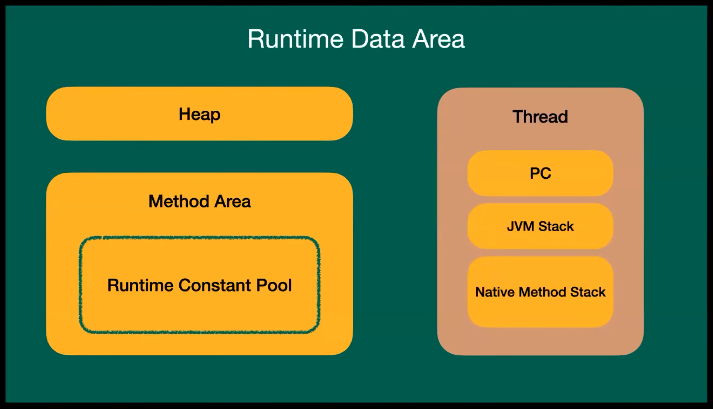
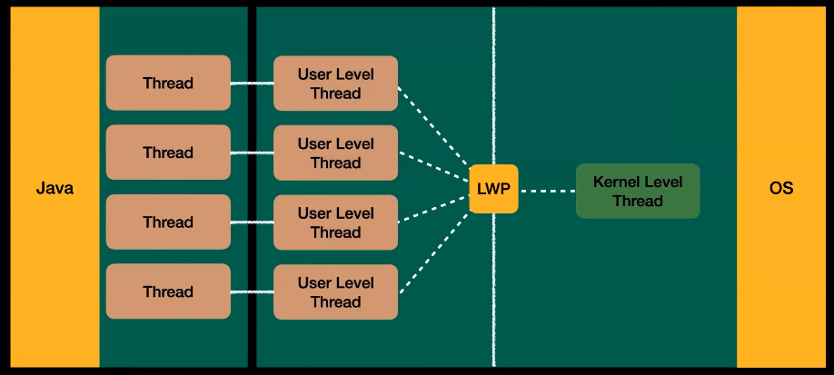
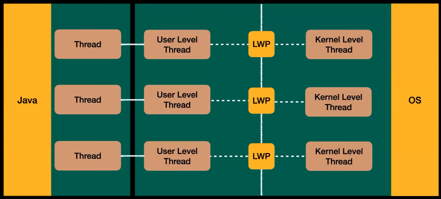
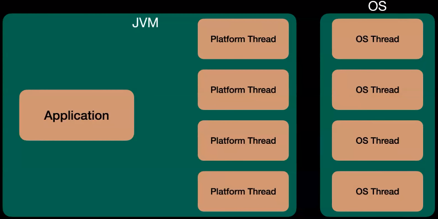
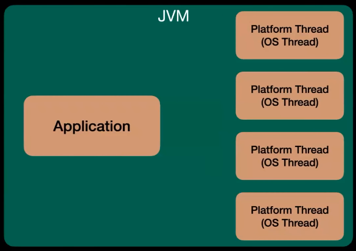
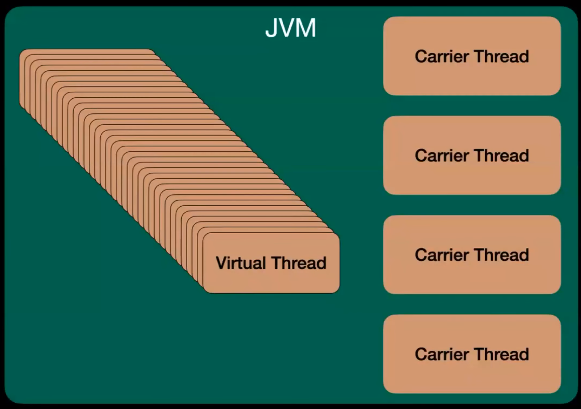
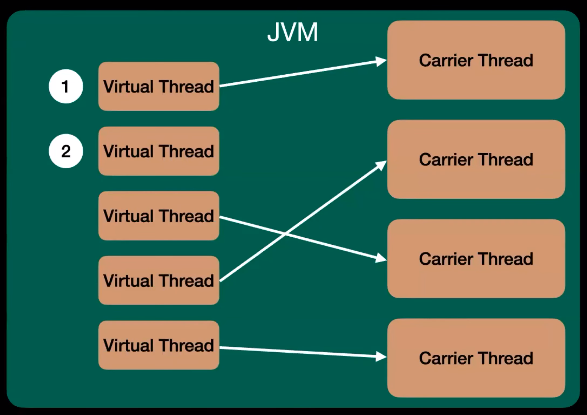

# 우가의 Virtual Thread (Java21의 새로운 기능)
[https://youtu.be/Q1jZtN8oMnU?si=oDeJsqynE1AtcprO](https://youtu.be/Q1jZtN8oMnU?si=oDeJsqynE1AtcprO)

# 우가의 Virtual Thread (Java21의 새로운 기능)
* toc
{:toc}

## Thread 란?
+ 
+ Heap은 new 명령으로 생성된 인스턴스나 객체가 저장되는 공간
+ Method Area는 이제 클래스, 변수, 스태틱, 정적 변수들이 저장되는 공간 여기 안에는 Runtime Constant Pool이 있는데 여기도 이제 클래스 정보와 같이 메타 데이터들이 저장되는 공간이다
+ Thread는 Process의 작은 작업 단위
+ 여기서 PC는 Process Counter Register이고 Thread 작업 흐름 단위를 저장하고 있다
+ JVM Stack은 이제 메소드 스택을 저장 메소드가 종료되면 메모리 공간에서 사라지게된다 
+ Native Method Stack은 이제 JNI라고 Java Native Interface인데 Java 코드가 아닌 다른 언어로 이루어진 언어들이 스택으로 저장되는 공간

## Green Thread Model 이란?

### Green Thread Model (N:1)
+ 
+ User Level Thread
  + 커널 상위에 존재하게 되고 User Library에서 구현된다
  + 구현되는 부분은 Thread의 생성과 스케줄링을 관리하는 부분을 라이브러리로 만들어서 제공을 해야 된다
+ Kernel Level
  + OS에서 커널 단에서 스케줄링하고 Thread와 Thread의 생성과 제거를 담당하게 된다
  + 자바 초창기에는 이렇게 User Level Thread와 Kernel Level Thread가 다대일로 이루어진다
  + User Level Thread가 다대일로 이루어지면서 User Level Thread를 원하는 만큼 만들 수가 있는데 하나의 User Level Thread만 Kernel Level Thread에 연결을 할 수가 있어가지고 나머지 한 User Level Thread가 연결되면
    만약에 한 User Level Thread가 블록킹이 되는 모든 User Level Thread가 전체 멈추게 되는 상황이 발생한다
  + Kernel Level Thread는 프로세스 내부의 Thread가 어떻게 동작하고 있는지 몰라서 그렇다
  + 컴퓨터가 좋아지면서 멀티코어가 표준이 되어서 이런 식으로 Green Thread Model을 N대1로 하게 되면 멀티코어의 효율을 살릴 수가 없어서 이 모델은 바로 사라지게 되었다

### 1:1 Thread Model
+ 
+ User Level Thread와 Kernel Level Thread가 1대1로 맵핑되는 것이다
+ User Level Thread랑 Kernel Level Thread랑 맵핑 됐을 때 장점은 하나가 블로킹 되어도 이제 병렬로 수행이 가능하다는 점인데 이때 User Level Thread를 무한정 만들 수는 있지만 Kernel Thread가 똑같이 1대1로 맵핑되기 위해서
  Kernel Level Thread가 똑같이 맞춰서 만들어져야 되는데 이는 시스템상 성능에 부하가 오기 때문에 윈도우나 리눅스 같이 OS들은 Thread의 최대 개수를 제한해서 성능에 이점을 챙기려고 노력했다

## Native Thread Model 이란?
+ 
+ 
+ 일반적으로 알고 있는 Java Native Thread Model은 OS Thread가 있고 JVM 안에는 Platform Thread가 있다.
+ Platform Thread는 이제 OS Thread를 가지고 랩핑을 해서 가지고 있게 되는데 이때 Solaris OS는 Platform Thread와 OS Thread가 N대M의 경우를 가지고 있고 윈도우랑 리눅스는 원투원을 가지고 있다.

## Virtual Thread 란?
+ Java 19 Preview로 등장을 하였고 JDK 21에 정식적으로 릴리즈 되었다
+ Virtual Thread는 처리량이 높고 유지 보수 및 디버깅이 수월해지는 경량 Thread이다
+ 디버깅이 수월해지는 뜻은 Thread랑 동작이 비슷하게 작동해서 그렇다
+ 
+ Virtual Thread을 보면 Carrier Thread가 있다 Native Thread Model에서 Platform Thread가 있는데 Platform Thread와 같이 Carrier Thread는 OS Thread랑 똑같이 1대1로 맵핑을 하게 된다
+ 이때 Virtual Thread는 JVM 내부에서 JVM 내부 스케줄링에 의해서 Virtual Thread가 스케줄링이 되고 Carrier Thread는 똑같이 1대1로 맵핑이 되는데 이제 Platform Thread와 다른 점이 하나 있다
+ Platform Thread를 사용할 때 블로킹이 된다면 Platform Thread 자체가 같이 대기 상태가 되는데 이때 대기상태가 된다는 것은 수행이 끝날 때까지 수행을 못한다 
+ Carrier Thread는 그거와 다르게 Virtual Thread가 하나 Carrier Thread와 연결되면 만약에 블록팅이 발생하면 Carrier Thread는 대기하지 않는다.
  그 Virtual Thread를 잠시 중단시키고 다른 Virtual Thread를 가져와서 수행을 시키는데 이는 CPU 효율을 최대 효율로 구현하기 위해서 쓴다
+ 
+ 1번 Virtual Thread를 보면 Carrier Thread랑 연결되어 있다 이때 1번 Virtual Thread에서 블로킹이 발생한다면 Virtual Thread는 Carrier Thread에 마운트 된다고 하는데 이때 마운트 될 때
  힙 메모리 영역에 Virtual Thread 정보를 저장하게 된다
+ 그리고 1번 Virtual Thread에서 블록킹이 발생한다면 Carrier Thread는 놀고 있는 2번 Virtual Thread를 가져와서 수행을 하게 된다
+ 이때 이제 스케줄링에 의해서 1번이 다시 IO 처리가 끝나고 1번이 수행되게 된다면 이때 다시 마운트 될 때는 힙 메모리 영역에 있던 스택, 메소드 스택들을 다 가져와서 다시 실행하게 된다

### Virtual Thread의 장점
+ 컨테스트 스위칭 비용이 저렴
  + 기존 Native Thread 모델은 Platform Thread로서 컨테스트 스위칭이 커널 단에서 발생하는데 이게 OS 단에서 발생하면
    아무래도 JVM에서 내부에서 스케줄링이 돌아가는 것보다 컨테스트 스위칭이 비싸서 Virtual Thread는 더 저렴하다
+ 기존보다 높은 처리량을 제공
  + 왜냐하면 Thread가 쉬지 않고 최대 CPU를 사용하기 때문에 높은 처리량을 제공
+ CPU를 효과적으로 활용
  
### Virtual Thread 주의할 점이 
+ 응답이 빠르지는 않다 응답이 빠르지는 않고 처리량이 더 높을 뿐이다
+ Thread는 엄청 많이 생성이 될 수가 있다 그래서 ThreadLocal 같이 Thread마다 생성되는 것을 신중히 사용해야 한다
+ Synchronized랑 Native Method를 지양해야 하는데 이를 공식 문서에서는 Avoid Pinning이라고 표현을 했다
  + Synchronized랑 Native Method를 사용하면 앞서 봤던 Carrier Thread가 같이 대기상태가 걸리게 되는데 그 Carrier Thread가 대기상태에 걸린다는 것은 Platform Thread랑 똑같이 대기상태에 걸리게 된다
  + 그래서 가상 Thread의 이점을 누릴 수가 없어서 공식문서는 이걸 Avoid Pinning이라고 Synchronized 랑 Native Method를 지양하라고 한다
