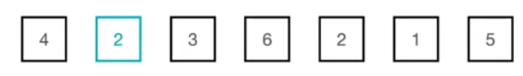
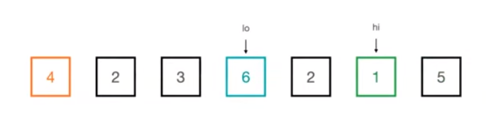
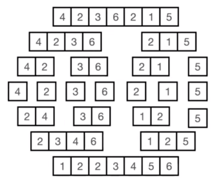
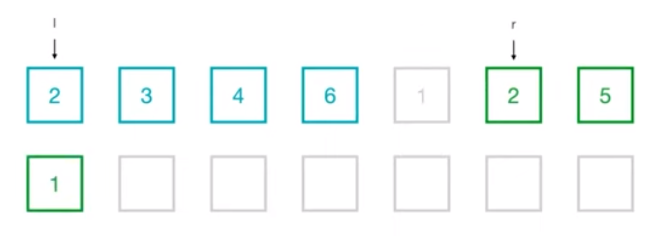
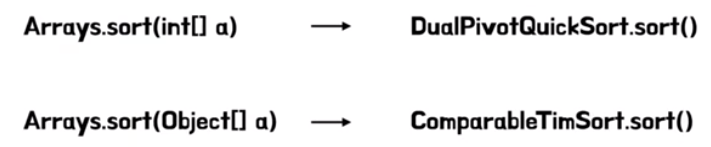
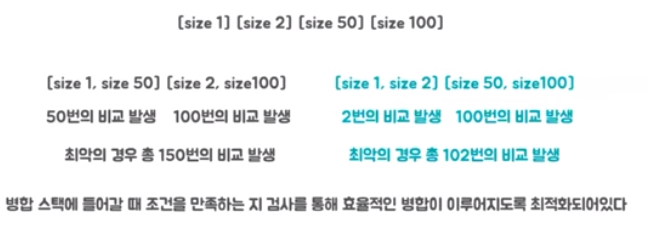
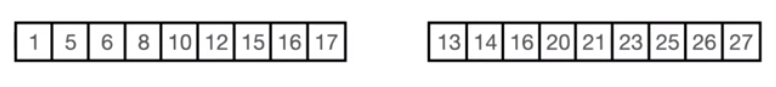

# 오도의 정렬 알고리즘
[https://youtu.be/oyzWDtMquo4?si=CqMBSEOlb7r7r___](https://youtu.be/oyzWDtMquo4?si=CqMBSEOlb7r7r___)

# 오도의 정렬 알고리즘
* toc
{:toc}

## 정렬 알고리즘을 소개하기에 앞서
+ 안정 정렬
  + 나이를 기준으로 정렬을 해달라고 했을 때 A와 B의 나이가 같은데 정렬 후에도 A가 B보다 앞에 있도록 정렬이 되는 것이 안정정렬
+ 제자리 정렬
  + 추가적인 메모리를 필요로 하지 않는 정렬
+ 참조 지역성
  + CPU가 미래에 원하는 데이터를 예측해 캐시 메모리에 담아놓게 되는데 이때 예측률을 높이기 위해 사용되는 원리를 참조 지역성의 원리라고 한다
  + 최근에 참조한 메모리나 그 메모리와 인접한 메모리를 다시 참조할 확률이 높다는 이론을 기반으로 캐시 메모리에 저장해주기 때문에 정렬 알고리즘의 성능에도 큰 영향을 미치게 된다 

## 삽입 정렬
+ 자료 배열의 모든 요소를 앞에서부터 차례대로 이미 정렬된 배열 부분과 비교해 자신의 위치를 찾아 삽입하는 정렬 알고리즘
+ 
+ 2라는 요소를 4와 비교해 4보다 작기 때문에 위치를 바꿔주게 된다
+ 다음으로는 3을 4와 비교해 위치를 바꿔주고 2와 비교했을 때는 크기 때문에 바꿔주지 않게 된다
+ 이처럼 2와 3과 4는 정렬이 되어 있는 상태고 그 다음 요소를 해당 정렬된 부분에서 위치를 찾아 삽입해 정렬하게 되는 알고리즘이다
+ 2를 정렬하는 과정에서 같은 2를 만났을 때는 자리를 바꾸지 않는다 이러한 방식으로 안정 정렬을 구현할 수 있다
+ 1과 5를 배열하게 되면 정렬이 완료된다

### 특징
+ 안정정렬
+ 제자리 정렬
+ 이미 정렬된 상태에서는 N-1번의 비교만을 필요로 하기 때문에 최선의 경우 시간 복잡도가 O(N)
+ 반대로 정렬된 배열에서는 두 번째 요소는 1번, 마지막 요소는 N-1번의 비교가 필요해 N제곱의 시간 복잡도를 가지게 된다

## 퀵 정렬
+ 임의의 숫자를 기준으로 좌측에는 작은 값을 두고 우측에는 큰 값을 두며 정렬하는 알고리즘
+ 
+ 우측에서는 4보다 작은 값을 찾아 나간다 좌측에서는 4보다 큰 값을 찾아 나간다
+ 두 요소의 위치를 바꾸게 된다
+ 다시 또 우측에서는 4보다 작은 값을 찾아 나가고 좌측에서는 4보다 큰 값을 찾아 나가는데 두 포인트의 위치가 겹치게 된다면 기준이 되는 요소와 겹치게 되는 요소의 위치를 바꿔주게 된다
+ 해당 부분에서 두 가지 포인트가 있는데 먼저 오른쪽에 있던 2라는 원소가 좌측에 있던 2보다 앞으로 가게 되는 것을 확인할 수 있다 이를 통해 퀵정렬은 불안정 정렬임을 확인할 수 있다
+ 또한 pivot을 기준으로 좌측에는 4보다 작은 값들이 우측에는 4보다 큰 값들이 정렬됨을 확인할 수 있다 
+ 다음번 스텝으로는 4보다 작은 값들에 대해 다시 한번 퀵정렬을 수행하는데 이제 2를 기준으로 잡고 2보다 작은 요소를 우측에서 찾고 좌측에서는 2보다 큰 값을 찾아 위치를 바꾸게 된다
+ 다음으로는 다시 또 2보다 작은 값을 찾아 나가는데 두 포인트의 위치와 겹치게 됐기 때문에 두 요소의 위치를 바꿔주게 된다
+ 다시 또 2를 기준으로 좌측에는 2보다 작은 값들이 우측에는 2보다 큰 값들이 놓이게 된 것을 확인할 수 있다
+ 마찬가지로 5와 6에 대해서도 정렬을 수행하게 되면 모든 정렬이 완료 된다

### 특징
+ 불안정 정렬
+ 빠르다
  + 스왑을 하는 과정에서 본인이 최종적으로 가야할 자리와 근접한 곳으로 이동하기 때문에 참조 지역성이 높고 교환이 불필요한 요소를 거의 교환하지 않아 교환 횟수가 적다
+ 최악의 경우 O(N^2)
  + 왼쪽을 기준으로 잡았을 때 정렬된 상태라고 가정을 한다면 좌측에는 아무 요소도 들어가지 않고 우측에 모든 요소가 들어가기 때문에 트리의 높이가 N이 되어서 N제곱의 시간 복잡도를 갖게 된다
+ 재귀를 사용하지 않으면 구현이 복잡해진다

## 병합 정렬
+ 하나의 리스트를 두 개의 균등한 크기의 부분 리스트로 분할해 정렬한 다음 정렬된 부분 리스트를 병합해 정렬하는 알고리즘
+ 
+ 배열을 절반씩 분할을 해나가고 다시 합치는 과정에서 정렬이 이루어지게 된다
+ 배열을 절반으로 나누고 각각 정렬한 다음 병합하는 과정을 거친다
+ 
+ 먼저 1과 2를 비교해 더 작은 값을 놓게 된다
+ 2와 2를 비교했을 때는 안정 정렬을 유지해야 되기 때문에 좌측의 요소를 담게 된다
+ 비교를 통해 계속 작은 값들을 찾아 나가고 한 부분 리스트의 모든 요소가 정렬이 되었다면 나머지 요소들은 그냥 넣어주게 된다

### 특징
+ 안정 정렬
+ 최악의 경우에도 항상 NlogN을 유지하게 된다
+ 메모리 사용량이 많다는 단점이 있다

## 팀 정렬
+ 팀정렬은 합병 정렬과 삽입 정렬이 혼합된 하이브리드
+ 정렬 알고리즘으로써 합병정렬을 기반으로 구현하되 일정 크기 이하의 부분 리스트에 대해서는 이진 삽입정렬을 활용한다

### 자바의 정렬
+ 
+ primitive 타입의 1차원 배열에 대해서는 DualPivotQuickSort를 활용
+ 오브젝트 배열에 대해서는 TimSort를 활용

### 팀정렬 등장 배경
+ 팀정렬은 현실 데이터를 잘 정렬하기 위해 개발되었고 각 정렬 알고리즘은 장단점이 있기 때문에 장점은 챙기고 단점은 보완하면서 개선되어 왔다
+ 퀵 정렬은 빠르지만 불안정 정렬이라는 단점이 있고 특정 경우에 성능이 나쁘다는 단점이 있다
+ 힙 정렬은 참조 지역성이 떨어지고 데이터가 클수록 성능이 나쁘다는 단점이 있다
+ 합병 정렬의 경우에는 추가적인 메모리가 필요하고 퀵 정렬에 비해 정렬 수행 속도가 느리다는 단점이 있다 
+ 현실의 데이터는 비교 비용이 큰 경우가 많고 그렇기에 비교 비용이 클 때의 성능이 굉장히 중요하다 또한 안정정렬인 것도 중요하고 최악의 경우에도 항상 성능을 보장해줘야 한다는 필요성이 있다
  + 이러한 특성들을 잘 만족하는 정렬이 바로 병합정렬인데 병합정렬은 느리고 메모리 사용량이 많다는 단점이 있다
  + 먼저 시간이 오래 걸린다는 문제는 이진 삽입 정렬을 활용해 개선했다
  + 메모리 사용량이 많다는 문제는 다양한 최적화 기법을 활용해 개선했다

### 이진 삽입 정렬
+ 시간이 오래 걸리는 문제를 시간 복잡도가 N제곱인 삽입 정렬 알고리즘을 쓰면 더 안 좋아지는 게 아닐까라는 의문이 들 수 있는데 삽입 정렬은 먼저 인접한 메모리와 비교를 해나가기 때문에 참조 지역성이 굉장히 좋은 알고리즘이다
+ 또한 N이 굉장히 작은 경우에만 활용하기 때문에 N제곱이 큰 문제가 되지 않는다
+ 이진 삽입 정렬이 대상이 되는 부분 리스트의 크기는 16에서 32의 값을 유동적으로 선택하게 된다 이는 배열의 크기에 따라 정해지는 숫자인데 먼저 이 값이 정해지는 것은 합병 정렬과 큰 연관이 있다
+ 합병 정렬은 절반씩 나누어 가면서 정렬을 진행하기 때문에 부분 리스트의 개수가 2의 X승이 되는데 16에서 32의 크기를 가지면서 나누었을 때 2의 X개의 부분 리스트가 나오도록 하는 수를 찾아야 한다
+ 그렇기에 500의 길이를 갖는 배열을 예시로 든다면 31이라는 부분 리스트의 크기를 갖게 하면 17개의 부분 리스트가 나와서 2의 지수성이 아니게 되어 효율이 떨어지게 돼 32라는 값을 찾아내는 로직이 들어가 있다

### 병합하는 횟수를 줄이는 방법
+ 모든 배열을 다 병합하려고 시도하는 것이 아닌 정렬된 부분을 찾고 병합해야 될 리스트에 그냥 합쳐서 넣게 돼서 병합할 횟수를 최대한 줄임으로써 성능 개선을 도모하고 있다
+ 또한 정렬된 부분이 아까 계산한 부분 리스트의 크기보다 크다고 할지라도 그냥 병합시켜야 될 대상으로 만들고 만약 작은 경우에만 그 부분을 제외하고 이진 삽입 정렬을 수행하게 된다 
+ 
+ 또한 비슷한 길이의 부분 리스트를 병합해야 효율이 좋은데 만약에 길이가 1, 2, 50, 100인 배열이 있다고 했을 때 1과 50, 2와 100을 병합하게 되면 최악의 경우 150번의 비교가 발생하지만
  1과 2, 5와 100을 비교하게 되면 최악의 경우에도 102번의 비교만 발생하기 때문에 병합 스택에 들어가는 경우 무조건 병합을 진행하는 것이 아닌 조건을 만족하는지 검사를 통해 효율적인 병합이 이루어지도록 최적화가 되어 있음을 알 수 있다
+ 
+ 또한 병합 과정에서도 메모리 사용량을 줄이려고 여러가지 기법들을 활용하는데 두 개의 배열이 존재한다고 했을 때 좌측 부분의 1부터 12까지의 숫자는 우측 배열에 13보다 작기 때문에 정렬할 필요가 없는 부분이고
  우측 부분의 17보다 큰 20부터 27의 숫자도 정열할 필요가 없는 부분이다
+ 그렇기 때문에 이 13을 기준으로 좌측부터 모든 원소를 보는 것이 아니라 2배씩 뛰어넘어가며 6과 15를 보고 13보다 커지는 구간을 2배씩 뛰어넘어 찾아 나간다 
+ 그리고 해당 구간에서 이진탐색을 활용해 13보다 작은 값을 찾아내고 1부터 12까지의 원소는 정렬할 필요가 없다고 생각을 하게 된다
+ 또한 우측에서도 17보다 큰 값을 동일한 방법으로 찾아 나가 모든 전체에 대해 모두 병합하는 것이 아닌 정렬이 필요한 부분만 병합하게 됨으로써 메모리 사용량을 줄이는 기법도 적용되어 있다

### 특징
+ 안정정렬
+ 최선의 경우 삽입정렬처럼 O(N)의 시간 복잡도를 갖는다
+ 최악의 경우에는 NlogN의 시간 복잡도를 가지는 알고리즘이다
