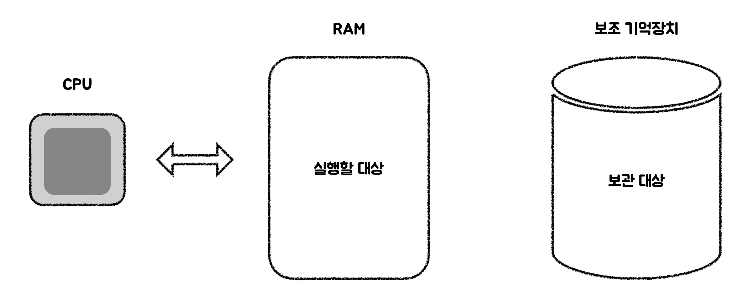
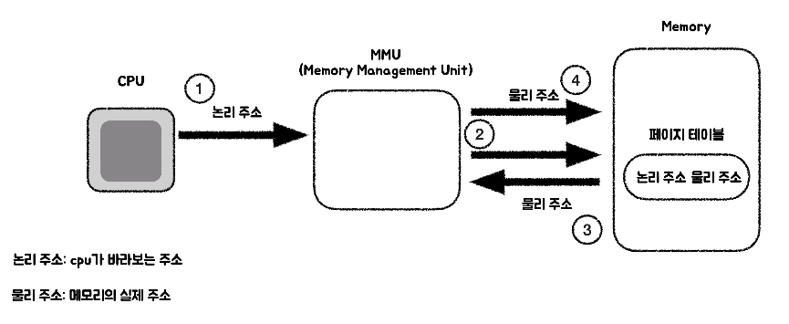
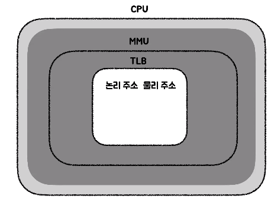
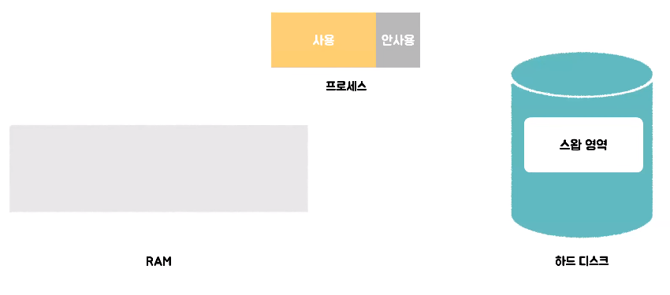
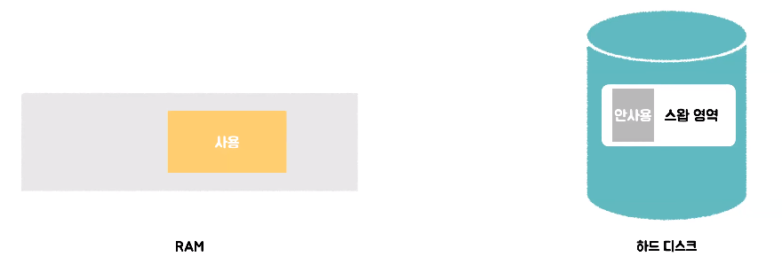
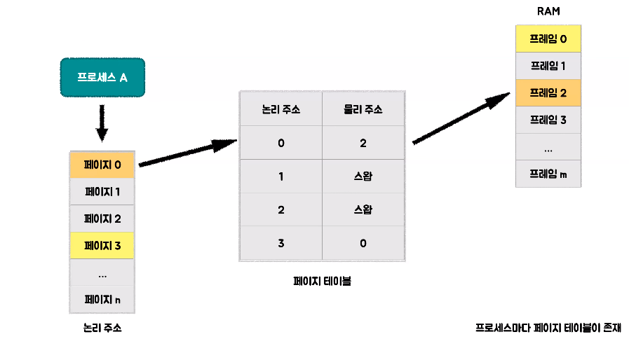
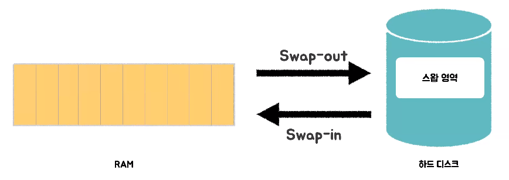
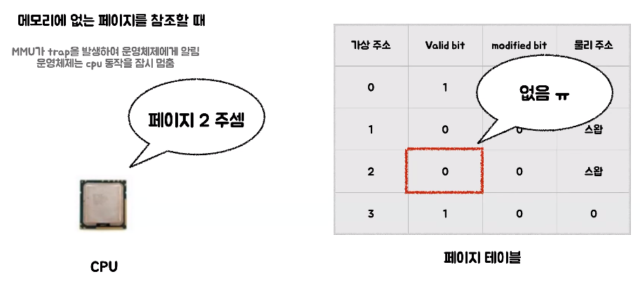
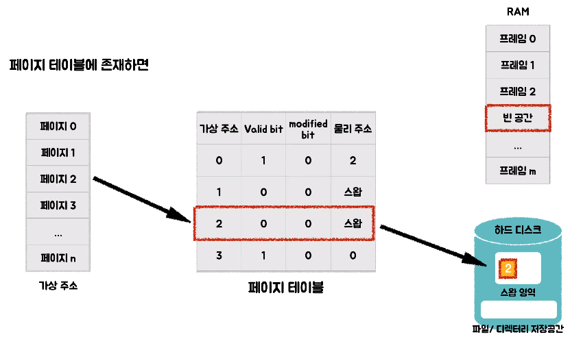
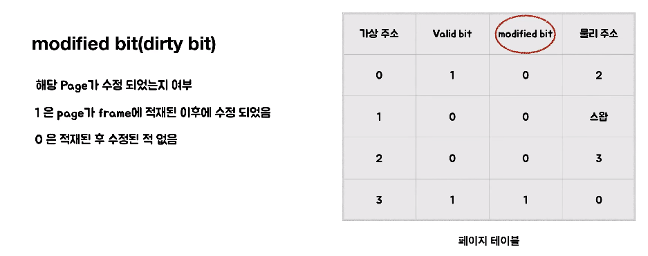

# 채채의 가상 메모리
[https://youtu.be/_SyFgWccEs8?si=CzxRl8LiV9VofDXG](https://youtu.be/_SyFgWccEs8?si=CzxRl8LiV9VofDXG)

# 채채의 가상 메모리
* toc
{:toc}

## 배경지식

### Hardware
+ 
+ 하드웨어는 CPU와 RAM, 보조 기억장치가 존재한다
+ CPU는 메모리를 연산하는 작업을 하는데 CPU는 RAM에 있는 메모리까지만 도달할 수 있기 때문에 보조 기억장치에 있는 메모리를  CPU가 연산 작업을 하고 싶으면 보조 기억장치에 있는 메모리를 RAM에 적재해야 한다
  + 쉽게 말해서 CPU가 처리해야 할 대상은 RAM에 존재해야 한다
+ 
+ 논리 주소는 CPU가 바라보는 주소이고 CPU가 만드는 주소이다
+ 물리 주소는 메모리의 실제 주소를 말한다
+ CPU가 논리 주소를 가지고 접근을 하게 되면 CPU 내부에 있는 MMU가 그 논리 주소를 가지고 논리 주소와 물리 주소의 맵핑 정보가 있는 페이지 테이블에 접근을 해서 물리 주소를 가지고 다시 또 메모리에 접근을 하게 된다
+ 그러면 결국 메모리에 두 번 접근을 하게 되는데 CPU는 내부에 자주 요청이 들어오는 논리주소와 물리주소의 맵핑 정보를 캐싱하고 있다 그것이 TLB이다
+ 
+ TLB는 MMU 안에 존재하고 자주 요청이 들어오는 논리주소와 물리주소의 맵핑 정보를 가지고 있어서 CPU 내부적으로 주소 변환을 할 수 있게 되어서 요청을 훨씬 더 빨리 처리할 수 있게 된다

## 가상 메모리 - 개념
+ 
+ 
+ 프로세스가 실행될 때 그 프로세스의 모든 메모리가 사용되는 것은 아니다
+ 사용하는 부분이 있고  사용하지 않는 부분이 있는데 만약에 프로세스 전체를 RAM에 적재하게 되면 사용하지 않는 부분까지 적재가 되기 때문에 RAM의 실제 메모리보다 RAM의 메모리를 효율적으로 사용하지 못하게 된다
+ 그래서 사용하지 않는 메모리를 하드 디스크의 swap 영역에서 관리하게 하여 RAM의 실제 메모리보다 더 많은 사용량을 쓸 수 있게 하는 것이 가상 메모리 기법이다

## 가상 메모리 - 페이징
+ 
+ 프로세스 A는 다음과 같이 논리 주소를 가지고 논리 주소는 페이지 단위로 쪼개서 관리된다
+ 그리고 RAM은 페이지와 같은 크기인 프레임 단위로 쪼개서 관리된다
+ 그렇게 페이지와 프레임을 맵핑하는 정보를 가지고 있는 것이 페이지 테이블이고 페이지 테이블은 프로세스마다 존재한다

## 가상 메모리 - 요구 패이징
+ 
+ 요구 페이징은 필요한 메모리만 RAM에 적재를 하는 방법이다
+ 만약에 RAM의 메모리가 모두 꽉 찼다면 사용하지 않는 메모리를 하드 디스크의 swap 영역으로 내보내는 것을 swap-out이라고 하고 RAM이 그 메모리가 다시 필요하게 되면
  그 swap-out 영역에서 다시 RAM으로 메모리를 가져오는 것을 swap-in이라고 한다

### 요구 패이징 - Page Fault
+ 
+ CPU가 RAM에 적재되어 있지 않는 메모리를 요청을 보낼 때는 Page Fault가 일어나는데 Page Fault가 발생하게 되면 MMU가 트랩을 발생해서 운영체제에게 알리고 운영체제는 CPU 동작을 잠시 멈춘다
+ 만약에 CPU가 페이지 2를 요청을 했다면 페이지 테이블에 valid bit를 보시면 0으로 존재 않는다 그리고 만약에 페이지 4를 요청을 하게 되면 페이지 4 같은 경우는 페이지 테이블에 아예 정보가 존재하지 않는다
+ 
+ 페이지 테이블에 존재는 하지만 valid bit가 0인 경우에는 해당 물리 주소가 하드 디스크의 swap 영역에 있다는 것을 뜻하고 그래서 swap 영역에 존재하는 페이지 2의 메모리를 RAM의 빈 공간에 찾아서 swap-in을 하게 된다
+ swap-in을 하고 페이지 테이블의 정보는 업데이트가 된다
+ 만약에 페이지 테이블에 아예 존재하지 않는 요청이었다면 그것은 swap 영역에 존재하지 않고 하드 디스크의 다른 저장 공간에 존재한다 
+ 그 공간에 존재하는 정보 또한 RAM의 빈 공간을 찾아서 실행 파일로 로딩을 하게 되고 페이지 테이블에 해당 정보가 추가되게 된다
+ 이렇게 테이블의 수정을 마치면 아까 멈췄던 CPU를 다시 실행시킨다 
+ 
+ valid bit 말고 또 modified bit라는 정보가 존재하는데 modified bit가 만약에 1인 경우에는 페이지가 프레임에 적재된 이후에 수정되었음을 말하고 0인 경우에는 적재된 이후에 수정된 적이 없음을 뜻한다
+ modified bit는 swap-out될 때 사용되는 정보이다
+ 만약에 페이지 3이 swap-out이 되어야 한다는 가정을 하면 하드 디스크의 swap 영역으로 페이지 3을 swap-out시키고 운영체제는 페이지 3에 modified bit가 1인 것을 확인하고 이것은 수정이 되었음을 알리기 때문에
  수정된 파일과 하드 디스크에 존재하는 파일을 일치시키기 위해서 추가적으로 쓰기 작업을 실행한다 
+ modified bit는 필요하지 않은 작업이 쓰기 작업을 하는 것을 막을 수 있다
+ 예를 들어서 modified bit가 0인 경우에는 수정된 적이 없기 때문에 굳이 쓰기 작업이 필요하지 않기 때문에 그것을 하지 않을 수 있게 할 수 있다

## 정리 
+ 가상 메모리는 사용하는 프로세스의 일부만 RAM에 올리고 나머지는 하드 디스크 swap 영역에 저장해서 실제 물리적 RAM보다 더 큰 메모리 공간을 효율적으로 사용할 수 있게 하는 것이다
+ 가상 메모리를 사용하면 메모리의 크기의 제약으로부터 더 자유로워지기 때문에 더 많은 프로그램을 동시에 수행 가능할 수 있게 하고 각 프로세스마다 가상 주소 공간을 가지고 있어서
  프로세스 간의 간섭을 줄여서 만약에 하나의 프로세스가 문제가 생긴다면  그 프로세스 때문에 다른 프로세스에 영향을 가지 않도록 할 수 있다
