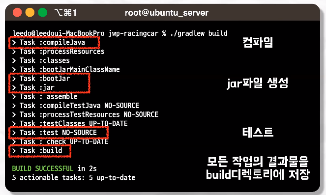
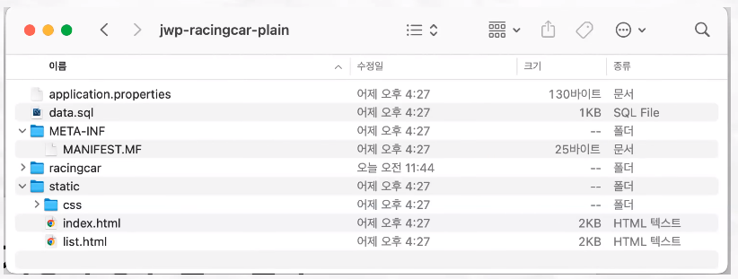
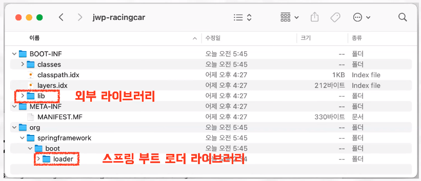
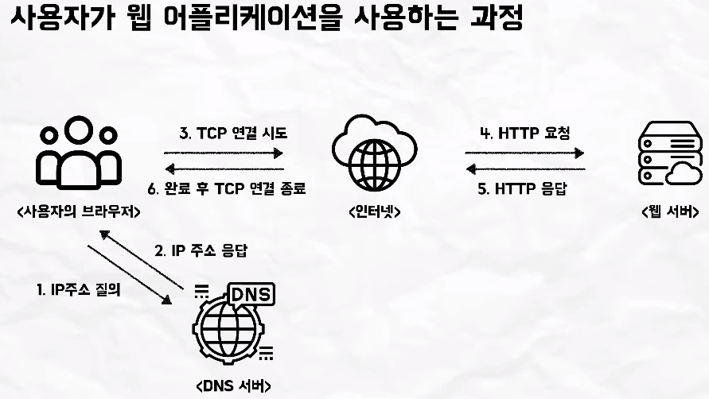
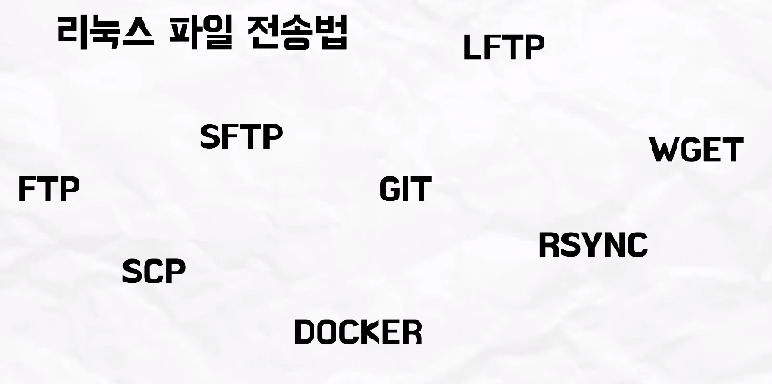
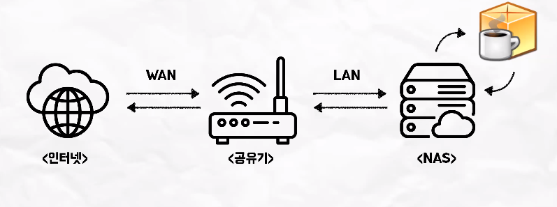

# 이레, 준팍의 빌드와 배포
[https://youtu.be/4LBMCHFLLpg?si=zL3BRYRtopF0scUL](https://youtu.be/4LBMCHFLLpg?si=zL3BRYRtopF0scUL)

# 이레, 준팍의 빌드와 배포
* toc
{:toc}

## 빌드와 배포란?
+ 빌드는 글을 번역하고 책으로 만드는 과정 배포는 완성된 책을 출판하는 과정이라고 할 수 있다
+ 아랍어로 된 글을 한국어 책으로 출판 해야 한다고 가정해 보면 아랍어로 된 글을 한국어로 번역을 해야한다 이러한 과정을 프로그래밍에서는 컴파일이라고 한다
+ 자바 소스 코드들을 기계들이 이해할 수 있는 이진 바이너리 코드로 만드는 것을 컴파일이라고 한다
+ 번역이 완료된 글들을 모아서 책으로 엮고 다음에 이 책 내용에 틀린 내용은 없는지 오타는 없는지 검수를 하는 과정을 프로그래밍에서 빌드에 해당한다
+ 컴파일된 여러 코드 파일들을 하나의 압축 파일로 패키징 하고 이 패키징된 파일 안에 틀린 내용이나 오류는 없는지 테스트를 하는 과정을 빌드라고 한다
+ 빌드의 결과물로 JAR 파일 또는 WAR 파일이 생성되게 된다
+ 완성된 책을 많은 사람들이 읽을 수 있게 서점에 진열을 하는 과정을 프로그래밍에서 배포에 해당 한다
+ 배포란 개발자가 만든 서비스를 여러 클라이언트가 사용할 수 있도록 환경을 조성하는 것이다

### 정리
+ 빌드
  + 빌드란 소스코드들을 컴퓨터가 이해할 수 있는 바이너리코드로 컴파일하고 컴파일된 파일들을 다시 하나의 압축된 파일로 패키징 하는 과정을 빌드라고 한다
+ 배포
  + 빌드를 통해 완성된 실행 가능한 JAR 혹은 WAR 파일을 사용자가 접근할 수 있는 환경에 대체하고 실행하는 것
  + 물론 서비스를 배포한 이후에 서비스가 잘 작동되고 있는지 모니터링하고 코드를 유지보수 하는 것 또한 배포의 과정에 포함된다

## 빌드의 과정
+ 
+ 자바 코드들을 JVM이 이해할 수 있는 자바 바이트코드로 컴파일
+ 컴파일된 여러 클래스 파일들을 한 파일로 압축파일로 묶어서 JAR 파일을 생성
+ 생성된 JAR 파일 내부에서 테스트 클래스 코드들을 추출해서 테스트를 진행하게 되는데 모든 테스트가 통과가 되면 진행했던 빌드 작업들의 결과물을 빌드 디렉토리에 저장하게 되면서 빌드가 완료되게 된다
+ bootJar라는 태스크와 JAR라는 태스크 두 가지가 이어졌었는데 bootJar 태스크를 통해서 생성된 JAR 파일과 JAR 태스크를 통해서 생성된 plain-jar 파일이 만들어진 것을 확인할 수 있다
+ 
+ plain-jar 파일 안에는 소스코드들을 컴파일된 클래스 파일과 그 다음에 정적 리소스 파일들이 저장 되어 있다
+ 
+ JAR 파일 같은 경우에는 클래스 파일과 리소스 파일 뿐만 아니라 외부 라이브러리 그리고 이 스프링 부트를 실행할 수 있는 스프링 부트 로더 라이브러리도 포함되어 있다

## 빌드의 결과물: JAR과 WAR
+ 프로젝트의 내용을 압축해서 담아 놓은 파일을 JAR 파일 WAR 파일이라고 한다
+ 웹 프로젝트를 폴더 째로 컴퓨터한테 넘겨 줄 순 없다 컴퓨터가 폴더를 이해할 수는 없으니까 해서 책을 읽는 것처럼 컴퓨터가 읽을 수 있는 형태의 파일로
  하나의 파일로 만들어서 넘겨주기 위해 파일을 만드는 과정을 진행하는 것

### Plain JAR
+ 자바 프로젝트를 압축한 파일
+ plain-jar 파일은 클래스 파일들과 해당 클래스에서 사용되는 리소스 파일들이 포함
+ plain-jar 파일은 외부 라이브러리를 포함 하지 않기 때문에 단독으로 실행 하기 보다는 주로 다른 프로젝트의 종속성으로 사용될 때 사용
+ 외부 라이브러리를 살펴보면 모두 JAR 파일로 저장되어 있는 것을 확인할 수 있는데 이 때 이 JAR 파일은 plain-jar 파일이라고 이해 하면 된다
+ 또는 로컬 환경에서 실행되는 어플리케이션으로 사용 (클래스패스 추가)

### Runnable JAR
+ plain-jar 파일과 달리 의존하는 라이브러리나 외부 모듈 등을 포함
+ 스프링 부트가 제공하는 내장 서버를 JAR 파일 내부에 포함하고 있기 때문에 배포를 할 때 외부에 웹서버를 따로 설치 할 필요 없이 JAR 파일만 가지고도 단독으로 실행하고 배포할 수 있다

### WAR
+ Runnable JAR 파일과 비슷하게 웹 프로젝트를 구동하기 위해서 필요한 모든 자원들을 포함하고 있는 파일
+ Runnable JAR 파일과 다른 점은 WAR 파일 같은 경우에는 스프링부트가 제공하는 내장 서버를 사용하지 않기 때문에 WAR 파일을 실행하려면 서버 컴퓨터에 웹 어플리케이션 서버 예를 들면 아파치 톰캣 같은 WAS가 설치되어 있어야 한다
+ 웹 애플리케이션을 통째로 패키징하고 배포하기 위한 목적으로 사용

### 스프링 부트 프로젝트는 무슨 파일로 빌드할까?
+ 스프링 부트에서 가이드하는 표준 형식은 JAR 파일이다, JAR 파일은 외부에 별도의 서버 설치 없이 단독으로 웹 어플리케이션이 실행 가능하기 때문이다
+ 스프링 부트에서 제공하는 내장 서버는 JSP 엔진을 가지고 있지 않기 때문에 JSP를 실행할 수 없다 따라서 JSP를 사용해서 화면을 구성하고 싶다 또는 나는 스프링 부트가 제공하는 내장 서버가 아니라 외장 서버를 이용할 계획이면
  JAR 파일이 아니라 WAR 파일을 빌드해서 배포해 사용면 된다

## 배포의 과정

### 배포란?
+ 실행 가능한 파일을 사용자가 접근할 수 있는 환경에 배치하고 실행 하는 것
+ 한마디로 사용자가 인터넷을 통해 웹 어플리케이션을 사용할 수 있게 만들어 주는 과정
+ 

### 배포의 과정
1. 서버 환경 구축
2. 배포 파일 업로드
3. 빌드 및 빌드된 파일 실행
4. 외부 접근 설정
5. 모니터링 및 유지보수

#### 서버 환경 구축
+ 서버 환경 구축은 여러 가지 요인에 따라 달라질 수 있다
  + 어떤 서버를 사용하는지
    + aws와 같은 클라우드 서버
    + Synology NAS와 같은 On-premises 환경
  + 어떤 파일을 업로드 하는지
    + 소스코드로 전달하는 방법
      + 서버 내에서 빌드 과정이 일어나기 때문에 서버에 jdk를 설치 해야 한다
    + JAR 파일로 전달하는 방법
      + 이미 로컬에서 빌드가 완료된 결과물을 서버에 올리기 때문에 서버에 이 JAR 파일을 실행할 JRE만 설치해 줘도 된다
    + WAR 파일로 전달하는 방법
      + 로컬에서 빌드가 완료된 결과물을 서버에 올리기 때문에 이 WAR 파일을 실행할 JRE만 있어도 충분하지만 WAR 파일에는 내장 톰캣이 없기 때문에 WAS도 추가적으로 설치 해줘야 한다
    + 물론 JDK를 설치해도 JAR 파일과 WAR 파일은 정상적으로 가동할 수 있다
  + 그 외 다른 요인

#### 배포 파일 업로드
+ 

##### GIT
+ 깃허브 레포지토리에 있는 소스코드를 서버로 업로드 하여서 서버 내에서 빌드
+ 그래서 서버에 openjdk를 설치하고 git clone을 이용하기 위해서 깃도 설치
+ git clone 명령어를 통해 깃허브 레포지토리에 있는 소스코드를 업로드

#### 빌드 및 빌드된 파일 실행
+ 업로드가 완료되면 소스코드가 있는 디렉토리로 이동하여 ./gradlew build를 이용해서 빌드
+ 빌드가 성공하게 되면은 그 빌드의 결과물인 JAR를 실행
  + nohup과 &를 사용하는 이유는 터미널이 종료된 이후에도 해당 프로그램이 백그라운드에서 계속 실행 되길 바랄 때 사용하는 명령어

##### nohup과 &
+ nohup과 &는 사용 목적 이 약간은 다르다
+ 

#### 외부 접근 설정
+ 홈 네트워크 구조
+ 
+ 외부망은 WAN 포트를 이용해서 공유기에 연결이 되고 공유기는 LAN 포트를 이용해서 NAS에 연결되게 된다
+ 외부망에서 NAS로의 접근이 불가능한 이유는  두 가지 장애물이 있었기 때문이다 
+ 첫 번째 장애물은 방화벽 설정이다 외부에서 공인 IP 주소 18080로 가는데 방화벽을 설정해 주지 않았기 때문에 요청이 공유기 내부로 들어오지 못 하는 상황이다
  + 방화벽 설정에 들어가서 해당 포트로 들어오는 모든 IP를 허용해서 해결 할 수 있다
+ 두 번째 장애물인 포트포워딩 설정이다 공인 IP 주소 18080으로 들어가고 싶다는 요청이 들어오자 공유기는 요청을 받아 줬을때 요청을 어느 장치에서 처리해 줘야 되는지 연결해 줄 수 없어서
  외부망의 연결이 여전히 안 된다
  + 공유기의 포트포워딩 설정에 들어가서 공유기의 18080 포트로 들어 오면은 서버에 18080 포트로 연결해주라는 규칙을 설정
  + 이 결과 공인 IP 주소 18080 포트로 요청이 들어오는 경우 공유기가 내부망 NAS 주소인 18080 포트로 가라고 중계를 해준다 그러면 tcp 연결이 완료되고 http 요청이 웹 서버에 전달되게 된다
+ 도메인 설정은 사용자가 웹사이트를 더 쉽게 기억하고 찾을 수 있게 하기 위해 설정하는데 하는 방법은 여러 가지 방법이 있겠지만 보통은 도메인을 구매해서 연결하는 과정을 거치게 된다
+ dns 서버에 도메인의 웹 서버의 IP 주소를 가르키도록 설정을 업데이트 해주면 된다

