# 조이,엔초의 DNS와 ARP
[https://youtu.be/DfNGidKhY6U?si=yqH4LZaLwT9zrsfs](https://youtu.be/DfNGidKhY6U?si=yqH4LZaLwT9zrsfs)

# 조이,엔초의 DNS와 ARP
* toc
{:toc}

## 요청을 위한 여정
+ 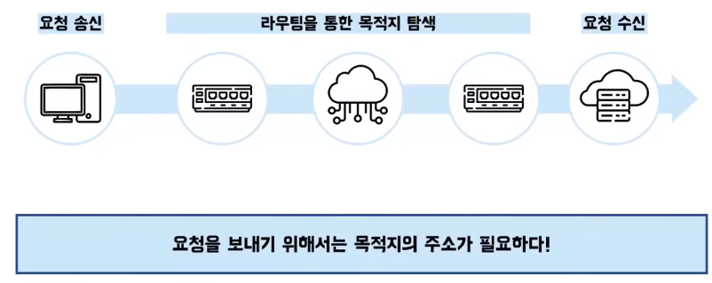
+ 우리의 컴퓨터는 요청을 만들고 요청을 보낸다
+ 그리고 수많은 라우터들을 지나서 목적지에 도착한다
+ 그럼 우리의 목적지에서 요청을 수신하고 이 요청을 처리한다
+ 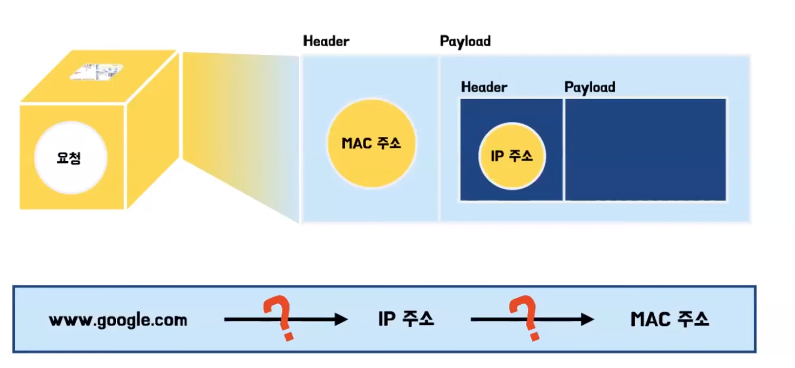
+ 택배를 보낼 때 운송장에 보내는 것과 받는 곳의 주소를 작성하는 것과 같이 요청을 보낼 때도 보내는 것과 받는 곳의 주소를 적어줘야 하는데 이때 사용되는 주소가 IP주소와 맥주소이다
+ 도메인 주소로 IP 주소와 맥 주소를 알 수 있는 이유는 DNS와 ARP가 사용되게 돼서이다 

## DNS (Domain Name System)
+ 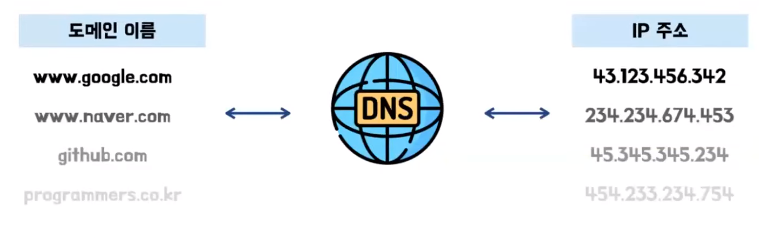
+ DNS는 네트워크에서 도메인 이름과 IP 주소를 변환하는 데 사용되는 시스템이다
+ IP 주소로 사이트에 접속하면 구글에 들어갈 때도, 네이버에 들어갈 때도 다음에 들어갈 때도 다 IP 주소로 검색을 해야한다 그럼 IP 주소를 다 기억하고 있고 관리를 하고 있어야한다 그러면 이 IP 주소는 숫자로 되어 있어서 헷갈린다
+ 그래서 주소에 이름을 붙여주기 했다
+ 요청을 보낼 때 도메인 주소로는 요청을 보낼 수 없다 그래서 그 중간에서 이름과 IP 주소를 맵핑해주는 역할이 필요한데 그게 바로 DNS이다

### DNS 동작 과정
+ 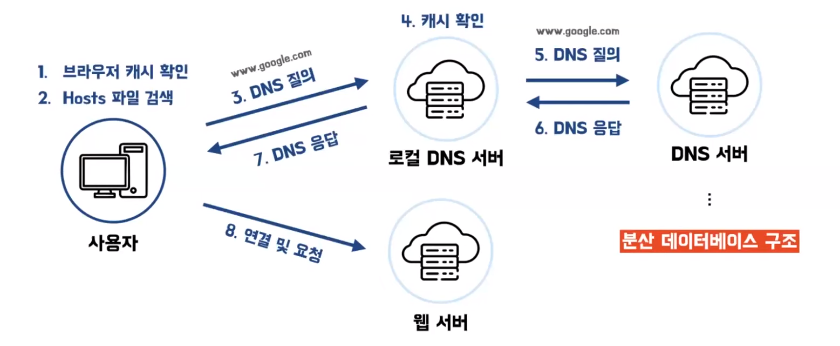
+ www.google.com에 접속하고 싶어서 IP 주소를 알아내려고 할때 이전에 먼저 이 요청을 한 적이 있는지 캐시를 한번 확인한다
+ 그리고 캐시가 존재하지 않는다면 로컬 DNS 서버에 요청을 한다 여기서도 한번 캐시를 확인하는데 만약에 여기에 캐시가 존재하지 않는다면 다른 DNS 서버들에 연쇄적으로 요청을 하고 응답을 받는다
+ 이때 하나의 DNS 서버에 요청을 하는 것이 아니라 여러 DNS 서버에 요청을 하는 이유는 하나의 DNS 서버에서 모든 정보를 관리하게 되면 부담이 당연히 클 것이고 부하도 커지게 된다 그래서 DNS 서버는 분산 데이터베이스 구조로 이루어져 있다

### DNS 구성 요소
+ 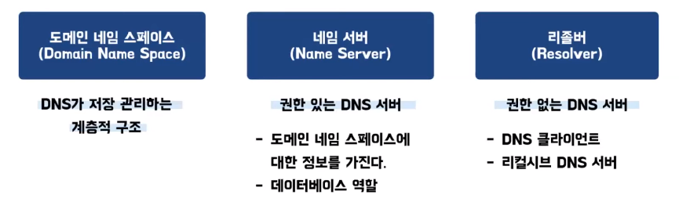
+ DNS는 도메인 네임 스페이스, 네임 서버, 그리고 리졸버로 총 3개로 구성되어 있다
+ 도메인 네임 스페이스는 DNS가 저장하고 관리하는 계층적인 구조이다 쉽게 생각하면 규칙이라고 보면 된다
+ 네임 서버는 권한 있는 DNS 서버이다 도메인 네임 스페이스에 대한 정보를 가지고 데이터베이스 역할을 하는데 쉽게 생각하면 정보를 가지고 요청이 들어왔을 때 그 정보를 이용해서 응답을 하는 역할을 한다고 보면 된다
+ 리졸버는 권한이 없는 DNS 서버이다 리졸버는 클라이언트에 가장 가까운 위치에서 클라이언트가 요청을 했을 때 다른 네임 서버에 질의를 해서 요청을 처리한다

### 도메인 네임 스페이스 (Domain Name Space)
+ 
+ 도메인 주소의 계층은 오른쪽에서 왼쪽으로 가는데 오른쪽이 가장 상위 계층이라는 뜻이다 그래서 왼쪽으로 갈수록 하위 계층이 된다
+ 가장 오른쪽에 위치한 점 이 루트 도메인이다 일반적으로 사용할 때는 생략해서 사용한다 그래서 왼쪽으로 갈수록 하나씩 계층이 낮아지게된다
+ 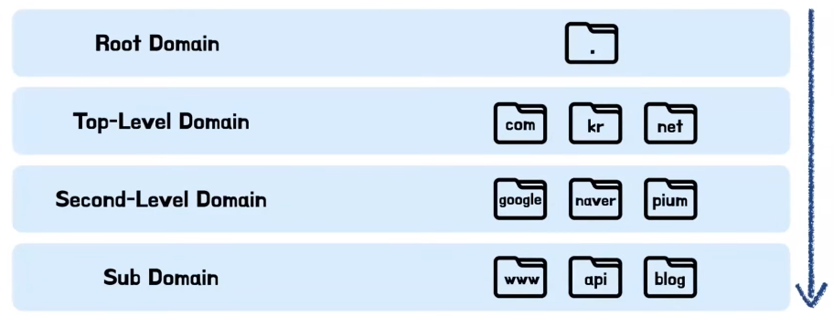
+ 가장 상위에 있던 이 점이 루트 도메인이다 그리고 그 하위에 있는 루트 도메인을 제외한 가장 상위 레벨의 도메인 이라고 해서 탑 레벨 도메인이 있다
+ 그리고 그 이후의 도메인들은 세컨드 레벨 도메인 처럼 순서를 이름으로 붙여줄 수는 있지만 일반적으로는 서브 도메인이라고 통칭하고 있다

### DNS 조회 프로세스
+ 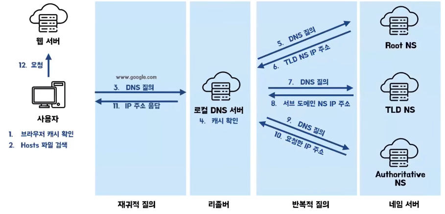
+ 로컬 DNS 서버에서 자체적으로 캐시를 확인하고 캐시가 만약에 없으면 다른 네임 서버에 질의를 해야 되는데 가장 먼저 최상위 계층인 루트 네임 서버에 질의를한다
+ 그런데 루트 네임 서버에는 www.google.com에 대한 IP 주소가 없다 
+ 그래서 자신의 하위 계층은 이 TLD 네임 서버의 IP 주소를 전달해 준다 
+ 그럼 TLD 네임 서버에도 그 정보가 없다면 바로 하위에 있는 서브 도메인 네임 서버의 IP 주소를 다시 전달해 준다 
+ 이렇게 연쇄적으로 계속 질문을 하다가 www.google.com에 대한 IP 주소를 가지고 있는 네임 서버가 있다면 IP 주소를 응답해 준다
+ 이 과정에서 사용자가 로컬 DNS 서버에 질의하는 것을 재귀적 질의라고 한다
+ 클라이언트와 가장 가까운 위치에서 다른 네임 서버에 지리를 하는 이 역할을 하는 로컬 DNS 서버를 리졸버라고 한다
+ 그리고 로컬 DNS 서버에서 다른 네임 서버로 질의하는 것을 반복적 질의라고 한다
+ 정보를 가지고 요청에 대한 응답을 해주는 서버를 네임 서버라고 한다

### DNS 서버 유형
+ 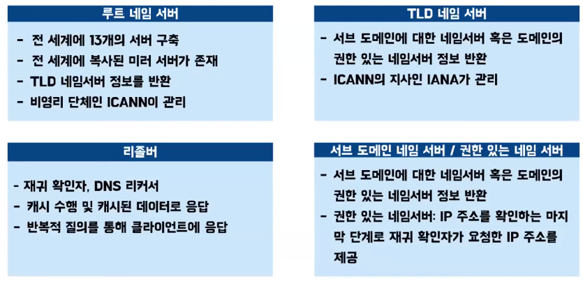
+ 루트 네임 서버는 전 세계 13개의 서버가 존재하고 이를 복사한 미러 서버가 존재한다 그래서 총 약 600개 정도가 존재하고 있다
+ 루트 네임 서버는 TLD 네임 서버의 정보를 반환하는 역할을 한다 
+ TLD 네임 서버는 서브 도메인에 대한 네임 서버 또는 권한 있는 네임 서버에 대한 정보를 반환해 준다
+ 리졸버는 재귀 확인자 DNS 리커서라고도 하고 캐시를 수행하는 역할을 한다 만약에 요청이 들어왔을 때 캐시된 데이터가 있다면 그 데이터로 응답을 하고 없다면 반복적으로 질의해서 클라이언트에 응답한다
+ 서브도메인 네임서버는 이 서브도메인에 대한 네임서버 또는 권한 있는 네임서버의 정보를 반환하는데 만약에 서브도메인 네임서버가 그 자체로 권한 있는 네임서버라면 재귀확인자가 요청한 IP 주소를 그대로 제공한다

### DNS 캐시
+ 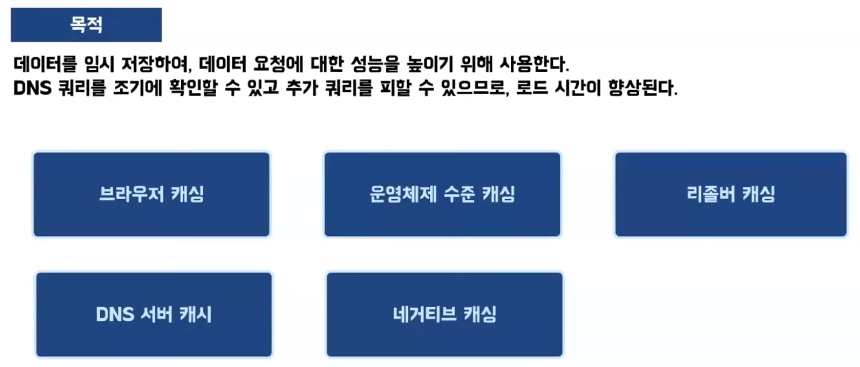
+ 캐시를 하는 목적은 데이터를 임시로 저장을 해서 데이터 요청에 대한 성능을 높이기 위해 사용을 하고 캐시의 종류는 5개가 있다

### DNS 스푸핑이란?
+ 
+ DNS 스푸핑은 웹브라우저에 웹사이트 요청을 가로채서 다른 웹사이트로 사용자를 유도하는 기술
+ 사용자가 DNS 서버에 DNS 질의를 한다
+ 그런데 공격자가 DNS 서버보다 먼저 위조된 DNS 응답을 한다
+ 그럼 정상적으로 보낸 응답이 거절되게 된다
+ 그래서 사용자는 이 공격자가 보낸 IP 주소로 접속하게 된다

## ARP (address resolution protocol) 주소 결정 프로토콜
+ 요청을 보내기 위해서는 IP주소와 MAC주소가 필요하는데 IP주소 같은 경우에는 DNS를 통해 조회를 해오게 된다
+ MAC주소 같은 경우에는 ARP라는 프로토콜을 사용해서 조회해 올 수 있다
+ 즉 ARP란 IP주소에 해당하는 MAC주소를 가지고 오기 위해 필요한 프로토콜이라고 보면 된다

### ARP의 동작 과정

#### ARP 테이블에 MAC 주소가 존재하는 경우
+ 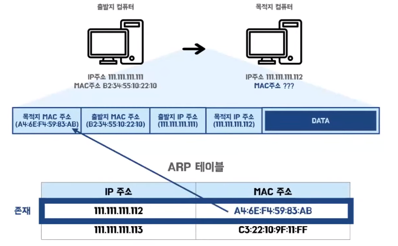
+ 데이터를 보내는 요청을할 때 필요한 데이터는 목적지 MAC주소와 출발지 MAC주소 그리고 출발지 IP 주소와 목적지 IP 주소가 필요하다
+ 출발지 컴퓨터 입장에서는 출발지 컴퓨터의 맥 주소와 IP 주소 그리고 목적지 컴퓨터의 IP 주소는 알고 있지만 목적지 컴퓨터의 맥 주소는 모르고 있는 상태가 된다
+ 이 과정에서 ARP 요청과 응답을 할 수도 있는데 그 전에 ARP 테이블을 먼저 확인한다
+ ARP 테이블은 IP 주소와 맥 주소를 맵핑하고 있는 캐시 테이블인데 여기 보면은 111.111.111.112의 컴퓨터에 해당하는 맥주소가 존재한다
+ 이런 경우에는 이 캐시 테이블에 있는 맥주소를 그대로 사용을 해서 패킷을 완성하고 데이터를 보내게 된다

#### ARP 테이블에 MAC 주소가 존재하지 않는 경우
+ ARP 테이블을 확인해 보는데 IP주소에 해당하는 맥주소가 캐시가 되어 있지 않는 경우에는 ARP를 사용해서 맥주소를 조회해 오는 과정이 필요하게 된다
+ ARP를 사용해서 맥주소를 조회해 오는 과정에는 ARP request와 ARP reply로 나누어져 있다

##### ARP request
+ 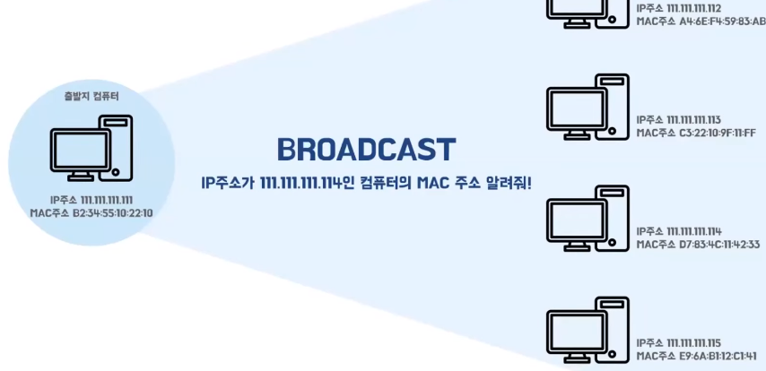
+ 리퀘스트 같은 경우에는 출발지 컴퓨터가 목적지 컴퓨터의 맥주소를 알아오기 위해서 하는 요청인데 이때 출발지 컴퓨터는 목적지 컴퓨터의 IP 주소만 알고 있고 맥주소는 모르는 상태이다
+ 그래서 자신의 네트워크 하위에 있는 모든 컴퓨터에 브로드캐스트 요청을 하게 된다
+ IP 주소가 114인 컴퓨터의 맥주소를 알려달라는 의미로 브로드캐스트 요청을 하게 된다

##### ARP reply
+ 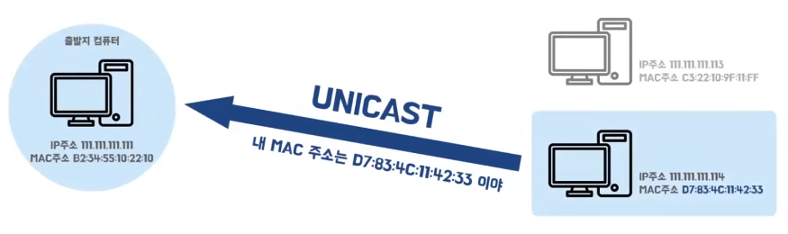
+ 114 컴퓨터가 이 요청을 받아서 자신의 맥주소를 알려주는 응답을 하게 된다
+ 이때 이 컴퓨터는 자신이 요청을 받은 패킷에 어디서부터 요청이 왔는지 그 맥주소를 알고 있기 때문에 그 목적지로 유니캐스트로 응답을 하게 되는 것이다
+ 그러면 이 응답을 받은 출발지 컴퓨터는 자신의 ARP 테이블에 해당 IP 주소와 MAC 주소를 캐시를 추가하게 되는 것이다
+ 그리고 그 이후에 데이터를 보낼 때에는 추가로 브로드캐스트 요청을 하고 다시 응답을 받고 이런 과정이 필요 없이 이 테이블에서 바로 MAC 주소를 조회를 해서 패킷을 완성해서 보낼 수 있게 되는 것이다

### ARP 패킷

#### ARP 패킷 구조
+ 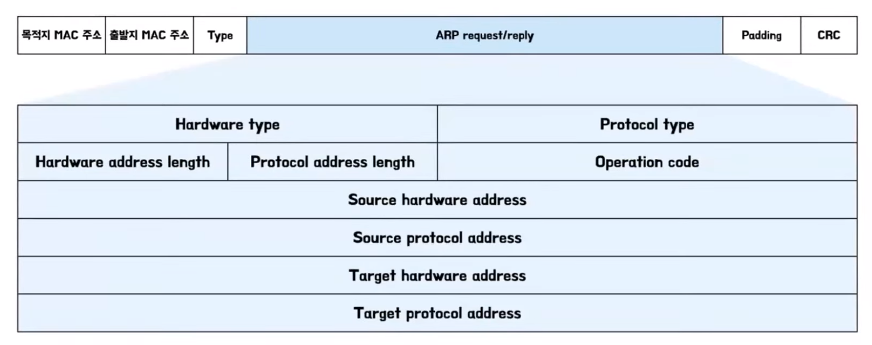
+ 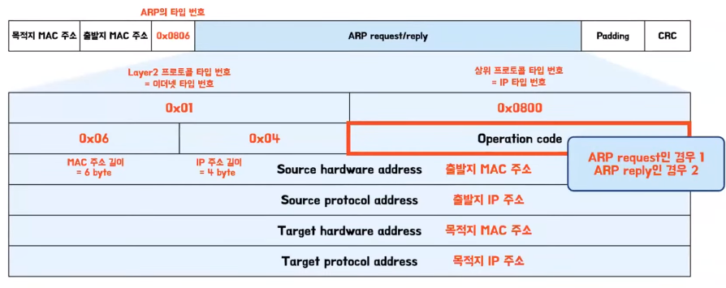
+ 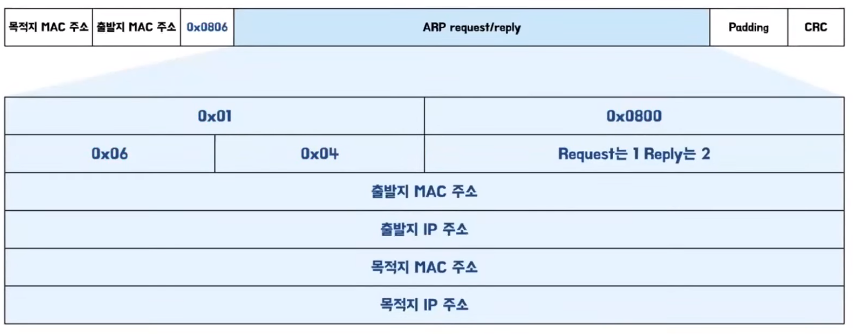
+ type 같은 경우에는 ARP 프로토콜을 사용하고 있기 때문에 ARP의 type 번호에 해당하는 0X0806이 들어가게 된다
+ 하드웨어 어드레스는 맥주소를 가리키고 프로토콜 어드레스는 IP주소를 가리키는데 그렇기 때문에 각각 출발지 맥주소와 출발지 IP주소 목적지 맥주소 그리고 목적지 IP주소에 맵핑이 되게 된다
+ 하드웨어 타입에는 OSI 7계층 2계층에서 이더넷을 사용하고 있기 때문에 이더넷에 해당하는 타입번호인 0X01이 들어가게 된다
+ 프로토콜 타입에는 그 상위 프로토콜인 IP의 타입번호인 0X0800이 들어가게 된다
+ Hardware address length와 Protocol address length 같은 경우에는 각각 MAC 주소의 길이와 IP 주소의 길이를 나타내고 있고 MAC 주소는 6바이트를 사용하고 IP 주소는 4바이트를 사용하기 때문에 각각 6과 4가 들어가게 된다 
+ 오퍼레이션 코드 같은 경우에는 ARP 과정이 리퀘스트와 리플라이로 나누어진다 그래서 리퀘스트 같은 경우에는 1이 들어가고 리플라이인 경우에는 2가 들어가게 된다

+ 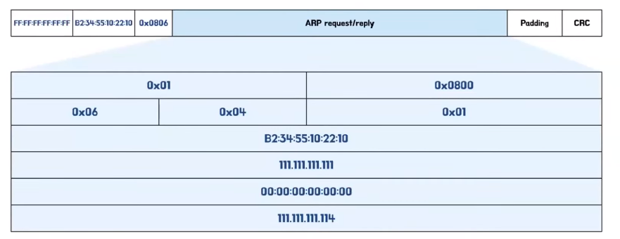
+ IP 주소가 111.111.111.111인 컴퓨터가 114 컴퓨터의 맥주소를 알아오고 싶을 때 데이터는 출발지 컴퓨터 입장에서는 출발지 컴퓨터의 맥주소와 그리고 출발지 IP 주소, 목적지 IP 주소는 알고 있기 때문에 데이터를 넣어줄 수 있고
  이거는 지금 리퀘스트이기 때문에 리퀘스트에 해당하는 오퍼레이션 코드 1이 들어가게 된다, 아직 목적지 맥주소를 모른다
+ 이때 이 목적지 맥주소 같은 경우에는 리퀘스트 과정에서는 브로드캐스트 요청을 한다 그래서 이 앞에 있는 브로드캐스트에 해당하는 FF:FF:FF:FF:FF:FF가 들어가게 되고 이 목적지 맥주소는 아직 모르기 때문에 그냥 0으로 설정한 채로 보내게 된다
+ 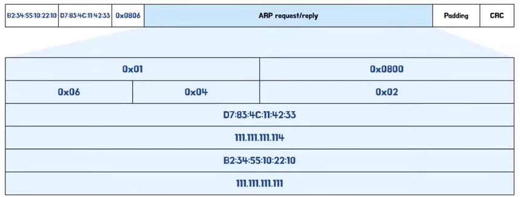
+ 목적지 컴퓨터가 해당 요청을 받고 리플라이를 보낼 때에는 자신이 어느 컴퓨터에서 요청을 받았는지 알고 있기 때문에 이 모든 IP 주소와 맥주소를 다 할당해서 넣어줄 수 있고 이 과정에서 reply이기 때문에 operation 코드는 2가 들어가게 된다

#### 정리
+ request인 경우에는 각각 이제 목적지 컴퓨터의 맥주소와 IP주소,그리고 출발지 컴퓨터의 맥주소와 IP주소가 들어가고 목적지 컴퓨터의 IP주소만 들어가고 나머지 목적지 컴퓨터의 맥주소는 broadcast에 해당하는
  FF로 채워진 채로 넘어가고  0으로 설정된 채로 넘어가는 것이다
+ reply 같은 경우에는 모든 데이터를 채운 채로 넘어가게 된다

### ARP 스푸핑
+ ARP 스푸핑은 ARP를 사용한 보안 공격 중에 하나인데 111.111.111.111 이라는 IP 주소를 가진 컴퓨터가 114 컴퓨터의 맥 주소를 알아오고 싶을 때 브로드캐스트 요청을 보낸다 근데 그 중간에 악성 사용자가 그 요청을 가로채서
  자신이 114 컴퓨터 라면서 본인의 맥주소로 알려 준다 
+ 이렇게 되면 지금 이 출발지 컴퓨터가 목적지 컴퓨터하고 통신을 해야 되는데 그 중간에서 이 약성 사용자가 데이터를 가로채게 된다 
+ 그래서 이 악성 사용자는 중간에서 요청을 가로채거나 응답을 자신이 원하는 응답으로 바꿔치기 하거나 이런 과정을 하게 된다
+ 그래서 만약에 로그인을 하게 되었을 때 전달하는 아이디와 패스워드 정보가 노출이 될 수도 있다
