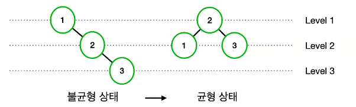

# 루쿠의 트리 자료구조
[https://youtu.be/QG6_DG5Tapw?si=UZtlGU5u2Iz2-wco](https://youtu.be/QG6_DG5Tapw?si=UZtlGU5u2Iz2-wco)

# 루쿠의 트리 자료구조
* toc
{:toc}

## 트리
+ 
+ 그래프는 데이터의 연결 관계를 정점과 간선으로 표현한 자료구조인데 여기서 정점은 노드라고도 불리운다
+ 
+ 트리는 그래프의 한 종류로서 어떤 특수한 경우의 그래프를 말하는데 여기서 어떤 특수한 경우의 그래프는 바로 연결 그래프와 비순환 그래프임을 말한다

### 트리가 아닌 경우
+ 
+ 
+ 그래서 트리는 연결 그래프이고 비순환 그래프이다

### 트리의 특징
+ 트리는 부모와 자식 관계라는 개념이 존재하고 최상위 노드가 존재한다
+ 데이터를 순차적으로 저장하지 않기 때문에 비선형 자료 구조
+ 트리 내에 또 다른 트리가 있는 재귀적 자료 구조
+ 
+ 0번 노드는 최상위 노드로 루트 노드라 불린다
+ 부모 노드와 자식 노드는 상대적인 관계인데 3번 노드가 부모 노드라고 하면 자식 노드는 6번과 7번 노드가 되나
+ 6번 노드 같은 경우에는 자식들이 하나도 없는 노드이기 때문에 단말 노드라고 불린다
+ 그리고 트리 안에 또 다른 트리를 가지고 있는 구조를 서브 트리라고 부른다

## 여러가지 트리

### 이진 트리(Binary Tree)
+ 
+ 이진 트리는 모든 노드의 자식 노드가 2개 이하인 트리이다 
+ 트리가 자료구조인 만큼 구조화된 데이터를 잘 사용할 수 있어야한다 그래서 만약에 이진 트리에서 원하는 데이터를 탐색하고 싶으면 아마도 모든 노드를 하나씩 방문해서 원하는 값인지 아닌지 확인을 해볼것이다
  그런데 만약 노드가 100개, 1000개 혹은 그 이상으로 많아지는 경우에는 어떻게 해야 할까? 이럴 때는 이진 탐색 트리를 사용하면 된다

### 이진 탐색 트리(Binary Search Tree)
+ 이진 탐색 트리는 데이터에 특정한 제약을 줌으로써 효율적으로 데이터를 탐색할 수 있는 이진 트리이다
+ 특정한 제약
  + 왼쪽 자식 노드는 부모 노드보다 작다
  + 오른쪽 자식 노드는 부모 노드보다 크다
  + 각각의 서브 트리도 위와 같은 조건을 만족한다
  + 그리고 기본적으로 중복된 노드는 허용하지 않는다
+ 
+ 이진 트리에서 값을 찾기 위해서는 하나씩 모든 노드를 방문해서 원하는 값을 찾게 될 것이다
  반대로 이진 탐색 트리인 경우에는 특정 노드를 기준으로 해당 노드보다 값이 작으면 왼쪽에 위치해 있고 해당 값보다 크면 데이터가 오른쪽으로 정렬된 상태를 유지하기 때문에 데이터를 찾는데 훨씬 수월하다
+ 이진 트리는 루트 노드로부터 모든 노드를 탐색해야 하므로 O(N)의 탐색 시간이 걸린다
+ 이진 탐색 트리 같은 경우는 이진 탐색과 같은 탐색이 가능하기 때문에O(logN)의 탐색 시간이 걸린다

#### 데이터를 추가하는 경우
+ 25 값을 추가해 볼 건데 탐색 방법과 동일하게 이렇게 노드로 이동하다가 단말 노드에 해당되면 25 값은 22 보다 크기 때문에 오른쪽 자식 노드에 위치하게 될 것이다

#### 삭제하는 경우
+ 삭제하려고 하는 노드가 단말 노드인 경우
  + 간단하게 삭제를 해주면 된다
+ 자식 노드가 1개 있는 경우
  + 삭제하려고 하는 노드의 자식 노드의 값을 삭제하려고 하는 노드에 복사를 해준다 그리고 이 복사를 했던 단말 노드인 노드를 삭제를 하면 깔끔하게 데이터를 삭제할 수 있다
+ 자식 노드가 2개 있는 경우
  + 
  + 18번을 찾은 다음에 18번 노드의 대체 노드를 찾아야 하는데 여기서는 18번보다 작으면서 가장 큰 노드인 12번 노드이거나 또는 18번 노드보다 크면서 가장 작은 노드인 22번 노드에 해당이 된다
  + 12번 있는 노드를 값을 복사를 해주고 단말 노드인 12번 노드를 다시 지워주면 이진 탐색 트리의 조건을 유지하면서도 데이터를 삭제할 수 있게 된다

#### 단점

+ 이진 탐색 트리에도 아주 치명적인 단점이 존재하는데 바로 이렇게 트리가 불균형 상태가 될 수 있다는 점이다
+ 트리가 불균형해진다면 이진 탐색 트리의 O(logN) 탐색 시간보다는 선형 탐색과 동일한 O(N)의 탐색 시간이 소요가 된다는 단점이 있다
+ 그래서 이러한 단점을 극복하고자 균형 탐색 트리가 고안이 되었다

### 균형 탐색 트리(Balanced Search Tree)

+ 균형 탐색 트리는 모든 노드의 좌우 서브 트리의 높이 차이를 1 이하로 유지하는 트리이다
+ 대표적으로는 AVL 트리, B - 트리, Red & Black 트리가 있다

#### AVL 트리
+ AVL 트리는 불균형 상태가 되면 균형 상태로 유지하는 이진 탐색 트리임을 말한다
+ 
+ 이진 탐색 트리는 만약에 2번이라는 데이터를 추가하려고 하면 이렇게 맨 끝에 2번 노드가 추가가 된다 하지만 이런 경우에는 트리의 높이차가 2 이상이 되어버려서 불균형 상태가 되어버린다는 단점이 있다
+ 반대로 AVL 트리 같은 경우는 데이터가 추가가 된 후에 회전에 의해서 재균형이 이루어지는데 먼저 2번 노드가 들어갈 자리를 찾고 데이터를 추가한 다음에 레벨 트리가 어느 정도 되는지 검사를한다 그리고 회전에 의해서 재균형이 이루어진다
